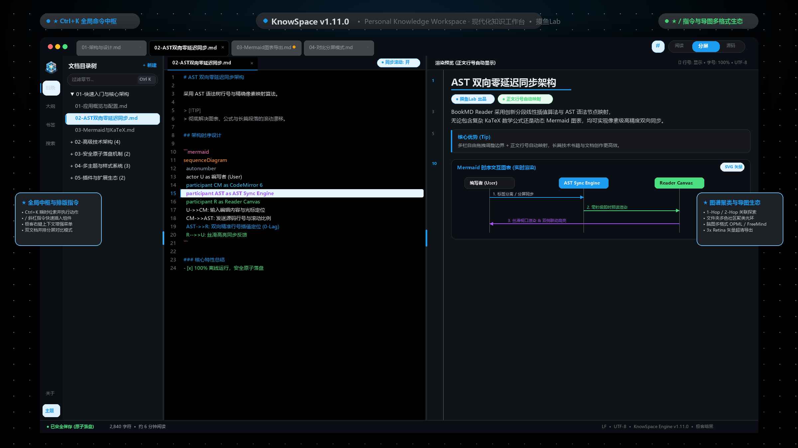

# KnowSpace

  

  <strong>KnowSpace · Personal Knowledge Workspace | 现代化个人知识工作台</strong> 
  <em>Write. Read. Connect. Know. (记录 · 阅读 · 连接 · 认知)</em>

  
  
  
  
  
  
  
  
  
  
  
  
  
  
  
  

  

  <a href="docs/全功能高清图片手册.md">🖼️ 全功能高清图片手册 (Picture Manual)</a> •
  <a href="docs/USER_MANUAL.md">📖 操作手册 (User Manual)</a> •
  <a href="#-核心能力体系">核心体系</a> •
  <a href="#-核心功能特性">功能特性</a> •
  <a href="#-键盘快捷键">快捷键</a> •
  <a href="#-便携版与-msi-安装包">下载运行</a> •
  <a href="#-english">English</a>

---

**KnowSpace** 是一个本地优先、高颜值的现代化个人知识工作台（Personal Knowledge Workspace）。由 **摸鱼Lab** 研发，秉承 **“Write. Read. Connect. Know.（记录 · 阅读 · 连接 · 认知）”** 的产品理念，以「超立方空间」HyperSpace Cube 为设计核心，旨在为你打造一个收纳所有想法、文档、图表与知识的私密安全空间。

---

## 🏛️ 核心能力体系

- **🎨 Infinite Canvas（无限空间可视化白板 · 兼容 JSON Canvas 1.0）**：标准开放的二维空间思维白板（`Ctrl+Shift+C`），**多模态卡片自由挂载**（富文本 Markdown、嵌入文档预览、逻辑分组容器），**高精度 4 锚点磁吸与贝塞尔/折线动态矢量连线**，配备右下角缩略雷达小地图与全景聚焦控制；**独创画布逆向拓扑萃取长文算法**，一键将白板因果关系逆向萃取为逻辑严密的 Markdown 专著。
- **⏳ Local Version History（本地时间旅行与版本快照历史）**：运行在本地知识库根目录隐藏空间（`.knowspace/snapshots/`）的无感版本防丢卫士（`Ctrl+Shift+H`），**30秒去抖静默捕获与 SHA-256 哈希去重**，配备直观版本时间轴；**左右双栏 Side-by-Side 与统一 Unified 视图**，Myers LCS 逐行与行内字符微粒度高亮，**一键无损安全还原与手动里程碑快照**。
- **🔍 Hybrid Vault Search（全库毫秒级混合检索引擎）**：全新文档级与段落级倒排索引（Inverted Index），万篇笔记键盘键入即刻（< 15ms）出结果。**深度支持结构化检索语法**：`tag:#架构`、`link:[[分布式协议]]`、`"严格短语"`、`-排除词`、时间范围过滤，提供「当前章节」与「全库检索」一键无缝切换、语法快捷辅助芯片与物理行微光脉冲联动。
- **🎯 Command Palette & Quick Switcher（全能全局命令中枢）**：全局随时按下 `Ctrl+K`（或编辑区直接穿透触发），支持三模合一：**默认快速切换（MRU 访问历史、标题/路径/别名智能模糊过滤）**、**动作执行模式（`>` 前缀检索并执行系统功能，如主题切换、新建笔记、导出等）**、**大纲直达模式（`#` 前缀实时大纲小节检索，Enter 秒级跳入目标段落）**。
- **🧠 Mind Map View（双向思维导图与多格式生态互通）**：Markdown 大纲一键转化为交互式多叉树脑图（`Ctrl+M`），**支持分支自由拖拽改变父子层级与同级重排（带自闭环防环保护与吸附光晕）**、**导图内实时搜索与平滑运镜聚焦**、**支持一键导出标准 OPML 2.0 (`.opml`)、FreeMind (`.mm`) XML 与 Markdown 大纲，无缝打通 XMind / MindNode / OmniOutliner 外部生态**，同时支持矢量 SVG/PNG 高清导出。
- **🌐 Graph & Backlinks（知识图谱深度与聚类深化）**：60FPS 极速全景拓扑图谱，新增 **`1-Hop` 直接关联 / `2-Hop` 扩展网络局部深度控制**，消除大库视觉过载；新增**按笔记所在目录调和色彩聚类（Folder Cluster Coloring）**；提供 **MOC 核心枢纽节点挖掘**与**未链接孤岛笔记（Orphan）发现**。
- **✍️ Editor & Slash Commands（编辑、斜杠命令与右键菜单）**：基于 CodeMirror 6 的现代编辑体验，毫秒级实时防抖渲染与零延迟双向同步滚动。**内置全键盘斜杠命令补全（`/`）与 Obsidian 级情境感知右键上下文菜单**，支持划词提取新笔记、块引用锚点生成、格式快速转换与文档字数统计。
- **🖨️ High-Fidelity PDF Print（专业高保真打印）**：集成 Chromium 原生打印引擎，支持 `Ctrl+P` 全局快捷键与工具栏一键导出标准 A4 矢量 PDF，注入印刷级 `@media print` 样式，正文标题、表格、代码块与架构图跨页自动防截断。
- **⚓ Block-Level Linking & Embedding（块级原子互联）**：`^block-id` 段落指纹标记、`[[doc#^block]]` 块引用跳转与 `![[doc#^block]]` 块级卡片内联嵌入，配合 CodeMirror 极速块补全。
- **⚡ Flash Capsule（闪念胶囊）**：全局热键秒级呼出毛玻璃微窗，随叫随到，原子归档落盘至 `Inbox/` 收集箱。
- **📖 Reader（阅读）**：纯净沉浸的 Markdown 排版阅读引擎，支持正文源码行号自动映射与双侧联动高亮。
- **📚 Library（知识库）**：多级文档目录树折叠展开、展开状态持久化记忆、单文档与多层级知识库智能载入。
- **🎨 Visual & Lightbox（视觉与导出）**：仿电子墨水屏纸质主题、Mermaid 架构图 3× 超清导出、毛玻璃全屏灯箱。
- **🛡️ Security（安全基石）**：系统托盘后台运行、Windows 开机自启动、本地事务原子落盘与外部修改冲突检测。

---

## 🌟 核心功能特性

### 1. ⚡ 闪念胶囊与 Space 沉淀看板 (Flash Capsule & Space Hub)
*无论处于任何工作、游戏或编码窗口，灵感与待办随叫随到，打通从捕捉到沉淀成文的完整闭环。*

  

- **全局毫秒唤起 (`Alt + Space`)**：支持自由按键录制自定义，在当前显示器黄金视线区域秒级唤起轻巧毛玻璃微窗（默认 `740×500`），失焦自动隐匿。
- **📌 窗口钉住 (Pin)**：点击顶部 Pin 图标锁定微窗，鼠标在其他软件查资料点击时窗口不退散，从容对照录入。
- **📝 常驻便签与提示词模板**：内置随写随存、归档不被清空的「常驻便签 / Prompt 模板」库，一键将模板内容填入闪念速记区。
- **📐 自由拖拉拉伸与记忆**：胶囊微窗右下角配备专属点阵手柄，四周边框支持按住拉伸，长宽尺寸本地持久化记忆。
- **🕒 分钟级 Space 智能存储**：自动安全按分钟命名落盘至 `Space/YYYY-MM-DD_HHmm.md`，同一分钟多次闪念自动追加并记录时分秒时间戳。
- **📅 闪念时间线流式瀑布流**：主窗口左侧 ActivityBar 直选进入闪念看板，按“今天”、“昨天”、“更早”分段呈现，支持按内容、标签与待办即时搜索。
- **☑️ 待办清单与实时交互打勾**：集中归纳所有闪念中的 `- [ ]` / `- [x]` 待办，在面板中直接点击 Checkbox 即可实时同步写回源 Markdown 文件。
- **📥 闭环并入正文**：闪念卡片支持一键在编辑器打开、一键以规范引用块直接并入当前编辑文档光标处、一键复制全文与安全清理。
- **⚡ 即时通信响应**：闪念胶囊按 `Ctrl + Enter` 保存后，主窗口看板无需手动刷新，最新灵感即刻呈现。

---

### 2. 🎯 全能全局命令中枢 (Command Palette & Quick Switcher · `Ctrl + K`)
*现代化 IDE 级全键盘控制中枢，手不离键盘，毫秒级调度全系统功能、穿梭十万字知识库。*

  

- **⚡ 三模自适应调度引擎**：
  - **默认模式（极速文件切换器 Quick Switcher）**：输入为空时自动推荐最近访问文档（MRU 历史）并标出 `⏱️ 最近` 与 `📌 当前` 徽标；输入文本触发中英全拼、简拼拼音首字母模糊匹配，关键词实时高亮，并清晰标注所属父级路径。
  - **`>` 动作执行模式 (Action Commands)**：输入 `>` 呼出 17+ 项核心功能全键盘调度（三大主题切换、排版模式、思维导图、全景图谱、打字机滚动锁定、PDF 导出、新建文档等），自带快捷键提示徽章，回车秒级执行。
  - **`#` 标题大纲直达模式 (Outline Navigation)**：输入 `#` 秒速就地解析当前文档的全部 H1~H6 标题大纲树，呈现层级徽标与物理行号，回车平滑滚动直达目标小节。
- **⌨️ 全局键盘免失焦穿透**：无论在编辑器写代码，还是在阅读区或目录树中，均可通过 `Ctrl + K` 瞬间穿透唤起；按下 `Esc` 退出时，光标焦点智能恢复至原打字位置，输入心流从不中断。

---

### 3. ✍️ 现代化极客编辑、斜杠命令与上下文菜单 (Modern Editor & Smart Interactions)
*基于 CodeMirror 6 深度打造，毫秒级实时防抖渲染，融入全键盘斜杠命令与情境感知上下文操作。*

  
  

- **⌨️ 全键盘斜杠命令补全菜单 (`/` Slash Commands)**：在行首或空格后键入 `/`（或拼音首字母），极速弹出交互式下拉建议框。内置 20+ 项原生排版模版（H1~H6 标题、待办清单 `- [ ]`、GFM 智能表格、多语言代码块、LaTeX 数学公式、Mermaid 流程架构图，以及 Note/Tip/Warning/Important/Caution 提示框），回车即填入并自动定位光标。
- **📑 Obsidian 级情境感知右键菜单 (Context-Aware Editor Menu)**：
  - **有选区时**：一键提取当前划词创建独立 Markdown 新笔记（并在原文原地替换为 `[[新笔记名]]` 双链）；一键提取生成标准段落块引用（`^block-id`）；一键归档存入 Space 闪记箱；快速应用加粗、斜体、代码、高亮（`==`）、删除线；选区各行批量转为标题、清单或引用块。
  - **无选区时**：一键插入标准三线表格、代码块、数学公式、架构图模版或 Callout 提示框。
  - **实时文档统计卡片**：菜单底部内嵌轻量统计面板，实时显示选中字符数、词数、行数与预估阅读耗时。
  - **三套主题深度适配**：在日光浅色、墨水屏、极客暗黑主题下均呈现精致的毛玻璃微光与高对比度交互。
- **⚡ 全局快捷键免失焦穿透 (Keybinding Penetration)**：在 CodeMirror 6 编辑器内打字时，无需摸鼠标失焦，直接敲击 `Ctrl+K`（命令中枢）、`Ctrl+G`（全景图谱）、`Ctrl+M`（导图切换）、`Ctrl+\`（折叠侧栏）、`Ctrl+P`（矢量打印）瞬间响应，保持纯粹的键盘心流。
- **🖼️ 剪贴板截图一键直接粘贴落盘 (`Ctrl + V`)**：截取微信、QQ、Snipaste 截图或网页图片后，在编辑器内直接粘贴，系统自动落盘至当前文档同级的 `assets/` 目录并插入 Markdown 相对路径，双栏即时渲染可见。
- **📂 本地图片自由拖拽 (`Drop`)**：从桌面或资源管理器拖拽图片直接插入正文并自动存入 `assets/`。
- **🔗 AST 零延迟双向高精度同步滚动**：基于源码 AST 块级行号与线性插值算法，富文本与源码高度差异无论多大均严丝合缝、彻底告别偏移。
- **💡 选区联动微光指示**：在预览区点击任意段落，源码侧自动聚焦定位到对应行号并高亮提示。
- **✍️ 打字机居中滚动模式 (`Alt + T`)**：活动光标行始终锁定在垂直视线黄金中心（45%~50%），告别频繁低头。
- **🔢 正文预览区行号联动显隐 (`#`)**：阅读侧与源码侧行号精准对齐，鼠标悬停点亮高亮。
- **📋 代码块语言标签与一键复制**：自动识别语法语言胶囊，绿色动画反馈复制。
- **🛡️ 大文档性能守护**：超大文档（>2MB）自动开启性能保护模式，智能防抖降载。

---

### 4. 📖 沉浸排版阅读、科学渲染与专业 PDF 打印 (Reader, Rendering & PDF Print)
*专为中文与西文混合长篇知识阅读打磨的排版艺术，兼具科学工程制图与印刷级导出能力。*

  

- **🖨️ 高保真专业 PDF 矢量打印与导出 (`Ctrl + P`)**：原生集成 Chromium 打印引擎与 Electron `webContents.printToPDF` 管道，支持一键导出标准 A4 矢量 PDF；注入印刷级 `@media print` 样式表，正文标题、多语言代码块、Mermaid 架构图与 GFM 表格自动开启跨页防截断保护（`break-inside: avoid`），彻底告别文字图表腰斩断裂。
- **纯净阅读排版**：960px 黄金视宽、精调字间距与段落呼吸感，沉浸阅读无打扰。
- **📊 Mermaid 架构图实时矢量渲染与 3× 超清导出**：实时渲染流程图、序列图、类图、思维导图、甘特图与状态图；支持以 3× Retina 超高清分辨率无裁切一键导出高质量透明或主题底色 PNG 图片。
- **📐 LaTeX / KaTeX 科学公式支持**：行内公式 `\(...\)` 与独立大公式块 `\[...\]` 毫秒级原生渲染。
- **🔍 媒体与架构图毛玻璃全屏灯箱 (Media Lightbox)**：点击正文中任意图片或架构图，一键呼出毛玻璃全屏灯箱，支持 0.2× ~ 6× 滚轮平滑缩放、鼠标拖拽平移与 `Esc` 快速退出。
- **✨ 扩展 Markdown 语法增强**：GFM 表格自动对齐、任务列表、Front Matter 元数据标签、原生高亮（`==高亮==`）、删除线与脚注。

---

### 5. 🎨 三大沉浸式专属调优主题 (Three Immersive Themes)
*覆盖日光、纸质与夜间多场景，左侧活动栏底部三态控制组一键直达。*

| ☀️ 日光浅色 (Warm Amber Light) | 📖 仿电子墨水屏 (E-ink Paper) | ✨ 极客暗黑 (Geek Dark) |
| :---: | :---: | :---: |
|  |  |  |

- **☀️ 日光浅色主题 (Warm Amber Light)**：自然柔白底色（`#ffffff` / `#f5f5f7`）与雅致暖橙黄强调色（`#D97706` / `#F59E0B`），温润柔和，长时间写作不刺眼。
- **📖 仿电子墨水屏主题 (E-ink Paper)**：模拟真实电子纸温润质感，采用高对比羊皮纸白背景（`#f4f1ea`）与沉墨字色（`#1a1a1a`）、衬线排版、印刷风代码高亮及灰度矢量图表，深度阅读零疲劳。
- **✨ 极客暗黑主题 (Geek Dark)**：Lights Out 纯黑底色（`#000000`）、电光蓝高亮（`#1D9BF0`）与发丝级科技微边框，在 OLED 屏幕上拥有纯净深邃的对比度。

---

### 6. 🪟 多文档协同、左右分屏与独立新窗口 (Multi-tabs & Window Management)
*支持多任务并行协作，多屏办公极度高效。*

  

- **📑 多标签页协同编辑栏 (Multi-Tabs Bar)**：打开多个 Markdown 章节或独立文档随心并行切换，支持未保存修改呼吸灯指示（`isDirty`）、中键快速关闭与右键菜单。
- **🗗 双文档左右分屏对比查看 (Dual Document Split View)**：在标签页上右键任意未激活文档即可开启分屏对比，中间分割线自由拖拽调整比例，同一窗口内对照两份文档。
- **🗗 标签页分离为独立新窗口 (Detach Tab to Independent Window)**：标签页右键支持秒级脱离为主窗口之外的完全独立新窗口，各窗口拥有独立阅读、编辑、大纲与保存状态。
- **📐 界面多栏边界自由鼠标拖拽 (Resizable Splitters)**：文档目录栏、侧边栏及分屏编辑器与预览窗口均支持鼠标自由拖拽调整，宽度自适应记忆。
- **🪟 Windows 桌面贴靠适配 (Snap Layouts)**：深度调优最小窗口限制，在 Windows 10/11 进行 `Win + 左右分屏` 或 4 象限分栏时严丝合缝。

---

### 7. 🔍 知识大纲导航与全文段落卡片检索 (Search & Navigation)
*结构化组织与秒级定位你的所有文档。*

- **📁 目录树多级子目录折叠展开**：支持任意层级 Markdown 知识库树状结构，顶部提供「全部展开 / 全部折叠」，折叠状态本地持久化记忆。
- **📑 动态大纲随动追踪 (TOC)**：动态提取文档各级标题，随阅读位置实时高亮当前小节，点击平滑滚动定位。
- **⭐ 精选书签系统 (`Ctrl + B`)**：随手将重要小节或段落加入书签，自动记录精准滚动比例与摘录，随时一键重访。
- **🔍 全文即时检索与卡片聚合 (`Ctrl + F`)**：毫秒级全文档关键词检索，卡片式聚合展示匹配段落与上下文，正文黄色呼吸光晕精准联动高亮。

---

### 8. 🛡️ 工业级数据安全体系与系统深度集成 (Desktop System & Security)
*本地优先，保护你的每一份心血不被丢失。*

- **🗔 Windows 系统托盘后台驻留**：关闭主窗口可常驻右下角系统托盘，全局热键与闪念胶囊随时待命，托盘菜单一键唤起。
- **🚀 开机自启动与后台静默就绪 (`--hidden`)**：随 Windows 开机自动启动并在后台静默就绪，开机不弹出窗口打扰，随叫随到。
- **📄 系统级文件关联秒开**：Windows 资源管理器双击任意 `.md` 文件，即刻唤起 KnowSpace 并精准聚焦打开对应文档。
- **💾 物理事务原子落盘**：采用独立临时事务文件原子写回，杜绝因系统崩溃、断电导致文档损坏或空白文件。
- **📝 文档编码与换行符保真**：完全保持源文件的 UTF-8 BOM 标记及 `CRLF / LF` 行尾格式不变。
- **⚠️ 外部修改智能冲突检测**：外部编辑器修改时自动侦测变更，提供差异对比与防丢稿拦截弹窗。

---

### 9. 🌐 知识网络全景拓扑图谱、局部视野与双链漫游 (Knowledge Graph & Bi-directional Links)
*打造网状立体认知，从零散碎片笔记升维为互联互通的个人数字脑神经网络。*

  

- **🎯 1-Hop 邻近与 2-Hop 扩展局部视野控制 (Hop Depth Subgraphing)**：大型知识库专属减负神器，提供「`1-Hop 邻近`（仅直系双向关联）」、「`2-Hop 扩展`（二阶可达网络）」与「`全局`（宏观星系拓扑）」三档深度自由切换，彻底消除密密麻麻的“毛线球”认知过载；在局部视野下单选任意节点即刻重置为聚焦中心，带 300ms 平滑重构动效。
- **🎨 顶级目录语义色彩聚类 (Folder Cluster Coloring)**：基于笔记根目录提取指纹哈希，采用 HSL 调和色相环算法自动为各知识板块赋予专属主题光环（翡翠绿、天空蓝、罗兰紫、珊瑚橙、琥珀黄等），统一节点边框、发光外晕与出入连接线色彩；悬浮卡片清晰标注聚类名称与完整路径，跨领域引用边界与交叉融合一目了然。
- **🏛️ MOC 核心枢纽与未链接孤岛智能发现 (Hubs & Orphans)**：顶栏视图过滤快速切换：
  - **核心枢纽 (MOC - Map of Content)**：一键筛出度数（入度 + 出度）$\ge 3$ 的骨干核心枢纽，快速梳理知识体系主干骨架；
  - **未链接孤岛 (Orphans)**：一键定位全库度数等于 0 的孤立单篇笔记，开展知识库健康度体检，及时修补缺失双链。
- **⚡ 60FPS 极速原生渲染管线**：移除了沉重的 GPU 离屏纹理快照，采用直接 2D Canvas 高性能绘制管线与 RAF 动画帧级事件节流，百量级节点缩放拖拽如丝般顺滑，告别卡顿。
- **🌌 2.2ms 黄金螺旋 2D 有机力导向算法**：彻底根治孤岛节点垂直堆叠成列的缺陷，结合黄金角发散、库仑斥力、胡克弹簧拉力与 95px 防穿透安全边界，关联紧密笔记自动聚合成星系簇，孤岛笔记疏密有致环绕发散。
- **🎯 智能聚焦当前文档与发光波纹 (`Crosshair`)**：多层级容错定位与 URL 解码匹配，平滑运镜并激发出 1.5s 柔和天蓝脉冲发光光晕；若遇孤岛过滤自动解禁召回。
- **🔍 100% 默认缩放与交互式手动输入**：初始视口标准 100% 聚焦居中，支持在工具栏手动输入 `10%` ~ `500%` 精准微调。
- **🔗 双向链接语法与实时联想补全**：在编辑器中输入 `[[` 即刻唤起浮动补全建议卡片，回车一键插入；按住 `Ctrl` 点击直接秒级跨文档跳转。
- **🔄 全局智能重构 (Refactor Links)**：重命名任意文档时，全工作区所有引用该文档的双链自动级联更新，永不断链。
- **🗂️ 侧边栏反向链接与未链接提及面板**：实时统计当前文档被谁引用（Linked References），智能挖掘正文中出现该标题但尚未建立链接的潜在线索（Unlinked Mentions），支持一键无损转化为规范双链。

---

### 10. 🧠 交互式思维导图、多格式生态导出与块级互联 (Mind Map & Block-Level Linking)
*结构化思维重构，将单线性文本升维为动态树状与原子块网，无缝打通外部主流脑图生态。*

  

- **📤 多格式生态导出与外部工具无缝流转 (Multi-Format Mindmap Export)**：
  - **📷 高清透明底 PNG 图片 (`.png`)**：基于 Canvas 2× 视网膜级超采样抗锯齿渲染，自动计算全脑图节点与连接线外接矩形（Bounding Box），边缘留白舒展不截断；默认透明背景，可直接拖入 PPT 演示胶片、Keynote、飞书或 Notion。
  - **📑 OPML 2.0 通用大纲交换格式 (`.opml`)**：开放信息处理大纲工业标准，生成标准 XML 结构与 `<outline>` 树状节点，完美兼容导入 **MindNode**、**OmniOutliner**、**Logseq**、**XMind**、**Dynalist** 等外部主流大纲与脑图工具。
  - **🧠 FreeMind 1.0.1 工业标准脑图 (`.mm`)**：遵循 FreeMind 1.0.1 DTD 标准，保真映射节点的 8 色调和色彩与多级层级结构，可被 **XMind**（全版本）、**Freeplane**、**MindManager** 原生双击打开，1:1 精准还原。
  - **📝 Markdown 分级列表大纲 (`.md`)**：一键将整棵导图树无损序列化为规范缩进的 Markdown 无序列表（保留行内样式元数据），方便沉淀为方案大纲或输入给大语言模型 (LLM) 进行二次扩写。
- **✨ 高能全键盘交互心流**：
  - `Tab` / `Insert`：为当前选中的节点快速创建**子主题**并立即进入就地重命名。
  - `Enter`：创建**同级主题**，灵感连绵不绝。
  - `Delete` / `Backspace`：删除选中分支，根节点享有防误删安全保护。
  - `F2` / `Space` / 双击：就地呼出悬浮输入框修改文字，完美支持中文输入法（IME）。
  - `方向键 (↑ ↓ ← →)`：在父子层级与同级兄弟分支之间流畅跳动导航。
  - `Ctrl + Z` / `Ctrl + Y`：完整的树结构历史快照堆栈，改动随心撤销与重做。
- **🔀 节点跨层级与同级拖拽重排 (Drag-and-Drop Reparenting)**：
  - **自由抓取重构**：鼠标按住任意分支节点拖动，移至目标节点上方即呈现绿色吸附指示光晕与半透明拖拽影子，释放即可改变父子层级关系或同级重排。
  - **自闭环防环保护**：算法严格阻止将父节点拖入自身子孙分支，杜绝拓扑环路与逻辑死循环。
- **🔍 导图内实时搜索与平滑运镜聚焦 (In-Canvas Search & Smooth Focus)**：
  - **画布顶部常驻微型搜索栏**：输入关键词实时高亮所有匹配节点并显示匹配计数。
  - **平滑运镜定位**：按回车或点击跳转箭头，视口自动平滑平移居中定位至目标节点，并激发出黄色呼吸发光光晕。
- **🎨 节点外观与文本深度定制 (Deep Visual & Typography Customization)**：
  - **边框自适应与智能折行（彻底告别溢出）**：多语言字符测算引擎，超长文字根据节点宽度智能自适应折行，边框弹性纵向扩展，确保文字 100% 保持在框内。
  - **自由拖拽调整大小与联动排版**：悬浮或选中节点时，右下角提供直观微型控制拉手，按住即可任意拉伸宽高；文字随宽度即时重排，双击或右键随时一键“恢复自适应大小”。
  - **四向文字对齐**：支持**居中**、**左对齐**、**右对齐**、**双边对齐 (Justify)**，兼顾美观与专业制图，内联编辑区实时同步。
  - **节点右键菜单**：在任意脑图节点（包括中心主题）上右键单击，秒级呼出半透明毛玻璃定制面板。
  - **多选批量定制**：按住 `Shift` 框选或点击多节点，一键统一修改背景色、边框色、字号、文字对齐及连线形态。
  - **14 色节点色彩与原生取色器**：实体色彩、标准透明透空背景与独立边框色搭配。
  - **4 种节点形状切换**：圆角胶囊 (`capsule`)、圆角矩形 (`rounded`)、纯直角矩形 (`rect`)、极简下划线 (`underline`)。
  - **3 种分支连接线形态**：平滑贝塞尔曲线 (`bezier`)、90° 直角阶梯折线 (`step`)、笔直直线 (`straight`)。
  - **连接线颜色定制**：可为特定分支流出的连线独立指定色彩或自动继承。
  - **标准行内注释持久化**：所有样式以标准 Markdown 注释（如 `<!-- style: color=#10b981,shape=capsule,align=center,width=280 -->`）保真保存，在第三方编辑器和 Git 中零侵入、纯净透明。
- **🎛️ 极简精炼工具栏与排版**：
  - **单行工整排版**：所有按键统一施加不换行保护与标准边距，彻底杜绝文字上下分割折行；
  - **功能聚焦**：右侧集成一键「导出导图 ▾」下拉菜单（PNG、OPML、FreeMind、Markdown），画布保留鼠标滚轮平滑缩放与拖拽漫游。
- **⚡ 节点加号与折叠按钮排版优化**：
  - **消除物理重合**：折叠按钮与悬浮加号按钮坐标动态分离，杜绝重叠；
  - **消除乱闪**：采用确定性稳定路径 ID 与内部更新防回流校验，添加子节点毫秒级平滑响应，杜绝全树重绘闪烁。
- **➕ 新建思维导图**：目录树顶部与空白首页直设「新建思维导图」入口，一键生成专用 `.mindmap.md` 脑图文件并立即进入编辑。
- **📝 双向无损 Markdown 规范序列化**：导图实时双向序列化为自然易读的标准 Markdown 缩进层级列表（`# 中心主题`、`- 分支主题`），任何第三方编辑器均可顺畅阅读。
- **⚓ 块级原子互联与嵌入**：
  - `^block-id`：段落末尾键入即可生成专属块指纹锚点，点击一键复制引用链接。
  - `[[doc#^block]]`：精准跳转至特定文档的目标段落并触发发光指示。
  - `![[doc#^block]]`：正文中以优雅卡片直接内联嵌入目标块内容，附带来源文档直达链接。
  - `#^`：CodeMirror 智能感知输入 `#^` 即时弹出块锚点联想补全。

---

### 11. 🎨 无限空间可视化白板 (Infinite Canvas · JSON Canvas 1.0 兼容 · `Ctrl + Shift + C`)
*标准开放的二维空间思维白板，打通从零散卡片、拓扑因果连线到结构化专著的完整心智飞跃。*

- **🌐 标准开放与跨生态流转 (JSON Canvas 1.0)**：原生采用社区通用规范存储为 `.canvas` 文件，与 **Obsidian Canvas** 等外部空间工具 100% 双向互通；在文件树中以专属翠绿 Boxes 图标区分，支持新建、重命名、移动与双击秒开。
- **📦 多模态节点自由挂载**：
  - **文本卡片 (Text Node)**：双击卡片进入行内编辑，失焦即刻渲染为标准 Markdown（完整支持公式、代码高亮与清单）；
  - **文档卡片 (File Node)**：直接挂载库内任意笔记，卡片内支持滚动预览，双击即可无缝穿梭直达原笔记；
  - **分组容器 (Group Node)**：半透明分类容器，带标题指示，支持框选和批量拖拽搬运；
  - **网页链接卡片 (Link Node)**：直观内嵌外部参考网站与标签。
- **⚡ 磁吸锚点、线型定制与反转连线流向 (`R`)**：
  - **4 锚点高精度磁吸**：卡片上、下、左、右四周配置磁吸锚点，拖拽连线靠近目标边缘时自动对齐贴附；
  - **丰富线型选择**：支持三次平滑贝塞尔曲线 (`bezier`)、90° 正交折线 (`step`) 与笔直直线 (`straight`)；
  - **🔀 快捷反转连线流向 (`R`)**：选中任意连线轻按 `R` 键，秒级反转两端节点与箭头流向；悬浮工具栏配备浅蓝高亮按钮，右键菜单明示起止卡片名称与 `R` 快捷键，伴随即时 Toast 反馈；
  - **💎 精美关系说明形状**：提供胶囊（Pill）、矩形（Rect）、真·几何对称菱形（Diamond）三种徽章形态，矢量等比自适应文本宽度，阴影自然立体。
- **📑 媲美 Figma / Miro 的 4 大右键上下文菜单**：
  - **空白画布**：新建各类卡片、**从剪贴板一键粘贴卡片 (`Ctrl+V`)**（自动读取剪贴板纯文本在光标处生成卡片）、适应画布 (`Shift+1`)、重置缩放 100% (`Ctrl+0`)、对齐网格（吸附至 20px 网格）、小地图与网格形态切换；
  - **单张卡片**：Markdown 编辑、复制文本、**复制双链引用 (`[[标题]]`)**、**提取为独立知识库笔记**、**重置为默认尺寸**、图层上下移与 6 色调色板；
  - **多选节点**：**一键打包为分组容器 (`Ctrl+G`)**（智能计算边界包围盒）、智能对齐（左对齐、居中对齐、顶端对齐）与**水平等距分布**；
  - **分组容器**：重命名容器、**一键全选内部所有卡片**、**自适应紧凑包围内容**（智能收缩留白 24px）、**解散分组**（仅删容器保留内部卡片）。
- **🔭 缩略雷达小地图 (Minimap)**：右下角常驻全局缩略雷达，实时呈现微缩卡片分布与高亮视口框，支持点击视框极速导航。
- **📝 画布逆向拓扑萃取长文算法 (Canvas-to-Article)**：独创拓扑因果萃取算法，根据卡片空间坐标与有向箭头依赖关系智能构建因果链路，一键萃取生成章节完备、引用严谨的独立 Markdown 专著。
- **📤 高清导出**：支持一键导出超高清透明底 PNG 与原生矢量 SVG。

---

### 12. ⏳ 本地时间旅行与版本快照历史 (Local Version History · `Ctrl + Shift + H`)
*每一次知识创作的修改都应被忠实记录。完全运行在用户本地、安全防丢的本地时间旅行系统。*

- **🛡️ 纯本地静默快照引擎**：在知识库根目录下维护 `.knowspace/snapshots/` 隐藏存储，每个快照打上绝对微秒时间戳与 SHA-256 哈希校验码，杜绝冗余重复写入。
- **⏱️ 30 秒静默去抖与自动配额修剪**：智能识别实质性变更，在频繁保存中聚合 30 秒去抖窗口；单个文档自动滚动维护最新的 50 个优质快照点，空间轻量环保。
- **⚖️ Side-by-Side 双栏与 Unified 单栏对比视图**：
  - **Myers LCS 差异引擎**：毫秒级生成行级与行内字符微粒度差异对比，高对比度绿底红底清晰直观；
  - **自由切换对比模式**：支持经典左右双栏对照与统一单栏流式查看，顶部实时统计修改行数（如 `+18 -5`）。
- **⏮️ 一键无损安全还原与手动里程碑**：支持一键回退到任一历史节点（带防误触确认与还原保护记录），支持随时手动打下自定义里程碑快照，支持一键复制代码。

---

### 13. 🔍 全库毫秒级混合检索引擎与结构化语法 (Hybrid Vault Search · `Ctrl + F`)
*全新文档级与段落级高性能倒排索引，十万字知识库键入即出（< 15ms）。*

- **⚡ 毫秒级倒排索引引擎 (Inverted Index Engine)**：建立内存级 `tagIndex`、`linkIndex` 与 `termIndex`，告别单文档暴力线性扫描。
- **🎯 强大的结构化检索语法**：
  - **标签圈选**：`tag:#架构` 或 `tag:架构` 或 `#架构` 筛选特定标签；
  - **双链追踪**：`link:[[分布式协议]]` 或 `link:分布式协议` 挖掘双向引用关系；
  - **严格短语**：`"raft consensus"` 严格连续字词精确匹配；
  - **排除负词**：`raft -paxos -废弃` 快速过滤无关分支；
  - **时间范围**：`after:2026-09-01` / `before:2026-09-08` 精准时间穿梭。
- **🎛️ 双模式切换与语法辅助芯片**：
  - 顶栏一键切换 `[当前章节]` 与 `[全库检索]`；
  - 搜索框下方配备 `tag:#`、`link:[[`、`"短语"`、`-排除` 辅助芯片，一触即填；
  - 全库模式下结果直接标识所属章节与行号（如 `[架构总览] L12-15`），点击跨文档秒级跳转，并伴有 1.8 秒柔和电光蓝脉冲高亮。

---

## ⌨️ 键盘快捷键

| 快捷键 | 功能 | 说明 |
| :--- | :--- | :--- |
| `Alt + Space` | **呼出/隐藏闪念胶囊** | 全局秒级唤起毛玻璃速记微窗（可在软件内自由自定义） |
| `Ctrl + K` | **全局命令面板与快速切换器** | 呼出全能中枢：快速切换笔记 (MRU)、执行系统命令 (`>`)、大纲小节秒级直达 (`#`)（编辑区免失焦直接穿透） |
| `Ctrl + P` | **打印 / 导出 PDF** | 呼出 Chromium 原生高保真打印与 A4 矢量 PDF 导出（跨页防截断，编辑区免失焦直接穿透） |
| `/` | **斜杠命令补全菜单** | (编辑器行首或空格后) 呼出 20+ 项排版、表格、代码、公式与 Callout 模板 |
| `右键` | **情境感知右键菜单** | (编辑器选区/正文) 提取为新笔记、生成块引用、存入闪念、富文本排版转换 |
| `Ctrl + Shift + H` | **版本快照历史与双栏对比** | 呼出本地时间旅行面板，支持 Side-by-Side 逐行与行内对比、一键无损还原 |
| `Ctrl + Shift + C` | **空间可视化白板** | 切换至无限空间白板视图，挂载多模态卡片并进行空间组织与连线 |
| `R` | **(白板连线选中时) 反转连线流向** | 一键对调连线两端起止卡片与箭头指向，伴有 Toast 反馈 |
| `Shift + 1` | **(白板中) 适应画布内容** | 一键平滑缩放平移至最适全景视口 (Zoom to Fit) |
| `Ctrl + 0` | **(白板中) 重置缩放 100%** | 恢复白板视口为标准 100% 原始比例 |
| `Ctrl + G` | **(白板多选时) 打包为分组容器** | 一键将多选卡片智能计算包围盒并打包为分组容器 |
| `Ctrl + M` | **思维导图视图** | 一键在 Markdown 读写与交互式思维导图间切换（编辑区免失焦直接穿透） |
| `Tab` / `Insert` | **(导图中) 添加子主题** | 为当前选中的脑图节点创建下一级子分支并就地命名 |
| `Enter` | **(导图中) 添加同级主题** | 为当前选中的脑图节点创建同级分支 |
| `Delete` | **(导图中) 删除主题** | 删除选中的脑图分支及其子节点（受保护根节点除外） |
| `F2` / `Space` | **(导图中) 重命名主题** | 就地呼出悬浮输入框修改节点名称（支持双击编辑） |
| `↑ ↓ ← →` | **(导图中) 方向键导航** | 在父子主题与兄弟主题之间键盘快速漫游定位 |
| `Ctrl + G` | **打开/收起知识网络图谱** | 开启或收起右侧关联图谱，支持 1-Hop/2-Hop 局部视野与目录色彩聚类（编辑区免失焦直接穿透） |
| `Ctrl + Enter` | **保存归档闪念** | 在闪念微窗内一键原子追加写入 `Inbox/YYYY-MM-DD.md` 收集箱 |
| `Esc` | **隐匿微窗 / 退出全屏** | 随时隐藏闪念胶囊、退出全屏或退出思维导图模式 |
| `Ctrl + N` | **新建文件** | 打开保存对话框创建新 Markdown 文件并进入编辑 |
| `Ctrl + S` | **保存文件** | 保存当前文档修改（未保存时顶部与底部指示灯高亮） |
| `Ctrl + Shift + S` | **另存为** | 将当前编辑内容另存为新路径 |
| `Ctrl + O` | **打开文件** | 快速打开本地单个 Markdown 文件 |
| `Ctrl + Shift + O` | **打开目录** | 选择并载入 Markdown 文档文件夹 |
| `Ctrl + W` | **关闭标签页** | 关闭当前文档标签页（未保存时触发确认弹窗） |
| `Ctrl + Tab` | **下一标签页** | 循环切换到下一个文档标签页 |
| `Ctrl + Shift + Tab` | **上一标签页** | 循环切换到上一个文档标签页 |
| `F10` | **专注模式 (Zen)** | 切换专注极简全宽阅读写作模式 |
| `Alt + T` | **打字机居中滚动** | 开启/关闭活动光标行视口居中模式 |
| `F11` | **全屏模式** | 切换沉浸式全屏阅读/写作（支持 `Esc` 退出） |
| `Ctrl + \` | **折叠/展开目录栏** | 快捷切换左侧文件目录树显示状态（编辑区免失焦直接穿透） |
| `Ctrl + F` | **搜索内容** | 呼出搜索面板（支持 tag:#、link:[[、"短语"、-排除、全库切换） |
| `Ctrl + B` | **添加书签** | 快速记录当前小节与阅读百分比 |
| `Alt + ←` | **上一篇** | 切换到上一章节（未保存修改时自动拦截提醒） |
| `Alt + →` | **下一篇** | 切换到下一章节（未保存修改时自动拦截提醒） |

---

## 📦 便携版与 MSI 安装包 (Downloads & Release Assets)

本项目为 Windows 64 位系统深度优化，提供标准安装包与免安装便携版，最新 `v2.0.0` 资产已发布：

> 🌐 **GitHub 官方发布主页**：[GitHub Releases · v2.0.0](https://github.com/chunxvzhang-lab/KnowSpace/releases/tag/v2.0.0)

### 1. Windows MSI 标准安装包
- **安装文件**：[`KnowSpace-2.0.0.msi`](https://github.com/chunxvzhang-lab/KnowSpace/releases/download/v2.0.0/KnowSpace-2.0.0.msi)
- **特点**：双击即可全自动安装至 Windows 系统，自动创建桌面快捷方式与开始菜单官方品牌图标，深度集成系统级 `.md` 与 `.canvas` 文件关联，支持标准控制面板卸载与企业级静默安装。

### 2. Windows 绿色免安装便携版
- **便携文件**：[`KnowSpace-win-x64-portable.zip`](https://github.com/chunxvzhang-lab/KnowSpace/releases/download/v2.0.0/KnowSpace-win-x64-portable.zip)
- **直接运行**：解压后双击 `KnowSpace.exe` 即可直接使用完整功能。
- **特点**：解压即用、随身携带（支持装入 U 盘或移动硬盘）；完全自包含 Electron 运行时与全套本地依赖，无需配置任何外部开发环境；支持右键「打开方式」关联 Markdown 与白板文档。

---

## 🛠️ 平台开发架构与语言构成 (Architecture & Languages)

项目基于严谨的跨平台桌面应用架构设计，各开发语言在技术栈中承担明确的核心职责：

| 开发语言 / 技术栈 | 架构层次 | 核心职责与代表模块 | 仓库语言权重 |
| :--- | :--- | :--- | :---: |
| **TypeScript / TSX** | 核心业务与交互层 (Core Logic & UI) | React 19 用户界面、CodeMirror 6 极客源码编辑引擎、Markdown/AST 行号映射注入、双向精准同步滚动与高亮 Hook、多标签页管理器、大图与 Mermaid 3x PNG 导出、会话状态机、持久化存储服务 | **~75%** |
| **CSS3 (Design System)** | 视觉设计系统 (Aesthetic Styling) | 极客暗夜 Twitter Dark 纯黑主题规范、日光浅色变量、Acrylic 毛玻璃灯箱与卡片、物理弹性动画、响应式断点适配 | **~15%** |
| **JavaScript / CommonJS** | 原生运行时与桥接层 (Electron Desktop Runtime) | Electron 42 主进程生命周期管理、`contextBridge` 安全跨进程通信、原子落盘物理事务保存、UTF-8 BOM/换行符保真与外部修改冲突检测 | **~6%** |
| **PowerShell / WiX / Python** | 发布构建与自动化 (Build & DevOps) | Windows MSI 安装包生成流水线、WiX 工具链自动编译链接、便携版零依赖打包压缩自动化脚本、GitHub Release 自动上传脚本 | **~4%** |

---

## 🌐 English

**KnowSpace** is a modern, local-first personal knowledge workspace built for developers, writers, and knowledge creators.

> **KnowSpace — Write. Read. Connect. Know.**

### Key Features

- **🎨 Infinite Canvas (JSON Canvas 1.0 Compatible · `Ctrl + Shift + C`)**:
  - *Open Standard Compatibility*: Full support for JSON Canvas 1.0 (`.canvas`), seamlessly interoperable with Obsidian Canvas and third-party spatial tools.
  - *Multimodal Cards & Anchors*: Markdown text nodes, embedded document nodes with live scrolling, and draggable grouping containers. 4-anchor magnetic snap with smooth cubic bezier, orthogonal, and straight connector lines.
  - *Minimap Radar & Reverse Longform Extraction*: Persistent minimap navigation with viewport indicator; one-click algorithmic reverse extraction transforms canvas spatial causality topology into a structured Markdown article!
- **⏳ Local Version History & Side-by-Side Diff (`Ctrl + Shift + H`)**:
  - *Silent Snapshot Engine*: Maintains local version history in `.knowspace/snapshots/` with 30s debounce, SHA-256 deduplication, and automatic pruning (latest 50 versions).
  - *Side-by-Side & Unified Diffs*: Myers LCS-powered line-by-line diffing with granular intra-line character diff highlight and additions/deletions stats.
  - *One-Click Safe Rollback*: Non-destructive revert to any snapshot with safety confirmation and manual snapshot creation.
- **🔍 Hybrid Vault Search & Inverted Index Engine (`Ctrl + F`)**:
  - *Millisecond Full-Vault Search*: High-performance inverted index (`tagIndex`, `linkIndex`, `termIndex`) delivers results in < 15ms.
  - *Structured Query Syntax*: Supports `tag:#tag` or `tag:tag`, `link:[[doc]]`, `"exact phrase"`, `-exclusion`, and date ranges (`after:`, `before:`).
  - *Scope Switching & Highlight Pulse*: Instant toggle between Current Chapter and Entire Vault, fast syntax helper chips, and smooth line scroll with glowing pulse animation.
- **🎯 All-in-One Command Palette & Quick Switcher (`Ctrl + K`)**:
  - *Three-in-One Global Hub*: Recent file switcher with MRU history & fuzzy pinyin search, `>` action commands (theme switching, export, layout toggle), and `#` heading outline jump.
  - *Keybinding Penetration*: Instant trigger directly from CodeMirror 6 editor without losing focus or typing flow.
- **🖨️ High-Fidelity Vector PDF Print & Export (`Ctrl + P`)**:
  - *Chromium Native Vector Print Engine*: Export standard A4 vector PDF directly or print via system dialog.
  - *Intelligent Page-Break Prevention*: Custom `@media print` rules prevent code blocks, LaTeX formulas, GFM tables, and Mermaid diagrams from being cut in half across pages.
- **🧠 Interactive Mind Map & Multi-Format Ecosystem Export (`Ctrl + M`)**:
  - *Multi-Format Export*: Export 2× Retina transparent PNG diagrams, standard OPML 2.0 (`.opml`) for MindNode / OmniOutliner / Logseq, FreeMind 1.0.1 XML (`.mm`) for XMind / Freeplane with preserved node colors, and structured Markdown outlines.
  - *Drag-and-Drop Reparenting*: Intuitive reorganization with cycle detection and snap glow.
  - *In-Canvas Search & Smooth Focus*: Dynamic keyword highlight and viewport centering.
  - *Full Keyboard Flow*: `Tab` (add subtopic), `Enter` (add sibling), `Delete` (remove topic), `F2` / Double-Click (in-place rename with Chinese IME support), Arrow Keys (smooth navigation), `Ctrl+Z` / `Ctrl+Y` (undo / redo).
  - *Right-Click Appearance Customization*: 14 harmonic palettes, 4 node shapes (capsule, rounded, sharp rect, minimalist underline), 3 connector line styles (bezier, step, straight).
  - *Two-way Markdown Synchronization*: Losslessly serializes into clean standard hierarchical lists with inline metadata comments (`<!-- style: ... -->`), universally compatible with third-party Markdown editors and Git.
  - *Block-Level Atomic Linking*: Paragraph-level fingerprinting (`^block-id`), direct jumping (`[[doc#^block]]`), and elegant embed cards (`![[doc#^block]]`).
- **🌐 60FPS Knowledge Graph, Local Subgraphs & Clustering (`Ctrl + G`)**:
  - *Hop Depth Filtering*: Toggle between `1-Hop` direct neighbors, `2-Hop` extended subgraphs, and global galaxy to eliminate cognitive overload in large vaults. Click any node to dynamically re-center.
  - *Folder Cluster Coloring*: HSL harmonic palette automatically groups notes by their root folders with matched glow borders and links.
  - *MOC Hubs & Orphan Detection*: Filter degree $\ge 3$ core hubs or degree $= 0$ isolated notes for vault maintenance.
  - *Ultra-Smooth Canvas Engine*: 60FPS native 2D Canvas rendering pipeline with RAF throttling for hundreds of notes.
  - *Golden Spiral 2D Organic Force-Directed Layout*: Self-developed 2.2ms physics simulation that groups related notes into galaxies and smoothly orbits isolated notes without vertical stacking.
  - *WikiLink Suggestions & Cascading Refactor*: Typing `[[` pops up instant document autocomplete suggestions; renaming any file automatically updates all references.
- **✍️ Modern Editor, Slash Commands & Smart Menu**:
  - *Slash Commands (`/`)*: Fast autocompletion for 20+ templates (headings, checklists, tables, code blocks, math, callouts, and diagrams).
  - *Context-Aware Right-Click Menu*: Extract selected text to a new note with automatic bidirectional link insertion, create block references (`^block`), save to flash notes, or format text.
  - *Clipboard Image Paste (`Ctrl + V`)*: Paste screenshots or images directly into CodeMirror 6. Auto-saves timestamped image files into local `assets/` directory and inserts markdown syntax with instant live preview.
  - *Image Drop*: Drag-and-drop image files from desktop directly into editor.
  - *AST Precise Synchronized Scrolling*: Eliminates drift between source code and rich preview with piecewise linear interpolation.
  - *Typewriter Mode (`Alt + T`)*: Keeps the active editing line vertically centered.
  - *Keybinding Penetration*: Global hotkeys (`Ctrl+K`, `Ctrl+G`, `Ctrl+M`, `Ctrl+\`, `Ctrl+P`) respond directly from inside editor without focus shifting.
- **📖 Reader & Scientific Diagrams**:
  - *Typography*: Beautiful 960px golden reading width, distraction-free reading experience.
  - *Mermaid Diagrams & 3× Retina Export*: Renders flowcharts, mindmaps, sequence diagrams, and class diagrams. Exports ultra-sharp 3× Retina PNG diagrams.
  - *LaTeX / KaTeX Formula Support*: Fast native inline `\(...\)` and block `\[...\]` math rendering.
  - *Media & Diagram Lightbox*: Click any image or diagram for full-screen glassmorphic zoom (0.2×~6×) and smooth panning.
- **🎨 Three Immersive Themes**:
  - *Warm Amber Light*: Gentle warm amber accents (`#D97706` / `#F59E0B`) on soft white, easy on the eyes.
  - *E-ink Paper*: High-contrast parchment paper style (`#F4F1EA`) with deep ink typography and greyscale diagrams.
  - *Geek Dark*: Pure black background (`#000000`) with electric blue accents (`#1D9BF0`).
- **🪟 Multi-tabs, Dual Split & Detached Windows**:
  - *Multi-Tabs Bar*: Tab management with dirty state indicators, middle-click close, and tab switching.
  - *Dual Document Split View*: Compare two Markdown files side-by-side with a draggable splitter.
  - *Detach Tab to Standalone Window*: Pop any tab out into an independent Electron window.
  - *Windows Desktop Snap Layouts*: Flawless docking on Windows 10/11 splits.
- **🔍 Structure & Navigation**:
  - *Collapsible Directory Tree*: Multi-level folder navigation with remembered expansion states.
  - *Dynamic Table of Contents (TOC)*: Auto-highlighting current heading with smooth scroll navigation.
  - *Fulltext Search (`Ctrl + F`)*: Instant paragraph card aggregation with synchronized keyword highlighting.
  - *Bookmarks (`Ctrl + B`)*: Quick access to important sections with preserved scroll ratios.
- **🛡️ Desktop Integration & Data Security**:
  - *System Tray & Silent Launch*: Runs quietly in system tray, instant background boot with Windows (`--hidden`).
  - *File Association*: Instant launch on double-clicking any `.md` file in Windows Explorer.
  - *Atomic File Saving & Encoding Fidelity*: Temp file atomic rename with fsync, preserving UTF-8 BOM and CRLF/LF line breaks.
  - *Conflict Detection*: Automatic alert when files are modified externally.

---

## 📄 License

MIT License © 2026 摸鱼Lab (Moyu Lab)
