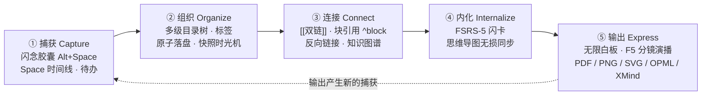
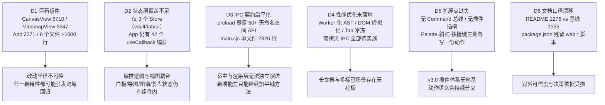
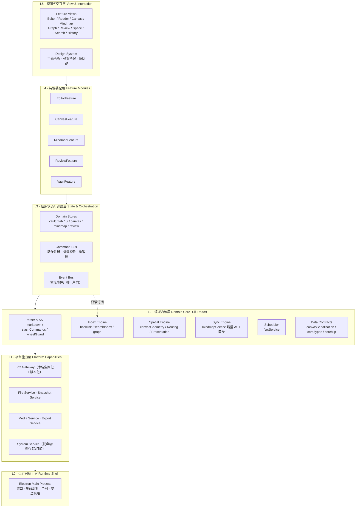
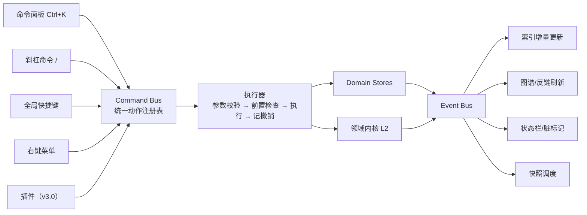
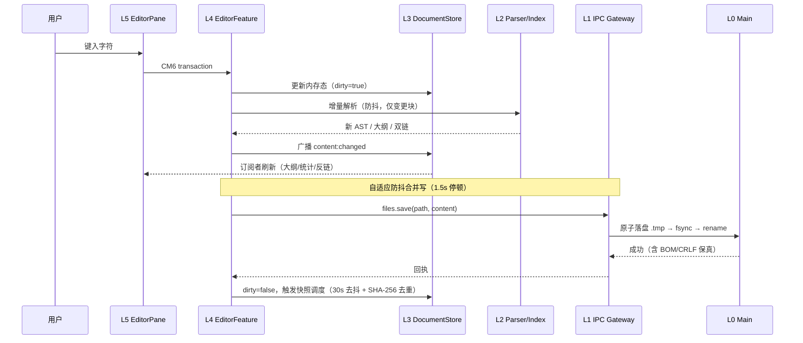
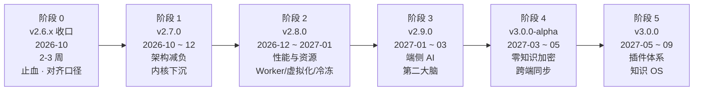

# 🏛️ KnowSpace 整体架构设计与长期演进规划

> **文档性质**：系统级架构设计说明 + 长期迭代规划（面向架构评审与团队执行）
> **基线版本**：桌面端 `v2.6.4`（Production Verified）
> **基线校准日期**：2026-09-26
> **数据口径**：本文所有 **🟢 实测** 数字均来自当前代码仓库的实际扫描（`wc -l` / 文件枚举 / `docs/TEST_BASELINE.md`）；**📘 规划** 内容为本次设计结论。
> **与既有文档的关系**：本文**重新校准**了 `docs/KNOWSPACE_EVOLUTION_BLUEPRINT_2026_2027.md`（该蓝图以 v2.3.0 为基线、将 FSRS 排在阶段一）——FSRS 已于 v2.5.0 交付，因此本文的阶段划分以 **v2.6.4 真实状态** 重新起算。功能路线图以本文为准，历史蓝图作为背景参考。

---

## 目录

- [第一部分 · 项目现有内容梳理](#第一部分--项目现有内容梳理)
- [第二部分 · 核心定位与关键需求](#第二部分--核心定位与关键需求)
- [第三部分 · 目标系统架构设计](#第三部分--目标系统架构设计)
- [第四部分 · 可扩展性与性能设计](#第四部分--可扩展性与性能设计)
- [第五部分 · 分阶段迭代更新计划](#第五部分--分阶段迭代更新计划)
- [第六部分 · 风险登记与治理机制](#第六部分--风险登记与治理机制)

---

# 第一部分 · 项目现有内容梳理

## 1.1 项目是什么

**KnowSpace** 是一款 **本地优先（Local-First）、零格式锁定、空间化拓扑认知** 的桌面级个人知识工作台（Personal Knowledge Workspace），产品理念为 **"Write. Read. Connect. Know."（记录 · 阅读 · 连接 · 认知）**。

它不是一个 Markdown 编辑器，而是把「**捕获 → 组织 → 连接 → 内化 → 输出**」五段认知闭环收敛到同一个本地文件系统上的**个人知识操作系统（Knowledge OS）雏形**。

## 1.2 技术栈与运行形态（🟢 实测）

| 维度 | 实测事实 |
| :--- | :--- |
| 运行时 | Electron `^42.5.0`（主进程 `electron/main.cjs` 单文件 2,326 行） |
| UI 框架 | React `^19.2.3` + TypeScript `^5.9.3` |
| 构建 | Vite `^7.3.6`（`tsc && vite build`） |
| 编辑器内核 | CodeMirror 6 全家桶（`view` / `state` / `language` / `autocomplete` / `search`） |
| 状态管理 | Zustand `^5.0.15`（**已引入，但仅覆盖 3 个域**） |
| 渲染 | markdown-it + highlight.js + DOMPurify + mermaid 11 + KaTeX（经 markdown-it 管道） |
| 测试 | Vitest `^4.1.10` + Testing Library + jsdom；Playwright `^1.63.0`（已装依赖） |
| 打包 | electron-builder `^26.15.3` → MSI / NSIS / 便携 zip（**仅 Windows**） |
| 分发形态 | 桌面单机应用；`web/` 宣传站目录 **已不存在**，但 `package.json` 仍残留 `web:dev` / `web:build` / `web:preview` 三条脚本 |

## 1.3 代码资产盘点（🟢 实测）

### 总量与分层

| 层 | 路径 | 文件数 | 行数 |
| :--- | :--- | ---: | ---: |
| 视图组件层 | `src/components/**` | 62（45 顶层 + 17 `canvas/`） | 42,595（TSX） |
| 服务层 | `src/services/` | 34 | 16,779 |
| Hook 层 | `src/hooks/` | 13 | 3,734 |
| 领域工具层 | `src/core/` | 16 | 2,188 |
| 状态层 | `src/store/` | 3 | 729 |
| 宿主层 | `electron/` | 4 | 3,466 |
| **非测试源码合计** | `src/` + `electron/` | — | **≈ 56,483 行** |
| 测试 | `src/__tests__/` | 109 个测试文件 | 27,360 行 |

> **测试:源码 ≈ 0.48 : 1**，109 个测试文件 / **1,335 项用例**（1,334 通过 / 1 跳过，通过率 99.9%，权威口径见 `docs/TEST_BASELINE.md`）。
> ⚠️ 对外文档 `README.md` 徽章仍标注 **1276** 项 —— 属**历史口径漂移**，需与基线脚本对齐（见 5.1 阶段 0）。

### 巨石文件清单（架构风险核心）

| 文件 | 行数 | 风险等级 | 说明 |
| :--- | ---: | :---: | :--- |
| `src/components/CanvasView.tsx` | **6,710** | 🔴 高 | 白板视口 + 节点 + 连线 + 路由 + 演示 + 小地图 + 导出 + 菜单全部耦合 |
| `src/components/MindmapView.tsx` | **3,547** | 🔴 高 | 导图画布 + 布局 + 样式 + 搜索 + 标注 + 关系线 + 同步 |
| `src/App.tsx` | **2,371** | 🔴 高 | 仍含 6 × `useState` / 13 × `useEffect` / **42 × `useCallback`** 的编排逻辑 |
| `src/components/DailyReviewPanel.tsx` | 1,233 | 🟠 中 | FSRS 复盘 UI + 队列 + 撤销 + 写回合并 |
| `src/components/FlashCapsule.tsx` | 1,098 | 🟠 中 | 闪念微窗 + 模板 + 尺寸记忆 + 钉住 |
| `src/components/EditorContextMenu.tsx` | 1,064 | 🟠 中 | 情境菜单 + 划词提取 + 统计卡片 |
| `src/components/GraphViewPane.tsx` | 1,059 | 🟠 中 | 力导向仿真 + 聚类 + Hop 过滤 + 详情卡 |
| `src/services/canvasService.ts` | — | 🔴 高 | 白板单一领域服务（被 98 项用例覆盖） |
| `electron/main.cjs` | 2,326 | 🟠 中 | 窗口/托盘/热键/打印/离屏渲染/文件关联集中在一个文件 |

### 已建立的架构资产（**值得保护**）

| 资产 | 位置 | 价值 |
| :--- | :--- | :--- |
| 单一事实来源注册表 | `docs/ENGINEERING_GUIDE.md` 第一节 | 已明确 9 个概念的唯一位置，是防止"同一概念写两遍"的护栏 |
| 纯函数化交互判定器 | `services/slashCommands.ts`（`detectSlashTrigger`）、`services/wheelScrollGuard.ts`（`canConsumeWheel`） | **同一规则被两个消费者共用**（文档编辑器 + 白板卡片）—— 这是本仓库最正确的架构决策，应推广 |
| 主题令牌化 | `services/canvasTheme.ts`（屏幕 + 导出共用）、`canvasModalStyles.ts`、`.flash-*` CSS 变量 | 消除"屏幕与导出配色漂移"类事故 |
| 领域核心层 | `src/core/`（16 个纯 TS：ids / zip / inflate / paths / types / mindmap* 系列） | 零 React 依赖，可单测、可 Worker 化、可复用 |
| 测试重置助手 | `src/__tests__/helpers/resetStores.ts` | 多 Store 环境下测试隔离的基础设施 |
| 已引入的状态域 | `useVaultStore`(158) / `useTabStore`(220) / `useUiStore`(351) | 解耦的**正确起点**，但覆盖面不足 |

## 1.4 宿主层与 IPC 现状（🟢 实测）

`electron/preload.cjs`（126 行）通过 `contextBridge` 向渲染进程暴露 **50+ 个扁平 API**（实测至少 50 项），例如：

```
openDirectory / refreshDirectory / readMarkdownFile / readMarkdownBatch / saveMarkdownFile
createMarkdownFile / renameMarkdownFile / saveMarkdownFileAs / getDirectoryForFile
listSnapshots / readSnapshot / revertSnapshot / createManualSnapshot
exportSvgAsPng / exportCanvasAsPng / copyCanvasAsImage / savePngBuffer / printToPdf / printDocument
openFlashCapsule / hideFlashCapsule / getFlashShortcut / saveFlashNote / getFlashPin / setFlashSize …
```

**特征与问题**：
- ✅ 安全边界正确：`contextIsolation` + `contextBridge`，渲染进程无 Node 直通。
- ⚠️ **无命名空间分组**：50+ 个方法平铺在一个对象上，`savePngData` / `savePngBuffer` / `copyPngToClipboard` / `exportSvgAsPng` / `exportCanvasAsPng` 语义交叉，调用方难以判断该用哪个。
- ⚠️ **无契约版本化**：IPC 通道名即隐式契约，宿主与渲染层无法独立演进。
- ⚠️ **主进程职责过载**：`main.cjs` 2,326 行同时承担窗口管理、托盘、全局热键、打印、离屏栅格化、文件关联、快照等 7 类职责。

## 1.5 现有规划文档盘点

| 文档 | 基线 | 现状判断 |
| :--- | :--- | :--- |
| `docs/KNOWSPACE_EVOLUTION_BLUEPRINT_2026_2027.md` | v2.3.0 | 📘 **已过期**：将 FSRS 排在阶段一，实际 v2.5.0 已交付；架构解耦目标（App < 500 行）**未达成**（现 2,371 行） |
| `docs/PROJECT_PLANNING_OVERVIEW.md` | v2.4.0 | 📘 部分过期：测试口径（384）已被 `TEST_BASELINE.md`（1,335）取代 |
| `knowspace-spuer-plan.md` | v1.5.0 | 📘 **未落地**：性能超级优化方案（Worker 化 AST / DOM 虚拟化 / Tab 冷冻 / 零拷贝 IPC）几乎全部仍待实施，且**依然完全适用** |
| `knowspace-netx-work-plan.md` | v1.5.1 | 📘 历史路线图（v1.6 ~ v2.5），大部分已交付 |
| `docs/ENGINEERING_GUIDE.md` | v2.6.3+ | 🟢 **活跃且权威**，是当前最有价值的工程约束文档 |
| `docs/TEST_BASELINE.md` | v2.6.4 | 🟢 脚本自动生成，权威口径 |

**结论**：项目不缺"功能清单"，缺的是**一份与当前代码事实一致、且能约束未来 12 个月技术决策的架构基线文档**。本文即为此而写。

---

# 第二部分 · 核心定位与关键需求

## 2.1 定位再校准

现有文档对 KnowSpace 的定位表述是"现代化个人知识工作台"。从代码事实反推，其**真实竞争位**应更精确地表述为：

> **KnowSpace = 以本地文件系统为唯一真相源（Single Source of Truth）、以标准开放格式为契约、以空间化拓扑为认知模型、以端侧纯 CPU 算力为边界的「个人知识操作系统」。**

四根不可动摇的支柱（每根都有对应代码证据）：

| 支柱 | 含义 | 代码证据 |
| :--- | :--- | :--- |
| **文件主权** | 用户数据永远是第三方可读的纯文本 | GFM Markdown + Frontmatter；`.canvas`（JSON Canvas 1.0）；FSRS 进度存单条 `<!-- fsrs:begin…end -->` 注释；导图样式存 `<!-- style: … -->` 注释 |
| **本地优先** | 核心能力不依赖网络与云 | FSRS 纯 CPU 毫秒级、零联网；检索为内存倒排索引；快照存 `.knowspace/snapshots/`；无遥测 |
| **性能即功能** | 大规模库下"秒开不卡"是产品能力而非优化项 | 协作式空闲分片索引、`readMarkdownBatch` 批量 IPC、32MB LRU、120FPS 视锥剔除、AABB 绕障 |
| **认知闭环** | 五段闭环缺一不可，功能必须挂在闭环上 | 闪念胶囊（捕获）→ 目录树/双链（组织）→ 图谱/块引用（连接）→ FSRS/导图（内化）→ 白板演示/PDF/逆向萃取（输出） |

## 2.2 关键功能需求（五域闭环）



| 域 | 关键需求（用户可感知的承诺） | 当前成熟度 |
| :--- | :--- | :---: |
| ① 捕获 | 任意窗口 `Alt+Space` 毫秒唤起、失焦隐匿、分钟级原子落盘、待办可回写 | 🟢 成熟 |
| ② 组织 | 万篇库打开秒开、目录树折叠记忆、30s 去抖快照、Myers LCS 差异还原 | 🟢 成熟 |
| ③ 连接 | `[[` 补全、重命名全库级联防断链、1/2-Hop 局部图谱、MOC/孤岛发现 | 🟢 成熟 |
| ④ 内化 | 三种零侵入闪卡语法、四档评分带间隔预览、撤销一步、写回是合并非覆盖 | 🟢 成熟（v2.5.0 起） |
| ⑤ 输出 | 白板多模态 + AABB 绕障 + F5 拓扑演播、7 种导图导出 / 3 种导入、高保真 PDF | 🟢 成熟 |

## 2.3 关键非功能需求（质量属性 + 量化目标）

这是**架构设计真正的输入**。以下指标分两类：🟢 已达成（作为护栏不可回退），📘 待达成（作为目标）。

| # | 质量属性 | 指标 | 现状 | 类型 |
| :--- | :--- | :--- | :--- | :---: |
| N1 | 启动与打开 | 冷启动 / 打开单文件 < 50ms；大目录首屏活动文档即时可用 | 已达成（协作式空闲分片索引） | 🟢 护栏 |
| N2 | 交互帧率 | 白板平移/缩放/拖拽恒定 60 / 120 FPS | 已达成（视锥剔除 + rAF 批处理） | 🟢 护栏 |
| N3 | 检索延迟 | 万篇库键入即出 < 15ms | 已达成（内存倒排索引） | 🟢 护栏 |
| N4 | 打字延迟 | 长文打字主线程延迟 < 16ms | 部分达成（大文档 > 2MB 有降载保护） | 📘 目标 |
| N5 | 内存预算 | 单标签增量内存 < 5MB（冷冻态 < 200KB） | 未达成（**无 Tab 冷冻机制**） | 📘 目标 |
| N6 | 数据安全 | 全部持久化走 `.tmp → fsync → rename` 原子落盘；BOM/CRLF 保真 | 已达成 | 🟢 护栏 |
| N7 | 隐私 | 无授权不遥测；同步未加密不出网；AI 优先端侧 | 已达成（当前无任何出网能力） | 🟢 护栏 |
| N8 | 零回归 | 每次改动后 1,335 项用例保持通过 | 已达成（99.9%，1 项 skip） | 🟢 护栏 |
| N9 | 文件纯净 | 样式/进度/元数据一律写入标准注释或 Frontmatter | 已达成 | 🟢 护栏 |
| N10 | 可维护性 | 单文件 ≤ 800 行；`App.tsx` < 500 行 | **未达成**（最大 6,710 行） | 📘 目标 |
| N11 | 跨平台 | Windows / macOS / Linux 均可构建运行 | **未达成**（仅 Windows 产物） | 📘 目标 |

## 2.4 架构债务诊断（本设计的靶子）



**债务的根因**：项目在 v2.x 期间以「**功能纵向切片**」方式高速演进——每个新能力（白板 → 演示 → 多模态 → FSRS → XMind）都直接落在最靠近 UI 的位置，领域逻辑随之被写入组件。功能交付速度换来了结构熵。**现在到了必须横向收口的时刻**：不是重构为了好看，而是因为 **v3.0 的插件体系与端侧 AI 都必须依赖一个可被外部调用的稳定内核**，而这个内核目前不存在。

---

# 第三部分 · 目标系统架构设计

## 3.1 分层模型（L0 – L5）

设计目标：**依赖单向向下、领域内核零框架依赖、能力边界显式声明**。



### 各层职责边界（硬约束）

| 层 | 允许 | 禁止 |
| :--- | :--- | :--- |
| **L5 视图** | React 组件、主题令牌、快捷键绑定、调用 L4 暴露的 hook | 直接 `import` L2 内核做业务计算；直接 `window.knowspace.*` 调 IPC |
| **L4 特性** | 组合 hook、订阅 Store、调用 Command | 持有跨域状态；直接读写文件 |
| **L3 状态/调度** | Zustand Store、Command/Event 总线、撤销栈 | 引入 React 渲染逻辑；直接操作 DOM |
| **L2 领域内核** | **纯 TS 函数与不可变数据**，输入输出明确 | `import React`；访问 `window` / `document` / IPC；持有全局可变状态 |
| **L1 平台能力** | IPC handler、Node fs/crypto、原生模块 | 承载业务规则（业务规则必须在 L2） |
| **L0 宿主** | 窗口/进程/安全/生命周期 | 承载领域逻辑（当前 `main.cjs` 需把快照/文件规则下沉到 L1/L2） |

## 3.2 模块划分与职责矩阵

| 模块 | 层 | 核心职责 | 现有代码映射 | 目标形态 |
| :--- | :---: | :--- | :--- | :--- |
| **Vault Module** | L4 | 目录树、文件打开/保存/冲突协商、快照 | `ChapterList` `useVaultOpening` `useDocumentSession` `markdown-files.cjs` | 收敛为 `features/vault/` |
| **Editor Module** | L4 | CM6 编辑、双链补全、块引用、斜杠命令、右键菜单 | `EditorPane` `EditorContextMenu` `slashCommands` | 收敛 + 菜单独立 |
| **Reader Module** | L4 | 渲染、AST 同步滚动、公式/图表、灯箱 | `ReaderPane` `useSyncScroll` `markdown.ts` `mermaid.ts` | 收敛为 `features/reader/` |
| **Canvas Module** | L4 | 视口、节点、连线、路由、演示、导出 | `CanvasView`(6710) + `canvas/`(17 文件) + `canvasService` + 6 个 canvas* 服务 | **拆 5 子模块**（见 3.3） |
| **Mindmap Module** | L4 | 布局、节点样式、标注、关系线、增量同步 | `MindmapView`(3547) + 11 个 Mindmap* 组件 + `mindmapService` | **拆 4 子模块** |
| **Graph Module** | L4 | 力导向、聚类、Hop 过滤、详情卡 | `GraphViewPane` `GlobalGraphDialog` `LocalGraphView` `graphService` | 收敛 + 仿真入 Worker |
| **Review Module** | L4 | FSRS 队列、评分、撤销、合并写回 | `DailyReviewPanel` `fsrsService` `reviewSources` `useReviewFolders` | UI 拆分 + 内核保留 |
| **Space Module** | L4 | 闪念微窗、时间线、待办回写、模板 | `FlashCapsule` `SpaceTimelinePanel` `useVaultCards` | 收敛为 `features/space/` |
| **Search Module** | L4 | 倒排索引、结构化语法、范围切换 | `SearchPanel` `searchIndexService` `useSearch` | 索引引擎下沉 L2 |
| **History Module** | L4 | 快照列表、Myers LCS 差异、还原 | `VersionHistoryDialog` `diffService` `snapshots.cjs` | 差异引擎下沉 L2 |
| **Platform Gateway** | L1 | 唯一 IPC 出口，命名空间 + 版本 + 类型 | `preload.cjs`(126) + `main.cjs`(2326) | **重构为 5 个命名空间** |

## 3.3 关键组件职责与交互

### (1) 三总线模型（本设计的核心机制）

现状痛点：**同一个用户动作被三处各写一遍** —— `CommandPalette`（`>` 动作模式）、`slashCommands.ts`（`/` 模板）、`useGlobalShortcuts.ts`（快捷键）。三者语义重叠、必然分叉。



**规则**：
- 一个动作 = 一条 `CommandDescriptor`（id / 标题 / 分类 / 快捷键 / 参数模式 / 执行器 / 撤销器）。
- 四个入口 + 未来插件**只做"发现与触发"**，不各自实现逻辑。
- 事件**单向广播**，订阅者不得回写触发源（避免事件环）。

### (2) Canvas Module 拆分方案（6,710 行 → 5 个 ≤ 800 行子模块）

| 子模块 | 职责 | 现有资产复用 |
| :--- | :--- | :--- |
| `CanvasViewport` | 视口矩阵、缩放平移手势、视锥剔除、坐标换算 | `canvasGeometry` `useColumnResize` |
| `CanvasNodeLayer` | 卡片渲染与虚拟化、卡片内编辑、媒体卡片 | `CanvasCardSuggestMenu` `canvasPrimitives` |
| `CanvasEdgeLayer` | 贝塞尔/折线/直线、AABB 绕障、标签、批量工具栏 | `CanvasEdgeLayer` `CanvasEdgeLabelLayer` `canvasRouting` `canvasEdges` |
| `CanvasPresentation` | F5 分镜演播、拓扑排序、运镜、控制台 | `canvasGraph` + 演播逻辑 |
| `CanvasChrome` | 小地图、右键菜单、导出/萃取弹窗、Toast | `CanvasMinimap` `NodeContextMenu` `EdgeContextMenu` `ExportModal` `ExtractModal` |

**关键约束**：拆分期间**禁止叠加新功能**，以 98 项 `canvas-service.test.ts` 用例 + 2,267 行 `canvas-view.test.tsx` 作为安全网，逐块搬迁并保持测试全绿。

### (3) 文档会话与保存链路（跨层交互范例）



### (4) IPC Gateway 命名空间化（L1 重构）

将 50+ 扁平 API 收敛为 5 个命名空间，并加契约版本：

| 命名空间 | 职责 | 归并的现有 API（示例） |
| :--- | :--- | :--- |
| `files` | 读写/创建/重命名/批量/目录扫描 | `openDirectory` `refreshDirectory` `readMarkdownFile` `readMarkdownBatch` `saveMarkdownFile` `createMarkdownFile` `renameMarkdownFile` `saveMarkdownFileAs` `getDirectoryForFile` |
| `history` | 快照列表/读取/还原/里程碑 | `listSnapshots` `readSnapshot` `revertSnapshot` `createManualSnapshot` |
| `media` | 图片/画布导出/剪贴板/数据 URL | `exportSvgAsPng` `exportCanvasAsPng` `savePngData` `savePngBuffer` `copyCanvasAsImage` `copyPngToClipboard` `readFileAsDataUrl` |
| `system` | 窗口/托盘/热键/打印/外链/主题 | `setNativeTheme` `openExternal` `toggleFullScreen` `isFullScreen` `printToPdf` `printDocument` `openInNewWindow` `setDocumentState` `resolveBeforeClose` `getLaunchFilePath` `getInitialSyncData` |
| `capture` | 闪念胶囊专属通道 | `openFlashCapsule` `hideFlashCapsule` `saveFlashNote` `getFlashShortcut` `setFlashShortcut` `getFlashPin` `setFlashPin` `getFlashSpaceConfig` `selectFlashSpaceDir` `setFlashSize` `getPersistentNote` `savePersistentNote` |

**收益**：新增能力有明确的归属地；`main.cjs` 按命名空间拆为 `electron/handlers/*.cjs`；渲染层调用形如 `platform.files.readBatch(paths)`，语义自解释。

---

# 第四部分 · 可扩展性与性能设计

## 4.1 三层扩展点（v3.0 插件体系的地基）

当前项目**没有任何扩展点**。v3.0 的"插件 SDK"若要成立，必须先在这三个位置定义稳定契约——它们恰好对应三类既有能力：

| 扩展点 | 契约形态 | 现有能力映射 | 插件可做的事 |
| :--- | :--- | :--- | :--- |
| **Command（动作）** | `CommandDescriptor` 注册到 Command Bus | 命令面板 `>` 动作、斜杠命令、快捷键 | 自定义动作、AI 指令、批量处理 |
| **View Slot（插槽）** | 具名挂载点：侧栏 / 状态栏 / 编辑器扩展 / 命令面板 | ActivityBar 页签、StatusBar、CM6 扩展 | 自定义面板、自定义编辑器行为 |
| **Converter（转换器）** | `parse / serialize` 双向接口 | 导图导入导出（OPML/MM/XMind/MD/SVG）、画布 JSON Canvas、PDF 导出 | 支持新格式（Notion、Roam、EPUB…） |

**关键设计决策**：扩展点**只暴露 L2 领域内核与 L3 命令总线**，绝不暴露 IPC 与文件系统。插件通过受限的 `PluginContext`（读文档、发命令、注册插槽、访问主题令牌）工作，天然获得沙盒边界。

> 注：导图已有 7 种导出 / 3 种导入（含自写 DEFLATE + ZIP 读写），说明**转换器模式已在实践中被验证**，只需把它抽象成统一接口。

## 4.2 状态与数据模型设计

### 状态域划分（Zustand，按"所有权"而非"页面"划分）

| Store | 所有权 | 状态内容 | 持久化 |
| :--- | :--- | :--- | :--- |
| `useVaultStore` 🟢已有 | 工作区 | 根路径、目录树、文件索引、选中项 | 库内 `.knowspace/` |
| `useTabStore` 🟢已有 | 标签与会话 | 标签列表、激活项、分屏、脏标记 | 会话级 |
| `useUiStore` 🟢已有 | 界面 | 主题、侧栏、面板开合、快捷键 | 本地配置 |
| `useDocumentStore` 📘新增 | 文档实例 | 各标签的文档内容/光标/滚动/AST 缓存 | 不持久化（内存） |
| `useCanvasStore` 📘新增 | 白板 | 卡片/连线/视口/选区/撤销栈 | `.canvas` 文件 |
| `useMindmapStore` 📘新增 | 导图 | 节点树/布局/样式/脏状态 | `.mindmap.md` 注释 |
| `useReviewStore` 📘新增 | 复盘 | 队列/当前卡/评分历史/撤销栈 | 文档内 FSRS 注释 |

**原则**：
1. **撤销栈属于领域，不属于组件** —— 白板"一次手势一条历史"、取色器"防抖提交单条历史"这类已实现的规则，应作为 Store 的通用能力。
2. **持久化路径必须收敛到单一序列化器**（`canvasSerialization` 已是正例）。
3. **AST/索引缓存用 LRU 且可丢弃** —— 任何缓存都不得成为唯一真相源。

## 4.3 性能设计（预算表 + 手段映射）

| 场景 | 预算 | 手段 | 现状 |
| :--- | :--- | :--- | :---: |
| 冷启动 | < 2s 可见窗口；活动文档 < 50ms | 延迟加载重模块；活动文档优先解析 | 🟢 |
| 大目录打开 | 首屏不阻塞；后台索引让出时间片 | 600ms 初始空闲 + 8 篇/分片 + 20ms 让步 | 🟢 |
| 全库检索 | < 15ms | 内存倒排索引（tag/link/term） | 🟢 |
| 批量读盘 | 10× 串行 IPC | `readMarkdownBatch` 主进程并发 + 32MB LRU | 🟢 |
| 长文打字 | 主线程延迟 < 16ms | **AST 解析移入 Web Worker + 增量块解析** | 📘 |
| 长文滚动 | 恒定 60 FPS；DOM 节点 < 200 | **预览区 DOM 虚拟化 + 滚动读写分离** | 📘 |
| 图表/公式密集页 | 批量渲染 < 80ms | **IntersectionObserver 惰性 + SVG LRU 池** | 📘 |
| 多标签（20+） | 单标签增量 < 5MB | **Tab 冷冻（>5min 销毁 DOM，仅留文本+滚动位）+ 50ms 注水** | 📘 |
| 白板大图 | 60/120 FPS | 视锥剔除 + rAF 批处理 + GPU 栅格化 | 🟢 |
| 大文本 IPC | 零拷贝 | **`Uint8Array` / SharedArrayBuffer 传输** | 📘 |
| 空闲功耗 | < 0.1% CPU | **V8 `--optimize-for-size` + 后台节流精细化** | 📘 |

**渐进增强原则（贯穿全设计）**：任何重能力都必须有降级路径 ——
无 WebGPU → CPU WASM；无 GPU → 2D 静态拓扑；无本地 LLM → 云端 BYOK；无端侧嵌入 → 关键词检索兜底。

## 4.4 数据与兼容性策略

| 关注点 | 策略 |
| :--- | :--- |
| **格式契约** | Markdown/GFM、JSON Canvas 1.0、OPML 2.0、FreeMind 1.0.1、XMind（zip+DEFLATE）、PDF —— 全部为**公开标准或可自解析格式** |
| **元数据承载** | 优先标准 Frontmatter；其次单条 HTML 注释（FSRS、导图样式）；**禁止引入专有二进制** |
| **向前兼容** | 序列化器**保留未知字段**（读入→修改→写回不丢数据） |
| **向后兼容** | 新版本必须能读旧版本文件；升级时一次性迁移脚本 + 迁移前自动快照 |
| **IPC 契约** | 命名空间 + `apiVersion`；渲染层与宿主层可独立演进 |
| **跨平台** | 路径处理收敛到 `core/paths.ts`；宿主层避免 Windows 专有 API 硬编码（文件关联、托盘需分平台适配） |

---

# 第五部分 · 分阶段迭代更新计划

## 5.0 阶段总览（2026-10 → 2027-09）



**排序依据（不是随意分段）**：
- 阶段 1 必须在阶段 2/3/4 之前 —— 性能优化（Worker/虚拟化）与 AI 能力都要求"领域内核可被非 React 环境调用"，巨石组件是硬阻塞。
- 阶段 2 在阶段 3 之前 —— 端侧 AI 会显著增加内存与计算负载，必须先有内存预算与 Worker 化基础设施，否则体验崩塌。
- 阶段 4 在阶段 5 之前 —— 插件体系需要"稳定的数据契约 + 稳定的 IPC 契约"，加密同步恰好会重塑这两者，先做同步再定契约可避免返工。

---

## 5.1 阶段 0 · v2.6.x 收口 ——「止血与口径对齐」（2026-10，2–3 周）

> **定位**：不新增功能。把"事实与文档不一致""发布资产膨胀""测试口径漂移"三个低成本高价值问题一次清掉，为后续所有重构建立可信标尺。

### 目标
建立"唯一可信事实源"：版本号、测试数、发布产物、能力清单四者互相一致，且可由脚本自动生成。

### 范围

| # | 工作项 | 说明 | 优先级 |
| :--- | :--- | :--- | :---: |
| 0-1 | **测试口径统一** | `README.md` 徽章 1276 → 以 `TEST_BASELINE.md`（1,335）为准；把基线捕获接入 CI/发布前检查 | **P0** |
| 0-2 | **清理 `package.json` 僵尸脚本** | 删除 `web:dev` / `web:build` / `web:preview`（`web/` 已不存在） | P1 |
| 0-3 | **`release/` 资产归档治理** | 历史 MSI / 解包目录移出仓库（保留最新 + Release 附件） | P1 |
| 0-4 | **文档中英/繁重复同步机制** | `USER_MANUAL.md` ↔ `操作手册.md`、`PICTURE_MANUAL.md` ↔ `全功能高清图片手册.md` 建立"一源多译"或明确主从关系 | P1 |
| 0-5 | **架构护栏落地** | 将本文 L2「禁止 import React / 禁止访问 IPC」写成 ESLint 规则或提交检查，防止债务继续增长 | **P0** |
| 0-6 | **性能基线埋点** | 落 `Ctrl+Shift+P` 性能 HUD（FPS / JS 堆 / DOM 节点数），为阶段 2 提供前后对比数据 | P1 |

### 交付物
- 与代码一致的 `README.md` / `TEST_BASELINE.md`
- 架构依赖护栏（ESLint `no-restricted-imports` 分区规则）
- 性能 HUD 与首份基线报告

### 验收判据
- ✅ 任意文档中的版本号/测试数与脚本输出**逐字一致**
- ✅ `npm run build` 后无残留 `web/*` 引用
- ✅ L2 目录下出现 `import React` 即构建失败
- ✅ 性能 HUD 可在开发态呼出并记录 5 项指标

### 风险
| 风险 | 缓解 |
| :--- | :--- |
| 护栏规则过严导致阶段 1 拆分寸步难行 | 护栏**只对新文件生效**，存量文件进白名单并标注"待迁移"，随拆分逐批移出 |

---

## 5.2 阶段 1 · v2.7.0 ——「架构减负与领域内核下沉」（2026-10 ~ 12，约 10 周）

> **定位**：本规划中**投入产出比最高、也最不可跳过**的阶段。目标不是"重构得漂亮"，而是**让领域内核可以被非 React 环境调用**——这是阶段 2/3/5 的共同前置条件。

### 目标（可量化）
| 指标 | 当前 🟢 | 目标 📘 |
| :--- | ---: | ---: |
| 单文件最大行数 | 6,710（`CanvasView.tsx`） | **≤ 800** |
| `App.tsx` 行数 | 2,371 | **< 500** |
| > 1,000 行的文件数 | 8 | **0** |
| Zustand 域 | 3 | **7** |
| 动作入口实现份数 | 3（Palette / 斜杠 / 快捷键各一份） | **1（Command Bus）** |
| IPC 暴露方式 | 50+ 扁平方法 | **5 命名空间 + 版本号** |
| 测试用例 | 1,335 | **≥ 1,335（零回归）** |

### 范围与拆分批次

**批次 1（第 1–3 周）· Command Bus 与状态域扩展**
- 定义 `CommandDescriptor` 契约，把命令面板 `>` 的 17+ 项动作、斜杠命令、全局快捷键**统一注册**到总线。
- 新增 `useDocumentStore` / `useCanvasStore` / `useMindmapStore` / `useReviewStore` 四个域。
- 从 `App.tsx` 迁出 42 个 `useCallback` 中的编排逻辑，`App.tsx` 降为"布局壳 + 路由"。
- **产出**：动作语义单点化；`App.tsx` < 1,200 行。

**批次 2（第 3–6 周）· CanvasView 拆分（最高风险，优先做）**
- 按 3.3(2) 拆为 `CanvasViewport` / `CanvasNodeLayer` / `CanvasEdgeLayer` / `CanvasPresentation` / `CanvasChrome`。
- 领域计算（几何/路由/图/序列化）确认**全部已在 `services/` 与 `core/`**，组件只负责渲染与事件。
- 安全网：`canvas-service.test.ts`(98 用例) + `canvas-view.test.tsx`(2,267 行) 全程绿灯。
- **产出**：5 个 ≤ 800 行子模块；`App.tsx` < 700 行。

**批次 3（第 6–9 周）· MindmapView 拆分 + 内核下沉**
- 拆为 `MindmapCanvas` / `MindmapToolbar` / `MindmapNodeStyle` / `MindmapAnnotations`。
- 把 `searchIndexService`（索引）、`diffService`（Myers LCS）、`fsrsService`（调度）**显式标注为 L2 内核**，移除其中任何浏览器/React 依赖。
- 抽出 `Converter` 统一接口，把现有 7 导出 / 3 导入挂到该接口下。
- **产出**：导图子模块化；转换器接口落地。

**批次 4（第 9–10 周）· IPC Gateway 命名空间化**
- 按 3.3(4) 把 50+ API 归并到 `files` / `history` / `media` / `system` / `capture`。
- `main.cjs` 拆为 `electron/main.cjs`（生命周期）+ `electron/handlers/*.cjs`（按命名空间）。
- 加 `apiVersion` 与启动时握手校验。
- **产出**：宿主层可独立演进；单文件 ≤ 800 行。

### 优先级
`批次 2（Canvas 拆分）` = **P0**（风险最高、最晚做成本最高）→ `批次 1（Command Bus）` = **P0** → `批次 4（IPC）` = P1 → `批次 3（导图 + 转换器）` = P1

### 验收判据
- ✅ 单文件 ≤ 800 行，`App.tsx` < 500 行
- ✅ 1,335 项用例**零回归**（允许新增用例，不允许失败或跳过数增加）
- ✅ 新增一个动作时，**只需在 Command Bus 注册一处**，命令面板/快捷键/斜杠命令同时可用
- ✅ 新增一个 IPC 能力时，只需在对应命名空间加一个方法，且类型自动贯通
- ✅ L2 目录下 `import React` / 访问 `window` 均构建失败

### 风险与缓解
| 风险 | 等级 | 缓解 |
| :--- | :---: | :--- |
| 拆分过程引入白板回归（交互极复杂） | 🔴 高 | 先补"行为快照测试"再动刀；每批次独立可回滚；**拆分期间禁止叠加新功能** |
| `App.tsx` 状态迁移引发并发渲染不一致（React 19） | 🟠 中 | 一次只迁一个域，迁完跑全量测试；避免在迁移中改变渲染时序 |
| IPC 重构破坏闪念胶囊（独立窗口，依赖专属通道） | 🟠 中 | 把 `capture` 命名空间排在最后迁移，并做双窗口联调 |
| 工期挤压导致半成品拆分 | 🔴 高 | 批次可独立发布（v2.7.0 / v2.7.1 / v2.7.2），**宁可分批发布也不留半拆状态** |

---

## 5.3 阶段 2 · v2.8.0 ——「性能与资源重构」（2026-12 ~ 2027-01，约 8 周）

> **定位**：把 `knowspace-spuer-plan.md` 中**始终未落地**的性能方案真正实施。这一阶段解决"多标签 + 超长文档"两个天花板，并为阶段 3 的 AI 负载腾出内存与算力预算。

### 目标（量化）
| 指标 | 当前 🟢 | 目标 📘 |
| :--- | ---: | ---: |
| 长文打字主线程延迟 | 未测（大文档降载） | **< 16ms** |
| 长文滚动帧率 | 42–52 FPS（历史数据） | **恒定 60 FPS** |
| 单标签增量内存 | ~18MB（历史数据） | **< 5MB；冷冻态 < 200KB** |
| 20 标签总内存 | 未测（无冷冻） | **下降 ≥ 50%** |
| 图表/公式批量渲染 | ~850ms（历史数据） | **< 80ms** |
| 空闲 CPU | 0.8–1.5%（历史数据） | **< 0.1%** |

### 范围

| # | 工作项 | 要点 | 优先级 |
| :--- | :--- | :--- | :---: |
| 2-1 | **Markdown AST 解析移入 Web Worker** | 增量块解析（仅重算变更段落），结构化克隆/`ArrayBuffer` 传输 | **P0** |
| 2-2 | **预览区 DOM 虚拟化** | 视口外占位撑高，10 万字文档 DOM 节点 < 200 | **P0** |
| 2-3 | **Tab 冷冻与注水** | >5min 未激活销毁 DOM 与 CM6 实例，仅留文本 + 滚动位；切回 50ms 注水 | **P0** |
| 2-4 | **滚动同步读写分离** | `passive` 监听 + rAF 批处理 + 行高映射缓存表 | P1 |
| 2-5 | **Mermaid/KaTeX 惰性渲染池** | IntersectionObserver 提前 300px + SVG LRU 缓存 | P1 |
| 2-6 | **IPC 零拷贝大文本传输** | `Uint8Array` / SharedArrayBuffer；窗口间只传增量 Patch | P1 |
| 2-7 | **自动保存聚合写队列** | 1.5s 自适应防抖合并；异步非阻塞写 | P1 |
| 2-8 | **目录树懒扫描 + 浅层监听** | 展开时才扫子目录；聚合 `fs.watch` 事件防风暴 | P2 |
| 2-9 | **Chromium/V8 启动参数调优** | `--optimize-for-size` / `--max-old-space-size=256` / `CanvasOopRasterization` | P2 |
| 2-10 | **生命周期守卫 + 泄漏防御** | `useDisposableListener` 封装；窗口销毁统一 `destroy()` | P1 |
| 2-11 | **弱引用资源回收** | 灯箱关闭 `revokeObjectURL`；缩略图用 `WeakRef` | P2 |

### 验收判据
- ✅ 打开 10 万字文档，DOM 节点数恒定 < 200，滚动 60 FPS，打字延迟 < 16ms
- ✅ 打开 20 个标签页，总内存较 v2.7 下降 ≥ 50%；切回冷冻标签 < 100ms 且光标/滚动位准确恢复
- ✅ 含 30 个 Mermaid 图的文档首屏 < 50ms，滚动到图表时才编译
- ✅ 7×24 小时常驻，内存无单调增长（泄漏测试通过）
- ✅ 1,335 项用例零回归

### 风险与缓解
| 风险 | 等级 | 缓解 |
| :--- | :---: | :--- |
| DOM 虚拟化破坏"AST 行号精确同步滚动"（本项目招牌能力） | 🔴 高 | 虚拟化层必须保留**逻辑行号→虚拟节点**双向映射；同步滚动改为"按行号定位虚拟窗口"，并补专门测试 |
| Tab 冷冻导致未保存内容丢失 | 🔴 高 | 冷冻**只在 dirty=false 时允许**；dirty 标签仅降载不销毁 |
| Worker 化后 Mermaid/KaTeX 渲染时序错乱 | 🟠 中 | Worker 只做解析产出 AST，渲染仍在主线程按原顺序执行 |
| 启动参数调优在某些硬件上引发崩溃 | 🟠 中 | 参数可配置 + 启动失败自动回退默认参数 |

---

## 5.4 阶段 3 · v2.9.0 ——「端侧 AI 第二大脑」（2027-01 ~ 03，约 10 周）

> **定位**：在**坚守零数据外传**的前提下，让工作台具备语义理解与全库对话能力。这是产品从"工具"跃迁为"第二大脑"的关键一步，也是**首次引入真正的不确定算力依赖**。

### 目标
| 指标 | 目标 📘 |
| :--- | :--- |
| 端侧嵌入模型体积 | **< 45MB**（量化，如 `bge-small-zh-v1.5-q4`） |
| 语义检索首屏 | **< 300ms**（含 Dense + BM25 融合） |
| 索引构建 | 后台空闲增量，**不阻塞 UI**；断网可用 |
| 回答可溯源率 | **100%**（每个论点附 `[[文档]]` / `^block-id` 锚点） |
| 无 GPU 降级 | CPU WASM 可用，仅速度下降，**功能不缺失** |

### 范围

| # | 工作项 | 要点 | 优先级 |
| :--- | :--- | :--- | :---: |
| 3-1 | **ONNX 端侧嵌入引擎** | WebGPU 优先，WASM SIMD 降级；段落级向量，增量更新 | **P0** |
| 3-2 | **混合多路召回（Dense + BM25 + RRF）** | 复用现有倒排索引作为稀疏路；RRF 加权融合 | **P0** |
| 3-3 | **全库 RAG 对话** | 双模调度：本地 Ollama/llama.cpp（离线）/ 云端 BYOK（在线） | **P0** |
| 3-4 | **强制溯源锚点体系** | 回答内嵌文件名 + 小节 + `^block-id` 徽章，点击跳转并脉冲高亮 | **P0** |
| 3-5 | **内联写作助手 `///`** | 润色 / 精简 / 互译 / 摘要 / 双链建议；以 Command 形式接入总线 | P1 |
| 3-6 | **知识健康度体检** | 孤岛笔记、重复概念、断链、过时笔记的库级报告 | P2 |
| 3-7 | **模型与算力可用性探测** | 启动时探测 WebGPU / Ollama 可用性，UI 明确展示降级状态 | **P0** |

### 优先级说明
`3-7（可用性探测）` 与 `3-1/3-2` 同属 P0 —— **AI 能力最大的失败模式不是"不智能"，而是"在用户机器上不可用却不说"**。必须让降级状态对用户可见。

### 验收判据
- ✅ 断网状态下，语义检索与本地模型问答均可工作
- ✅ 每一条 AI 回答的每个论点都有可点击的原文锚点，且点击后精确高亮
- ✅ 无 WebGPU 机器上功能完整、UI 明确提示"CPU 模式"
- ✅ 索引构建期间滚动与打字帧率不受影响
- ✅ **零遥测、零未授权出网**（网络请求白名单审计通过）

### 风险与缓解
| 风险 | 等级 | 缓解 |
| :--- | :---: | :--- |
| 硬件差异导致体验两极分化 | 🔴 高 | 渐进增强 + 显式状态提示 + 关键词检索永久兜底 |
| 向量索引内存膨胀（大库） | 🟠 中 | 量化向量 + 分片懒加载 + 索引可重建（非唯一真相源） |
| 云端 BYOK 泄露密钥 | 🟠 中 | 密钥存系统钥匙串（非明文配置）；请求前二次确认 |
| AI 幻觉污染知识库 | 🔴 高 | AI **默认只读**，写入必须用户显式确认；溯源强制 |

---

## 5.5 阶段 4 · v3.0.0-alpha ——「零知识加密同步与跨端」（2027-03 ~ 05，约 10 周）

> **定位**：打破单机边界。**这是全规划中数据丢失风险最高的阶段**，必须按"只读验证 → 单向写入 → 双向协商"三步走，任何一步不达标即停止推进。

### 目标
| 指标 | 目标 📘 |
| :--- | :--- |
| 加密算法 | AES-256-GCM，密钥由 Argon2id 从主密码派生 |
| 服务端可见内容 | **仅密文**（零知识） |
| 后端兼容 | WebDAV（坚果云/群晖/Nextcloud）+ S3 兼容（R2/MinIO/OSS） |
| 冲突策略 | **永不覆盖**，并发冲突生成 `.conflict.md` 副本 |
| 首次同步 | 只读比对，**不写任何远端文件** |

### 范围

| # | 工作项 | 要点 | 优先级 |
| :--- | :--- | :--- | :---: |
| 4-1 | **客户端加密内核** | AES-256-GCM + Argon2id；文件级加密切片；AES-NI 加速 | **P0** |
| 4-2 | **同步后端抽象层** | 统一 `SyncBackend` 接口，WebDAV / S3 两个实现 | **P0** |
| 4-3 | **向量钟增量协商** | 基于版本向量的差异计算；同行并发不丢字 | **P0** |
| 4-4 | **只读同步验证模式** | 先做"下载比对报告"，用户确认后才允许写入 | **P0** |
| 4-5 | **冲突仲裁 UI** | 复用现有 `FileConflictDialog` 模式，扩展为多端冲突 | P1 |
| 4-6 | **移动端 PWA 伴侣** | 复用 L2 内核（这就是阶段 1 的回报）；拍照/录音速记入 Space | P1 |
| 4-7 | **平板手势与笔触适配** | 双指缩放、手写笔压感（白板/导图） | P2 |
| 4-8 | **跨平台桌面构建** | macOS（dmg）/ Linux（AppImage）打包流水线 | P1 |

### 验收判据
- ✅ 加密后远端文件用任何工具打开均为不可读密文
- ✅ **破坏性测试**：同步过程中强制断网/杀进程，本地与远端均无损坏、无丢字
- ✅ 两端同时编辑同一文件，产生 `.conflict.md` 且两边内容都完整保留
- ✅ 首次同步全程只读（网络抓包验证无写请求）
- ✅ macOS / Linux 构建产物可安装运行（跨平台达成，N11 闭环）

### 风险与缓解
| 风险 | 等级 | 缓解 |
| :--- | :---: | :--- |
| **数据丢失（不可接受）** | 🔴 极高 | 三步走（只读→单向→双向）；每步上线前做破坏性测试；同步前自动本地快照 |
| 各家 WebDAV/S3 实现差异大 | 🟠 中 | 抽象层 + 兼容性矩阵测试；先支持 2–3 家主流服务 |
| 主密码丢失导致数据永久不可读 | 🔴 高 | 强制生成恢复码；导出时明确风险提示；禁止"记住密码即唯一凭证" |
| PWA 与桌面端状态不一致 | 🟠 中 | 共享 L2 内核 + 共享数据契约；禁止在 PWA 里另写一套解析 |

---

## 5.6 阶段 5 · v3.0.0 ——「插件体系与知识 OS」（2027-05 ~ 09，约 16 周）

> **定位**：从"一款软件"升维为"可被第三方扩展的平台"。此阶段的所有地基（Command / Slot / Converter 三大扩展点、命名空间化 IPC、稳定数据契约）都已在阶段 1–4 铺设完毕。

### 目标
| 指标 | 目标 📘 |
| :--- | :--- |
| 插件安装方式 | 拖入 `.zip` 即热加载，无需重启 |
| 权限模型 | 显式声明 + 用户授权，**默认最小权限** |
| 插件崩溃影响 | **零** —— 插件异常不得影响主程序 |
| 首个官方插件 | 数字花园静态发布（验证扩展点是否真的够用） |

### 范围

| # | 工作项 | 要点 | 优先级 |
| :--- | :--- | :--- | :---: |
| 5-1 | **Plugin SDK（TS 类型 + 文档）** | `PluginContext`：读文档 / 发命令 / 注册插槽 / 主题令牌 / 受限存储 | **P0** |
| 5-2 | **插件加载器与沙盒** | 独立执行环境（Worker / iframe）；崩溃隔离；资源配额 | **P0** |
| 5-3 | **权限管控模型** | 权限清单 + 运行时授权 + 可撤销 | **P0** |
| 5-4 | **数字花园一键发布** | `publish: true` 笔记 + 白板 → 静态站（Astro/VitePress 管线） | P1 |
| 5-5 | **无代码自动化工作流** | 触发器（定时/文件事件）→ 动作（命令总线）；每日汇总待办等 | P1 |
| 5-6 | **插件市场与模板中心** | 分发、版本、评分；本地目录安装兜底 | P2 |
| 5-7 | **全生命周期知识健康体检** | 库级诊断报告 + 一键修复建议 | P2 |

### 验收判据
- ✅ 一个**未接触过本项目源码**的开发者，仅凭 SDK 文档在 1 天内写出可用插件
- ✅ 故意让插件抛异常/死循环，主程序不受影响、可正常卸载
- ✅ 插件在未授权时**无法**读写用户文件（越权测试通过）
- ✅ 数字花园插件完全通过公开 SDK 实现（**若需要修改内核才能完成，则说明扩展点设计失败，须返工**）

### 风险与缓解
| 风险 | 等级 | 缓解 |
| :--- | :---: | :--- |
| 扩展点设计不足，官方插件被迫"开洞" | 🔴 高 | 用数字花园作为**验收性探针**；先内部实现，再抽 SDK |
| 插件生态安全（恶意插件） | 🔴 高 | 沙盒 + 最小权限 + 授权可见 + 可审计；禁止插件直接访问 IPC |
| 平台化稀释核心体验 | 🟠 中 | 核心闭环（捕获→输出）性能与稳定性优先级**永久高于**插件能力 |

---

## 5.7 优先级总表

| 优先级 | 事项 | 阶段 | 判定依据 |
| :---: | :--- | :---: | :--- |
| **P0** | 测试口径统一 + 架构护栏落地 | 0 | 后续一切重构的安全网与标尺，成本极低 |
| **P0** | `CanvasView.tsx` 拆分（6,710 行） | 1 | 最大风险源；越晚拆成本越高；阻塞阶段 2/3 |
| **P0** | Command Bus 统一动作入口 | 1 | 消除三处语义分叉；插件体系前置条件 |
| **P0** | `App.tsx` 瘦身至 < 500 行 | 1 | 编排逻辑与视图耦合的总根源 |
| **P0** | AST Worker 化 + DOM 虚拟化 + Tab 冷冻 | 2 | 长文与多标签的体验天花板 |
| **P0** | 端侧 AI 可用性探测 + 混合召回 + 强制溯源 | 3 | 决定 AI 能力是否"可信可用" |
| **P0** | 加密内核 + 只读验证 + 冲突不覆盖 | 4 | 数据安全不可妥协，必须最保守推进 |
| **P0** | Plugin SDK + 沙盒 + 权限模型 | 5 | 平台化的唯一入口 |
| P1 | IPC 命名空间化 + `main.cjs` 拆分 | 1 | 宿主层可演进；非阻塞项 |
| P1 | 导图拆分 + Converter 统一接口 | 1 | 为格式扩展与插件铺路 |
| P1 | 滚动读写分离 / 惰性渲染池 / 泄漏防御 | 2 | 体验细节与长稳运行 |
| P1 | 内联写作助手 `///` | 3 | 高频使用场景，但依赖 AI 基础设施 |
| P1 | 跨平台构建（macOS / Linux） | 4 | 覆盖非 Windows 用户；解锁用户基数 |
| P1 | 数字花园 / 自动化工作流 | 5 | 验证扩展点的探针 |
| P2 | 目录懒扫描 / V8 参数 / 弱引用回收 | 2 | 边际收益，低风险 |
| P2 | 知识健康体检 / 插件市场 / 平板手势 | 3–5 | 锦上添花 |

## 5.8 里程碑与阶段成功判据

| 阶段 | 版本 | 时间窗口 | 主题 | **一句话成功判据** |
| :---: | :--- | :--- | :--- | :--- |
| 0 | v2.6.x | 2026-10 | 收口与对齐 | 文档与代码事实**逐字一致**，护栏生效 |
| 1 | v2.7.0 | 2026-10 ~ 12 | 架构减负 | **无单文件 > 800 行**，1,335 用例零回归 |
| 2 | v2.8.0 | 2026-12 ~ 2027-01 | 性能重构 | 10 万字文档 60FPS、20 标签内存降半 |
| 3 | v2.9.0 | 2027-01 ~ 03 | 端侧 AI | **断网可用、回答 100% 可溯源** |
| 4 | v3.0.0-alpha | 2027-03 ~ 05 | 加密跨端 | 断网/杀进程不丢字，服务端只存密文 |
| 5 | v3.0.0 | 2027-05 ~ 09 | 插件生态 | **外人凭 SDK 一天内写出可用插件** |

---

# 第六部分 · 风险登记与治理机制

## 6.1 风险登记册

| ID | 风险 | 等级 | 影响 | 缓解策略 | 归属阶段 |
| :--- | :--- | :---: | :--- | :--- | :---: |
| **R1** | 巨石组件阻碍演进（6,710 / 3,547 / 2,371 行） | 🔴 高 | 改动半径不可控；新人上手成本极高；阻塞 AI 与插件 | **先拆再长**；以 1,335 用例为安全网；拆分期禁止叠新功能 | 1 |
| **R2** | 拆分引发白板/导图回归（交互最复杂、测试最多） | 🔴 高 | 核心体验崩塌 | 先补行为快照测试；分批可独立回滚 | 1 |
| **R3** | 性能优化破坏招牌能力（AST 精确同步滚动） | 🔴 高 | 差异化优势丢失 | 虚拟化保留行号映射；同步滚动改按行号定位虚拟窗口 | 2 |
| **R4** | 文档与代码事实持续脱节（1276 vs 1335 已发生） | 🟠 中 | 决策依据失真、对外可信度受损 | 关键数字脚本自动生成；发布前一致性检查 | 0 |
| **R5** | 单平台绑定（仅 Windows 产物） | 🟠 中 | 无法覆盖 macOS / Linux 用户 | 路径收敛到 `core/paths.ts`；阶段 4 补齐跨平台构建 | 4 |
| **R6** | 端侧 AI 算力差异大 | 🟠 中 | 体验不一致，可能被迫降级 | 渐进增强 + 显式状态提示 + 关键词兜底 | 3 |
| **R7** | 加密同步数据丢失 | 🔴 极高 | **不可接受** | 三步走；破坏性测试；同步前自动快照；永不覆盖 | 4 |
| **R8** | 主密码丢失导致数据永久不可读 | 🔴 高 | 用户数据损失 | 强制恢复码；风险显式提示 | 4 |
| **R9** | 扩展点设计不足导致插件"开洞" | 🔴 高 | 平台化失败、内核被污染 | 数字花园作验收探针；探针失败即返工 SDK | 5 |
| **R10** | 插件生态安全风险 | 🔴 高 | 用户数据被恶意插件读取 | 沙盒 + 最小权限 + 禁止直连 IPC + 可审计 | 5 |
| **R11** | 工期挤压导致半成品重构 | 🔴 高 | 长期处于"半拆"不稳定态 | 批次可独立发版；宁可分批发布 | 1 |
| **R12** | Electron 大版本升级破坏离屏渲染/剪贴板/文件关联 | 🟠 中 | 导出与系统集成失效 | 锁定主版本；升级前跑导出与集成专项测试 | 全阶段 |

## 6.2 治理机制（让架构约束"活着"）

| 机制 | 内容 | 落地形式 |
| :--- | :--- | :--- |
| **单一事实来源注册表** | 延续 `ENGINEERING_GUIDE.md` 第一节：新概念必须先查表，不存在则登记 | 文档表 + 代码评审清单 |
| **分层依赖护栏** | L2 禁止 `import React` / 访问 `window` / IPC；L5 禁止直连 IPC | ESLint `no-restricted-imports` + CI 阻断 |
| **文件体量护栏** | 单文件 ≤ 800 行；超限即 CI 警告，超过 1,000 行阻断 | CI 脚本 |
| **零回归协议** | 任何核心改动必须保持 1,335 项用例通过；新增能力必须补测 | `npm test` + 发布前门禁 |
| **口径自动化** | 版本号、测试数、发布产物清单由脚本生成，禁止手写 | `scripts/capture-test-baseline.cjs` 扩展 |
| **架构决策记录（ADR）** | 每次架构级选择（如"为什么 Command Bus 而非各自实现"）留档 | `docs/adr/` |
| **阶段门禁** | 每阶段验收判据未全绿，不得进入下一阶段 | 阶段评审 |

## 6.3 五条不可妥协的工程红线（延续并强化）

1. **纯净文件主权** —— 笔记/白板/闪卡元数据永远为 GFM Markdown / Frontmatter / JSON Canvas 1.0 / 标准注释。
2. **物理事务原子落盘** —— `.tmp → fsync → rename`，杜绝断电损坏。
3. **零回归测试协议** —— 核心改动必须同步补测。
4. **恒定高刷与冷冻机制** —— 单标签增量内存 < 5MB，长文打字延迟 < 16ms。
5. **绝对零隐私外泄** —— 无授权不遥测；同步未加密不出网；AI 优先端侧。

---

## 附录 · 文档索引与权威口径

| 文档 | 用途 | 状态 |
| :--- | :--- | :--- |
| **`docs/ARCHITECTURE_DESIGN_AND_ROADMAP.md`（本文）** | **架构设计 + 长期规划权威基线** | 🟢 现行 |
| `docs/ENGINEERING_GUIDE.md` | 工程约束与单一事实来源注册表 | 🟢 现行 |
| `docs/TEST_BASELINE.md` | 测试用例数权威口径（脚本生成） | 🟢 现行 |
| `docs/KNOWSPACE_EVOLUTION_BLUEPRINT_2026_2027.md` | 功能演进蓝图（v2.3.0 基线，已过期） | 📘 归档参考 |
| `docs/PROJECT_PLANNING_OVERVIEW.md` | 项目全景梳理（v2.4.0 基线） | 📘 归档参考 |
| `knowspace-spuer-plan.md` | 性能与资源优化方案（未落地，阶段 2 依据） | 📘 待实施 |
| `knowspace-netx-work-plan.md` | 历史路线图（v1.6 ~ v2.5） | 📘 历史 |
| `docs/knowspace-roadmap-v2.0-v3.0.md` | 版本路线图 | 📘 历史 |
| `README.md` | 对外总览 | ⚠️ 测试徽章待与基线对齐 |

> **维护约定**：本文的 🟢 实测数字建议每季度复核一次；阶段推进后须回写"已完成/已调整"标注，保持单一基线。若本文与历史文档冲突，**以本文 + `TEST_BASELINE.md` 为准**。

---

*KnowSpace · Personal Knowledge Workspace —— Write. Read. Connect. Know.*
