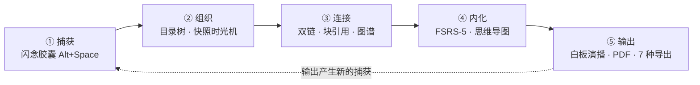
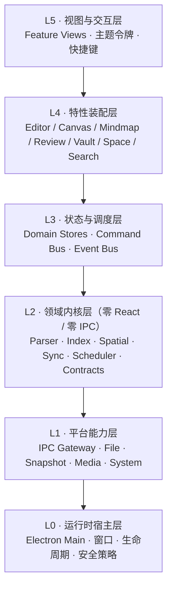
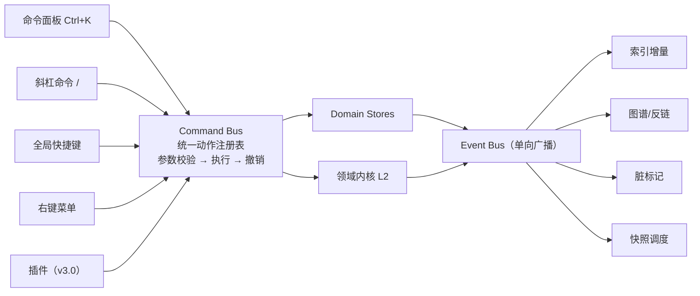
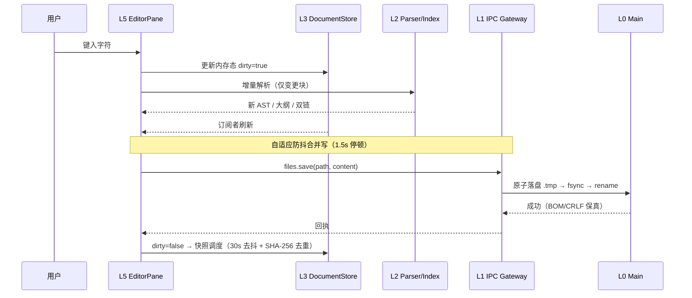
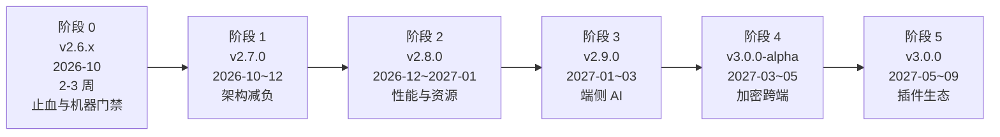

# KnowSpace · 工程能力建设与代码质量把控方案

> **文档性质**：工程规范（与 `docs/ENGINEERING_GUIDE.md` 配套）
> **基线版本**：`v2.6.5`（2026-09-26 发布）
> **数据口径**：本文所有 🟢 **实测** 数字均来自当前仓库 `C:/Users/chunxvzhang/Desktop/codex` 的实际扫描；📘 为本次设计结论。
> **与 `ENGINEERING_GUIDE.md` 的分工**：
> - `ENGINEERING_GUIDE.md` 管 **「规则是什么」**——它由真实事故沉淀而来，是最高权威。
> - 本文管 **「规则如何被执行、团队如何具备执行它的能力」**。
> - **冲突裁决：以 `ENGINEERING_GUIDE.md` 为准。**
> **本文的存续约定**：第四节（质量体系）与第五节（能力建设）属长期工程规范，应随版本维护；**第六节的阶段计划一旦执行完毕即应删除或迁入 issue 跟踪**——`docs/` 只保留跟着版本走的内容，这是本仓库 2026-09-26 刚刚确立的原则，本文不应成为它的例外。

---

## 目录

- [零、先说一个今天就要修的事实](#零先说一个今天就要修的事实)
- [第一部分 · 现状梳理](#第一部分--现状梳理)
- [第二部分 · 核心定位与关键需求](#第二部分--核心定位与关键需求)
- [第三部分 · 目标系统架构](#第三部分--目标系统架构)
- [第四部分 · 代码质量把控体系（五道防线）](#第四部分--代码质量把控体系五道防线)
- [第五部分 · 团队技术能力提升路径](#第五部分--团队技术能力提升路径)
- [第六部分 · 分阶段迭代优化计划](#第六部分--分阶段迭代优化计划)
- [第七部分 · 风险登记与治理机制](#第七部分--风险登记与治理机制)

---

# 零、先说一个今天就要修的事实

**`docs/TEST_BASELINE.md` 停留在 `2.6.4`（生成于 2026-09-21），而仓库已于 2026-09-26 发布 `v2.6.5`。**

这不是文档疏漏，是**机制缺口的一次现场复现**：

- `ENGINEERING_GUIDE.md` 第三节写了「提交前门禁四条」，第 3 条正是 `node scripts/capture-test-baseline.cjs`；
- 但这条门禁**靠人记得跑**——没有 hook、没有 CI 拦住它；
- 于是它就被漏掉了，而且漏得毫无声音。

同一份指南在 4.3 节自己写下了结论：

> **约定只要有一处不遵守，它就不再是约定。**

本文的全部设计都建立在这句话上：**KnowSpace 的工程质量问题，不是「团队不会写」，而是「团队写下的规则没有机器执行」。** 规则写得极好——好到罕见——但它们以人力为执行载体，因此必然随负载、疲劳、人员变动而失效。

**立刻执行**：`node scripts/capture-test-baseline.cjs`，确认用例数未下降后提交。

---

# 第一部分 · 现状梳理

## 1.1 项目是什么

**KnowSpace** 是一款 **本地优先（Local-First）、零格式锁定、空间化拓扑认知** 的桌面个人知识工作台（Electron + React）。

产品理念 **"Write. Read. Connect. Know."**，实质是把「**捕获 → 组织 → 连接 → 内化 → 输出**」五段认知闭环收敛到本地文件系统上的**个人知识操作系统**雏形。

## 1.2 工程资产盘点（🟢 实测）

| 维度 | 实测值 |
| :--- | :--- |
| 版本 / 提交 | `v2.6.5` · git 共 **389** 次提交，**近 30 天 294 次**，工作区干净（0 未提交改动） |
| 源码规模 | `src/` 249 个 `.ts`/`.tsx`，非测试代码 **56,635 行** |
| 测试 | **109 个测试文件 / 1,335 项用例**（1,334 通过、1 跳过，通过率 99.9%） |
| 分层规模 | 组件 TSX 42,595 · `services/` 16,779（34 文件）· `hooks/` 3,734 · `core/` 2,188 · `store/` 729 · `electron/` 3,466 |
| 类型严格度 | `tsconfig.json` **`strict: true`** |
| 文档 | `docs/` 13 份（用户手册 + 工程规范 + RELEASE_NOTES v2.4~v2.6.5 + TEST_BASELINE） |
| 脚本 | `scripts/` **56 个已跟踪文件** |

## 1.3 工程能力评估：强项（**必须保护，不要为了"规范化"破坏它们**）

这一节先写，因为**任何改进方案如果损伤了这些，就是负收益**。

| # | 强项 | 证据 |
| :--- | :--- | :--- |
| S1 | **提交信息写「为什么」，而非「做了什么」** | `fix(css): 200 hardcoded cyan literals now follow the theme; drop 9 dead data-theme="dark" selectors` —— 一句话交代了范围、动机与副作用 |
| S2 | **不靠压制类型错误** | `@ts-ignore` / `@ts-expect-error` 均为 **0 处**；`debugger` 0 处 |
| S3 | **不靠 TODO 拖延** | `TODO` / `FIXME` / `HACK` 全为 **0 处**——在 5.6 万行代码里，这是极罕见的状态 |
| S4 | **测试有权威口径且脚本生成** | `TEST_BASELINE.md` 明确「禁止手改」，并写清「299/379 是历史过时数字，不是被 exclude 的测试」——**主动澄清口径**而非掩盖 |
| S5 | **跨文件引用一致性守卫** | `css-animation-keyframes` / `css-custom-properties` / `css-theme-vocabulary` / `css-accent-info` / `flash-capsule-theme-contrast` —— 把「编译器不做跨文件检查」的一类问题**机器化**。**这是本仓库最有价值的工程资产**（详见 4.8） |
| S6 | **测试卫生纪律成文** | `resetStores` 统一重置入口；「偶发失败必须当 bug 修，不能靠重跑掩盖」；超时预算带实测理由；墙钟断言「预热 + 取 N 次最快」 |
| S7 | **`.gitignore` 严谨到注明原因** | 连 `/release-next` 的由来都写了注释并指向 `scripts/refresh-release-in-place.cjs`；30 个根目录日志/备份文件**全部被正确忽略**，未污染仓库 |
| S8 | **门禁与清单已成文** | 提交前门禁 4 条 + 回归判定基线 3 条 + Code Review 清单 13 项 |
| S9 | **事故即规则** | `ENGINEERING_GUIDE.md` 10 条规则每条都标注了触发它的事故，并写明「违反它会出什么事」 |

## 1.4 工程能力评估：短板（🟢 实测）

| # | 短板 | 实测证据 | 性质 |
| :--- | :--- | :--- | :--- |
| **G1** | **零自动化质量工具链** | 无 ESLint、无 Prettier、无 `.editorconfig`、无 husky / lint-staged、**无 `.github/workflows`（无 CI）**；`package.json` 无 `lint` / `format` / `typecheck` / `preflight` 脚本 | 🔴 **根因** |
| **G2** | **测试基线滞后一个版本** | `TEST_BASELINE.md` 标 `2.6.4` / 生成于 09-21，仓库已发 `2.6.5`；`vitest.config.ts` **无 coverage 配置** | 🟠 |
| **G3** | **体量债务未完整登记** | 实测 **15 个文件 > 1,000 行**，但 `ENGINEERING_GUIDE.md` 技术债表只记了 `CanvasView.tsx` 与 `App.tsx`。**漏登记的 13 个里，有 8 个在服务层**：`mindmapLayout` 1261 / `mindmapSidecar` 1201 / `mindmapService` 1194 / `canvasGraph` 1152 / `markdown` 1088 / `canvasExport` 1075 / `fsrsService` 1050 / `canvasGeometry` 1021 | 🔴 |
| **G4** | **类型逃逸未被计量** | **34 处 `: any` + 13 处 `as any`**（`strict: true` 已开，`any` 是合法后门）；无棘轮约束 | 🟠 |
| **G5** | **一次性脚本无生命周期** | `scripts/` 56 个已跟踪文件，其中 **25 个**是 `extract-*` / `append-*` / `replace-*` / `remove-*` / `split-*` 迁移脚本。它们记录了历史（有价值），但没有归档标记，也无「何时可删」的约定 | 🟡 |
| **G6** | **知识集中度（bus factor ≈ 1）** | 708 行的 `ENGINEERING_GUIDE.md` 承载了全部判断，且指南自己写下「这是有意为之还是历史遗留，**没人记得了**」（4.4 `singleFork`）。文档极强，但**没有第二个人能独立复现这些判断** | 🔴 |
| **G7** | `web:*` 脚本指向已抽出的仓库 | `.gitignore` 注明 `/web/` 已抽到独立仓库 `Knowspace-web`，但 `package.json` 仍有 `web:dev` / `web:build` / `web:preview` | 🟡 |

## 1.5 诊断结论

```
   G1（无机器门禁）
        │
        ├──► G2 基线滞后      「门禁靠人记得跑」→ 漏跑且无声
        ├──► G3 体量债务漏登记 「护栏靠人记得数」→ 新债务不进入清单
        ├──► G4 any 无棘轮     「指标靠人记得查」→ 逃逸点持续累积
        └──► G6 知识不可传递   「判断靠人记得」→ bus factor = 1

   共同结构：规则存在于文档，执行依赖于人的记忆与纪律。
```

**KnowSpace 的团队不缺工程素养，缺的是把素养固化成基础设施的那一层。**
`ENGINEERING_GUIDE.md` 已经证明了团队有能力写出世界级的规则；接下来要证明的是——**团队有能力让规则自己生效**。

---

# 第二部分 · 核心定位与关键需求

## 2.1 定位

> **KnowSpace = 以本地文件系统为唯一真相源、以标准开放格式为契约、以空间化拓扑为认知模型、以端侧纯 CPU 算力为边界的「个人知识操作系统」。**

四根支柱（每根都有代码证据）：

| 支柱 | 含义 | 证据 |
| :--- | :--- | :--- |
| **文件主权** | 数据永远是第三方可读的纯文本 | GFM Markdown + Frontmatter；JSON Canvas 1.0；FSRS 进度存单条 `<!-- fsrs:… -->` 注释 |
| **本地优先** | 核心能力不依赖网络 | FSRS 纯 CPU 零联网；内存倒排索引；快照存 `.knowspace/snapshots/`；无遥测 |
| **性能即功能** | 「秒开不卡」是产品能力而非优化项 | 协作式空闲分片索引、批量 IPC、LRU 缓存、视锥剔除、AABB 绕障 |
| **认知闭环** | 功能必须挂在闭环上，不能是孤立特性 | 闪念胶囊 → 目录树/双链 → 图谱/块引用 → FSRS/导图 → 白板演播/PDF/逆向萃取 |

## 2.2 五域闭环与关键需求



## 2.3 关键非功能需求（架构设计的真正输入）

| # | 质量属性 | 指标 | 现状 | 类型 |
| :--- | :--- | :--- | :--- | :---: |
| N1 | 启动与打开 | 冷启动 / 打开单文件 < 50ms | 已达成 | 🟢 护栏 |
| N2 | 交互帧率 | 白板平移缩放恒定 60 / 120 FPS | 已达成 | 🟢 护栏 |
| N3 | 检索延迟 | 万篇库键入即出 < 15ms | 已达成 | 🟢 护栏 |
| N4 | 打字延迟 | 长文主线程延迟 < 16ms | 部分达成 | 📘 目标 |
| N5 | 内存预算 | 单标签增量 < 5MB（冷冻态 < 200KB） | 未达成（无 Tab 冷冻） | 📘 目标 |
| N6 | 数据安全 | 全部持久化 `.tmp → fsync → rename` | 已达成 | 🟢 护栏 |
| N7 | 隐私 | 无授权不遥测；同步未加密不出网 | 已达成 | 🟢 护栏 |
| N8 | 零回归 | 每次改动后 1,335 项用例全绿 | 已达成（99.9%） | 🟢 护栏 |
| N9 | 文件纯净 | 元数据一律写入标准注释 / Frontmatter | 已达成 | 🟢 护栏 |
| **N10** | **可维护性** | 单文件 ≤ 800 行；`App.tsx` < 500 行 | **未达成**（最大 6,710 行；15 文件 > 1000 行） | 📘 目标 |
| **N11** | **工程可信度** | 门禁由机器执行，基线不滞后 | **未达成**（见 G1 / G2） | 📘 目标 |
| N12 | 跨平台 | Windows / macOS / Linux 可构建 | 未达成（仅 Windows） | 📘 目标 |

> **N11 是本次新增的质量属性**。它此前隐含在「流程」里，从未被当作可验收的工程指标——这正是 G1 长期存在的原因。

---

# 第三部分 · 目标系统架构

## 3.1 分层模型（L0 – L5）



**硬约束**（应转为 ESLint 规则，见 4.6）：

| 层 | 允许 | 禁止 |
| :--- | :--- | :--- |
| L5 视图 | React 组件、主题令牌、快捷键、调用 L4 hook | 直接 `import` L2 做业务计算；直接 `window.knowspace.*` |
| L4 特性 | 组合 hook、订阅 Store、调用 Command | 持有跨域状态；直接读写文件 |
| L3 状态/调度 | Zustand Store、Command/Event 总线、撤销栈 | 引入渲染逻辑；直接操作 DOM |
| **L2 领域内核** | **纯 TS 函数与不可变数据** | **`import React`；访问 `window` / `document` / IPC；持有全局可变状态** |
| L1 平台能力 | IPC handler、Node fs/crypto | 承载业务规则（业务规则属 L2） |
| L0 宿主 | 窗口/进程/安全/生命周期 | 承载领域逻辑 |

## 3.2 模块划分与职责

| 模块 | 层 | 职责 | 现有代码 | 目标 |
| :--- | :---: | :--- | :--- | :--- |
| Vault | L4 | 目录树、打开/保存/冲突、快照 | `ChapterList` `useVaultOpening` `markdown-files.cjs` | 收敛为 `features/vault/` |
| Editor | L4 | CM6、双链补全、块引用、斜杠命令 | `EditorPane` `EditorContextMenu` `slashCommands` | 菜单独立 |
| Reader | L4 | 渲染、AST 同步滚动、公式图表 | `ReaderPane` `useSyncScroll` `markdown.ts` | 收敛 |
| **Canvas** | L4 | 视口/节点/连线/路由/演播/导出 | `CanvasView`(6710) + `canvas/`(17) + 9 个 canvas* 服务 | **拆 5 子模块** |
| **Mindmap** | L4 | 布局/样式/标注/关系线/增量同步 | `MindmapView`(3547) + 11 个组件 + 3 个 >1190 行服务 | **拆 4 子模块 + 服务收敛** |
| Graph | L4 | 力导向、聚类、Hop 过滤 | `GraphViewPane` `GlobalGraphDialog` `graphService` | 仿真入 Worker |
| Review | L4 | FSRS 队列、评分、撤销、合并写回 | `DailyReviewPanel` `fsrsService` | UI 拆分 |
| Space | L4 | 闪念微窗、时间线、待办回写 | `FlashCapsule` `SpaceTimelinePanel` | 收敛 |
| Search | L4 | 倒排索引、结构化语法 | `SearchPanel` `searchIndexService` | 索引下沉 L2 |
| History | L4 | 快照列表、Myers LCS、还原 | `VersionHistoryDialog` `diffService` | 差异引擎下沉 L2 |
| **Platform Gateway** | L1 | 唯一 IPC 出口 | `preload.cjs`(126) + `main.cjs`(2326) | **5 命名空间 + 版本** |

## 3.3 关键组件交互

### (1) 三总线模型

现状：**同一个动作在三处各写一遍**——命令面板 `>`、`slashCommands.ts` 的 `/` 模板、`useGlobalShortcuts.ts` 的快捷键。



### (2) 文档会话与保存链路



### (3) IPC Gateway 命名空间化

将 `preload.cjs` 暴露的 **50+ 个扁平 API** 收敛为 5 个命名空间 + `apiVersion`：

| 命名空间 | 归并的现有 API（示例） |
| :--- | :--- |
| `files` | `openDirectory` `refreshDirectory` `readMarkdownFile` `readMarkdownBatch` `saveMarkdownFile` `createMarkdownFile` `renameMarkdownFile` `saveMarkdownFileAs` `getDirectoryForFile` |
| `history` | `listSnapshots` `readSnapshot` `revertSnapshot` `createManualSnapshot` |
| `media` | `exportSvgAsPng` `exportCanvasAsPng` `savePngData` `savePngBuffer` `copyCanvasAsImage` `copyPngToClipboard` `readFileAsDataUrl` |
| `system` | `setNativeTheme` `openExternal` `toggleFullScreen` `printToPdf` `printDocument` `openInNewWindow` `setDocumentState` `resolveBeforeClose` |
| `capture` | `openFlashCapsule` `hideFlashCapsule` `saveFlashNote` `getFlashShortcut` `getFlashPin` `getFlashSpaceConfig` `setFlashSize` … |

**收益**：`main.cjs` 按命名空间拆为 `electron/handlers/*.cjs`；新增能力有明确归属地；**并且立刻获得一个可被守卫测试覆盖的契约**（见 4.8 的 IPC 通道名守卫）。

## 3.4 可扩展性：三层扩展点

当前项目**没有任何扩展点**。v3.0 插件体系要成立，必须先定义这三个稳定契约——它们恰好对应三类既有能力：

| 扩展点 | 契约 | 现有映射 | 插件可做 |
| :--- | :--- | :--- | :--- |
| **Command** | `CommandDescriptor` 注册到 Command Bus | 命令面板 `>`、斜杠命令、快捷键 | 自定义动作、AI 指令 |
| **View Slot** | 具名挂载点（侧栏/状态栏/编辑器扩展/命令面板） | ActivityBar 页签、StatusBar、CM6 扩展 | 自定义面板与编辑器行为 |
| **Converter** | `parse / serialize` 双向接口 | 导图 7 导出 / 3 导入（OPML、FreeMind、XMind、MD、SVG）、JSON Canvas、PDF | 新格式（Notion、Roam、EPUB） |

**关键决策**：扩展点**只暴露 L2 内核与 L3 总线，绝不暴露 IPC 与文件系统**。插件通过受限 `PluginContext` 工作，天然获得沙盒边界。

> 导图已有 7 导出 / 3 导入（含自写 DEFLATE + ZIP 读写），说明**转换器模式已在实践中验证**，只需抽象成统一接口。

## 3.5 性能考量

| 场景 | 预算 | 手段 | 现状 |
| :--- | :--- | :--- | :---: |
| 冷启动 | 窗口可见 < 2s；活动文档 < 50ms | 延迟加载；活动文档优先解析 | 🟢 |
| 大目录 | 首屏不阻塞 | 600ms 初始空闲 + 8 篇/分片 + 20ms 让步 | 🟢 |
| 全库检索 | < 15ms | 内存倒排索引 | 🟢 |
| 批量读盘 | 10× 串行 | `readMarkdownBatch` + 32MB LRU | 🟢 |
| 长文打字 | 主线程 < 16ms | **AST 移入 Web Worker + 增量块解析** | 📘 |
| 长文滚动 | 恒定 60 FPS；DOM < 200 | **DOM 虚拟化 + 滚动读写分离** | 📘 |
| 图表密集页 | 批量 < 80ms | **IntersectionObserver 惰性 + SVG LRU** | 📘 |
| 多标签 20+ | 单标签 < 5MB | **Tab 冷冻（>5min 销毁 DOM）+ 50ms 注水** | 📘 |
| 白板大图 | 60 / 120 FPS | 视锥剔除 + rAF 批处理 + GPU 栅格化 | 🟢 |
| 大文本 IPC | 零拷贝 | **`Uint8Array` / SharedArrayBuffer** | 📘 |

**渐进增强原则**：任何重能力都必须有降级路径——无 WebGPU → CPU WASM；无 GPU → 2D 静态拓扑；无本地 LLM → 云端 BYOK；无端侧嵌入 → 关键词检索兜底。

---

# 第四部分 · 代码质量把控体系（五道防线）

## 4.1 设计原则

现状是「**一条防线，靠人守**」。目标是「**五道防线，前三道由机器守**」。

```
①  本地     编辑器即规范        ← 机器（保存时）
②  提交     pre-commit hook     ← 机器（git 强制）
③  集成     CI pipeline         ← 机器（PR 强制）
④  评审     清单 + 守卫         ← 人 + 机器
⑤  发布     preflight 脚本      ← 机器（发版强制）
```

**判据**：任何一条规则，如果它的执行依赖于「人记得做」，就视为**尚未落地**。

## 4.2 第一道防线 · 本地：编辑器即规范

| 引入 | 配置要点 | 为什么 |
| :--- | :--- | :--- |
| **Prettier** | 单一配置，`printWidth: 100`；`src/styles.css` 纳入格式化范围 | 消灭格式类 diff 噪声，让评审只看逻辑 |
| **`.editorconfig`** | 与 Prettier 一致（缩进/换行/末尾空行） | 覆盖非 Prettier 编辑场景 |
| **ESLint（flat config）** | `typescript-eslint` + `react-hooks` + **分层依赖规则**（见 4.6） | 唯一能自动拦截「架构违规」的手段 |
| 编辑器 | 保存即 `eslint --fix` + Prettier | 让规范在写入时生效，而非在评审时争论 |

> **注意**：本仓库有 `src/styles.css` 这种万行级 CSS 与大量 CSS 守卫测试。Prettier 格式化 CSS 会**改变行号**，而 `css-animation-keyframes.test.ts` 明确记录过「行号差 25 行」导致定位失效的坑。**首次格式化必须在独立提交中完成，且格式化后立刻重跑全部 CSS 守卫测试**，确认它们仍能正确定位。

## 4.3 第二道防线 · 提交：pre-commit hook

```jsonc
// package.json（新增）
"scripts": {
  "lint":       "eslint . --max-warnings 0",
  "format":     "prettier --write .",
  "format:check": "prettier --check .",
  "typecheck":  "tsc --noEmit",
  "preflight":  "node scripts/preflight.cjs"
}
```

| Hook | 动作 | 时间预算 |
| :--- | :--- | :--- |
| `pre-commit` | `lint-staged`：对暂存文件跑 `eslint --fix` + `prettier --write` | < 5s |
| `commit-msg` | 校验 conventional commit 格式（本仓库已自然遵守，转为强制即可） | < 1s |
| `pre-push` | `tsc --noEmit` | < 30s |

**刻意不放进 pre-commit**：全量 `vitest run`（109 文件约 200s）。它属于第三道防线。**hook 超过 10 秒就会被 `--no-verify` 绕过，那样反而更糟。**

## 4.4 第三道防线 · 集成：CI

当前**无 `.github/workflows`**。建议流水线（按失败成本排序，快速失败在前）：

```yaml
# .github/workflows/quality.yml（要点）
1. typecheck     npx tsc --noEmit                    # 秒级
2. lint          npm run lint && npm run format:check # 秒级
3. ratchet       node scripts/quality-ratchet.cjs --check   # 秒级（见 4.7）
4. test          npx vitest run                       # 约 200s
5. baseline      node scripts/capture-test-baseline.cjs --check  # 用例数未下降
```

**关键点**：第 5 步把 `ENGINEERING_GUIDE.md` 第三节「门禁四条」中**依赖人的那三条**（跑测试、重跑基线、确认用例数未降）变成 CI 的退出码。这正是本文要解决的核心问题。

## 4.5 第四道防线 · 评审

保留 `ENGINEERING_GUIDE.md` 第七节现有的 13 项清单（**它是本仓库最好的资产之一，不要重写**），在其后追加 3 项：

- [ ] **分层依赖**：新增代码是否把 L2 逻辑写进了组件，或让 L5 直连 IPC？（规则由 ESLint 兜底，但设计意图需人判断）
- [ ] **文件体量**：改动后是否有文件越过 1,000 行？是否推高了棘轮基线？
- [ ] **类型逃逸**：是否新增了 `: any` / `as any`？若是，注释是否说明了为什么无法避免？

## 4.6 分层依赖护栏（ESLint 规则）

这是**唯一能自动拦截架构腐化**的手段。用 `no-restricted-imports` 按目录分区：

| 作用域 | 禁止 |
| :--- | :--- |
| `src/core/**`, `src/services/**`（L2） | `react`, `react-dom`, `zustand`, 以及访问 `window`/`document`/`ipcRenderer` |
| `src/components/**`（L5） | 直接 import `electron/*`；直接使用 `window.knowspace` |
| `src/store/**`（L3） | `react-dom`；直接操作 DOM |

**落地策略（关键）**：存量代码必然违规。**护栏只对新文件与已迁移文件生效**，存量文件进白名单并标注「待迁移」，随阶段 1 的拆分逐批移出白名单。**不要一次性全量开启——那会导致规则被整体关闭，比没有更糟。**

## 4.7 棘轮机制（Ratchet）

这是**适配「已有大量债务、不能一刀切」现实的唯一可行方案**，且它完美复用本仓库已有的心智模型——`TEST_BASELINE.md` 就是「脚本生成权威口径 + 只许改善不许恶化」。

**新增 `scripts/quality-ratchet.cjs` → 生成 `docs/QUALITY_BASELINE.md`**（禁止手改，与 `TEST_BASELINE.md` 同规格）：

| 指标 | 当前基线 🟢 | 规则 |
| :--- | ---: | :--- |
| `: any` 出现次数 | 34 | **只减不增** |
| `as any` 出现次数 | 13 | **只减不增** |
| 文件 > 1,000 行的数量 | 15 | **只减不增** |
| 单文件最大行数 | 6,710 | **只减不增** |
| `src/` 非测试总行数 | 56,635 | 记录趋势，不设闸 |
| 测试用例数 | 1,335 | **只增不减**（已有） |

**机制**：基线数字**自动收紧**——某次改动把 `any` 从 34 降到 31，基线即变为 31，之后不许回升到 32。CI 中 `--check` 模式比对失败即阻断。

**为什么这比"定一个目标值"更有效**：目标值（如"any 清零"）在 5.6 万行存量面前不可达，于是被无视；棘轮只要求"不比昨天差"，**每次改动都必然可达**，因此能被真正执行。

## 4.8 守卫测试范式化（本仓库最强资产）

仓库已有 5 个守卫测试，它们解决的是**同一类结构问题**：

> **引用端与定义端分离，编译期不做跨文件检查。**

这类问题的三种信号全部沉默——**不报错、视觉无异常、测试不读取**（`ENGINEERING_GUIDE.md` 规则 10 已完整论证）。**只有守卫能发现它。**

**因此：这不是「CSS 的技巧」，而是一条通用工程策略，应当被明确命名并推广。**

### 守卫的五要素模板（从现有 5 个守卫中提炼）

| 要素 | 内容 | 现有示例 |
| :--- | :--- | :--- |
| ① 单一事实来源 | 定义端从哪里读，而非复制一份常量 | 主题词汇表从 `src/core/types.ts` 解析 `ThemeMode` 联合类型 |
| ② 集合断言 | **引用 ⊆ 定义** | `animation` 名 ⊆ `@keyframes` 名 |
| ③ 负向对照 | **合法写法必须通过** | `animation: none`、`var(--anim)` 必须绿 |
| ④ 解析器自检 | **解析失败必须报错，不能空转** | 「解析 `ThemeMode` 失败必须报错」「扫到主题名必须超过阈值」 |
| ⑤ 允许清单带腐坏检查 | 白名单条目若已修好必须报错 | 「清单里的令牌确实仍未定义」+ 理由 ≥ 20 字符 |

> ③ 与 ④ 是**成对断言**（规则 5）的推广：任何「不要做某事」的断言，都要配一条「该做时确实做了」的断言。**没有 ③④ 的守卫会「静默全绿」，比没有守卫更危险。**

### 本仓库尚未覆盖、但结构完全相同的引用对（按价值排序）

| 优先级 | 引用端 | 定义端 | 失效后果 | 备注 |
| :---: | :--- | :--- | :--- | :--- |
| **P0** | `preload.cjs` 暴露的 50+ 方法名 | `main.cjs` 中 `ipcMain.handle/on` 注册的通道名 | **渲染层调用一个不存在的方法 → 运行时 TypeError**，且只在该功能被触发时才暴露 | 这是本仓库**最大的无声失效面**：两个 2,300 / 126 行的文件，无类型贯通 |
| **P1** | 脚本中的路径常量 | 实际存在的文件 | 打包/发布脚本中途倒下 | 已有 `PORTABLE_ONLY_ENTRIES` / `PORTABLE_DOC_ENTRIES` 两个集合，正是高危区 |
| **P1** | 测试文件是否使用 `resetStores` | `src/__tests__/helpers/resetStores.ts` | 状态泄漏 → 偶发失败（规则 4.2 已记录真实事故） | 可直接守卫：「所有渲染组件且写 localStorage 的测试文件必须 import `resetStores`」 |
| **P2** | `data-*` 属性名（TSX 写入 ↔ CSS 选择） | 两端 | 样式静默失效 | 与主题词汇表同族 |
| **P2** | i18n key（若引入） | 词条表 | 显示 key 原文 | — |

**建议：把「IPC 通道名守卫」作为阶段 0 的 P0 交付**。它成本低（两个文件、一个正则）、收益高（覆盖 50+ 个调用点），而且是**训练团队写守卫的最佳载体**——见 5.3。

## 4.9 度量看板

| 指标 | 来源 | 频率 | 阈值 |
| :--- | :--- | :--- | :--- |
| 类型检查 | `tsc --noEmit` | 每次提交 | 0 错误 |
| Lint | `eslint . --max-warnings 0` | 每次提交 | 0 警告 |
| 用例数 / 通过率 | `TEST_BASELINE.md` | 每次发版 | 只增不减 / 100% |
| `any` 逃逸数 | `QUALITY_BASELINE.md` | 每次提交 | 只减不增 |
| 超 1000 行文件数 | `QUALITY_BASELINE.md` | 每次提交 | 只减不增 |
| 最大文件行数 | `QUALITY_BASELINE.md` | 每次提交 | 只减不增 |
| 覆盖率 | 待引入（当前**无 coverage 配置**） | 每周 | 先测量，暂不设闸 |
| 全量测试耗时 | CI 日志 | 每周 | 记录趋势（当前 ~200s，`singleFork`） |

> **覆盖率不设闸的理由**：在 1,335 用例已有 99.9% 通过率的成熟套件上，覆盖率数字对质量的解释力低于「守卫数量」与「棘轮趋势」。**先测量、后决策**，不要为了一个好看的数字而写无断言测试——那会稀释真正有价值的用例。

---

# 第五部分 · 团队技术能力提升路径

## 5.1 能力四阶模型

| 阶 | 名称 | 判据（可验证） | 当前分布（估） |
| :---: | :--- | :--- | :---: |
| **L1** | 改得动 | 能改样式/文案/参数，跑通五道防线，不引入 lint 错误 | 全员 |
| **L2** | 加得上 | 能独立加一个功能，**且知道先查单一事实来源注册表**，不复制第二份实现 | 多数 |
| **L3** | 拆得开 | 能做模块拆分、把逻辑抽成纯函数、**能为新问题写一个守卫** | 少数 |
| **L4** | 定得了规 | 能从事故沉淀出规则、判断规则的边界与代价、评审架构级改动 | **1–2 人** |

**目标（90 天）**：**L3 至少 2 人**，且其中 1 人具备独立完成架构级评审的能力。

**为什么定在 L3 而不是 L4**：L4 的能力来自**多次真实事故的积累**，无法速成。但 L3 是**可训练的**——它由三个可练习的动作组成：抽纯函数、拆模块、写守卫。这三个动作恰好覆盖本仓库接下来 12 个月的主要工作。

## 5.2 最大风险：知识集中度

**G6 是本方案中风险最高的短板**，高于任何技术债。

- 708 行 `ENGINEERING_GUIDE.md` 承载了全部工程判断；
- 389 次提交、近 30 天 294 次——高频、高质，但集中在极少数人；
- 指南自己承认过知识断点：「`forks.singleFork: true` 让 103 个文件挤在同一个进程里顺序跑（全量约 200s）。**这是有意为之还是历史遗留，没人记得了。**」

**这个断点本身就是一个信号**：当规则的最初动机丢失时，规则就退化为教条，而**教条会被绕过**。

**转移机制（三条）**：

| 机制 | 做法 | 验证方式 |
| :--- | :--- | :--- |
| **① 规则的「动机」必须可追溯** | 每条规则已标注触发它的事故（S9）——保持这一点，并要求**新增规则必须写「违反它会出什么事」** | 评审时检查：新规则是否带事故描述 |
| **② 每条规则配一个守卫或一个自动化检查** | 规则不可执行 = 不可传递。把「纯函数」「portal」「成对断言」等规则尽量转为守卫 | 统计：10 条规则中已有几条被机器覆盖 |
| **③ 断点必须补记或删除** | 对「没人记得了」这类条目，要么找到原因并补记，要么按当前最优解重写并标注「已重新决策」 | 消灭 `ENGINEERING_GUIDE.md` 中所有「没人记得了」 |

## 5.3 以「守卫测试」为训练载体（**最高性价比**）

**为什么守卫是最好的训练题**：

1. **风险极低**——守卫只读代码文本，不改变运行时行为，写错也不会弄坏产品；
2. **学习密度极高**——要写守卫，必须先理解：单一事实来源在哪、引用如何跨文件流动、解析器为什么会静默失效、什么算「合法写法」；
3. **产出直接进 CI**——训练成果立刻变成团队资产，不是练习题；
4. **它天然教会规则 1 / 规则 5 / 规则 10** —— 本仓库三条最重要的规则，全都通过守卫被理解。

**训练任务（每人认领 1 个，从 4.8 表中选）**：

| 任务 | 难度 | 覆盖的能力 |
| :--- | :---: | :--- |
| IPC 通道名守卫（P0） | ★★ | 跨文件契约、解析器自检、允许清单 |
| `resetStores` 使用守卫（P1） | ★ | 集合断言、规则 4.2 |
| `PORTABLE_*_ENTRIES` 路径守卫（P1） | ★★ | 脚本与构建产物契约 |
| `data-*` 属性守卫（P2） | ★★ | 与主题词汇表同族，可参照现有实现 |

**验收标准**：守卫必须满足 4.8 的五要素，特别是 **③ 负向对照** 与 **④ 解析器自检**——**没有这两条的守卫会被打回**，因为它会「静默全绿」，比没有更危险。

## 5.4 以重构任务为训练场

阶段 1 的 `CanvasView.tsx`（6,710 行 → 5 个 ≤ 800 行模块）是**天然的教学项目**——但**绝不能一个人拆完**。

**配对模式**：

| 角色 | 职责 |
| :--- | :--- |
| L4（导师） | 只做**拆分边界设计**与**批次验收**；不写实现 |
| L2/L3（被训练者） | 执行搬迁、补行为快照测试、保证测试全绿 |

**批次节奏**：每批次结束必须满足「1,335 用例零回归 + 单文件 ≤ 800 行」，然后独立提交、独立回滚点。

**关键约束**（来自 R1 风险）：**拆分期间禁止叠加新功能**。这既是工程纪律，也是教学纪律——一次只学一件事。

## 5.5 90 天能力建设路线

| 周次 | 动作 | 交付物 | 验收 |
| :--- | :--- | :--- | :--- |
| **W1–2** | 五道防线落地：ESLint + Prettier + husky + CI + 棘轮脚本 | 绿色 CI 徽章；`QUALITY_BASELINE.md` | 任何 PR 不合规即被阻断 |
| **W3–6** | 每人认领 1 个守卫（含 P0 的 IPC 通道守卫） | ≥ 3 个新守卫进 CI | 每个守卫都满足五要素，含负向对照 |
| **W7–10** | `CanvasView` 拆分配对进行；被训练者主导 ≥ 1 个批次 | 5 个模块 + 零回归 | 单文件 ≤ 800 行；1,335 用例全绿 |
| **W11–13** | 被训练者**独立完成一次架构级评审**，并**新增 1 条工程规则** | 评审记录 + 新规则（带事故描述） | 评审中发现 ≥ 1 个真实问题；新规则被他人引用 |
| **持续** | 消灭 `ENGINEERING_GUIDE.md` 中所有「没人记得了」 | 断点清零或重写标注 | — |

**判据**：90 天后，若团队中出现第 2 个能独立回答「这个改动会不会破坏单一事实来源」的人，则本阶段成功。

---

# 第六部分 · 分阶段迭代优化计划

> **存续提醒**：本节的阶段计划执行完毕后应删除或迁入 issue 跟踪。`docs/` 只保留跟着版本走的内容（见文首存续约定）。

## 6.0 总览（2026-10 → 2027-09）



**排序依据（依赖关系，非偏好）**：
1. **阶段 0 必须最先**——它产出的是「度量能力」。没有棘轮与 CI，后续所有重构都无法证明"没有变差"。
2. **阶段 1 先于 2/3/5**——性能优化（Worker 化）与端侧 AI 与插件体系，都要求领域内核**能被非 React 环境调用**；巨石组件是硬阻塞。
3. **阶段 2 先于阶段 3**——端侧 AI 显著增加内存与算力负载，必须先有内存预算与 Worker 基础设施。
4. **阶段 4 先于阶段 5**——加密同步会重塑数据与 IPC 契约；先定契约再做同步会返工。

---

## 6.1 阶段 0 · v2.6.x 收口 ——「止血与机器门禁」（2026-10，2–3 周）

> **定位**：**不新增任何产品功能**。把「靠人守的门禁」变成「机器守的门禁」，并让团队具备度量自身质量的能力。

### 目标
把 N11（工程可信度）从未达成变为达成：**任何不合规的改动在进入仓库前就被阻断**。

### 范围

| # | 工作项 | 说明 | 优先级 |
| :--- | :--- | :--- | :---: |
| 0-1 | **重跑测试基线** | `node scripts/capture-test-baseline.cjs`，修正 `2.6.4` → `2.6.5` | **P0** |
| 0-2 | **引入 ESLint + Prettier + `.editorconfig`** | 首次格式化独立提交；**格式化后立刻重跑 CSS 守卫**（见 4.2 警告） | **P0** |
| 0-3 | **husky + lint-staged** | pre-commit（lint+format，<5s）、commit-msg（conventional）、pre-push（tsc） | **P0** |
| 0-4 | **CI 流水线** | `.github/workflows/quality.yml`：typecheck → lint → ratchet → test → baseline | **P0** |
| 0-5 | **质量棘轮脚本** | `scripts/quality-ratchet.cjs` + `docs/QUALITY_BASELINE.md`（禁止手改） | **P0** |
| 0-6 | **IPC 通道名守卫** | 覆盖 `preload.cjs` ↔ `main.cjs` 的 50+ 通道契约 | **P0** |
| 0-7 | **分层依赖 ESLint 规则** | 存量文件进白名单并标注「待迁移」，只对新文件生效 | P1 |
| 0-8 | **清理 `web:*` 僵尸脚本** | `/web/` 已抽出为独立仓库，删除三条脚本 | P2 |
| 0-9 | **`scripts/` 生命周期约定** | 给 25 个一次性迁移脚本加归档标记（如 `_archive/` 或文件头注记），明确「何时可删」 | P2 |

### 交付物
- 绿色 CI + `QUALITY_BASELINE.md` + `TEST_BASELINE.md`（v2.6.5）
- 4 个 hook + 1 条流水线 + 1 个新守卫
- `ENGINEERING_GUIDE.md` 第三节更新：**门禁由 CI 执行，人只需理解失败原因**

### 验收判据
- ✅ **故意提交一个 `: any`** → CI 因棘轮失败（证明棘轮真的在生效）
- ✅ **故意改坏一个 IPC 通道名** → 守卫测试变红并报出行号
- ✅ 提交信息不合规 → 被 commit-msg hook 拒绝
- ✅ 任意文档中的版本号/用例数与脚本输出**逐字一致**
- ✅ `ENGINEERING_GUIDE.md` 的门禁四条中，**至少三条已由机器执行**

### 风险
| 风险 | 缓解 |
| :--- | :--- |
| Prettier 首次格式化产生巨大 diff，淹没真实改动 | 独立提交 + 独立 PR，不夹带任何逻辑改动 |
| 格式化改变 CSS 行号，破坏现有守卫定位 | 格式化后立刻重跑 5 个 CSS 守卫；若失败，优先修守卫的定位逻辑（它是长期资产） |
| ESLint 存量违规过多导致规则被整体关闭 | **白名单 + 只对新文件生效**；棘轮负责存量收敛 |
| hook 拖慢提交节奏导致被 `--no-verify` 绕过 | pre-commit 严格控制在 5s 内；重活放 CI |

---

## 6.2 阶段 1 · v2.7.0 ——「架构减负与领域内核下沉」（2026-10 ~ 12，约 10 周）

> **定位**：本规划中**投入产出比最高、也最不可跳过**的阶段。目标不是"重构得漂亮"，而是**让领域内核可以被非 React 环境调用**——阶段 2/3/5 的共同前置条件。

### 目标（可量化）

| 指标 | 当前 🟢 | 目标 📘 |
| :--- | ---: | ---: |
| 单文件最大行数 | 6,710 | **≤ 800** |
| `App.tsx` 行数 | 2,412 | **< 500** |
| > 1,000 行的文件数 | 15 | **0** |
| Zustand 域 | 3 | **7** |
| 动作入口实现份数 | 3（Palette / 斜杠 / 快捷键） | **1（Command Bus）** |
| IPC 暴露方式 | 50+ 扁平方法 | **5 命名空间 + 版本** |
| 测试用例 | 1,335 | **≥ 1,335（零回归）** |

### 范围与批次

**批次 1（W1–3）· Command Bus 与状态域扩展**
- 定义 `CommandDescriptor` 契约；把命令面板、斜杠命令、全局快捷键**统一注册**到总线
- 新增 `useDocumentStore` / `useCanvasStore` / `useMindmapStore` / `useReviewStore`
- 从 `App.tsx` 迁出编排逻辑，降为「布局壳 + 路由」
- **产出**：动作语义单点化；`App.tsx` < 1,200 行

**批次 2（W3–6）· `CanvasView` 拆分（最高风险，优先做）**
- 拆为 `CanvasViewport` / `CanvasNodeLayer` / `CanvasEdgeLayer` / `CanvasPresentation` / `CanvasChrome`
- 领域计算（几何/路由/图/序列化）确认全部已在 `services/` 与 `core/`，组件只负责渲染与事件
- 安全网：`canvas-service.test.ts`(98 用例) + `canvas-view.test.tsx`(58 用例)
- **产出**：5 个 ≤ 800 行子模块

**批次 3（W6–9）· `MindmapView` 拆分 + 服务层体量收敛（G3 新增）**
- 拆为 `MindmapCanvas` / `MindmapToolbar` / `MindmapNodeStyle` / `MindmapAnnotations`
- **服务层收敛**：`mindmapLayout`(1261) / `mindmapSidecar`(1201) / `mindmapService`(1194) 三个文件 > 1,190 行，是导图域真正的复杂度中心——**它们此前未进入任何债务清单**
- 把 `searchIndexService`（索引）、`diffService`（Myers LCS）、`fsrsService`（调度）显式标注为 L2 内核，移除任何浏览器/React 依赖
- 抽出 `Converter` 统一接口，把 7 导出 / 3 导入挂到该接口下
- **产出**：导图子模块化 + 服务层全部 ≤ 800 行 + 转换器接口落地

**批次 4（W9–10）· IPC Gateway 命名空间化**
- 50+ API 归并为 `files` / `history` / `media` / `system` / `capture`
- `main.cjs`(2326) 拆为 `electron/main.cjs`（生命周期）+ `electron/handlers/*.cjs`
- 加 `apiVersion` 与启动握手校验
- **产出**：宿主层可独立演进；IPC 守卫自动覆盖新契约

### 优先级
`批次 2（Canvas 拆分）` = **P0**（风险最高、最晚做成本最高）→ `批次 1（Command Bus）` = **P0** → `批次 3（导图 + 服务层）` = P1 → `批次 4（IPC）` = P1

### 能力建设目标
按 5.4 的配对模式进行；**被训练者主导 ≥ 1 个批次**；每批次独立提交、独立回滚点。

### 验收判据
- ✅ 单文件 ≤ 800 行，`App.tsx` < 500 行，**> 1,000 行文件数为 0**
- ✅ 1,335 项用例**零回归**（允许新增，不允许失败或跳过数增加）
- ✅ 新增一个动作只需在 Command Bus 注册一处，三个入口同时可用
- ✅ L2 目录下 `import React` 即构建失败
- ✅ 棘轮基线全面收紧（any 数、最大文件行数）

### 风险与缓解
| 风险 | 等级 | 缓解 |
| :--- | :---: | :--- |
| 拆分引入白板回归（交互极复杂） | 🔴 高 | 先补行为快照测试再动刀；每批次可独立回滚；**拆分期禁止叠加新功能** |
| `App.tsx` 状态迁移引发 React 19 并发渲染不一致 | 🟠 中 | 一次只迁一个域，迁完跑全量测试；不改变渲染时序 |
| IPC 重构破坏闪念胶囊（独立窗口依赖专属通道） | 🟠 中 | `capture` 命名空间最后迁移，并做双窗口联调 |
| 工期挤压导致半成品拆分 | 🔴 高 | 批次可独立发版（v2.7.0 / v2.7.1 / v2.7.2），**宁可分批发布也不留半拆状态** |

---

## 6.3 阶段 2 · v2.8.0 ——「性能与资源重构」（2026-12 ~ 2027-01，约 8 周）

> **定位**：把长期未落地的性能方案真正实施，解决「多标签 + 超长文档」两个天花板，并为阶段 3 的 AI 负载腾出内存与算力预算。

### 目标（量化）

| 指标 | 当前 | 目标 📘 |
| :--- | ---: | ---: |
| 长文打字主线程延迟 | 未测 | **< 16ms** |
| 长文滚动帧率 | 42–52 FPS（历史） | **恒定 60 FPS** |
| 单标签增量内存 | ~18MB（历史） | **< 5MB；冷冻态 < 200KB** |
| 20 标签总内存 | 未测 | **下降 ≥ 50%** |
| 图表/公式批量渲染 | ~850ms（历史） | **< 80ms** |
| 空闲 CPU | 0.8–1.5%（历史） | **< 0.1%** |

### 范围

| # | 工作项 | 优先级 |
| :--- | :--- | :---: |
| 2-1 | ~~Markdown AST 移入 Web Worker + 增量块解析~~ → **分块净化缓存（块级 DOMPurify）**：2026-09-28 基准（bench-render-breakdown）实测 100k 字符管线中解析仅占 4%（17ms），净化占 83%（368ms）——Worker 化解析无收益，落点改为把净化按顶层块分块并缓存，一次击键只重净化脏块 | **P0** |
| 2-2 | 预览区 DOM 虚拟化（10 万字 DOM < 200） | **P0** |
| 2-3 | ~~Tab 冷冻与注水~~：2026-09-28 基线否定其前提——每标签 JS 堆增量实测 1.22MB（非假设的 ~18MB），现行单会话架构无 DOM 可冻结；降级至 2-2 落地后重估 | ~~P0~~ → P2 |
| 2-4 | 滚动同步读写分离（passive + rAF + 行高映射缓存）✅ 2026-09-28 完成（2059aec）；CPU 剖面收尾波 ✅（reader 几何缓存 + 事件期快照 + 高度表键复用 + StatusBar memo + tracker 范围缓存；同 Build min-of-3 实测 p95 30.9→18.4、掉帧 13→2；CodeMirror 视口重测与浏览器滚动为本机地板，基线待凉机重捕） | P1 |
| 2-5 | Mermaid/KaTeX 惰性渲染池（IntersectionObserver + SVG LRU）✅ 2026-09-28 完成（e9d3908；30 图首屏 368→207ms，余量在冷 chunk 加载，非本项职责） | P1 |
| 2-6 | ~~IPC 零拷贝大文本传输（`Uint8Array`）~~：2026-09-28 实测否定前提——Node/V8 对 string 克隆走优化快路径，10 万字（~200KB）全文传输 0.13ms，换 `Uint8Array`+`TextDecoder` 反而 0.29ms（慢 2.3 倍）；~1MB 文件也仅 2.6→2.1ms，在 77ms 的标签切换里是噪声。收益不存在，不做 | ~~P1~~ → 关闭 |
| 2-7 | 自动保存聚合写队列（1.5s 防抖合并） | P1 |
| 2-8 | ~~目录树懒扫描 + 浅层监听~~：2026-09-28 实测——10,000 文件的五层 vault warm 全量扫描 510ms（冷首扫 1.9s 为 OS 文件缓存/Defender 主导，懒扫首访同样要走完树，省不掉），而 refresh 仅在手动刷新/重命名/新建文档时触发（低频）；v2.6.5 护栏（50k 文件/64 层/20s 兜底 + 截断上报）已覆盖病态目录。监听换来的收益 <0.5s/次，代价是 fs.watch 生命周期、事件风暴与增量树合并的正确面——不成比例，关闭 | ~~P2~~ → 关闭 |
| 2-9 | Chromium/V8 启动参数调优 | P2 |
| 2-10 | 生命周期守卫（`useDisposableListener`）+ 泄漏防御 | P1 |
| 2-11 | ~~灯箱 `revokeObjectURL`~~（审计：灯箱走协议 URL 从不建 blob；全仓 6 处 create 均已配对 revoke）→ 真正的无上限增长在虚拟化高度表：✅ 2026-09-28 加 40k 上限 + 逐出最旧半区 + 重测触新（be99e9d，成对测试钉住逐出与触新两条路径） | P2 ✅ |

### 能力建设目标
本阶段是**性能测试的练兵场**：要求每个性能改动都配一条**可重复的基准测试**（沿用 `ENGINEERING_GUIDE.md` 4.5 的「预热 + 取 N 次最快」范式），并写入 `docs/PERF_BASELINE.md`——与测试基线、质量棘轮同一套心智模型。

### 验收判据
- ✅ 打开 10 万字文档：DOM 节点 < 200、滚动 60 FPS、打字延迟 < 16ms
- ✅ 打开 20 个标签：总内存较 v2.7 下降 ≥ 50%；切回冷冻标签 < 100ms 且光标/滚动位准确
- ✅ 含 30 个 Mermaid 图的文档首屏 < 50ms
- ✅ 7×24 小时常驻无内存单调增长
- ✅ 1,335+ 用例零回归；棘轮基线继续收紧

### 风险与缓解
| 风险 | 等级 | 缓解 |
| :--- | :---: | :--- |
| DOM 虚拟化破坏「AST 行号精确同步滚动」（招牌能力） | 🔴 高 | 虚拟化层保留**逻辑行号 ↔ 虚拟节点**双向映射；同步滚动改为按行号定位虚拟窗口；补专门测试 |
| Tab 冷冻导致未保存内容丢失 | 🔴 高 | 冷冻**只在 `dirty=false` 时允许**；dirty 标签只降载不销毁 |
| Worker 化后 Mermaid/KaTeX 渲染时序错乱 | 🟠 中 | Worker 只做解析产出 AST，渲染仍在主线程按原顺序执行 |
| 启动参数调优在某些硬件引发崩溃 | 🟠 中 | 参数可配置 + 启动失败自动回退 |

---

## 6.4 阶段 3 · v2.9.0 ——「端侧 AI 第二大脑」（2027-01 ~ 03，约 10 周）

> **定位**：在**坚守零数据外传**前提下，让工作台具备语义理解与全库对话能力。这是产品从"工具"跃迁为"第二大脑"的关键一步，也是**首次引入真正不确定的算力依赖**。

### 目标

| 指标 | 目标 📘 |
| :--- | :--- |
| 端侧嵌入模型体积 | **< 45MB**（量化，如 `bge-small-zh-v1.5-q4`） |
| 语义检索首屏 | **< 300ms**（Dense + BM25 融合） |
| 索引构建 | 后台空闲增量，**不阻塞 UI**；断网可用 |
| 回答可溯源率 | **100%**（每个论点附 `[[文档]]` / `^block-id` 锚点） |
| 无 GPU 降级 | CPU WASM 可用，仅速度下降，**功能不缺失** |

### 范围

| # | 工作项 | 优先级 |
| :--- | :--- | :---: |
| 3-1 | ONNX 端侧嵌入引擎（WebGPU 优先 / WASM SIMD 降级） | **P0** |
| 3-2 | 混合多路召回（Dense + BM25 + RRF，复用现有倒排索引） | **P0** |
| 3-3 | 全库 RAG 对话（本地 Ollama / 云端 BYOK 双模） | **P0** |
| 3-4 | 强制溯源锚点体系（点击跳转 + 脉冲高亮） | **P0** |
| 3-5 | 模型与算力可用性探测（启动探测 + UI 显式提示降级状态） | **P0** |
| 3-6 | 内联写作助手 `///`（以 Command 形式接入总线） | P1 |
| 3-7 | 知识健康度体检（孤岛、重复、断链、过时） | P2 |

### 能力建设目标
本阶段要求团队建立**「不确定性工程」意识**——这是此前从未有过的能力：AI 能力必须在**用户机器上不可用时有明确降级与提示**。建议以「无 GPU 机器上的完整体验」作为一次专项评审主题。

### 验收判据
- ✅ 断网状态下语义检索与本地模型问答均可工作
- ✅ 每条 AI 回答的每个论点都有可点击原文锚点，点击后精确高亮
- ✅ 无 WebGPU 机器上功能完整、UI 明确提示「CPU 模式」
- ✅ 索引构建期间滚动与打字帧率不受影响
- ✅ **零遥测、零未授权出网**（网络请求白名单审计通过）

### 风险与缓解
| 风险 | 等级 | 缓解 |
| :--- | :---: | :--- |
| 硬件差异导致体验两极分化 | 🔴 高 | 渐进增强 + 显式状态提示 + 关键词检索永久兜底 |
| 向量索引内存膨胀 | 🟠 中 | 量化向量 + 分片懒加载 + 索引可重建（非唯一真相源） |
| 云端 BYOK 泄露密钥 | 🟠 中 | 密钥存系统钥匙串；请求前二次确认 |
| AI 幻觉污染知识库 | 🔴 高 | AI **默认只读**，写入必须用户显式确认；溯源强制 |

---

## 6.5 阶段 4 · v3.0.0-alpha ——「零知识加密同步与跨端」（2027-03 ~ 05，约 10 周）

> **定位**：打破单机边界。**全规划中数据丢失风险最高的阶段**，必须按「只读验证 → 单向写入 → 双向协商」三步走，任一步不达标即停止推进。

### 目标

| 指标 | 目标 📘 |
| :--- | :--- |
| 加密算法 | AES-256-GCM，密钥由 Argon2id 从主密码派生 |
| 服务端可见内容 | **仅密文**（零知识） |
| 后端兼容 | WebDAV（坚果云/群晖/Nextcloud）+ S3 兼容（R2/MinIO/OSS） |
| 冲突策略 | **永不覆盖**，并发冲突生成 `.conflict.md` 副本 |
| 首次同步 | 只读比对，**不写任何远端文件** |

### 范围

| # | 工作项 | 优先级 |
| :--- | :--- | :---: |
| 4-1 | 客户端加密内核（AES-256-GCM + Argon2id，AES-NI 加速） | **P0** |
| 4-2 | 同步后端抽象层（`SyncBackend` 接口 + WebDAV / S3 两实现） | **P0** |
| 4-3 | 向量钟增量协商（同行并发不丢字） | **P0** |
| 4-4 | 只读同步验证模式（下载比对报告，确认后才允许写入） | **P0** |
| 4-5 | 冲突仲裁 UI（扩展现有 `FileConflictDialog`） | P1 |
| 4-6 | 移动端 PWA 伴侣（复用 L2 内核——这是阶段 1 的回报） | P1 |
| 4-7 | 跨平台桌面构建（macOS dmg / Linux AppImage） | P1 |
| 4-8 | 平板手势与笔触适配 | P2 |

### 能力建设目标
建立**「破坏性测试」能力**——这是本仓库目前完全没有的测试类型。要求：断网、杀进程、磁盘满、时钟回拨四类场景各有一组可重复的破坏性测试用例，并纳入 CI（或独立的 nightly 流水线）。

### 验收判据
- ✅ 加密后远端文件用任何工具打开均为不可读密文
- ✅ **破坏性测试**：同步中强制断网/杀进程，本地与远端均无损坏、无丢字
- ✅ 两端同时编辑同一文件 → 产生 `.conflict.md`，两边内容都完整保留
- ✅ 首次同步全程只读（网络抓包验证无写请求）
- ✅ macOS / Linux 构建产物可安装运行（N12 闭环）

### 风险与缓解
| 风险 | 等级 | 缓解 |
| :--- | :---: | :--- |
| **数据丢失（不可接受）** | 🔴 极高 | 三步走；每步上线前破坏性测试；同步前自动本地快照 |
| 各家 WebDAV/S3 实现差异大 | 🟠 中 | 抽象层 + 兼容性矩阵；先支持 2–3 家主流 |
| 主密码丢失 → 数据永久不可读 | 🔴 高 | 强制生成恢复码；导出时明确风险提示 |
| PWA 与桌面端状态不一致 | 🟠 中 | 共享 L2 内核与数据契约；禁止在 PWA 另写一套解析 |

---

## 6.6 阶段 5 · v3.0.0 ——「插件体系与知识 OS」（2027-05 ~ 09，约 16 周）

> **定位**：从"一款软件"升维为"可被第三方扩展的平台"。地基（三大扩展点、命名空间化 IPC、稳定数据契约）均已在阶段 1–4 铺设完毕。

### 目标

| 指标 | 目标 📘 |
| :--- | :--- |
| 插件安装 | 拖入 `.zip` 即热加载，无需重启 |
| 权限模型 | 显式声明 + 用户授权，**默认最小权限** |
| 插件崩溃影响 | **零**——插件异常不得影响主程序 |
| 首个官方插件 | 数字花园静态发布（验证扩展点是否真的够用） |

### 范围

| # | 工作项 | 优先级 |
| :--- | :--- | :---: |
| 5-1 | Plugin SDK（TS 类型 + 文档 + `PluginContext`） | **P0** |
| 5-2 | 插件加载器与沙盒（独立执行环境、崩溃隔离、资源配额） | **P0** |
| 5-3 | 权限管控模型（清单 + 运行时授权 + 可撤销） | **P0** |
| 5-4 | 数字花园一键发布（`publish: true` → Astro/VitePress 静态站） | P1 |
| 5-5 | 无代码自动化工作流（触发器 → Command） | P1 |
| 5-6 | 插件市场与模板中心 | P2 |
| 5-7 | 全生命周期知识健康体检 | P2 |

### 能力建设目标
**「外部开发者视角」评审**——要求团队中至少 2 人扮演从未接触源码的插件作者，仅凭 SDK 文档实现一个插件。**这是对团队能否把隐性知识写成显性契约的最终检验。**

### 验收判据
- ✅ 一个**未接触过本项目源码**的开发者，仅凭 SDK 文档在 1 天内写出可用插件
- ✅ 故意让插件抛异常/死循环，主程序不受影响、可正常卸载
- ✅ 插件未授权时**无法**读写用户文件（越权测试通过）
- ✅ 数字花园插件完全通过公开 SDK 实现（**若需修改内核才能完成，说明扩展点设计失败，须返工**）

### 风险与缓解
| 风险 | 等级 | 缓解 |
| :--- | :---: | :--- |
| 扩展点设计不足，官方插件被迫"开洞" | 🔴 高 | 用数字花园作**验收性探针**；先内部实现，再抽 SDK |
| 插件生态安全（恶意插件） | 🔴 高 | 沙盒 + 最小权限 + 授权可见 + 可审计；禁止插件直连 IPC |
| 平台化稀释核心体验 | 🟠 中 | 核心闭环的性能与稳定性优先级**永久高于**插件能力 |

---

## 6.7 优先级总表

| 优先级 | 事项 | 阶段 | 判定依据 |
| :---: | :--- | :---: | :--- |
| **P0** | 测试基线重跑（当前已滞后） | 0 | 成本极低，是后续一切重构的标尺 |
| **P0** | ESLint + Prettier + husky + CI | 0 | 消灭 G1 根因；无此则后续所有规则仍靠人守 |
| **P0** | 质量棘轮基线 | 0 | 唯一能让「存量债务」持续收敛的机制 |
| **P0** | IPC 通道名守卫 | 0 | 仓库最大无声失效面；同时是团队训练载体 |
| **P0** | `CanvasView` 拆分（6,710 行） | 1 | 最大风险源；阻塞阶段 2/3/5 |
| **P0** | Command Bus 统一动作入口 | 1 | 消除三处语义分叉；插件体系前置条件 |
| **P0** | `App.tsx` 瘦身至 < 500 行 | 1 | 编排与视图耦合的总根源 |
| **P0** | AST Worker 化 + DOM 虚拟化 + Tab 冷冻 | 2 | 长文与多标签的体验天花板 |
| **P0** | 端侧 AI 可用性探测 + 混合召回 + 强制溯源 | 3 | 决定 AI 能力是否"可信可用" |
| **P0** | 加密内核 + 只读验证 + 冲突不覆盖 | 4 | 数据安全不可妥协 |
| **P0** | Plugin SDK + 沙盒 + 权限模型 | 5 | 平台化唯一入口 |
| P1 | 分层依赖 ESLint 规则 | 0 | 架构腐化的自动拦截 |
| P1 | 服务层体量收敛（8 个 >1000 行服务） | 1 | G3 漏登记项，导图域复杂度中心 |
| P1 | IPC 命名空间化 + `main.cjs` 拆分 | 1 | 宿主层可独立演进 |
| P1 | 导图拆分 + Converter 统一接口 | 1 | 为格式扩展与插件铺路 |
| P1 | 滚动读写分离 / 惰性渲染池 / 泄漏防御 | 2 | 体验细节与长稳运行 |
| P1 | 内联写作助手 `///` | 3 | 高频场景，依赖 AI 基础设施 |
| P1 | 跨平台构建（macOS / Linux） | 4 | 解锁用户基数 |
| P1 | 数字花园 / 自动化工作流 | 5 | 验证扩展点的探针 |
| P2 | `web:*` 僵尸脚本清理 / `scripts/` 生命周期 | 0 | 低成本卫生 |
| P2 | 目录懒扫描 / V8 参数 / 弱引用回收 | 2 | 边际收益 |
| P2 | 知识健康体检 / 插件市场 / 平板手势 | 3–5 | 锦上添花 |

---

# 第七部分 · 风险登记与治理机制

## 7.1 风险登记册

| ID | 风险 | 等级 | 影响 | 缓解 | 阶段 |
| :--- | :--- | :---: | :--- | :--- | :---: |
| **R1** | 知识集中度（bus factor ≈ 1） | 🔴 高 | 工程判断不可传递；人员变动即能力断崖 | 5.2 三条转移机制 + 5.5 的 90 天路线 | 0–1 |
| **R2** | 门禁仍靠人守 | 🔴 高 | 基线滞后类问题反复发生 | 五道防线，前三道机器化 | 0 |
| **R3** | 巨石组件阻碍演进（15 文件 > 1000 行） | 🔴 高 | 改动半径不可控；阻塞 AI 与插件 | 先拆再长；1,335 用例为安全网；拆分期禁止叠新功能 | 1 |
| **R4** | 拆分引发白板/导图回归 | 🔴 高 | 核心体验崩塌 | 先补行为快照测试；分批可独立回滚 | 1 |
| **R5** | 棘轮被"放宽基线"绕过 | 🟠 中 | 机制形同虚设 | 基线文件禁止手改（与 `TEST_BASELINE.md` 同规格）；放宽必须走评审并留记录 | 0 |
| **R6** | Prettier 首次格式化破坏 CSS 守卫定位 | 🟠 中 | 5 个高价值守卫失效 | 独立提交；格式化后立刻重跑；失败优先修守卫而非关规则 | 0 |
| **R7** | 性能优化破坏 AST 精确同步滚动 | 🔴 高 | 差异化优势丢失 | 保留行号映射；按行号定位虚拟窗口；补专门测试 | 2 |
| **R8** | Tab 冷冻导致未保存内容丢失 | 🔴 高 | 用户数据丢失 | 冷冻只在 `dirty=false` 时允许 | 2 |
| **R9** | 端侧 AI 算力差异大 | 🟠 中 | 体验不一致 | 渐进增强 + 显式状态提示 + 关键词兜底 | 3 |
| **R10** | 加密同步数据丢失 | 🔴 极高 | **不可接受** | 三步走；破坏性测试；同步前自动快照；永不覆盖 | 4 |
| **R11** | 主密码丢失 → 数据永久不可读 | 🔴 高 | 用户数据损失 | 强制恢复码；风险显式提示 | 4 |
| **R12** | 扩展点设计不足导致插件"开洞" | 🔴 高 | 平台化失败 | 数字花园作验收探针；失败即返工 SDK | 5 |
| **R13** | 插件生态安全 | 🔴 高 | 用户数据被恶意插件读取 | 沙盒 + 最小权限 + 禁止直连 IPC | 5 |
| **R14** | 工期挤压导致半成品重构 | 🔴 高 | 长期处于"半拆"不稳定态 | 批次可独立发版；宁可分批 | 1 |

## 7.2 治理机制

| 机制 | 内容 | 落地形式 |
| :--- | :--- | :--- |
| **五道防线** | 本地 / 提交 / 集成 / 评审 / 发布 | ESLint + husky + CI + 清单 + `preflight.cjs` |
| **棘轮** | `any` 数、>1000 行文件数、最大文件行数、用例数 | `QUALITY_BASELINE.md`（禁止手改）+ CI 比对 |
| **单一事实来源注册表** | 延续 `ENGINEERING_GUIDE.md` 第一节；新概念先查表 | 文档表 + 评审清单 |
| **守卫范式** | 引用端/定义端分离的问题必须配守卫（五要素） | 4.8 模板 + 评审验收 |
| **分层依赖护栏** | L2 禁 React/IPC；L5 禁直连 IPC | ESLint `no-restricted-imports` + 白名单递减 |
| **事故即规则** | 修 bug 的人写规则，规则必须带「违反会出什么事」 | `ENGINEERING_GUIDE.md` 第二节 |
| **断点清零** | 消灭所有「没人记得了」 | 每阶段评审检查项 |
| **阶段门禁** | 验收判据未全绿不得进入下一阶段 | 阶段评审 |

## 7.3 五条不可妥协的工程红线（延续）

1. **纯净文件主权** —— 笔记/白板/闪卡元数据永远为 GFM Markdown / Frontmatter / JSON Canvas 1.0 / 标准注释
2. **物理事务原子落盘** —— `.tmp → fsync → rename`
3. **零回归测试协议** —— 核心改动必须同步补测；用例数只增不减
4. **恒定高刷与冷冻机制** —— 单标签增量内存 < 5MB，长文打字延迟 < 16ms
5. **绝对零隐私外泄** —— 无授权不遥测；同步未加密不出网；AI 优先端侧

---

## 附录 · 本次新增的工程规范清单

| 新增项 | 类型 | 落地位置 |
| :--- | :--- | :--- |
| ESLint（含分层依赖规则）+ Prettier + `.editorconfig` | 配置 | 仓库根 |
| husky（pre-commit / commit-msg / pre-push） | 配置 | `.husky/` |
| CI 流水线 | 配置 | `.github/workflows/quality.yml` |
| 质量棘轮 | 脚本 + 文档 | `scripts/quality-ratchet.cjs` + `docs/QUALITY_BASELINE.md` |
| 发版前检查 | 脚本 | `scripts/preflight.cjs` |
| IPC 通道名守卫 | 测试 | `src/__tests__/ipc-channel-contract.test.ts` |
| 性能基线 | 文档 | `docs/PERF_BASELINE.md`（阶段 2） |

---

*KnowSpace · Personal Knowledge Workspace —— Write. Read. Connect. Know.*
