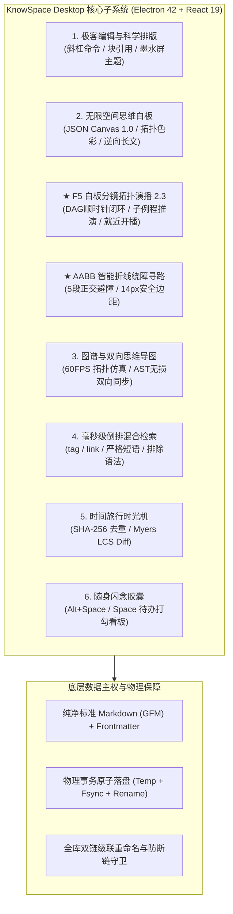
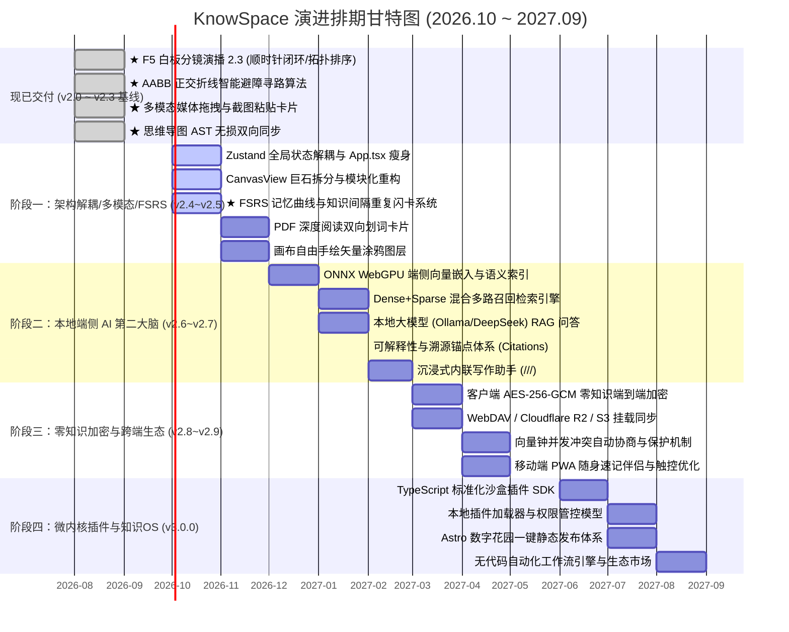

# 🪐 KnowSpace 项目深度梳理与全景更新进化计划书 (2026 ~ 2027)

> **项目代号**：KnowSpace · Personal Knowledge Workspace（现代化空间化个人知识工作台）  
> **核心使命**：*Write. Read. Connect. Know.（记录 · 阅读 · 连接 · 认知）*  
> **当前实际交付基线**：桌面端 `v2.3.0`（包含已完整交付的 **F5 白板分镜拓扑演播 2.3**、**多模态媒体卡片 2.1**、**AABB 连线绕障**、**思维导图双端无损同步**）/ Web 宣传站 `v2.0.0`  
> **演进核心哲学**：*本地优先 (Local-First) · 极致纯净性能 · 空间多维认知 · 零知识隐私安全 · 渐进式端侧智能*  
> **重大调整说明**：依据最新战略决策，正式将 **「FSRS 记忆曲线与知识间隔重复闪卡系统 (SRS)」** 提前移至 **阶段一 (v2.4.0 ~ v2.5.0)**，与 Space 流水线及白板卡片深度融合，无需等待大模型与 GPU 算力，优先实现纯本地知识内化闭环！

---

## Executive Summary (执行摘要)

KnowSpace 是一款以**「本地优先、零格式锁定、空间化拓扑认知」**为核心宗旨的现代化桌面知识工作台。

经过多轮密集的技术攻坚，项目不仅完整实现了 CodeMirror 6 极客编辑引擎、60FPS 知识网络图谱、毫秒级倒排混合检索、时间旅行快照对比引擎、全局闪念胶囊流式看板，**更在空间白板领域完整交付了「F5 白板分镜全屏演播 2.3 拓扑全景系统」与「AABB 智能折线绕障算法」**。

在本次规划演进中，团队针对**「输入 ➔ 整理 ➔ 记忆内化 ➔ 空间输出」**的认知闭环做出了关键调度：**将纯 CPU 毫秒级驱动的「FSRS 记忆曲线与间隔重复闪卡系统 (SRS)」提速至阶段一交付**。结合架构解耦与白板深度多模态，让用户在第一阶段即可享受每天打开应用、在 Space 收集箱流式打勾待办并完成每日闪卡复习的极速心流体验。

---

## 第一部分：当前项目全景梳理与现状诊断

### 1.1 技术栈与架构拓扑盘点

KnowSpace 采用 **Desktop (桌面主程序) + Web (独立宣传展示站)** 的双轨仓库架构，兼具桌面本地原生性能与现代 Web 的跨平台展示能力。



#### 桌面端核心配置清单
- **运行时环境**：Node.js + Electron `^42.5.0`
- **前端框架**：React `^19.2.3` + TypeScript `^5.9.3` + Vite `^7.3.6`
- **核心编辑层**：`@codemirror/view` (`^6.43.9`)、`@codemirror/state`、`@codemirror/lang-markdown`、`markdown-it`
- **图表与公式渲染**：`mermaid` (`^11.12.1`)、`highlight.js` (`^11.11.1`)、`dompurify`
- **测试框架**：`vitest` (`^4.1.10`)，已编写 **44 个**完整测试套件、**379 项测试用例全部 100% 通过**
- **打包分发**：`electron-builder` (`^26.15.3`)，打通 **MSI 安装包**与**绿色便携版 (Portable Zip)** 双轨发布

---

### 1.2 现已交付功能资产全景图 (v2.3.0 真实基线)

| 模块名称 | 核心功能特性与技术亮点 | 代码与测试位置 | 交付成熟度 |
| :--- | :--- | :--- | :---: |
| **📽️ F5 白板分镜演播 (Presentation 2.3)** | **已完整交付**：基于 DAG 拓扑因果关系自动计算运镜演播序；**同一容器优先演播**；**深入子例程推演与自然归栈**；**先单卡后成环推演**；**顺时针极角排序闭环演播**；**跨容器上下文感知复现**；**就近开播**（从当前选区卡片秒级启动）；带底部浮动避让控制台、全键盘快捷流（Space/方向键）、自动循环播放与平滑呼吸光晕。 | `src/components/CanvasView.tsx`<br/>`src/services/canvasService.ts`<br/>`src/__tests__/canvas-view.test.tsx`<br/>`src/__tests__/canvas-service.test.ts` | 🟢 **工业级完备 (v2.3.0 已落地)** |
| **🛣️ 连线 AABB 绕障寻路 (Routing)** | **已完整交付**：折线自动检测端点间阻挡卡片包围盒（外扩 14px 安全避让边距），动态规划 5 段正交平滑绕障路径，彻底杜绝穿透遮挡卡片文字；连线发起源高亮色彩一致性与单条连线 HEX 自定义调色板。 | `src/services/canvasService.ts`<br/>`src/components/CanvasView.tsx` | 🟢 **工业级完备 (v2.1.0 已落地)** |
| **🖼️ 画布媒体多模态 (Multimodal 2.1)** | **已完整交付**：剪贴板截图一键直接粘贴 (`Ctrl+V`)；图片/音视频外部拖拽投放 (Drag & Drop) 自动存入库内 `assets/` 并在视口落点生成卡片；原生内置媒体播放控制、双击全屏毛玻璃灯箱 (`MediaLightbox`)。 | `src/components/CanvasView.tsx`<br/>`src/components/MediaLightbox.tsx` | 🟢 **工业级完备 (v2.1.0 已落地)** |
| **🎨 无限空间白板基座 (Canvas 1.0)** | 100% 兼容 JSON Canvas 1.0；严格 4 边几何中点对齐与上下垂直优先路由；中点动态弯折手柄；多选框选批量改色/改线型；视口智能避让右键菜单；画布逆向拓扑萃取长文算法；4× 超清无损 PNG/SVG 导出。 | `src/components/CanvasView.tsx`<br/>`src/services/canvasService.ts` | 🟢 工业级成熟 (v2.0) |
| **🧠 思维导图与无损同步 (Mind Map)** | Markdown 大纲双向思维导图；**AST 非破坏性增量双向同步 (`syncMindmapToDocument`)**，同步时 100% 保留正文段落、代码块、表格与公式；分支拖拽重排与自闭环防环；OPML 2.0 / FreeMind XML 双向互通。 | `src/components/MindmapView.tsx`<br/>`src/services/mindmapService.ts` | 🟢 工业级成熟 (v2.2) |
| **🌐 全景知识网络图谱 (Graph)** | 60FPS 物理力导向图谱；单击高亮 1-Hop 邻域与悬停探灯连线 (Hover Headlight)；双击平滑打开文件；顶级目录色彩聚类；MOC 枢纽与孤岛笔记挖掘。 | `src/components/GraphViewPane.tsx`<br/>`src/services/graphService.ts` | 🟢 工业级成熟 (v2.2) |
| **✍️ 极客编辑引擎 (Editor)** | CodeMirror 6 深度定制；全键盘斜杠命令菜单 (`/`) 快捷排版；Obsidian 级右键菜单（划词提取双链、段落块引用指纹 `^block-id`）；AST 块级行号双向零延迟精准同步滚动；打字机居中模式 (`Alt + T`)；三大专属调优主题。 | `src/components/EditorPane.tsx`<br/>`src/services/markdown.ts` | 🟢 工业级成熟 (v2.0) |
| **⏳ 时间旅行时光机 (History)** | 纯本地隐藏存储 `.knowspace/snapshots/`；30s 静默去抖 + SHA-256 去重；Side-by-Side 双栏高亮与 Unified 统一视图；Myers LCS 字符级 Diff 对比；一键无损还原。 | `src/components/VersionHistoryDialog.tsx`<br/>`src/services/diffService.ts` | 🟢 工业级成熟 (v2.0) |
| **🔍 毫秒级混合检索 (Search)** | 内存倒排索引 (Inverted Index)；万字库响应 < 15ms；结构化高级语法（`tag:`、`link:`、`"严格短语"`、`-排除词`）；当前小节 vs 全库范围秒级切换。 | `src/components/SearchPanel.tsx`<br/>`src/services/searchIndexService.ts` | 🟢 工业级成熟 (v2.0) |
| **⚡ 随身闪念胶囊 (Capsule)** | `Alt + Space` 全局秒级唤起毛玻璃微窗；窗口钉住置顶；分钟级持久化至 `Space/`；集中收拢待办事项 (`- [ ]`) 并提供流式打勾看板；一键并入当前笔记正文。 | `src/components/FlashCapsule.tsx`<br/>`src/components/SpaceTimelinePanel.tsx` | 🟢 工业级成熟 (v2.0) |
| **🌐 独立宣传站与文档中心 (Web)** | React 18 + Vite 5 打造极轻量营销站；自研 492 行 Design Token 纯 CSS 三主题切换；中英双语 i18n；36 张高清 WebP 界面实录；完整打通 80,000 字图文操作手册。 | `web/` 目录整套系统 | 🟢 已构建待部署 (v2.0) |

---

## 第二部分：四维阶梯式后续更新进化计划 (v2.4.0 ➔ v3.0.0)

```
【阶段一：2026 Q4 重点】    【阶段二：2026 Q4~2027 Q1】      【阶段三：2027 Q1~Q2】          【阶段四：2027 Q2~Q3】
v2.4.0 ~ v2.5.0              v2.6.0 ~ v2.7.0                 v2.8.0 ~ v2.9.0                 v3.0.0
🏛️ 架构解耦/多模态/FSRS闪卡   🧠 本地端侧 AI 第二大脑         🔒 零知识加密与跨端伴侣         🌌 认知操作系统与生态
┌──────────────────────┐     ┌──────────────────────┐        ┌──────────────────────┐        ┌──────────────────────┐
│• Zustand 领域状态机解耦│   │• ONNX 本地向量 Embedding│     │• AES-256-GCM 端到端加密│    │• 沙盒化插件扩展体系SDK│
│• App.tsx 瘦身至 <500行│    │• 混合多路召回(Dense+BM25)│    │• WebDAV / S3 对象存储│        │• 数字花园一键静态发布 │
│• CanvasView 模块化拆解 │   │• 本地大模型(Ollama/Qwen)│    │• 向量钟自动冲突合并保护│     │• 本地无代码自动化工作流│
│• PDF 深度阅读双向划词  │   │• 可溯源引用 (Citations) │    │• 移动端 PWA 随身伴侣   │       │• 扩展市场与模板中心   │
│• 画布自由手绘涂鸦图层  │   │• 全库图拓扑增强 RAG 问答│     │• 平板手势与笔触深度适配│      │• 全生命周期知识健康体检│
│★ FSRS 间隔重复记忆闪卡 │   │                         │    │                        │    │                        │
└──────────────────────┘     └──────────────────────┘        └──────────────────────┘        └──────────────────────┘
```

---

### 阶段一：v2.4.0 ~ v2.5.0 —「核心架构解耦、深度多模态与 FSRS 记忆内化」（2026 Q4）
> **定位与目标**：实施关键技术债务剥离，重塑高内聚低耦合的代码底座；深化白板多模态能力；**提前打通纯 CPU 毫秒级驱动的 FSRS 记忆曲线闪卡系统**，让知识从“随手记录”跨越到“大脑长期内化”。

#### 1.1 全局状态机解耦与 App.tsx 瘦身
- **引入 Zustand 原子化状态管理**：
  - `useVaultStore`：管理工作区目录树、当前选中章节、文件索引状态、物理落盘事件；
  - `useTabStore`：管理多标签页、左右分屏状态、标签页注水与冷冻休眠（Tab Freezing）；
  - `useCanvasStore`：抽离白板数据、视口状态、选区与撤销重做栈；
  - 将 `src/App.tsx` 瘦身至 **< 500 行**，彻底解除 Prop Drilling 回调传递地狱。
- **`CanvasView.tsx` 组件模块化重构**：
  - 拆分为 `CanvasViewport`（视口投影/缩放平移手势）、`CanvasNodeLayer`（卡片虚拟化）、`CanvasEdgeLayer`（AABB 折线与贝塞尔连线）、`CanvasPresentationOverlay`（F5 分镜演播悬浮控制台）、`CanvasMinimap`（雷达小地图）。

#### 1.2 深度多模态：PDF 双向锚定与自由手绘涂鸦
- **PDF 嵌入式深度阅读与双向划词卡片**：
  - 白板内嵌 PDF 卡片支持跨页连续翻阅与缩放；
  - 在 PDF 中划选文字或框选图表，一键复制深度引用（`[[paper.pdf#page=12&rect=100,200,300,400]]`），点击平滑飞渡回 PDF 对应页码的高亮区域。
- **画布手绘矢量涂鸦图层 (Freehand Ink Layer)**：
  - 在白板中提供画笔 ✏️ 与荧光笔 🖊️ 模式，支持手绘箭头、重点圈选与草图涂鸦；
  - 轨迹采用紧凑 SVG 矢量 Path 存储，随画布无级平滑缩放。

#### 1.3 ★ 间隔重复记忆闪卡系统 (Spaced Repetition / FSRS 记忆内化引擎) [🌱 纯 CPU / 零 GPU 依赖]
- **算力与算法**：
  - 纯 CPU 离线计算，毫秒级轻量调度；采用前沿的 **FSRS-4.5 / FSRS-5** 算法（基于 DSR 三维遗忘模型：Difficulty 难度、Stability 稳定性、Retrievability 可提取性），预测精准度显著超越传统 Anki SM-2；
- **Markdown / 白板多源原生闪卡语法**：
  - **问答对**：自动识别笔记中的 `Q: 问题` / `A: 答案` 或行内 `这是正面问题 :: 这是背面答案`；
  - **挖空填空 (Cloze Deletion)**：识别 `==被遮挡的高亮文本==` 或 `{{c1::挖空答案}}`；
  - **白板卡片原生模式**：任意便签或卡片可直接勾选「纳入复习闪卡」，卡片背面作为答案翻转。
- **与 Space 流水线及全键盘交互深度结合**：
  - 在 Space 看板增加「🧠 每日闪卡复盘 (Daily Review)」视图，展示今日待复习卡片流；
  - 极简键盘流：`Space` 翻转卡片，数字键 `1 (Again/重来)` / `2 (Hard/困难)` / `3 (Good/良好)` / `4 (Easy/容易)` 快速评估，FSRS 实时计算并更新下一次到期时间 (`due date`)；
  - **纯本地 Frontmatter / 注释元数据存储**：闪卡进度以完全保真的 Frontmatter 或 HTML 注释（如 `<!-- fsrs: S=3.2 D=4.1 due=2026-09-22 -->`）记录，外部编辑器完全透明可读。

---

### 阶段二：v2.6.0 ~ v2.7.0 —「纯本地端侧 AI 第二大脑与全库 RAG」（2026 Q4 ~ 2027 Q1）
> **定位与目标**：坚守 100% 本地隐私安全，在端侧赋予工作台语义理解、概念搜索与全库智能对话能力。

#### 2.1 端侧轻量向量嵌入与 Dense+BM25 混合检索
- **纯本地 Embedding 引擎**：
  - 基于 ONNX Runtime Web / WebGPU 在端侧加载量化嵌入模型（如 `bge-small-zh-v1.5-q4`，体积 < 45MB）；
  - 纯本地硬件计算，零数据外传，断网状态下毫秒级生成段落向量；
- **混合多路召回 (Hybrid Retrieval)**：
  - 融合倒排检索（BM25 关键词精确匹配）与向量余弦相似度（Dense Vector），借助 RRF 算法加权，实现概念级自然语言模糊搜索。

#### 2.2 全库知识智能对话助手 (Chat with Vault)
- **双模模型调度**：
  - **离线端侧模型**：直连本地 Ollama / llama.cpp 服务（DeepSeek-R1、Qwen2.5 开源模型）；
  - **云端高智模型 (BYOK)**：用户自备 API Key 直连 Gemini 2.5 Flash / Claude 3.5 Sonnet。
- **强制溯源与防幻觉锚点 (Verifiable Citations)**：
  - 回答的每一个论据自动附带 Markdown 文件名、小节标题及 `^block-id` 块级引用跳转徽章，点击在左侧秒级高亮原文，彻底防止 AI 幻觉。

#### 2.3 沉浸式内联写作助手 (`///`)
- 在正文编辑区输入 `///` 弹出轻量 AI 悬浮指令框（支持润色、精简、多语言互译、提取总结、反向生成双链建议）。

---

### 阶段三：v2.8.0 ~ v2.9.0 —「零知识端到端加密同步与跨端生态」（2027 Q1 ~ Q2）
> **定位与目标**：打破单机限制，依托强密码学在多设备间实现极速安全的无感流转。

#### 3.1 客户端 AES-256-GCM 零知识加密同步
- 主密码通过 Argon2id 派生密钥，所有笔记与附件在离开物理磁盘前完成客户端强加密切片；
- 云端服务器永远只保存密文，数学底层杜绝隐私窥探；
- 原生支持 **WebDAV**（坚果云、群晖 NAS、Nextcloud）与 **S3 兼容对象存储**（Cloudflare R2 免费 10GB 零流量费、MinIO、阿里云 OSS）；
- 基于向量钟（Vector Clocks）增量协商，同行并发冲突生成 `.conflict.md` 副本，绝不丢字。

#### 3.2 移动端 PWA 随身伴侣与平板手势
- 基于 `web/` 架构衍生出轻量 PWA 移动客户端，随时拍照、录音并转化为文字速记推入桌面 Space 收集箱；
- 深度适配 iPad 与 Surface 平板的双指缩放手势与手写笔压感。

---

### 阶段四：v3.0.0 —「微内核开放插件体系与认知操作系统」（2027 Q2 ~ Q3）
> **定位与目标**：从单款工具软件，升维为开放、可扩展的个人认知操作系统（Knowledge OS）。

#### 4.1 安全沙盒化插件扩展体系 (Plugin SDK)
- 开放基于 TypeScript 的标准化 Plugin API，提供 View Slot（侧栏/状态栏）、Editor Extension（CM6高亮/快捷键）、Command Palette（Ctrl+K自定义动作）、Converter（外部笔记导入导出）四大标准插槽；
- 支持本地解压拖入 `.zip` 插件包一键热加载，严格沙盒权限隔离。

#### 4.2 数字花园 (Digital Garden) 静态站一键发布
- 一键将库内带有 `publish: true` 标记的笔记与白板编译为极速静态网站；
- 无缝打通 Astro / VitePress 编译管线，直传 Cloudflare Pages 或 GitHub Pages，零服务器成本构建个人公开知识站。

#### 4.3 本地无代码自动化工作流
- 提供“触发器 ➔ 动作”的轻量本地自动化管线（如每日定时汇总打勾事项并归档、媒体文件自动规整）。

---

## 第三部分：更新排期甘特图 (含 FSRS 提前至阶段一)



---

## 第四部分：工程质量与数据主权红线

在推进后续演进中，严格恪守以下五大红线：
1. **纯净文件主权原则 (Zero Lock-in)**：所有核心笔记与闪卡元数据始终基于物理标准 Markdown（GFM）、标准 Frontmatter 与标准 JSON Canvas 1.0，外部第三方编辑器随时可读，绝不锁入专有二进制。
2. **物理事务原子落盘底线 (ACID Atomicity)**：所有持久化强制遵守「写入 `.tmp` 临时文件 ➔ `fsync` 刷盘 ➔ `rename` 原子重命名」流水线，杜绝断电损坏。
3. **零回归测试协议 (Zero-Regression Protocol)**：已有 44 个核心测试套件保持 100% 通过率，核心改动必须同步补齐单测。
4. **恒定 60FPS 与注水冷冻机制**：视口外卡片与非激活标签页执行注水冷冻，单标签增量内存控制在 `< 5MB`，长文打字延迟 `< 16ms`。
5. **绝对零隐私外泄规范 (Privacy by Default)**：未经显式授权绝不向外发起任何遥测；同步数据未经客户端加密绝不出网；AI 优先以端侧离线模型为第一推荐。
