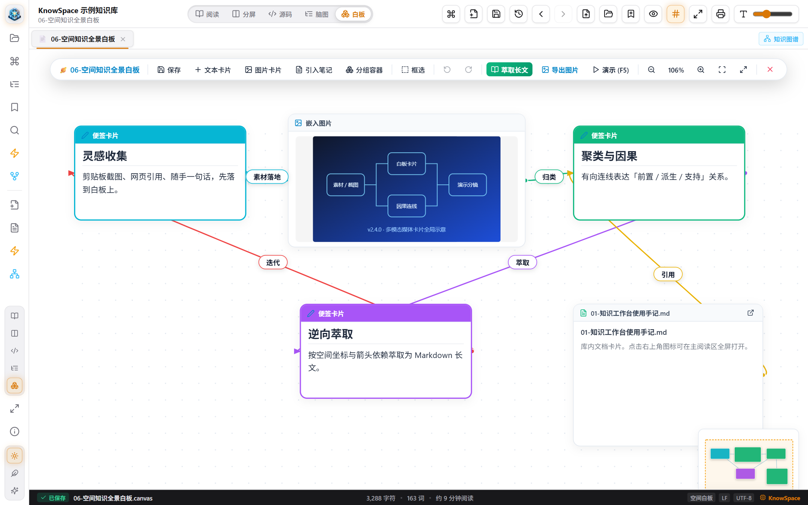
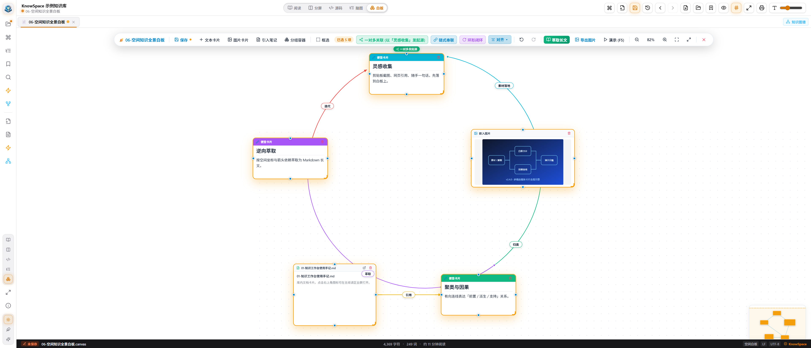
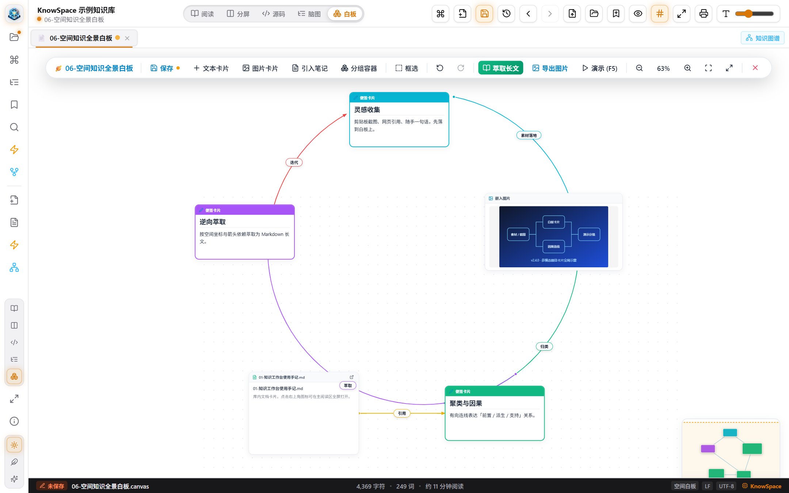
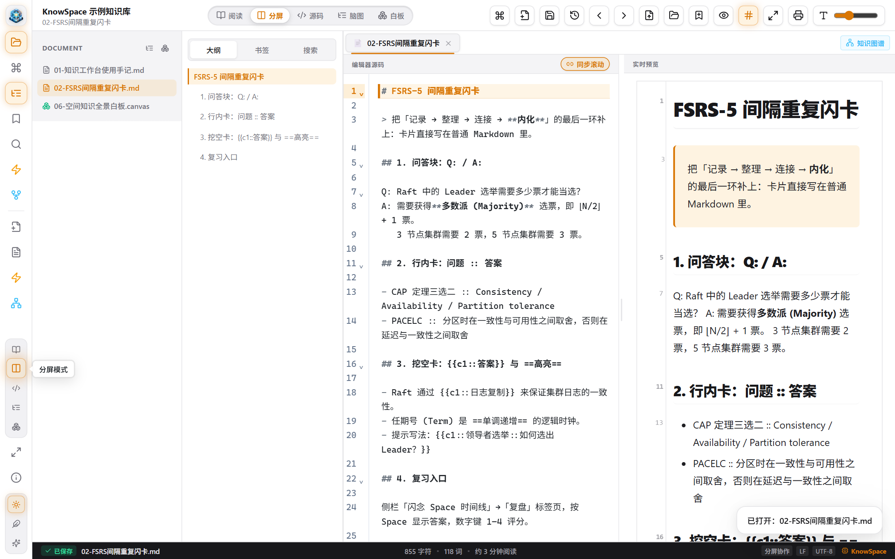
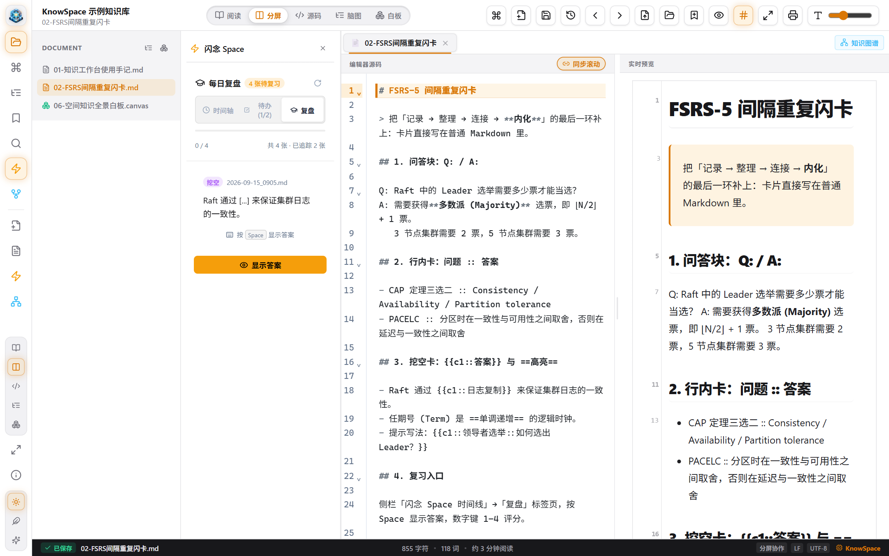
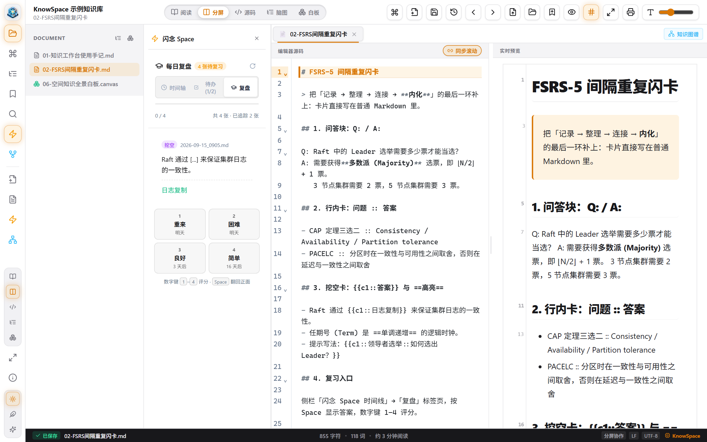

# KnowSpace 用户手册（v2.5.0）

<p align="center" style="text-align: center;">
  
</p>

<p align="center">
  <strong>KnowSpace · Personal Knowledge Workspace | 现代化个人知识工作台</strong><br />
  <em>Write. Read. Connect. Know.（记录 · 阅读 · 连接 · 认知）</em>
</p>

| 文档信息 | 内容 |
| :--- | :--- |
| 文档名称 | KnowSpace 完整用户手册 |
| 适用软件版本 | **v2.5.0**（`package.json` 版本号，对话框与本文档一致） |
| 适用平台 | Windows 10 / 11（x64） |
| 文档类型 | 功能全覆盖操作手册（含操作案例、操作步骤、预期结果、注意事项） |
| 编写依据 | 项目源码 `src/`、`electron/`，发行说明 `docs/RELEASE_NOTES_v2.4.0.md`、`docs/RELEASE_NOTES_v2.5.0.md`，测试基线 `docs/TEST_BASELINE.md` |
| 截图来源 | `docs/manual-images/`（其中 36–42 号为 v2.4.0 / v2.5.0 新增功能实机截图） |
| 研发团队 | KnowSpace Lab · 摸鱼Lab |

> [!IMPORTANT]
> 本手册所有功能描述均以 **v2.5.0 实际实现** 为准。项目中早期的 `USER_MANUAL.md` / `操作手册.md` 与根 `README.md` 中部分条目（例如 `F10` 专注模式、`Ctrl+Shift+C` 白板快捷键、`Inbox/` 归档目录、`Ctrl+G` 打包分组容器、版本快照存放于 `.knowspace/snapshots/`）属于历史版本口径，请以本手册与下表「口径校正」为准。

---

## 📑 目录

- [一、项目概述](#一项目概述)
  - [1.1 产品定位与设计理念](#11-产品定位与设计理念)
  - [1.2 技术架构](#12-技术架构)
  - [1.3 版本演进（v2.2 → v2.5）](#13-版本演进v22--v25)
  - [1.4 数据与文件组织规范](#14-数据与文件组织规范)
  - [1.5 质量基线](#15-质量基线)
- [二、环境准备](#二环境准备)
  - [2.1 系统要求](#21-系统要求)
  - [2.2 安装与部署（三种方式）](#22-安装与部署三种方式)
  - [2.3 首次启动](#23-首次启动)
  - [2.4 推荐的知识库目录结构](#24-推荐的知识库目录结构)
  - [2.5 首选项与系统设置](#25-首选项与系统设置)
  - [2.6 数据备份与迁移](#26-数据备份与迁移)
  - [2.7 升级与卸载](#27-升级与卸载)
- [三、功能索引](#三功能索引)
- [四、功能详细说明](#四功能详细说明)
  - [4.1 工作台界面与布局](#41-工作台界面与布局)
  - [4.2 知识库与文档管理](#42-知识库与文档管理)
  - [4.3 三种视图与双向同步滚动](#43-三种视图与双向同步滚动)
  - [4.4 编辑器增强：斜杠命令、右键菜单与图片快捷插入](#44-编辑器增强斜杠命令右键菜单与图片快捷插入)
  - [4.5 块级互联与内联嵌入](#45-块级互联与内联嵌入)
  - [4.6 阅读渲染、媒体灯箱与 PDF 打印](#46-阅读渲染媒体灯箱与-pdf-打印)
  - [4.7 三大主题](#47-三大主题)
  - [4.8 全局命令中枢（Ctrl+K）](#48-全局命令中枢ctrlk)
  - [4.9 大纲、书签与混合检索](#49-大纲书签与混合检索)
  - [4.10 双向链接、反向链接与未链接提及](#410-双向链接反向链接与未链接提及)
  - [4.11 知识图谱](#411-知识图谱)
  - [4.12 思维导图](#412-思维导图)
  - [4.13 无限空间白板（Canvas）](#413-无限空间白板canvas)
  - [4.14 闪念胶囊与 Space 看板](#414-闪念胶囊与-space-看板)
  - [4.15 FSRS-5 间隔重复闪卡（v2.5.0 新增）](#415-fsrs-5-间隔重复闪卡v250-新增)
  - [4.16 本地版本历史](#416-本地版本历史)
  - [4.17 多标签页、双文档分屏与独立窗口](#417-多标签页双文档分屏与独立窗口)
  - [4.18 数据安全与系统集成](#418-数据安全与系统集成)
- [五、快捷键总表](#五快捷键总表)
- [六、常见问题（FAQ）](#六常见问题faq)
- [七、附录](#七附录)

---

## 一、项目概述

### 1.1 产品定位与设计理念

KnowSpace 是一款 **本地优先（Local-First）** 的现代化个人知识工作台，面向开发者、写作者与知识管理者。它以「超立方空间 HyperSpace Cube」为视觉核心，把 **记录 → 整理 → 连接 → 内化** 串成一条完整链路：

| 环节 | 对应能力 |
| :--- | :--- |
| 记录 | 闪念胶囊（全局热键）、编辑器、斜杠命令、剪贴板图床 |
| 整理 | 多级知识库目录树、标签页、双文档分屏、思维导图 |
| 连接 | `[[双向链接]]`、块级互联、反向链接面板、知识图谱、无限白板 |
| 内化 | **v2.5.0 新增 FSRS-5 间隔重复闪卡**、每日复盘看板 |

核心承诺：

- **数据属于用户自己**：全部内容以纯 Markdown / JSON Canvas 落盘，目录结构即知识结构，任何第三方编辑器都能打开，无专有格式锁定。
- **零联网**：不产生网络请求（闪卡调度、检索、图谱、导图全部为本地纯 CPU 计算）。
- **不改写你的文件习惯**：保留 UTF-8 BOM 与 `CRLF` / `LF` 行尾；样式、闪卡进度等附加信息以标准 Markdown 注释保存，在 Git 中 diff 可读。

### 1.2 技术架构

| 层次 | 技术栈 | 说明 |
| :--- | :--- | :--- |
| 桌面运行时 | **Electron 42** | 主进程（`electron/main.cjs`）负责窗口、托盘、全局热键、文件系统、打印与离屏导出 |
| 安全桥接 | `contextBridge` + `preload.cjs` | 渲染进程通过 `window.knowSpaceDesktop`（兼容别名 `bookMDDesktop`）调用本地能力 |
| 界面层 | **React 19 + TypeScript 5.9 + Vite 7** | 领域状态由 Zustand 管理（`useUiStore` / `useTabStore` / `useVaultStore`） |
| 编辑器 | **CodeMirror 6** | 分区 AST 行号映射 + 分段线性插值，实现源码与预览的双向同步滚动 |
| 渲染管线 | markdown-it + highlight.js + Mermaid 11 + KaTeX + DOMPurify | 表格、任务清单、Front Matter、公式、架构图与安全净化 |
| 桌面打包 | electron-builder | 输出 NSIS 安装程序、MSI 安装包与便携版目录 |

### 1.3 版本演进（v2.2 → v2.5）

| 版本 | 主题 | 关键内容 |
| :--- | :--- | :--- |
| v2.2.0 | 导图无损同步与图谱交互升级 | `syncMindmapToDocument` 非破坏性标题结构同步；图谱单击只高亮 1-hop、双击（350ms 窗口）才打开文档；280px 结构化详情卡片；0.18s 补间与悬停探灯 |
| v2.3.0 | 白板分镜演播与导图工具栏 | F5 分镜演示 2.3（容器优先、子例程深入与归栈、先单卡后成环、顺时针完整闭环、跨容器上下文复现）；导图响应式换行工具栏 |
| v2.4.0 | 排布调距、媒体插入、导出加固 | 环形半径滑块与拖拽卡片调距、网格行/列间距拖拽、多选组整体平移；右键插入图片/视频/音频并按点击位置落卡，双击媒体卡片全屏预览；导出走「渲染进程 → 主进程离屏 `capturePage()` → SVG 如实降级」三级链路，剪贴板改走系统原生 API；调色盘 6 → **12 色**并支持自定义 HEX 取色；连线图层下沉 + 多障碍链式绕行 |
| v2.5.0 | FSRS-5 闪卡与架构减负 | **FSRS-5 间隔重复闪卡**（三种零侵入语法、DSR 调度、四档评分与间隔预览、进度存于单条 HTML 注释）；`App.tsx` 减少 40%、`canvasService` 拆为 9 模块 + 门面、`CanvasView` 减少 30%；测试增至 **55 套件 / 619 用例** |

### 1.4 数据与文件组织规范

| 路径 / 标记 | 作用 | 是否必需 |
| :--- | :--- | :--- |
| `*.md` | 普通知识笔记，UTF-8（可含 BOM），行尾保持原样 | 是（知识库主体） |
| `*.mindmap.md` | 思维导图专用文件（本质仍是 Markdown 大纲） | 按需 |
| `*.canvas` | 无限白板文件，采用 **JSON Canvas 1.0** 开放规范 | 按需 |
| `assets/` | 编辑器粘贴/拖拽图片与白板媒体卡片的落地目录（相对文档所在目录） | 自动创建 |
| `Space/` | 闪念胶囊归档目录，文件名 `YYYY-MM-DD_HHmm.md` | 自动创建 |
| `.knowspace/snapshots/` | 版本快照目录（**可选**：当知识库中已存在该目录时优先使用） | 可选 |
| `<!-- fsrs:begin … fsrs:end -->` | 闪卡调度进度注释块，一卡一行，位于文档末尾 | 使用闪卡后自动写入 |
| `<!-- style: … -->` | 思维导图节点外观注释（颜色、形状、对齐、宽高等） | 使用导图样式后自动写入 |
| `%APPDATA%\KnowSpace\` | 应用配置 `knowspace-config.json`、默认版本快照库 `snapshots/` | 自动创建 |

### 1.5 质量基线

- 测试：**55 个测试套件 / 619 项用例，100% 通过**（基线快照见 `docs/TEST_BASELINE.md`，可按 `node scripts/capture-test-baseline.cjs` 重新生成）。
- TypeScript：构建期 0 错误。
- 其中闪卡调度（`src/__tests__/fsrs-service.test.ts`，70 项）与复盘面板（`daily-review-panel.test.tsx`，19 项）为 v2.5.0 新增覆盖。

---

## 二、环境准备

### 2.1 系统要求

| 项目 | 要求 |
| :--- | :--- |
| 操作系统 | Windows 10 / 11（64 位） |
| 磁盘 | 便携版约需数百 MB 空间（自包含 Electron 运行时）；知识库另计 |
| 显示 | 建议 1440×900 及以上；窗口最小尺寸 360×240，支持 Windows 贴靠分屏 |
| 网络 | **不需要**（软件全程离线运行） |
| 其他 | 无需安装 Node.js / 运行库，发行包自带运行时 |

### 2.2 安装与部署（三种方式）

#### 方式一：图形化安装程序（推荐个人使用）

1. 下载 `KnowSpace-Setup-2.5.0.exe`。
2. 双击运行，按向导选择安装目录（默认当前用户安装，允许提权）。
3. 完成后勾选「运行 KnowSpace」，或从桌面快捷方式/开始菜单启动。

**预期结果**：桌面与开始菜单出现 KnowSpace 图标；系统级 `.md`、`.canvas` 文件关联就绪；控制面板中出现卸载项 `KnowSpace 2.5.0`。

#### 方式二：MSI 标准安装包（适合企业分发）

```powershell
msiexec /i KnowSpace-2.5.0.msi /qn
```

**预期结果**：静默安装完成，可被组策略统一分发，支持标准卸载。

#### 方式三：绿色便携版（U 盘随身携带）

1. 解压 `KnowSpace-win-x64-portable.zip`（例如解压到 `D:\Tools\KnowSpace`）。
2. 直接双击目录内的 `KnowSpace.exe`。

**预期结果**：立即启动，无需安装；知识库可放在同目录或任意磁盘；卸载时删除整个目录即可（注意：用户数据仍保留在 `%APPDATA%\KnowSpace`）。

**注意事项**

- 便携版与安装版可共存，但两者共用同一份 `%APPDATA%\KnowSpace` 配置（闪念热键、Space 目录、窗口尺寸等）。
- 若杀毒软件拦截，请将安装目录加入白名单（Electron 应用首次运行常见误报）。

### 2.3 首次启动

1. 启动 KnowSpace，出现欢迎/空白工作台。
2. 选择载入方式：
   - **打开目录**：`Ctrl+Shift+O`，或在左侧「文档目录」栏点击「打开文件夹」按钮，选择一个包含 Markdown 的文件夹（推荐作为知识库根目录）。
   - **打开单文件**：`Ctrl+O` 打开单个 Markdown 文件；此时进入单文档模式，仅能使用当前文档的渲染、编辑、导图与打印能力。
   - **系统关联**：在资源管理器中双击任意 `.md` 文件，KnowSpace 会在新标签页中打开它。

**预期结果**：左侧目录树展开知识库多级结构；右侧进入分屏（左源码 / 右预览）；底部状态栏显示字符数、行数、词数与预计阅读时间。


**注意事项**

- 主窗口默认尺寸 1320×860，可用 `F11` 或侧栏底部按钮切换全屏。
- 打开单个 `.md` 文件（而非目录）时，全库检索、知识图谱、反向链接面板等依赖工作区的能力不可用，这是设计使然。

### 2.4 推荐的知识库目录结构

```
我的知识库/
├─ 01-技术/
│   ├─ 分布式系统.md
│   └─ 分布式协议.md
├─ 02-产品/
├─ 03-写作/
├─ Space/                     ← 闪念胶囊归档（自动创建）
│   ├─ 2026-09-16_2130.md     ← 同一分钟多次闪念自动追加
│   └─ 2026-09-15_0905.md
├─ assets/                    ← 编辑器/白板媒体资源（自动创建）
├─ 我的导图.mindmap.md
├─ 项目白板.canvas
└─ .knowspace/snapshots/      ← 可选：让版本快照随库存放
```

**注意事项**

- `Space/` 目录中的闪念文件默认在文档目录树中折叠隐藏，只在其被激活时局部展开，以保持知识主干清爽。
- 若你希望版本快照与知识库一同备份（如放进 Git 或网盘），可在库根目录手动建立 `.knowspace/snapshots/` 目录，快照将优先写入该处；应用自身不会主动在桌面或文档目录里创建隐藏目录。

### 2.5 首选项与系统设置

打开方式：左侧活动栏底部「关于应用」按钮 → 对话框中的「系统运行与开机偏好设置」。

| 设置项 | 默认值 | 说明 |
| :--- | :--- | :--- |
| 开机自启动（后台静默就绪） | 关闭 | 开机后常驻托盘，不弹出主窗口（等价于以 `--hidden` 启动） |
| 关闭主窗口时保持后台运行 | **开启** | 点击窗口 ✕ 时隐藏到系统托盘，托盘图标双击/右键可恢复 |
| 闪念全局热键 | `Alt + Space` | 在闪念胶囊设置面板中录制自定义；支持 `F1`–`F12` 单键 |
| 闪念 Space 存储目录 | `<知识库>/Space` | 可自定义为任意目录，也可一键恢复默认 |
| 闪念胶囊窗口尺寸 | 600 × 360 | 拖动边缘/右下角手柄调整后本地记忆；范围 440×260 ~ 1000×720 |

**预期结果**：修改后立即生效并写入 `%APPDATA%\KnowSpace\knowspace-config.json`；托盘图标常驻，右键可「显示主窗口 / 退出」。

**注意事项**

- 若自定义热键被其他软件占用，注册会失败并返回提示，请换用组合键（例如 `Ctrl+Alt+N`）。
- 关闭「关闭主窗口时保持后台运行」后，点击 ✕ 将真正退出程序，全局热键与闪念胶囊同时失效。

### 2.6 数据备份与迁移

| 需要备份的内容 | 位置 |
| :--- | :--- |
| 全部笔记、白板、导图、`assets/` | 知识库目录（直接复制整个文件夹） |
| 闪念速记 | 知识库下的 `Space/`（默认） |
| 版本历史 | `%APPDATA%\KnowSpace\snapshots\`（或知识库内 `.knowspace/snapshots/`） |
| 应用设置 | `%APPDATA%\KnowSpace\knowspace-config.json` |

**操作建议**：把知识库放入 Git 仓库或同步盘；`assets/` 与 `Space/` 一并纳入，即可实现「笔记 + 图片 + 闪念 + 版本历史」的完整迁移。

### 2.7 升级与卸载

- **升级**：直接运行新版本安装包覆盖安装即可，**无需迁移动作**（v2.5.0 未改变任何既有文件格式，也不新增强制目录）。新版本创建的库可被旧版本打开，多出的注释块与普通注释无异。
- **卸载**：设置 → 应用 → KnowSpace → 卸载（MSI/NSIS 均支持）。卸载不会删除你的知识库；如需彻底清理，可手动删除 `%APPDATA%\KnowSpace`。

---

## 三、功能索引

| # | 功能模块 | 主要入口 / 快捷键 | 典型使用场景 | 配图 | 章节 |
| :---: | :--- | :--- | :--- | :---: | :--- |
| 1 | 工作台界面与布局 | 活动栏 / 拖拽分割线 | 定制阅读与写作布局 | [01](manual-images/01-overview-workbench.png) | [4.1](#41-工作台界面与布局) |
| 2 | 知识库与文档管理 | `Ctrl+Shift+O` / `Ctrl+O` / 目录树 | 载入、组织、重命名知识库 | [01](manual-images/01-overview-workbench.png) | [4.2](#42-知识库与文档管理) |
| 3 | 三种视图与同步滚动 | 顶部工具栏 / 活动栏底部三个按钮 | 写作、校对、沉浸阅读 | [05](manual-images/05-mode-split.png) [06](manual-images/06-mode-source.png) [07](manual-images/07-mode-read.png) | [4.3](#43-三种视图与双向同步滚动) |
| 4 | 编辑器增强 | `/`、右键菜单、`Ctrl+V` | 快速排版、提取笔记、贴图 | [28](manual-images/28-slash-commands.png) [29](manual-images/29-editor-context-menu.png) | [4.4](#44-编辑器增强斜杠命令右键菜单与图片快捷插入) |
| 5 | 块级互联 | `^block-id`、`[[doc#^block]]`、`![[doc#^block]]` | 段落级精准引用与嵌入 | [26](manual-images/26-block-reference.png) | [4.5](#45-块级互联与内联嵌入) |
| 6 | 阅读渲染与打印 | `Ctrl+P` / 点击图片 | 科学公式、架构图、矢量 PDF | [08](manual-images/08-rich-markdown.png) [14](manual-images/14-media-lightbox.png) | [4.6](#46-阅读渲染媒体灯箱与-pdf-打印) |
| 7 | 三大主题 | 活动栏底部主题三态按钮 | 白天 / 长文护眼 / 夜间 | [02](manual-images/02-theme-light.png) [03](manual-images/03-theme-eink.png) [04](manual-images/04-theme-dark.png) | [4.7](#47-三大主题) |
| 8 | 全局命令中枢 | `Ctrl+K`（默认 / `>` / `#`） | 全键盘调度与文档穿梭 | [27](manual-images/27-command-palette.png) | [4.8](#48-全局命令中枢ctrlk) |
| 9 | 大纲、书签与检索 | `Ctrl+F` / `Ctrl+B` | 长篇定位、跨库检索 | [11](manual-images/11-navigation-toc.png) [35](manual-images/35-hybrid-vault-search.png) [13](manual-images/13-bookmarks.png) | [4.9](#49-大纲书签与混合检索) |
| 10 | 双向链接体系 | `[[`、反链面板 | 网状知识与引用溯源 | [22](manual-images/22-backlinks-panel.png) | [4.10](#410-双向链接反向链接与未链接提及) |
| 11 | 知识图谱 | `Ctrl+G` / 全景图谱按钮 | 结构体检、孤岛发现 | [21](manual-images/21-global-graph.png) [31](manual-images/31-graph-depth-clustering.png) | [4.11](#411-知识图谱) |
| 12 | 思维导图 | `Ctrl+M`、导图工具栏 | 结构化重构与多格式导出 | [24](manual-images/24-mindmap-view.png) [25](manual-images/25-mindmap-customization.png) [30](manual-images/30-mindmap-export-modal.png) | [4.12](#412-思维导图) |
| 13 | 无限空间白板 | 白板视图 / `F5` 演示 | 空间思考、媒体素材、演示 | [32](manual-images/32-infinite-canvas.png) [40](manual-images/40-canvas-media-cards.png) [41](manual-images/41-canvas-ring-layout.png) [42](manual-images/42-canvas-multi-select-toolbar.png) | [4.13](#413-无限空间白板canvas) |
| 14 | 闪念胶囊与 Space 看板 | `Alt+Space` / `Ctrl+Enter` | 随时捕捉灵感与待办 | [15](manual-images/15-flash-capsule.png) [15s](manual-images/15-flash-capsule-settings.png) [23](manual-images/23-timeline-panel.png) | [4.14](#414-闪念胶囊与-space-看板) |
| 15 | **FSRS-5 间隔重复闪卡** | Space 面板 →「复盘」 | 让读过的内容真正记住 | [36](manual-images/36-fsrs-card-syntax.png) [37](manual-images/37-fsrs-review-question.png) [38](manual-images/38-fsrs-review-answer.png) | [4.15](#415-fsrs-5-间隔重复闪卡v250-新增) |
| 16 | 本地版本历史 | `Ctrl+Shift+H` | 误删还原、差异审阅 | [34](manual-images/34-version-history.png) | [4.16](#416-本地版本历史) |
| 17 | 多标签与独立窗口 | `Ctrl+W`、标签右键 | 并行写作与多屏办公 | [09](manual-images/09-multi-tabs.png) [10](manual-images/10-dual-split-compare.png) | [4.17](#417-多标签页双文档分屏与独立窗口) |
| 18 | 数据安全与系统集成 | 自动保存 / 托盘 | 防丢稿与桌面深度集成 | [17](manual-images/17-dialog-unsaved.png) [18](manual-images/18-dialog-conflict.png) | [4.18](#418-数据安全与系统集成) |

---

## 四、功能详细说明

### 4.1 工作台界面与布局

**功能说明**：工作台由五块区域组成——左侧活动栏（图标导航）、文档目录树、功能区侧栏（大纲/书签/搜索/闪念/反链）、主编辑区、底部状态栏；各栏宽度均可拖拽调整并被记忆。

**入口**：启动即进入；活动栏按钮悬浮会显示名称与快捷键。

**操作步骤**

1. 点击活动栏顶部的「文档目录」按钮，展开/收起文档目录栏（也可按 `Ctrl+\`）。
2. 依次点击活动栏图标：命令中枢、大纲目录、精选书签、全文搜索、闪念 Space 时间线、反向链接与引用。
3. 鼠标移至任意两栏之间的竖直分割线，按住左右拖动调整宽度。
4. 观察底部状态栏：字符数、行数、词数、预计阅读时间、保存状态、`UTF-8`、行尾格式（`LF` / `CRLF`）。

**预期结果**：布局即时变化；关闭应用后重新打开，栏宽与目录树展开状态保持不变；状态栏数据随输入实时刷新。


**使用案例**：把「文档目录」拉窄到 180px 只留文件名，把侧栏切到「全文搜索」，编辑区最大化——形成「左导航 + 右检索 + 中写作」的紧凑布局。

**注意事项**

- 状态栏出现红色呼吸点表示「未保存」，出现「已优化」徽标说明超大文档（> 2MB）已进入性能保护模式。
- 全屏（`F11`）下侧栏会自动滚动与收紧，避免底部按钮被裁切；`Esc` 可退出全屏。

### 4.2 知识库与文档管理

**功能说明**：支持多级文件夹目录树、三种文档类型（笔记 `.md` / 思维导图 `.mindmap.md` / 白板 `.canvas`）、文档重命名（含双链级联更新）与多标签页管理。

**入口**

| 操作 | 入口 |
| :--- | :--- |
| 打开目录 | `Ctrl+Shift+O`、活动栏「打开文件夹」、`Ctrl+K` → `打开本地知识库目录` |
| 打开单文件 | `Ctrl+O`、活动栏「打开文件」 |
| 新建笔记 | `Ctrl+N`、活动栏「新建文件」 |
| 新建思维导图 | 目录树顶部「新建思维导图」按钮 |
| 新建白板 | 目录树顶部「新建空间白板」按钮、`Ctrl+K` → `新建空间白板 (.canvas)` |
| 重命名 | 目录树中文件行右侧的重命名按钮 |

**操作步骤（载入知识库并新建三类文档）**

1. 按 `Ctrl+Shift+O`，选择知识库根目录。
2. 目录树顶部点击「新建思维导图」，在弹窗中命名并确认。
3. 再次点击「新建空间白板」，命名 `项目白板.canvas`。
4. 按 `Ctrl+N` 新建一篇普通笔记。
5. 在目录树中重命名任意被引用的文档，观察提示。

**预期结果**：目录树即时刷新；`.mindmap.md` 打开后直接进入思维导图视图，`.canvas` 打开后直接进入白板视图；重命名后提示「已成功重命名为「X」，并同步更新了 N 处双链引用」。


**使用案例**：把课程资料按 `01-课程笔记/`、`02-实验报告/`、`03-参考资料/` 分层，用导图文件 `复习大纲.mindmap.md` 组织复习结构，用白板文件 `知识地图.canvas` 建立跨章节关联。

**注意事项**

- 文件类型由扩展名决定：只有 `.canvas` 与 `.mindmap.md` 会被自动切换到对应视图，普通 `.md` 文件默认分屏。
- 重命名会触发全库双链级联更新；若某文档被大量引用，操作会略有延迟，属正常现象。
- 目录树支持逐级折叠与展开，折叠状态本地持久化；点击目录标题栏的「全部收起」按钮可一次性折叠所有文件夹。

### 4.3 三种视图与双向同步滚动

**功能说明**：同一份 Markdown 可在三种视图间切换——**分屏**（左源码 / 右实时预览）、**源码**（全宽编辑）、**阅读**（纯渲染）。分屏模式基于 AST 行号映射与分段线性插值实现双向同步滚动与选区联动。

**入口**：顶部工具栏「阅读 / 分屏 / 源码」按钮，或活动栏底部的视图模式按钮。

**操作步骤**

1. 打开一篇长文，切换到「分屏」。
2. 在左侧源码区向下滚动，观察右侧预览同步滚动。
3. 在右侧预览区点击任意段落，观察左侧源码定位与高亮。
4. 切换到「源码」模式，使用 `Alt+T` 开启打字机居中滚动（光标行锁定在视口中心附近）。
5. 切换「阅读」模式，享受 960px 黄金视宽的纯净排版。

**预期结果**：双向滚动无偏移；点击预览段落时源码侧对应行获得微光高亮；打字机模式下输入时光标保持居中。

| 分屏 | 源码 | 阅读 |
| :---: | :---: | :---: |
|  |  |  |

**使用案例**：写长篇技术教程时使用分屏 + 打字机模式：左侧持续码字，右侧实时查看公式与架构图渲染效果，避免反复切换窗口。

**注意事项**

- 预览区行号槽位与源码行号对齐，鼠标悬停可点亮高亮（用于代码审查式阅读）。
- 超大文档会自动降低同步频率以保护输入流畅度。

### 4.4 编辑器增强：斜杠命令、右键菜单与图片快捷插入

**功能说明**：编辑器内置 20+ 斜杠命令模板、情境感知右键菜单（划词提取为笔记、生成块引用、存入闪念、富文本转换）、剪贴板图片粘贴与本地图片拖拽，并带有选区字数统计。

**入口**：编辑器内输入 `/`（行首或空格后）；选中文字或在正文区右键；`Ctrl+V` 粘贴截图；直接从资源管理器拖入图片。

**操作步骤（斜杠命令插入表格与提示卡片）**

1. 在空白行输入 `/table`（或输入 `/` 后用方向键浏览）。
2. 回车确认，光标自动落入表格首个单元格。
3. 再次输入 `/callout`，从提示卡片（Note / Tip / Warning / Important）中选择并插入。

**操作步骤（划词提取为新笔记）**

1. 选中一段文字 → 右键 → 选择「提取为新笔记」。
2. 输入新笔记标题并确认。

**预期结果**：新建独立 Markdown 文件，且原位置自动替换为 `[[新笔记标题]]` 双链；右键菜单底部显示选中字符数、词数、行数与预估阅读耗时。

| 斜杠命令 | 右键菜单 |
| :---: | :---: |
|  |  |

**使用案例**：整理会议记录时，选中「行动项」段落右键「存入闪念」，即可把待办推进 `Space/` 收集箱，稍后在闪念看板集中勾选。

**注意事项**

- 粘贴的图片会以时间戳命名写入当前文档同级的 `assets/` 目录，并插入相对路径；移动文档时请连同 `assets/` 一起移动。
- 代码块右上角提供语言胶囊与一键复制，复制成功显示绿色 `✓ 已复制` 反馈。


### 4.5 块级互联与内联嵌入

**功能说明**：段落级「原子」引用体系，适合跨文档引用一段结论、一个公式或一张表。

| 语法 | 作用 |
| :--- | :--- |
| `^block-id` | 在段落后添加块指纹锚点（界面中隐藏原始字符串，渲染为小徽章） |
| `[[文档名#^block-id]]` | 跳转到目标文档的指定段落 |
| `![[文档名#^block-id]]` | 把目标段落以卡片形式内联嵌入当前文档 |
| `#^` | 在编辑器中触发块锚点联想补全 |

**操作步骤**

1. 在目标段落末尾输入 ` ^block-1`（`^` 后跟自定义 ID）。
2. 在另一篇文档中输入 `![[目标文档#^block-1]]`。
3. 点击渲染结果中的徽章，复制引用链接；按住 `Ctrl` 点击双链可跳转。

**预期结果**：块引用渲染为紧凑徽章；嵌入块显示为卡片并附来源文档直达链接。


**使用案例**：在「项目 A 结项报告」中嵌入《性能测试报告》的结论段落；被测文档更新后，引用位置阅读时始终呈现同源内容。

**注意事项**

- 块 ID 需在文档内唯一；重命名文档不会破坏块引用（引用按文档名解析，重命名会级联更新）。
- 在编辑器内直接编辑渲染后的徽章不会改动锚点，请切到源码模式修改 ID。

### 4.6 阅读渲染、媒体灯箱与 PDF 打印

**功能说明**：渲染管线支持 GFM 表格、任务清单、Front Matter、行内高亮 `==高亮==`、删除线、脚注、KaTeX 公式（`\(...\)` 与 `\[...\]`）与 Mermaid 全类型图表；图片与图表可全屏灯箱查看；整篇文档可导出矢量 PDF。

**入口**：正文渲染区点击图片/图表（灯箱）；`Ctrl+P` 或工具栏打印按钮（PDF）。

**操作步骤（导出 PDF）**

1. 打开目标文档，按 `Ctrl+P`。
2. 在系统打印对话框中选择「Microsoft Print to PDF」或「另存为 PDF」，设置纸张为 A4。
3. 保存文件。

**预期结果**：生成矢量级 PDF；标题、表格、代码块与 Mermaid 图跨页时不会被拦腰截断（内置 `@media print` 防截断规则）。

**操作步骤（灯箱查看架构图）**

1. 点击正文中的 Mermaid 图或图片。
2. 使用滚轮缩放（0.2× ~ 6×），按住拖动平移。
3. 按 `Esc` 退出；如需导出图片，使用灯箱中的下载按钮（Mermaid 图支持 3× Retina 超清 PNG）。

| 富文本渲染 | 媒体灯箱 |
| :---: | :---: |
|  |  |

**使用案例**：把设计评审文档导出 PDF 发给同事——架构图、时序图与性能表格均可跨页完整呈现，无需再手工截图排版。

**注意事项**

- PDF 内容取决于打印样式；超宽表格建议先在阅读模式确认排版。
- 灯箱仅支持图片与 Mermaid 图；视频/音频请在白板卡片中预览（见 4.13）。

### 4.7 三大主题

**功能说明**：内置三套沉浸式主题，覆盖日光办公、长文护眼与夜间书写；主题作用于编辑器、预览、菜单、白板与图谱。

| ☀️ 日光浅色 (Warm Amber Light) | 📖 仿电子墨水屏 (E-ink Paper) | ✨ 极客暗黑 (Geek Dark) |
| :---: | :---: | :---: |
| 柔白底 `#ffffff` / `#f5f5f7`，暖橙强调色 | 羊皮纸白 `#f4f1ea` + 沉墨字色，衬线排版，灰度图表 | 纯黑 `#000000` + 电光蓝 `#1D9BF0` 强调 |
|  |  |  |

**入口**：活动栏底部的主题三态按钮；或 `Ctrl+K` → `>` → 搜索「视觉主题」。

**操作步骤**

1. 点击活动栏底部的「日光浅色 / 仿电子墨水屏 / 极客暗黑」任一按钮。
2. 观察编辑器、预览区、侧栏与状态栏配色同时切换。

**预期结果**：主题立即生效并被记忆；白板导出图片的配色与屏幕主题保持一致。

**使用案例**：白天写作用日光浅色；读 60 页技术文档切墨水屏降低疲劳；夜间编码切极客暗黑，OLED 屏幕获得纯黑对比度。

**注意事项**

- 主题为应用级设置，不影响文档内容；导出的白板 PNG 会跟随当前主题着色。
- E-ink 主题下代码高亮与图表会自动转为灰度，便于打印。

### 4.8 全局命令中枢（Ctrl+K）

**功能说明**：三模合一的全局调度中心，在编辑器内可直接穿透呼出，不用鼠标、不用失焦。

| 模式 | 触发 | 能力 |
| :--- | :--- | :--- |
| 快速切换（默认） | `Ctrl+K` | 推荐最近访问文档（MRU），支持标题/路径模糊匹配与拼音首字母；显示 `⏱️ 最近` 等徽标 |
| 动作执行 | 输入 `>` | 执行系统动作：视图切换、主题、打印、新建笔记/白板、版本历史、全屏、打字机模式、关于等 |
| 大纲直达 | 输入 `#` | 实时解析当前文档 H1–H6 大纲，回车平滑滚动至目标小节 |

**操作步骤**

1. 在编辑器打字过程中按 `Ctrl+K`（无需先点开面板）。
2. 直接输入关键词，例如输入 `rax` 或「日志」筛选文档。
3. 按 `↑ ↓` 选择，回车打开。
4. 再按 `Ctrl+K`，输入 `>` 后键入 `主题` 或 `打印`，回车执行动作。
5. 输入 `#` 后输入小节标题关键字，回车直达大纲位置。
6. 按 `Esc` 退出，光标焦点自动回到原打字位置。

**预期结果**：输入为空时展示最近访问列表；动作模式显示快捷键徽章并即时执行；大纲模式显示层级与行号并精准定位。


**使用案例**：写长文时不想离开键盘：`Ctrl+K` → `>` → `切换打字机居中模式`，一秒切换写作体感。

**注意事项**

- 命令中枢可在编辑器中穿透触发，但若焦点位于输入框（如搜索框），请先 `Esc` 退出输入状态。
- 命令列表中的部分快捷键文案（如视图切换旁标注的 `Alt+1/2/3`）为界面提示，实际生效的快捷键请以本手册第五章为准。

### 4.9 大纲、书签与混合检索

**功能说明**：侧栏提供三个导航能力——动态大纲（TOC，随阅读位置高亮）、精选书签（记录滚动比例与摘录）与全文/全库检索（倒排索引 + 结构化语法）。

**入口**：活动栏「大纲目录 / 精选书签 / 全文搜索」按钮；快捷键 `Ctrl+F`（搜索）、`Ctrl+B`（加书签）。

**操作步骤（全库结构化检索）**

1. 按 `Ctrl+F` 打开搜索面板。
2. 点击顶部「全库检索」标签，输入：`tag:#分布式 link:[[分布式协议]] "raft consensus" -paxos after:2026-09-01`
3. 观察结果卡片：显示所属章节与行号（如 `[架构总览] L12-15`）。
4. 点击结果，文档跳转并触发柔和脉冲高亮。

**支持的结构化语法**

| 语法 | 示例 | 说明 |
| :--- | :--- | :--- |
| 标签圈选 | `tag:#架构` / `tag:架构` / `#架构` | 按标签筛选 |
| 双链追踪 | `link:[[分布式协议]]` / `link:分布式协议` | 查找引用了某文档的内容 |
| 严格短语 | `"raft consensus"` | 连续字词精确匹配 |
| 排除负词 | `raft -paxos -废弃` | 过滤无关分支 |
| 时间范围 | `after:2026-09-01` / `before:2026-09-08` | 按文档日期过滤 |

**预期结果**：键入即出结果（文档级 + 段落级倒排索引）；结果超过 100 条时提示「仅展示前 100 条最相关结果」。

| 大纲导航 | 全库检索 | 书签 |
| :---: | :---: | :---: |
|  |  |  |

**使用案例**：复习「分布式」专题时在搜索框输入 `tag:#分布式 after:2026-09-01`，一次性筛出近期所有相关笔记并逐条跳转。

**注意事项**

- 「当前章节」模式只检索打开中的文档；跨文档结果需要「全库检索」模式，且依赖已载入的工作区。
- 全库索引在打开目录后于后台分片构建（前 600ms 静默），超大知识库刚打开时结果可能短暂不全，稍候即完整。

### 4.10 双向链接、反向链接与未链接提及

**功能说明**：以 `[[文档名]]` 建立双向链接；侧栏反向链接面板聚合「谁引用了我」的上下文片段，并挖掘「提到了但还没链接」的文字，一键升级为正式双链。

**入口**：编辑器输入 `[[`（联想补全）；活动栏「反向链接与引用」按钮。

**操作步骤**

1. 在文档中输入 `[[`，从下拉建议中回车插入目标文档。
2. 打开被引用的文档，切到侧栏「反向链接与引用」。
3. 查看 Linked References（已链引用）列表，点击行号标签直达来源位置。
4. 在 Unlinked Mentions（未链接提及）中，点击「+ 设为双链」把纯文本升级为链接。

**预期结果**：反向链接按来源文档聚合展示上下文与行号；升级后原文本被替换为 `[[文档名]]`，反向链接列表即时刷新。


**使用案例**：整理「分布式协议」主题时，通过反向链接面板发现 3 篇笔记都提到该标题但未加链接，一键补链后知识图谱出现新的关联边。

**注意事项**

- 按住 `Ctrl` 点击双链可跨文档跳转（不开新窗口）。
- 反向链接依赖工作区索引；单文件模式下面板为空属正常现象。

### 4.11 知识图谱

**功能说明**：把知识库渲染为可交互的网络拓扑，帮助发现 MOC 核心枢纽与孤岛笔记。交互设计与 v2.2.0 起解耦：

- **单击节点**：仅高亮该节点及其 1-hop 邻域，并弹出 280px 结构化详情卡片（徽标行 + 标题 + 路径 + 被引用/引出/跨目录三项指标），**不会**在左侧打开文档。
- **双击节点**（350ms 窗口）：在左侧平滑打开对应笔记。
- **点击空白背景**：清空高亮，恢复全景。

**入口**：活动栏「知识网络全景图谱」按钮（全景窗口）；`Ctrl+G` 或标签栏「知识图谱」按钮（右侧分栏视图）。

**操作步骤**

1. 按 `Ctrl+G` 在右侧打开图谱分栏（再次按下收起）。
2. 切换视图过滤查看 **1-Hop 邻近**、**2-Hop 扩展** 或 **全局** 拓扑。
3. 单击一个节点，观察 1-hop 高亮与详情卡片；双击进入笔记。
4. 切换到「核心枢纽（MOC）」筛选度数 ≥ 3 的节点，或「孤岛」筛选度数为 0 的笔记。
5. 观察节点颜色：按知识库一级目录自动聚类着色。

**预期结果**：单击只做关系探索、不切换文档；双击才打开；局部视野下单击节点会以该节点为新中心重建子图。

| 全景图谱 | 深度过滤与聚类 |
| :---: | :---: |
|  |  |

**使用案例**：每月做一次知识库体检——先筛「孤岛」找出无人引用的笔记，再筛「核心枢纽」确认主干文档是否与预期一致。

**注意事项**

- 图谱依赖工作区索引；打开大型知识库后拓扑会逐步补全。
- 悬停节点会点亮所有相连的出入边（Hover Headlight），缩放拖拽为 60FPS 画布渲染。

### 4.12 思维导图

**功能说明**：把 Markdown 大纲实时转化为可编辑脑图，并支持**非破坏性双向同步**——在导图中增删、重命名、调整层级时，正文段落、代码块、表格、公式与块锚点 100% 保留。

**入口**：`Ctrl+M` 或工具栏「脑图」按钮切换视图；目录树顶部按钮新建 `.mindmap.md` 文件。

**操作步骤（结构重构 + 同步回文档）**

1. 打开一篇带多级标题的文档，按 `Ctrl+M` 进入导图。
2. 选中节点按 `Tab` 添加子主题、`Enter` 添加同级主题、`F2`（或双击）就地重命名、`Delete` 删除分支。
3. 拖动某个节点到另一个节点上方，观察绿色吸附指示后松手（自动防环）。
4. 点击顶栏「🔄 同步到文档」（或 `Ctrl+S`）。
5. 切回分屏/源码视图，检查正文段落是否完整保留。

**预期结果**：导图有未保存修改时，同步按钮呈翡翠绿光晕与呼吸脉冲提示；同步后正文标题结构更新，而正文内容零丢失。

**操作步骤（外观定制与导出）**

1. 在节点上右键，打开毛玻璃定制面板：选择 14 色、4 种节点形状（胶囊/圆角矩形/直角矩形/下划线）、3 种连线形态（贝塞尔/折线/直线）、文字对齐方式。
2. 按住 `Shift` 多选节点可批量套用样式。
3. 点击顶栏「导出导图 ▾」，选择：**PNG（2× Retina 透明底）**、**OPML 2.0**、**FreeMind 1.0.1 (.mm)** 或 **Markdown 大纲**。

**预期结果**：样式以标准 Markdown 注释（如 `<!-- style: color=#10b981,shape=capsule,align=center,width=280 -->`）写入文件，第三方编辑器可读；导出文件可被 XMind、MindNode、Logseq 等工具打开。

| 导图视图 | 外观定制 | 导出面板 |
| :---: | :---: | :---: |
|  |  |  |

**使用案例**：把一篇 8000 字的技术方案用 `Ctrl+M` 打开，重排为「背景 → 方案 → 风险 → 排期」四支结构，同步回文档后正文一字未丢，只有标题结构被重排。

**注意事项**

- 导图编辑基于标题层级；**没有标题的正文段落**会被保留在所属章节块内，但不会作为独立节点出现。
- 导图内搜索框可实时高亮匹配节点并计数，回车平滑定位。
- 根节点受防误删保护。

### 4.13 无限空间白板（Canvas）

**功能说明**：基于 **JSON Canvas 1.0** 开放规范的二维空间白板，用于承载多模态卡片、因果连线与空间化推演，并支持一键逆向萃取为 Markdown 长文。

**入口**：打开任意 `.canvas` 文件（自动进入白板视图）；或工具栏/活动栏「白板」按钮切换当前视图；`Ctrl+K` → `切换视图: 空间白板`。

#### 4.13.1 卡片体系

| 卡片类型 | 建立方式 | 说明 |
| :--- | :--- | :--- |
| 文本卡片 | 顶栏「+ 文本卡片」或画布右键「新建文本卡片」 | 双击进入 Markdown 行内编辑，失焦渲染 |
| 图片/媒体卡片 | 顶栏「图片卡片」、右键「插入图片/视频/音频」、`Ctrl+V` 粘贴截图、从桌面拖拽文件 | 媒体文件自动落入同级 `assets/`，卡片落在**你右键点击的位置** |
| 文档卡片 | 顶栏「引入笔记」 | 挂载知识库内笔记，卡片内可滚动预览，双击直达原笔记 |
| 分组容器 | 顶栏「分组容器」或右键「打包为分组容器」 | 半透明分类容器，可整体搬运 |

**操作步骤（插入一张图片卡片并全屏预览）**

1. 在白板空白处右键，选择「插入图片...」（文件对话框已按类型预过滤）。
2. 选择本地图片，确认。
3. 卡片出现在鼠标右键位置；双击该卡片进入全屏预览（图片可缩放平移，视频自动播放，音频显示播放器），按 `✕` 或 `Esc` 关闭。

**预期结果**：媒体文件被复制到白板同级 `assets/` 目录；卡片显示媒体缩略图与格式标记，不再出现破图占位。



#### 4.13.2 连线与关系

- 从卡片四边**几何中心**的锚点圆点拖出连线；锚点严格对齐各边中点。
- 连线形态：贝塞尔曲线（防「冲天」自适应约束）、90° 正交折线（**AABB 绕障避让**，自动绕开中间卡片并保持 +14px 安全边距，多障碍时链式绕行）、笔直直线。
- 连线标签：胶囊 / 矩形 / 菱形三种关系说明徽章，标签自动吸附到路径中点。
- 选中一条连线：按 `R` 反转流向；可在右键菜单中改色（12 色 + 自定义 HEX 取色器）、改箭头（单向/双向/无箭头）、改线型与虚实。
- 多选连线：底部弹出批量工具栏，支持批量改色/箭头/线型/虚实/反向/删除。
- 多选卡片后右键「断开所选卡片间连线」，只解除所选卡片内部连线，保留对外连线。

**操作步骤（批量选中与批量操作）**

1. 在画布空白处按住左键拖出框选，或按住 `Shift` / `Ctrl` 逐个点选。
2. 或按 `Ctrl+A` 全选所有卡片（画布空白处右键菜单也有「全选所有卡片」）。
3. 观察顶栏出现「已选 N 项」与操作按钮组。

**预期结果**：顶栏出现多选专属按钮（一对多关联、链式串联、环形闭环、对齐 ▾、派生想法等），底部出现连线批量工具栏。



#### 4.13.3 排布与调距（v2.4.0）

**操作步骤（环形排布与调距）**

1. 多选 ≥ 3 张卡片。
2. 点击顶栏「对齐 ▾」→「环形对齐 (圆周等分)」。
3. 若这些卡片之间已存在闭环连线，连线会自动升级为**真正的圆形向心弧线**。
4. 在「对齐 ▾」下拉里的「环半径」滑块上拖动，或**直接拖动环上任意卡片**，实时调整半径（其余卡片围绕被拖动卡片重排）。

**预期结果**：卡片沿圆周均匀分布；拖拽整段手势只记入**一条**撤销历史；环半径有基于卡片尺寸计算的防重叠下限。



**操作步骤（矩形网格排布）**

1. 多选若干卡片 → 「对齐 ▾」→「矩形排布 (网格矩阵)」。
2. 拖动任意卡片调整行列间距，观察整组实时重排。
3. 「对齐 ▾」中还可执行水平/垂直居中、左/右/顶/底对齐、水平/垂直等距分布。

**注意事项**

- 工具栏按钮较多时（多选状态会追加多个按钮），「对齐 ▾」下拉面板在小窗口下可能被工具条横向裁切；此时可最大化窗口，或直接**拖动环上卡片**完成调距（效果等同滑块）。
- 多选后拖动选中组中间的空白区域可整体平移，间距保持不变，且不会误拖画布背景。

#### 4.13.4 演示模式与导出

**操作步骤（F5 分镜演示）**

1. 在白板中按 `F5` 或点击顶栏「演示 (F5)」。
2. 使用 `→` / `空格` / `PageDown` 下一张，`←` / `PageUp` 上一张，`L` 展开分镜大纲，`Esc` 退出。
3. 观察当前演播卡片的脉冲呼吸光晕、非演播卡片的弱化（透明度约 0.18–0.22）与电影级平滑运镜。

**预期结果**：镜头按因果拓扑顺序逐张聚焦：同一容器内优先顺序演播 → 遇发起点卡片则深入其子例程推演并自然归栈 → 先演播独立分支再演播成环卡片组（顺时针完整闭环）→ 跨容器时该卡片可再次作为完整卡片复现。

**操作步骤（导出图片 / 复制到剪贴板）**

1. 点击顶栏「导出图片」，选择导出 PNG 或 SVG，以及背景（透明底或主题底色）。
2. 或点击导出面板中的「复制图片到剪贴板」，随后在微信、飞书或 PPT 中直接 `Ctrl+V` 粘贴。

**预期结果**：导出链路为「渲染进程栅格化 → 失败则主进程离屏 `capturePage()` → 仍失败才降级为 SVG 并如实提示」，因此请求 PNG 必定得到 PNG；导出配色与当前主题一致。


**操作步骤（逆向萃取长文）**

1. 点击顶栏「萃取长文」。
2. 在弹窗中预览按空间坐标与箭头依赖生成的 Markdown 结构。
3. 确认后一键写入为新笔记，或复制全文。

**使用案例**：把一场头脑风暴的 30 张卡片与箭头关系，直接萃取成一份「背景 → 方案 → 风险」结构完整的方案初稿。

**注意事项**

- 白板文件可在 Obsidian Canvas 等支持 JSON Canvas 1.0 的工具中双向互通。
- 右下角小地图（Minimap）实时显示微缩卡片分布与视口框，可点击导航；`Shift` 相关缩放入口位于顶栏（缩小 / 重置 100% / 放大 / 自适应全图）。
- 大画布导出带尺寸钳制（单边 ≤ 16384px、总量 ≤ 24MP），避免内存峰值崩溃。

### 4.14 闪念胶囊与 Space 看板

**功能说明**：全局热键呼出的毛玻璃速记微窗，把「任何窗口中的灵感」无打扰地落入 `Space/` 目录，并在主窗口以时间线与待办看板集中回收。

**入口**：全局热键 `Alt+Space`（可自定义）；活动栏「闪念胶囊」按钮；活动栏「闪念 Space 时间线」打开看板。

**操作步骤（捕捉一条灵感）**

1. 在任意软件中按 `Alt+Space`，微窗在屏幕黄金视线位置弹出。
2. 输入内容（支持 `[[` 双链联想补全）。
3. 按 `Ctrl+Enter` 归档。
4. 再按 `Alt+Space` 或 `Esc` 关闭微窗。

**预期结果**：内容原子写入 `Space/YYYY-MM-DD_HHmm.md`；同一分钟内的多次闪念自动追加到同一文件，并记录精确到秒的时间戳；主窗口看板无需手动刷新即可看到最新闪念。


**操作步骤（看板管理与待办勾选）**

1. 点击活动栏「闪念 Space 时间线」，看到「时间轴 / 待办 (已完成/总数) / 复盘」三个标签。
2. 在「时间轴」中按「今天 / 昨天 / 更早」浏览，使用搜索框检索内容、标签或待办。
3. 切到「待办」，直接点击复选框；观察勾选结果同步写回源 Markdown 文件。
4. 在闪念卡片上使用「打开所属文件」「并入当前文档」「复制」「删除」。

**预期结果**：勾选操作乐观更新界面并落盘；「并入当前文档」会把内容以引用块形式插入当前编辑文档的光标位置。


**操作步骤（自定义热键与胶囊尺寸）**

1. 在闪念微窗中打开设置（齿轮），录制新的全局热键。
2. 拖动微窗右下角点阵手柄调整尺寸；点击「恢复精炼胶囊尺寸 (600×360)」可复位。
3. 打开「固定胶囊窗口」后，点击其他软件时窗口不会自动隐藏。

**预期结果**：热键、尺寸、钉住状态均本地持久化，重启后保持。


**注意事项**

- 默认 Space 目录位于**当前知识库根目录**下；若尚未打开知识库，则回退到 `%APPDATA%\KnowSpace\workspace\Space`。可在设置中改到任意目录，或一键恢复默认。
- 同一分钟内的多次记录会合并到同一个月文件，避免碎片文件过多。
- 删除闪念文件需在闪念卡片上确认，操作不可撤销。

### 4.15 FSRS-5 间隔重复闪卡（v2.5.0 新增）

> **为什么需要它**：记下来的知识会随时间遗忘。闪卡是 KnowSpace 第一次回答「如何让读到的东西真正留下来」——把「记录 → 整理 → 连接 → **内化**」闭环补齐。

**功能说明**：把普通 Markdown 中的特定写法自动识别为闪卡，并按 **FSRS-5（DSR 记忆模型）** 计算每张卡的下次复习时间；所有调度在本地纯 CPU 完成，**零联网、零 GPU、零 AI 依赖**，评分响应预算 < 50ms。

#### 4.15.1 三种零侵入卡片语法

| 语法 | 写法示例 | 特点 |
| :--- | :--- | :--- |
| **问答块** | `Q: 问题`（换行）`A: 答案` | 答案可多行续写；全角 `：` 与半角 `:` 均识别 |
| **行内卡** | `问题 :: 答案` | 单行成卡，适合术语速记 |
| **挖空卡** | `{{c1::答案}}`、`{{c1::答案::提示}}`、`==高亮==` | 提示可选；`==高亮==` 等价于一个挖空 |

**操作步骤（写下第一张闪卡）**

1. 打开 `Space/` 目录下的任意闪念文件（或任意一篇笔记，闪卡会从 Space 目录统一收集）。
2. 输入以下内容：

```markdown
Q: Raft 中的 Leader 选举需要多少票才能当选？
A: 需要获得多数派 (Majority) 选票，即 ⌊N/2⌋ + 1 票。

- CAP 定理三选二 :: Consistency / Availability / Partition tolerance
- Raft 通过 {{c1::日志复制}} 来保证集群日志的一致性。
- 任期号 (Term) 是 ==单调递增== 的逻辑时钟。
```

3. 保存文件。

**预期结果**：上述 4 行被识别为 4 张卡片（1 张问答、1 张行内、2 张挖空）。卡片**不会**污染正文——你可以继续在任意第三方 Markdown 编辑器中打开该文件。



**注意事项**

- **代码块中的内容不会被识别为卡片**（避免示例代码里的 `::` 或 `{{c1::}}` 变成真卡片）。
- 问答块的答案会一直续读到下一个 `Q:` 或空行；已进入 `<!-- fsrs … -->` 注释块的行也会跳过。
- 卡片的唯一 ID 由「卡片类型 + 问题文本」派生：**重排笔记顺序、在卡片上方插入内容都不会让卡片丢失历史**，只有真正修改问题才会重置进度。
- 多个笔记中出现完全相同的问题文本时，ID 相同的卡片只会计算一次（按首次出现的笔记归属）。

#### 4.15.2 每日复盘面板

**入口**：左侧活动栏「闪念 Space 时间线」→ 顶部标签「**复盘**」。

**操作步骤**

1. 点击活动栏「闪念 Space 时间线」按钮，切到「复盘」标签。
2. 面板顶部显示「每日复盘」标题、`N 张待复习` 徽标、本轮进度条与统计（`已完成 / 总数`、`共 X 张 · 已追踪 Y 张`）。
3. 阅读卡片正面（含卡片类型徽标「问答 / 行内 / 挖空」与来源文件名）。
4. 按 `空格` 或点击「显示答案」翻面。
5. 依据回忆情况按数字键 `1`–`4`（或点击按钮）评分。

**预期结果**：每个评分按钮上直接显示选择它之后的下次间隔（如「明天」「3 天后」），评分后自动写回文档末尾的进度注释块，并立即进入下一张；一轮结束后显示本次会话总结（本轮复习张数、回忆顺利张数与百分比、明日再来的张数）。

| 卡片正面 | 答案与四档评分 |
| :---: | :---: |
|  |  |

**四档评分语义**

| 按键 | 标签 | 含义 |
| :---: | :--- | :--- |
| `1` | 重来 | 完全没想起来（记为一次遗忘，进入 relearning） |
| `2` | 困难 | 想起来了，但很吃力 |
| `3` | 良好 | 顺利回忆 |
| `4` | 简单 | 毫不费力 |

**队列规则**：未学过的新卡优先进队（避免新内容被积压的老卡「饿死」），其余卡片按当前可回忆性升序排列（越可能忘的越先复习）。

**注意事项**

- 只有 `due` 日期 ≤ 今天的卡片才会进入队列；未到期的卡片会明确提示「没有到期的卡片。今日仍有 N 张已在计划中」。
- 复习写回采用强制保存（绕过外部修改冲突检测）：因为本次修改的就是卡片自身的元数据；下次打开文档时会重新从磁盘读取。
- 闪卡面板不依赖 GPU 与网络：断网、离线、无独显环境均可正常复盘。

#### 4.15.3 调度算法与进度存储

**DSR 三变量模型**

| 变量 | 含义 |
| :--- | :--- |
| **S**（Stability，稳定性） | 记忆保持率降到 90% 所需的天数，即最合适的复习间隔 |
| **D**（Difficulty，难度） | 1（最易）~ 10（最难），随评分动态调整并带均值回归 |
| **R**（Retrievability，可回忆性） | 当前时刻能回忆起来的概率，由遗忘曲线 `R(t,S) = (1 + FACTOR·t/S)^DECAY` 计算 |

其中 `DECAY = -0.5`、`FACTOR = 19/81` 是为了保证 `R(S, S) = 0.9` 恒成立——这正是「稳定性 = 保持率降到 90% 所需天数」的定义本身。遗忘（评「重来」）后的新稳定性**不会高于**原稳定性，即「忘记」绝不会让卡片变得更容易记住。

**进度存储格式**：所有调度状态集中写在文档末尾的一条注释块中，一卡一行：

```markdown
<!-- fsrs:begin
fsrs-abc123 S=6.4000 D=5.1000 due=2026-09-15 reps=3 lapses=0 state=review last=2026-09-08
fsrs-def456 S=2.8000 D=6.3000 due=2026-09-16 reps=1 lapses=0 state=review last=2026-09-12
fsrs:end -->
```

| 字段 | 含义 |
| :--- | :--- |
| `S` / `D` | 稳定性（天）/ 难度（1–10） |
| `due` | 下次到期日 `YYYY-MM-DD` |
| `reps` / `lapses` | 累计复习次数 / 累计遗忘次数 |
| `state` | `new` / `learning` / `review` / `relearning` |
| `last` | 上次复习日期（从未复习过则不写） |

**使用案例（把一段读书笔记变成长期记忆）**

1. 读《分布式系统设计》第 5 章时，把关键结论写成 3 张卡片（概念用挖空卡，原理用问答卡，术语对照用行内卡）。
2. 当天的读书记录就是一个闪念文件，保存后立刻到「复盘」标签下复习一遍。
3. 之后每天打开「复盘」，系统只把到期的卡片推给你；答不上来的卡片间隔缩短，记得牢的卡片间隔逐步拉长到数周。

**注意事项**

- 删除某张卡片后，下次写回时其元数据行会被自动清理，重复写入是**替换**而非堆叠，元数据不会无限膨胀。
- 元数据在第三方编辑器中就是一条普通 HTML 注释，Git diff 保持可读；不用闪卡时文档中不会出现该注释块。
- 早期版本遗留的单行形式 `<!-- fsrs: S=… D=… due=… -->` 仍可被识别（按卡片顺序依次匹配），笔记无需迁移。

### 4.16 本地版本历史

**功能说明**：自动为修改中的文档保留本地版本快照，支持逐行与行内差异对比，并可一键安全还原。

**入口**：`Ctrl+Shift+H`、工具栏「版本历史」按钮，或 `Ctrl+K` → `版本快照历史与双栏比对`。

**操作步骤**

1. 打开任意文档，正常编辑并保存。
2. 按 `Ctrl+Shift+H` 打开版本历史面板。
3. 在左侧时间轴选择任一快照，右侧显示与当前内容的差异对比；切换 Side-by-Side（左右双栏）与 Unified（单栏）视图。
4. 需要回退时点击「还原」，在确认弹窗中确认；也可随时创建一条手动里程碑快照（可填写说明），或复制快照源码。

**预期结果**：快照带微秒级时间戳与 SHA-256 哈希；重复内容自动跳过；同一文档最多保留最新 50 个快照，超出后自动淘汰最旧条目。


**使用案例**：重构一篇技术方案时误删了两个章节，`Ctrl+Shift+H` 找到 20 分钟前的快照，对比确认后一键还原，完整找回原稿。

**注意事项**

- 快照存放位置的判定顺序：① 环境变量 `KNOWSPACE_SNAPSHOTS_DIR`（若设置）→ ② 知识库中**已存在**的 `.knowspace/snapshots/` 目录 → ③ 默认应用数据目录 `%APPDATA%\KnowSpace\snapshots\`。应用**不会**主动在你的桌面/文档目录里新建隐藏目录。
- 列出历史时会同时合并「库内快照」与「全局快照」两处数据，因此不会因切换存储位置而丢失旧历史。
- 自动快照有 30 秒去抖窗口：30 秒内的连续保存会更新同一条快照，而不是产生大量碎片。

### 4.17 多标签页、双文档分屏与独立窗口

**功能说明**：多标签并行编辑、同窗口左右分屏对照、标签脱离为独立窗口。

**入口**：标签栏（切换 / 关闭 / 右键菜单）。

**操作步骤**

1. 打开多个文档形成标签页；按 `Ctrl+Tab` / `Ctrl+Shift+Tab` 循环切换，`Ctrl+W` 关闭当前标签（中键点击标签也可关闭）。
2. 在**未激活**的标签上右键 → 选择分屏对比，进入双文档左右分屏；拖动中间分割线调整比例。
3. 在标签右键菜单中选择「在独立窗口中打开」，把该文档脱离到新窗口；每个窗口拥有独立的阅读、编辑、大纲与保存状态。

**预期结果**：有未保存修改的标签显示呼吸点；分屏两侧可独立滚动与编辑；关闭分屏可按 `Esc` 或点击关闭按钮。

| 多标签页 | 双文档分屏对比 |
| :---: | :---: |
|  |  |

**使用案例**：校对 API 文档新旧版本时，把两个文件分为左右两栏逐行比对，改完左侧立刻切到右侧核对。

**注意事项**

- 关闭带未保存修改的标签或窗口会被拦截并弹出确认（见 4.18）。
- 独立窗口与主窗口共享同一份文件与配置；同一文件在两处同时编辑仍会触发外部修改冲突检测。

### 4.18 数据安全与系统集成

**功能说明**：围绕「不丢稿」构建的四道防线，以及与 Windows 的深度集成。

| 能力 | 说明 |
| :--- | :--- |
| 原子落盘 | 写入独立临时文件后原子替换，避免崩溃/断电造成文件损坏或空白 |
| 编码与换行保真 | 保持 UTF-8 BOM 标记与 `CRLF` / `LF` 行尾不被打乱 |
| 冲突检测 | 检测到外部编辑器修改时弹窗协商，提供四种处理策略 |
| 未保存守卫 | 切换文档/关闭窗口前阻断并确认 |
| 系统集成 | 系统托盘常驻、开机静默自启、`.md`/`.canvas` 文件关联 |

**操作步骤（外部冲突协商）**

1. 用 VS Code 修改正在 KnowSpace 中打开的文档并保存。
2. 回到 KnowSpace 继续编辑并保存。
3. 观察冲突弹窗，选择其一：

| 选项 | 结果 |
| :--- | :--- |
| 重新载入磁盘内容 | 放弃本地修改，以磁盘为准 |
| 强制覆盖磁盘文件 | 用当前编辑器内容覆盖磁盘 |
| 另存为新文件 | 保留双方，另存一份副本 |
| 取消 | 返回编辑，不做任何写入 |


**操作步骤（未保存守卫与托盘）**

1. 在有未保存修改时按 `Ctrl+W` 或点击窗口 ✕。
2. 在弹窗中选择「保存文件 / 放弃更改 / 取消」。
3. 关闭主窗口后，双击右下角托盘图标可恢复工作台。


**注意事项**

- 若要完全退出（含托盘），请在托盘图标右键菜单选择退出，或关闭「关闭主窗口时保持后台运行」后再关闭窗口。
- 文件关联在安装版中自动注册；便携版可通过右键「打开方式」手动关联。

---

## 五、快捷键总表

> 下表为 **v2.5.0 实际生效** 的快捷键（依据 `src/hooks/useGlobalShortcuts.ts`、`src/components/CanvasView.tsx`、`src/components/MindmapView.tsx`、`src/components/FlashCapsule.tsx`、`electron/main.cjs` 核对）。标注「编辑区内」的快捷键会穿透 CodeMirror 焦点直接生效。

### 5.1 全局与文档

| 快捷键 | 功能 |
| :--- | :--- |
| `Ctrl + K` | 打开/关闭全局命令中枢（三模式） |
| `Ctrl + P` | 打印 / 导出 PDF |
| `Ctrl + N` | 新建 Markdown 笔记 |
| `Ctrl + O` | 打开单个 Markdown 文件 |
| `Ctrl + Shift + O` | 打开知识库目录 |
| `Ctrl + S` | 保存当前文档 |
| `Ctrl + Shift + S` | 另存为 |
| `Ctrl + W` | 关闭当前标签页（未保存时拦截） |
| `Ctrl + Tab` / `Ctrl + Shift + Tab` | 下一个 / 上一个标签页 |
| `Ctrl + Shift + H` | 打开本地版本历史 |
| `Ctrl + Q` | 退出应用（应用菜单加速键） |
| `F11` | 切换全屏（`Esc` 退出） |
| `Alt + ←` / `Alt + →` | 上一篇 / 下一篇章节 |

### 5.2 视图与阅读

| 快捷键 | 功能 |
| :--- | :--- |
| `Ctrl + M` | 在 Markdown 与思维导图视图之间切换（编辑区内） |
| `Ctrl + G` | 展开 / 收起右侧知识图谱分栏（编辑区内） |
| `Ctrl + \` | 折叠 / 展开文档目录栏（编辑区内） |
| `Alt + T` | 打字机居中滚动模式开关（编辑区内） |
| `Ctrl + F` | 聚焦搜索面板（非输入态） |
| `Ctrl + B` | 为当前阅读位置添加书签（非输入态） |
| `Esc` | 依次关闭：命令面板 → 版本历史 → 灯箱 → 双文档分屏 → 全屏 |

### 5.3 编辑器

| 快捷键 | 功能 |
| :--- | :--- |
| `/` | 行首或空格后呼出斜杠命令模板菜单 |
| `Ctrl + V` | 粘贴截图/图片，自动落盘到同级 `assets/` |
| `[[` | 触发双链联想补全 |
| `#^` | 触发块锚点补全 |
| 右键 | 呼出情境感知菜单（提取笔记、块引用、存入闪念、格式转换） |

### 5.4 思维导图

| 快捷键 | 功能 |
| :--- | :--- |
| `Tab` / `Insert` | 为选中节点创建子主题 |
| `Enter` | 创建同级主题 |
| `Delete` / `Backspace` | 删除选中分支（根节点受保护） |
| `F2` / `Space` / 双击 | 就地重命名（支持中文输入法） |
| 方向键 `↑ ↓ ← →` | 父子层级与兄弟分支间导航 |
| `Ctrl + Z` / `Ctrl + Y` | 撤销 / 重做 |
| 拖拽节点 | 跨层级重组（自动防环） |

### 5.5 无限白板

| 快捷键 | 功能 |
| :--- | :--- |
| `Ctrl + S` | 保存白板 |
| `Ctrl + A` | 全选所有卡片 |
| `Ctrl + Z` / `Ctrl + Shift + Z` / `Ctrl + Y` | 撤销 / 重做 |
| `Ctrl + D` | 复制所选卡片 |
| `Delete` / `Backspace` | 删除所选卡片或所选连线 |
| `Tab` | 由选中卡片派生并联子卡片 |
| `Enter` | 编辑选中卡片文本 |
| `R` | 反转所选连线流向 |
| `Ctrl + V` | 粘贴剪贴板图片/文本为卡片 |
| `F5` | 进入 / 退出分镜演示模式 |
| `→` / `空格` / `PageDown` | 演示：下一张 |
| `←` / `PageUp` | 演示：上一张 |
| `L` | 演示：展开/收起分镜大纲抽屉 |
| `Esc` | 取消选择 / 退出演示 |

### 5.6 闪念胶囊与复盘

| 快捷键 | 功能 |
| :--- | :--- |
| `Alt + Space`（可自定义） | 全局呼出 / 隐藏闪念胶囊 |
| `Ctrl + Enter` | 在闪念微窗中归档保存 |
| `[[` | 在闪念微窗中插入双链 |
| `Space` | 复盘面板：显示答案 / 翻回正面 |
| `1` `2` `3` `4` | 复盘面板：重来 / 困难 / 良好 / 简单 |

### 5.7 已废弃口径（勿参照）

以下条目出现在早期 README 或旧手册中，但 **v2.5.0 未实现**，请勿依赖：

| 旧口径 | 实际情况 |
| :--- | :--- |
| `F10` 专注模式（Zen） | 无此快捷键与功能；请使用全屏 `F11` + `Ctrl+\` 折叠目录栏获得近似效果 |
| `Ctrl + Shift + C` 白板 | 无此快捷键；请用工具栏「白板」按钮或命令面板切换 |
| `Ctrl + G` 打包分组容器 | `Ctrl+G` 为知识图谱开关；分组请在多选卡片后右键「打包为分组容器」 |
| `Shift + 1` 适应画布 / `Ctrl + 0` 重置缩放 | 无此快捷键；请使用白板顶栏的「自适应全图」与「重置为 100% 缩放」按钮 |
| 闪念归档到 `Inbox/` | 实际归档目录为知识库下的 `Space/`（可在设置中自定义） |
| 版本快照固定存于 `.knowspace/snapshots/` | 默认为 `%APPDATA%\KnowSpace\snapshots\`；仅当库内已存在该隐藏目录时才写入库内 |

---

## 六、常见问题（FAQ）

### 6.1 安装与启动

**Q1：双击 `KnowSpace.exe` 没有反应，或被杀毒软件拦截？**
A：Electron 应用首次运行可能被安全软件拦截。请将安装目录加入白名单后重试；若仍无反应，可先尝试以管理员身份运行一次。

**Q2：便携版与安装版可以同时用吗？**
A：可以，但两者共用 `%APPDATA%\KnowSpace` 下的同一份配置（热键、Space 目录、窗口尺寸等），修改设置会相互影响。

**Q3：卸载后我的笔记会丢吗？**
A：不会。卸载程序不删除知识库目录；如需彻底清理，请手动删除知识库与 `%APPDATA%\KnowSpace`。

### 6.2 启动与工作区

**Q4：为什么知识图谱、全库检索、反向链接都是空的？**
A：这些能力依赖「工作区（目录）」。如果你是 `Ctrl+O` 打开的单个文件，它们不会工作；请改用 `Ctrl+Shift+O` 打开整个文件夹。

**Q5：打开超大知识库时结果似乎不全？**
A：索引在后台分片构建（打开目录后前 600ms 静默，之后每批 8 篇让出主线程），活动文档优先就绪。稍等片刻即完整，期间输入与滚动不会被阻塞。

**Q6：目录树里看不到我的闪念文件？**
A：`Space/` 目录中的闪念默认在树中隐藏，避免干扰主知识结构，只在其被激活时局部展开。要集中管理请使用「闪念 Space 时间线」看板。

### 6.3 编辑与阅读

**Q7：粘贴截图后图片在哪？**
A：自动存入当前文档同级的 `assets/` 目录（时间戳命名），正文插入相对路径。移动或分享文档时请连同 `assets/` 一起移动。

**Q8：为什么我的 Mermaid 图没有渲染？**
A：请检查语法；渲染引擎对语法异常有优雅降级保护（不会白屏），但错误图会以文本/占位呈现。修正语法后重新渲染即可。

**Q9：如何让代码块、表格在 PDF 中不被截断？**
A：无需额外配置，打印样式已内置跨页防截断规则；建议使用 A4 纸张并避免在表格中间手动分页。

**Q10：正文行号与源码行号对不上？**
A：行号槽基于 AST 映射，若文档含大量嵌套 HTML 或非常规语法，可能出现偏差；此类文档建议使用分屏模式校对。

### 6.4 检索、图谱与双链

**Q11：`tag:#架构` 搜不到结果？**
A：标签需以 `#标签名` 形式出现在正文中（非标题行）；检索时会做小写归一化。若标签写在代码块内则不会被索引。

**Q12：重命名文档后双链会断吗？**
A：不会。重命名会触发全工作区双链级联更新，并在提示中给出更新的引用数量。

**Q13：图谱里为什么有节点孤零零地飘在外面？**
A：那是「孤岛」笔记（度数为 0）。可用视图过滤只看孤岛，逐个补链；这也是知识库健康度体检的常用手法。

### 6.5 思维导图

**Q14：在导图里改了结构，正文段落会不会丢？**
A：不会。同步算法基于 AST 章节区块做增量标题结构同步，段落、代码块、表格、公式与块锚点 100% 保留。若仍有顾虑，可先 `Ctrl+Shift+H` 留一份版本快照。

**Q15：导图有修改但没同步，会怎样？**
A：顶栏「同步到文档」按钮会显示脏状态（翡翠绿光晕 + 呼吸脉冲），提示尚未同步；记得按 `Ctrl+S` 或点击该按钮。

### 6.6 无限白板

**Q16：导出 PNG 得到的却是 SVG？**
A：正常情况下不会。导出链路为「渲染进程 → 主进程离屏 `capturePage()` → 必要时如实降级」，前两级失败才会降级并提示。若确实降级，通常是图片资源跨域或超大画布，请尝试缩小画布范围或改用 SVG 导出。

**Q17：复制图片到剪贴板没有反应？**
A：复制走系统原生剪贴板 API，需要窗口处于前台；请保持白板窗口激活后重试。

**Q18：图片卡片显示破图？**
A：媒体路径按 `.canvas` 文件所在目录解析。若你移动了白板文件而没带上 `assets/`，就会出现占位破图——把资源目录一起移动即可恢复。

**Q19：「对齐 ▾」下拉看不全？**
A：多选状态会让工具栏按钮变多，窗口较小时下拉面板可能被工具条横向裁切。请最大化窗口，或直接拖动环上卡片完成调距。

### 6.7 闪念与闪卡

**Q20：`Alt+Space` 没反应？**
A：该组合可能被其他软件占用。打开闪念胶囊设置重新录制热键（例如 `Ctrl+Alt+N`）；若修改后仍失败，提示会告知格式无效。

**Q21：闪念保存到哪里了？**
A：默认是**当前知识库根目录**下的 `Space/`，文件名形如 `2026-09-16_2130.md`；同一分钟多次保存会追加到同一文件。未打开知识库时回退到 `%APPDATA%\KnowSpace\workspace\Space`。

**Q22：我写的 `Q:` / `::` 没有生成闪卡？**
A：请检查三点：① 内容是否位于 `Space/` 目录下的文件中（复盘面板只收集 Space 笔记）；② 语法是否写在**代码块**内（代码块会被跳过）；③ `::` 前后是否都有文本。

**Q23：卡片的复习进度会写在正文里吗？**
A：不会。进度集中在文档末尾的单条 `<!-- fsrs:begin … fsrs:end -->` 注释块中，一卡一行，对正文零污染，删除卡片后对应行会在下次写回时自动清理。

**Q24：重排笔记顺序会丢进度吗？**
A：不会。卡片 ID 由「类型 + 问题文本」派生；只有真正修改问题文本才会被视为新卡。相同问题文本出现在多处时，按首次出现归属，避免同一张卡重复计数。

**Q25：评分按钮上的「明天 / 3 天后」是什么？**
A：那是选择该评分后系统给出的下次复习间隔（FSRS-5 实时计算），用来让你在评分前直观看到代价与收益。

**Q26：复习时会覆盖我在其他编辑器里的修改吗？**
A：复习写回会强制保存（绕过冲突检测），因为它修改的是卡片自身的调度元数据。请避免在复习同一文件的同时用其他编辑器大量编辑该文件。

### 6.8 版本历史与数据安全

**Q27：版本快照存在哪里？会污染我的知识库吗？**
A：默认存于 `%APPDATA%\KnowSpace\snapshots\`，不会在你的桌面或文档目录里创建隐藏目录；仅当知识库中已存在 `.knowspace/snapshots/` 时才会写入库内（便于随库备份）。列出历史时会合并两处结果。

**Q28：快照会无限增长吗？**
A：不会。每个文档最多保留最新 50 条，超出自动淘汰最旧条目；30 秒内的连续保存会更新同一条快照。

**Q29：断电或崩溃会损坏文档吗？**
A：保存使用临时文件原子替换，正常文件系统下不会出现半截文件；同时换行符与 BOM 均被保留。

**Q30：我在 VS Code 里改了文件，KnowSpace 没有提示？**
A：外部修改在你**下次保存**时会被检测到并弹出冲突协商；选择「重新载入磁盘内容」即可同步最新版本。

### 6.9 性能

**Q31：打开超大目录会不会卡？**
A：不会。首屏活动文档优先就绪，后台索引分片让出时间片；常用文档常驻内存缓存（LRU，256 篇规模），二次切换几乎零磁盘 I/O。

**Q32：超大 Markdown 文件编辑卡顿？**
A：文档 > 2MB 时会自动进入性能保护模式（状态栏显示「已优化」），降低同步与渲染频率。

**Q33：白板卡片很多时如何流畅操作？**
A：白板启用了硬件栅格化与 600px 视口裁剪（视口外的卡片与连线跳过重绘），平移/缩放/拖拽均走 `requestAnimationFrame` 批处理；建议把不参与当前思考的分组折叠远离视口。

---

## 七、附录

### 附录 A：目录与文件规范速查

| 规范 | 内容 |
| :--- | :--- |
| 笔记格式 | 标准 Markdown（UTF-8，可含 BOM，保持原行尾） |
| 导图文件 | `*.mindmap.md`，本质是 Markdown 大纲 + `<!-- style: … -->` 注释 |
| 白板文件 | `*.canvas`，JSON Canvas 1.0（`nodes` / `edges`） |
| 图片资源 | 编辑器与白板共用同级 `assets/` |
| 闪念归档 | `Space/YYYY-MM-DD_HHmm.md` |
| 版本快照 | `%APPDATA%\KnowSpace\snapshots\<文件键>\*.json`（或库内 `.knowspace/snapshots/`） |
| 应用配置 | `%APPDATA%\KnowSpace\knowspace-config.json` |

### 附录 B：思维导图样式注释字段

```markdown
<!-- style: color=#10b981,shape=capsule,align=center,width=280 -->
```

| 字段 | 取值 |
| :--- | :--- |
| `color` | 颜色（HEX 或 `transparent`） |
| `shape` | `capsule` / `rounded` / `rect` / `underline` |
| `align` | `left` / `center` / `right` / `justify` |
| `width` / `height` | 自定义节点尺寸（像素） |

### 附录 C：FSRS 元数据字段

见 [4.15.3 调度算法与进度存储](#4153-调度算法与进度存储)。核心要点：`S`（稳定性/天）、`D`（难度 1–10）、`due`（下次到期日）、`reps`（复习次数）、`lapses`（遗忘次数）、`state`（`new`/`learning`/`review`/`relearning`）、`last`（上次复习日）。

### 附录 D：白板（JSON Canvas 1.0）字段速查

| 字段 | 说明 |
| :--- | :--- |
| `nodes[].type` | `text` / `file` / `link` / `group` |
| `nodes[].color` | `1`–`6` 为 JSON Canvas 标准色（保证跨工具互通），`7`–`12` 为 KnowSpace 扩展色 |
| `edges[].fromNode` / `toNode` | 连线起止节点 id |
| `edges[].label` / `color` | 关系说明徽章文字与颜色 |

### 附录 E：文档版本记录

| 日期 | 版本 | 变更 |
| :--- | :--- | :--- |
| 2026-09-17 | v2.5.0 | 首次发布完整用户手册：覆盖 18 大功能模块，补充 v2.4.0 / v2.5.0 新增能力的实机截图（36–42 号），校正历史文档与实现不一致的快捷键与存储路径口径 |

---

> **KnowSpace — Write. Read. Connect. Know.（记录 · 阅读 · 连接 · 认知）**
> MIT License © 2026 摸鱼Lab (Moyu Lab) · KnowSpace Lab
