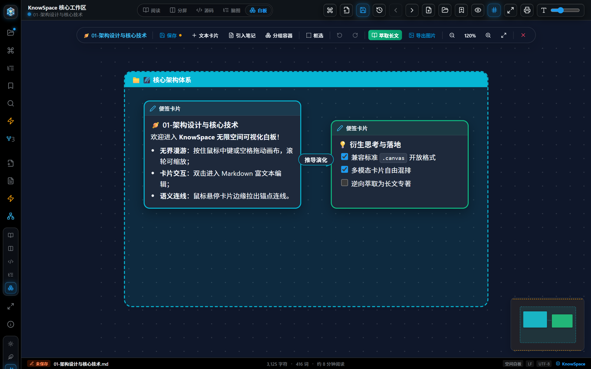
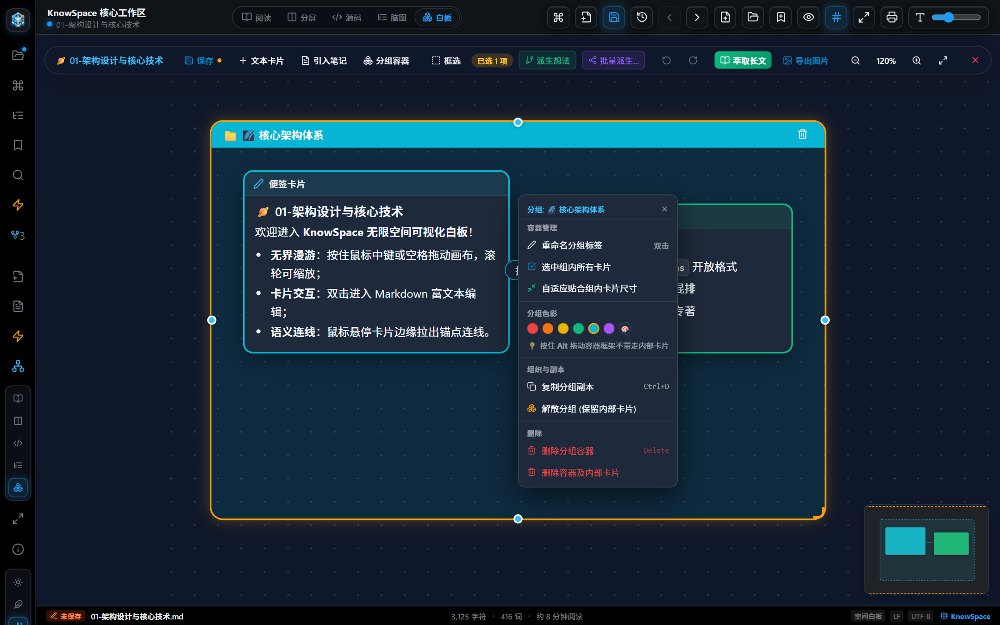
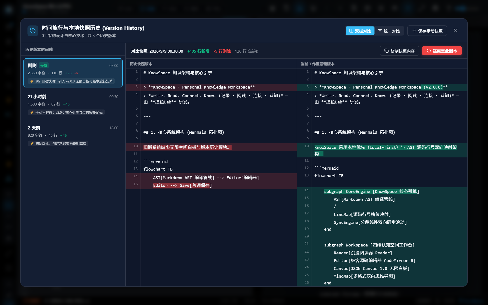
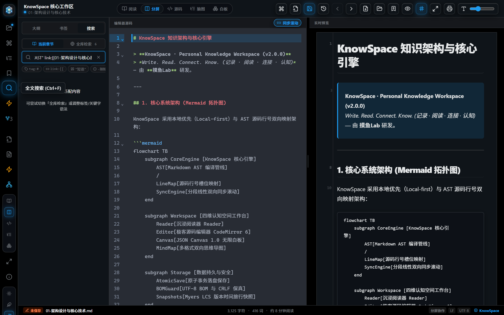

# KnowSpace 全功能高清图片操作手册与视觉指南 (Illustrated Manual)

  

  <strong>KnowSpace · Personal Knowledge Workspace | 现代化个人知识工作台</strong> 
  <em>一张图胜过千言万语 · 32 大功能模块全景画册与深度实操图解</em>

  
  
  
  
  

---

## 📖 画册导读与模块快速导航

本手册专为追求**直观、高效、视觉化学习**的用户量身打造。每一个模块均以最新的 **1080P/Retina 高清界面原图** 为核心，结合界面元素透视、端到端实操步骤与极客技巧，帮助您在 3 分钟内精通 KnowSpace 的每一个核心功能：

| 模块序号 | 功能模块名称 | 核心快捷键 | 关键视觉元素与配图 | 快速直达 |
| :--- | :--- | :--- | :--- | :--- |
| **01** | **工作台全景与三段式架构** | `Ctrl+\` / `Ctrl+B` | 目录树、双栏分屏、状态栏三段式全貌 | [查看图解](#01-工作台全景与三段式交互架构) |
| **02** | **三大沉浸主题系统** | 顶栏主题按钮 | 日光浅色、电子墨水屏、极客暗黑 | [查看图解](#02-三大沉浸主题系统) |
| **03** | **五重视图自适应切换** | `阅读` / `分屏` / `源码` / `脑图` / `白板` | 双栏分屏联动、极客编辑器、纯粹阅读、可视化白板 | [查看图解](#03-三重视图自适应切换) |
| **04** | **科学与现代富文本排版** | GFM / LaTeX / Mermaid | KaTeX 数学公式、Mermaid 架构图、任务清单 | [查看图解](#04-高级富文本与现代科学排版引擎) |
| **05** | **代码块语法高亮与一键复制** | 悬浮复制按钮 | 语言微胶囊、单行/多行代码高亮、复制成功动效 | [查看图解](#05-代码块语法高亮与一键复制微动效) |
| **06** | **多标签协同与右键菜单** | `Ctrl+W` / 鼠标中键 | 多标签协同、未保存呼吸灯、标签上下文菜单 | [查看图解](#06-原生多标签协同浏览与标签右键管理) |
| **07** | **双文档左右分屏对比模式** | 标签右键菜单 | 左右双文档独立滚动对比、一键还原单屏 | [查看图解](#07-原生双文档左右分屏对比模式) |
| **08** | **交互式思维导图模式** | `Ctrl+M` | 核心主题发散、分支连线、色彩层级 | [查看图解](#08-交互式思维导图模式) |
| **09** | **思维导图节点右键与定制** | 节点右键 / `Tab` / `Enter` | 添加子主题、添加同级主题、节点就地重命名 | [查看图解](#09-思维导图节点右键编辑与分支管理) |
| **10** | **导图多格式生态导出** | 导出按钮 ▾ | PNG透明图、OPML 2.0、FreeMind、Markdown | [查看图解](#10-思维导图多格式生态导出) |
| **11** | **全局命令中枢 (Palette)** | `Ctrl+K` / `Ctrl+P` | 快速文件跳转、前缀 `>` 执行动作、前缀 `#` 大纲 | [查看图解](#11-全局命令中枢-command-palette) |
| **12** | **编辑器斜杠指令速查** | `/` (斜杠) | 标题、表格、代码块、LaTeX、架构图悬浮菜单 | [查看图解](#12-编辑器斜杠快捷指令菜单) |
| **13** | **极客编辑器右键增强菜单** | 编辑区右键单击 | 格式化 Markdown、包裹双链、语法转换 | [查看图解](#13-极客编辑器右键上下文增强菜单) |
| **14** | **双向链接与反向引用面板** | `[[` / 侧栏反链图标 | 双链自动建立、反向链接列表、未引用提及 | [查看图解](#14-双向链接网络与反向引用面板) |
| **15** | **原子块级引用与嵌入卡片** | `^block-id` / `![[#^id]]` | 段落指纹标记、卡片式原子嵌入、原出处穿透 | [查看图解](#15-原子块级引用与嵌入卡片) |
| **16** | **知识网络全景拓扑图谱** | `Ctrl+G` | 60FPS 动态力导向全屏拓扑、知识孤岛识别 | [查看图解](#16-知识网络全景拓扑图谱) |
| **17** | **图谱多层探索与聚类光环** | 深度按钮 / 聚类开关 | 1-Hop / 2-Hop 关联步长、目录社区彩色聚类光环 | [查看图解](#17-知识图谱多层探索与彩色聚类光环) |
| **18** | **闪念胶囊悬浮速记微窗** | `Alt+Space` | 磨砂浮窗、快捷键保存、秒级追加收集箱 | [查看图解](#18-闪念胶囊灵感速记悬浮微窗) |
| **19** | **闪念胶囊热键与开机配置** | 胶囊右上角齿轮 | 全局热键实时录制、开机常驻后台、提示音 | [查看图解](#19-闪念胶囊全局热键录制与常驻配置) |
| **20** | **知识时空面板与热力矩阵** | 活动栏时空图标 | GitHub 风格活动日历热力格、修订足迹 | [查看图解](#20-知识时空面板与活跃度热力矩阵) |
| **21** | **实时大纲目录树 (TOC)** | 活动栏大纲图标 | H1~H6 树形结构、视口同步高亮、平滑跳转 | [查看图解](#21-多级实时大纲目录树) |
| **22** | **全文检索与高亮穿透定位** | `Ctrl+F` | 毫秒级跨文档搜索、关键词黄色高亮、光标穿透 | [查看图解](#22-全文极速检索与毫秒级高亮穿透) |
| **23** | **精选书签与阅读进度百分比** | `Ctrl+B` | 标记重点章节、精确进度百分比、一键直达 | [查看图解](#23-精选书签与阅读进度百分比管理) |
| **24** | **媒体与架构图无损灯箱** | 单击图表 / `Esc` | 全屏暗黑遮罩、平移缩放、3× Retina PNG 导出 | [查看图解](#24-媒体与架构图无损缩放灯箱) |
| **25** | **Zen 极简专注模式** | `F10` | 自动隐去全侧栏与工具栏、960px 黄金视宽居中 | [查看图解](#25-zen-极简专注模式) |
| **26** | **外部文件修改冲突协商** | 自动感知 | 磁盘指纹比对、覆盖/重载/另存为三向协商 | [查看图解](#26-外部编辑器并发修改冲突协商) |
| **27** | **原子事务落盘与未保存守卫** | `Ctrl+S` / 切章节拦截 | 物理临时文件写入、fsync刷盘、未保存防丢弹窗 | [查看图解](#27-物理事务原子落盘与未保存守卫拦截) |
| **28** | **无限空间可视化白板** | `白板` 标签 / 滚轮缩放 | JSON Canvas 1.0 标准、节点/分组/连线、鹰眼漫游 | [查看图解](#28-无限空间可视化白板-json-canvas-10-标准) |
| **29** | **白板卡片定制与逆向长文萃取** | 导出为 Markdown | 富文本/文档卡片、右键色系、拓扑逆向长文生成 | [查看图解](#29-白板卡片定制与逆向拓扑长文萃取) |
| **30** | **本地版本历史与 LCS 差异对比** | `Ctrl+Shift+H` | 事务快照时间线、Myers LCS 算法、增删行统计 | [查看图解](#30-本地版本时间旅行与-myers-lcs-差异对比) |
| **31** | **全库混合检索引擎与结构化语法** | `Ctrl+Shift+F` | tag:#, link:[[, "短语", -排除, 跨文档高亮脉冲 | [查看图解](#31-全库毫秒级混合检索引擎与结构化语法) |
| **32** | **关于 KnowSpace 与团队致谢** | 活动栏关于图标 | 桌面技术栈、版本声明、摸鱼Lab 团队主页 | [查看图解](#32-关于-knowspace-与技术架构) |
| **33** | **全局全功能快捷键实战速查图谱** | 全键盘速查 | 全库核心、导图、白板、检索、版本时间旅行 | [查看图解](#33-全局全功能快捷键实战速查图谱) |

---

## 01. 工作台全景与三段式交互架构

  

### 🎯 设计定位与核心价值
KnowSpace 工作台采用业界领先的**三段式模块化流式布局**：最左侧为「活动导航栏 + 文档目录树」，中部左侧为「CodeMirror 6 极客编辑器」，中部右侧为「AST 双向行号映射沉浸阅读器」，底部为「物理安全状态栏」。左右栏宽度自由拖拽，既满足极客高强度源码编写，又兼顾专业级出版排版审阅。

### 🔍 核心界面元素透视
1. **左侧深色活动栏 (Activity Bar)**：集成文档树、命令中枢、大纲、书签、搜索、时空足迹、反向链接、全景图谱及主题切换控制。
2. **多级知识库目录树 (Vault Explorer)**：支持多级文件夹折叠/展开、文档实时创建、选中高亮与物理路径悬浮气泡。
3. **顶栏多标签管理 (Tab System)**：清晰展示已打开文档，正在编辑的修改未保存时亮起黄色呼吸提示灯。
4. **双栏编辑器与预览器 (Split Workspace)**：左侧编辑光标移动或滚轮滚动时，右侧阅读器基于 AST 行号插值算法毫秒级同步定位，彻底消除传统百分比滚动的严重漂移。
5. **底部极客状态栏 (Status Bar)**：实时显示原子落盘状态、光标行号列号、文档全文字数、预估阅读耗时与编码格式（LF/UTF-8）。

### 🛠️ 推荐实操流程
- 按下 `Ctrl + Shift + O` 打开本地知识库文件夹，目录树瞬时载入。
- 单击目录树中任意 `.md` 文件，工作区秒开并高亮当前活动标签。
- 按下 `Ctrl + \` 可随心折叠左侧目录树，让工作台视线更宽阔。

---

## 02. 三大沉浸主题系统

KnowSpace 内置经过专业色彩工学调优的三套主题，覆盖白天明亮环境、长时间文本校对与深夜暗光码字场景。

### 2.1 日光暖橙浅色主题 (Daylight Warm)

  

- **设计特色**：采用高明度暖白底色（`#FAFAFA`）搭配温润的琥珀暖橙强调色，对比清晰且不刺眼，非常适合日间高强度阅读与办公汇报。
- **切换方式**：点击活动栏底部太阳图标 `☀️` 或按下 `Ctrl+K` 输入 `>日光`。

### 2.2 仿电子墨水屏纸质主题 (E-ink Paper)

  

- **设计特色**：模拟 Kindle 与专业电子纸质感（`#EAE6DF`），去除高饱和色彩，字体采用深炭黑高对比度纯色，极大降低眼部疲劳，专为深度沉浸式长文阅读设计。
- **切换方式**：点击活动栏底部羽毛笔图标 `🪶` 或按下 `Ctrl+K` 输入 `>墨水屏`。

### 2.3 极客午夜暗黑主题 (Midnight Geek)

  

- **设计特色**：基于 Twitter Lights Out 纯黑底色（`#000000`）打造，搭配冰川蓝（`#1D9BF0`）与微弱深灰边框（`#2F3336`），在暗光环境下带来纯粹、冷峻的极客沉浸氛围。
- **切换方式**：点击活动栏底部月亮图标 `🌙` 或按下 `Ctrl+K` 输入 `>暗黑`。

---

## 03. 三重视图自适应切换

顶部工具栏右侧提供「分屏 / 源码 / 阅读」三个并列按键，用户可根据任务形态一秒切换。

### 3.1 左右分屏联动模式 (Split Mode)

  

- **适用场景**：日常知识创作、一边编写 Markdown 源码一边实时核对排版效果。
- **技术亮点**：双向同步滚动算法实时校准当前段落，拖动左右分隔线可自由调整编辑器与预览区的宽度配比。

### 3.2 纯源码极客编辑模式 (Source Mode)

  

- **适用场景**：专注纯文本录入、复杂正则批量替换、大段代码与数学公式编写。
- **技术亮点**：CodeMirror 6 全新内核，配备语法高亮、代码折叠三角形、当前行高亮脉冲以及无缝多光标编辑。

### 3.3 沉浸式纯阅读模式 (Read Mode)

  

- **适用场景**：终稿阅读校对、向团队投屏演示、无干扰长文研读。
- **技术亮点**：正文自适应黄金阅读宽度，行间距与字距经过精细数学优化，隐藏多余编辑杂音。

---

## 04. 高级富文本与现代科学排版引擎

  

### 🎯 设计定位与核心价值
KnowSpace 内置**工业级完整 AST 渲染管线**，开箱支持 GFM 标准扩展、KaTeX 数学物理公式渲染、动态 Mermaid 架构拓扑以及丰富的任务清单与警示卡片。

### 🔍 核心元素解析
1. **KaTeX 物理与数学公式**：无论是行内质能方程 `$E=mc^2$` 还是复杂的独立积分块公式 `$$\hat{f}(\xi) = \int_{-\infty}^{\infty} f(x) e^{-2\pi i x \xi} dx$$`，均秒级矢量栅格化呈现。
2. **Mermaid 架构流程图**：标准 `flowchart`、`sequenceDiagram`、`classDiagram` 直接转为交互式 SVG，节点清晰可读。
3. **GFM 任务清单与状态复选框**：`- [x]` 任务列表支持在阅读器中直接点击切换勾选状态。
4. **专业级对比表格**：表头加粗着色、隔行斑马线纹理、支持列对齐修饰符。

---

## 05. 代码块语法高亮与一键复制微动效

  

### 🎯 设计定位与核心价值
专为研发人员打造的高品质代码展示体验。不仅支持主流 50+ 编程语言的精准语法着色，还在右上角配备了带有动效反馈的一键复制控件。

### 🔍 视觉反馈细节
- **语言微标签**：代码块右上角自动提炼显示 `typescript`、`python`、`json`、`rust` 等等宽标签。
- **瞬时反馈微动效**：点击复制按钮后，图标瞬间变换为绿色对勾 `✓`，文字切换为「已复制!」，2 秒后平滑恢复，杜绝用户反复误按确认。

---

## 06. 原生多标签协同浏览与标签右键管理

  

### 🎯 设计定位与核心价值
无需频繁在目录树中来回翻找，KnowSpace 提供类似主流 IDE 的**多标签协同工作区**。每个标签维护独立的阅读位置、撤销重做栈与编辑状态。

### 🛠️ 推荐操作技巧
- **鼠标中键极速关闭**：鼠标中键单击任意标签页，无需瞄准右上角小叉号即可秒级关闭。
- **未保存状态守卫**：文档若有未保存修改，标签右上角亮起黄色呼吸灯；关闭或切换时系统自动弹出安全拦截弹窗。
- **右键上下文菜单**：右键任意未激活标签，可快速呼出「向右拆分 / 分屏对比」、「关闭其他标签」、「关闭右侧标签」。

---

## 07. 原生双文档左右分屏对比模式

  

### 🎯 设计定位与核心价值
在撰写新架构方案、校验跨章节引用或比对中英文对照文档时，传统编辑器往往需要打开两个独立系统窗口并手动缩放对齐。KnowSpace 在主窗口内直接提供**原生双文档左右并排对比模式 (Dual Split View)**。

### 🔍 核心功能点
1. **独立视口控制**：左右两个文档窗口各自拥有完整的滚动条、阅读进度与大纲定位能力。
2. **醒目的分屏提示栏**：顶部显示「双文档分屏对比模式」状态条，包含两个文档的真实文件名。
3. **一键还原**：点击右上方「退出对比 (Exit Split)」按钮，瞬间平滑还原为标准单文档工作台。

---

## 08. 交互式思维导图模式

  

### 🎯 设计定位与核心价值
**“大纲即导图，导图即大纲”**。按下快捷键 `Ctrl + M`，KnowSpace 瞬间将当前 Markdown 文档的所有层级（H1 根主题、H2 二级分支、H3 子节点）解析为富有表现力的交互式思维导图。

### 🔍 视觉表现
- **彩虹分支着色**：不同分支自动赋予协调且对比鲜明的彩虹色相（青、绿、橙、紫、粉）。
- **流畅平移缩放**：按住鼠标左键拖动画布，滑动滚轮以光标为中心自由缩放，右上角常驻缩放比例与居中复位按钮。
- **双向无损互转**：在导图模式中新增或修改节点，底层 Markdown 源码实时同步更新。

---

## 09. 思维导图节点右键编辑与分支管理

  

### 🎯 设计定位与核心价值
在思维导图视图中，用户无需返回源码即可完成头脑风暴的全套操作。支持纯键盘操作与右键上下文交互。

### 🛠️ 快捷键实战速查
- `Tab` / `Insert`：为当前选中的节点快速添加下一级**子主题**并就地呼出输入框。
- `Enter`：为当前选中的节点创建**同级主题**。
- `F2` 或双击节点：就地悬浮输入框，实时修改分支名称。
- `Delete` / `Backspace`：快速删除当前节点及其从属子分支。
- `右键菜单`：提供「展开/折叠全部子节点」、「设置分支主题色」及「删除」等高级动作。

---

## 10. 思维导图多格式生态导出

  

### 🎯 设计定位与核心价值
打破思维导图的软件孤岛！点击导图工具栏右侧的「导出导图 ▾」下拉菜单，KnowSpace 为您提供 4 种专业级导出通道：

1. **导出 PNG 图片**：生成 100% 透明背景的高清抗锯齿位图，可直接粘贴至 PPT 或技术方案中。
2. **导出 OPML 2.0 格式**：通用大纲交换协议，可无损导入至 **MindNode、OmniOutliner、幕布、XMind** 等主流工具。
3. **导出 FreeMind (.mm)**：经典开源思维导图 XML 标准，支持在 FreeMind、Freeplane 中无缝承接。
4. **导出 Markdown 大纲**：自动按嵌套无序列表（Tab 缩进）格式化并下载为标准大纲文件。

---

## 11. 全局命令中枢 (Command Palette)

  

### 🎯 设计定位与核心价值
无论当前处于哪个界面或编辑状态，随时按下 `Ctrl + K`（或 `Ctrl + P`），即可唤起居中高斯模糊的**全局命令中枢**。键盘流极客的终极效率神器！

### 🔍 三模合一指令系统
- **默认快速文件跳转**：直接输入文件名或拼音首字母，模糊匹配并秒级跳转目标文档。
- **动作执行模式（前缀 `>`）**：输入 `>` 调出全系统操作指令，如切换主题、打开脑图、开启分屏、打印 PDF 等。
- **大纲小节检索（前缀 `#`）**：输入 `#` 实时检索当前文档中的所有 H1~H6 标题，回车光标直接穿透定位。

---

## 12. 编辑器斜杠快捷指令菜单

  

### 🎯 设计定位与核心价值
在 CodeMirror 6 编辑区的新行输入一个英文斜杠 `/`，系统立即在光标正下方悬浮弹出**组件极速插入菜单**。无需记忆复杂的 Markdown 语法符号。

### 🛠️ 常用指令支持
- `/h1` ~ `/h3`：快速插入一至三级标题。
- `/table`：插入预设 3 列对齐的标准 Markdown 表格模板。
- `/code`：插入带语法高亮围栏的代码块并自动将光标聚焦于语言字段。
- `/math`：插入居中 KaTeX 数学公式块模板。
- `/mermaid`：快速插入流程图或时序图架构模板。
- `/tip`、`/warning`：插入精致的 GitHub 规范提示卡片。

---

## 13. 极客编辑器右键上下文增强菜单

  

### 🎯 设计定位与核心价值
不同于操作系统简陋的原生右键菜单，KnowSpace 针对知识创作者深度定制了**极客上下文增强菜单**。

### 🔍 核心操作项
- **文本转换与包裹**：选中文本后右键，一键转换为粗体、斜体、行内代码或删除线。
- **智能插入双链**：一键将选中的词汇包裹为 `[[目标词汇]]` 双向链接。
- **包裹为代码块**：将多行文本一键包裹进三反引号代码块中。
- **格式化文档**：自动校准中英文空格、规范标点与段落间距。

---

## 14. 双向链接网络与反向引用面板

  

### 🎯 设计定位与核心价值
构建如同人脑神经突触般的网状知识库。在正文中输入 `[[` 即可调出联想卡片引用任意文档。点击活动栏的「反向链接与引用」图标，右侧展开反链管理面板。

### 🔍 面板能力详解
1. **显式反向引用 (Linked References)**：清晰罗列出所有主动通过 `[[当前文档]]` 链接过来的外部笔记，并带上下文段落预览。
2. **未引用的潜在提及 (Unlinked Mentions)**：全文智能扫描包含当前文档标题但尚未建立链接的文本，支持一键点击转换为双链，让遗漏的灵感重新交织。

---

## 15. 原子块级引用与嵌入卡片

  

### 🎯 设计定位与核心价值
超越文件级的粒度控制！KnowSpace 支持对任意段落标记原子指纹（如 `^ast-sync`）。通过 `![[文档#^指纹]]` 语法，可以将目标段落以**卡片形式无损嵌入**到任意其他文档中。

### 🔍 嵌入卡片特性
- **独立高亮边框**：带有「🔗 块级内联引用」标签与源文档来源链接。
- **单向修改、全网联动**：在源文件中更新段落内容，所有嵌入该卡片的文档在阅读时自动呈现最新版本。
- **点击来源直达**：点击卡片右上方的源链接，工作台瞬间切换并定位至原始文档的锚点行。

---

## 16. 知识网络全景拓扑图谱

  

### 🎯 设计定位与核心价值
按下全局快捷键 `Ctrl + G` 或点击活动栏拓扑图标，即可进入 **60FPS 硬件加速的知识网络全景图谱**。所有笔记节点以力导向物理引擎自由漫游与吸附。

### 🔍 核心图谱特性
- **入度出度感知**：被引用越频繁的核心笔记，其节点圆圈越大、发光越明显。
- **动态交互漫游**：支持鼠标拖拽节点、缩放画布、悬停高亮关联连线、单击节点直接打开阅读。
- **孤岛快速发现**：无任何连线的边缘孤立节点一目了然，帮助用户发现未沉淀成知识体系的零碎笔记。

---

## 17. 知识图谱多层探索与彩色聚类光环

  

### 🎯 设计定位与核心价值
当知识库拥有成百上千篇笔记时，全景图谱容易产生视觉杂乱（“毛线团效应”）。KnowSpace v1.11.0 引入了**探索深度调节与文件夹社区彩色聚类光环**。

### 🔍 进阶过滤控制
1. **关联深度切换 (Hop Depth)**：支持快速选择「全部 / 1-Hop（仅直接关联）/ 2-Hop（两步拓展）」，精准聚焦当前研究主题的核心关系网。
2. **彩色聚类光环 (Cluster Halos)**：同属于一个父级目录或标签分类的节点群，自动被包裹在柔和透亮的社区聚类光环中，宏观知识拓扑层次井然。

---

## 18. 闪念胶囊灵感速记悬浮微窗

  

### 🎯 设计定位与核心价值
灵感稍纵即逝。无论您正在编写代码、浏览网页还是观看视频，按下全局热键 `Alt + Space`，屏幕中央立即唤起带有毛玻璃拟态的**闪念胶囊速记微窗**。

### 🛠️ 秒级落盘工作流
- 输入随时随地的灵感碎片、代办清单 `- [ ]` 或 `#标签`。
- 按下 `Ctrl + Enter`，卡片瞬间淡出，内容以物理追加方式毫秒级沉入知识库的 `Inbox/YYYY-MM-DD.md` 收集箱中。
- 绝不打断您当前正在进行的主线工作。

---

## 19. 闪念胶囊全局热键录制与常驻配置

  

### 🎯 设计定位与核心价值
点击闪念胶囊右上角的齿轮设置图标，可对速记工作流进行高度个性化调优：
- **热键自由录制**：支持在输入框内直接按下您最顺手的组合键（如 `Ctrl+Shift+Space`、`Alt+Q` 等），底层自动进行系统级热键重绑定。
- **开机常驻托盘**：勾选常驻后台与开机静默自启，保证每次唤起均为 0 延迟秒开。

---

## 20. 知识时空面板与活跃度热力矩阵

  

### 🎯 设计定位与核心价值
点击活动栏时空足迹图标，展开知识时空看板。直观呈现您的知识沉淀历程与创作节律：
- **GitHub 风格热力矩阵**：以绿色矩阵方块呈现一整年的每日写作与阅读活跃度，颜色越深代表当日沉淀字数与互动越多。
- **时间旅行足迹**：按时间先后顺序记录知识库创建、最近修改、关键章节里程碑，让每一点积累看得见。

---

## 21. 多级实时大纲目录树

  

### 🎯 设计定位与核心价值
长篇技术方案与专著阅读的导航罗盘。侧栏大纲实时解析正文中的 H1~H6 标题结构：
- **视口高亮穿透**：随着正文滚轮滚动，大纲对应的小节自动实时高亮高能发光。
- **平滑动画跳转**：点击大纲中任意一级标题，正文以平滑线性动画毫秒级滚动至对应段落。

---

## 22. 全文极速检索与毫秒级高亮穿透

  

### 🎯 设计定位与核心价值
按下 `Ctrl + F` 呼出全文搜索侧栏。内置轻量级倒排索引，在万字长文中键入关键词瞬间即可呈现所有匹配结果卡片。

### 🔍 交互细节
- **上下文段落预览**：结果卡片展示命中文本的前后上下文，命中关键词附带黄色发光背景。
- **单击穿透定位**：点击卡片，主工作区不仅瞬间滚动到该段落，还会驱动光标在编辑器中精准选中文本。

---

## 23. 精选书签与阅读进度百分比管理

  

### 🎯 设计定位与核心价值
在研读数百页的技术规格书或长篇资料时，按下 `Ctrl + B` 可随时为当前段落打上**精选书签**。
- **精确进度记录**：书签卡片不仅记录章节名称与小节，还精确计算并保存了当前的阅读百分比（如 `68%`）。
- **随时续读**：点击书签列表即可精确回到上次标记时的视口高度。

---

## 24. 媒体与架构图无损缩放灯箱

  

### 🎯 设计定位与核心价值
在阅读器中单击任意大型 Mermaid 架构图或高分辨率插图，即可进入**全屏无损媒体灯箱**。
- **自由缩放平移**：支持通过鼠标滚轮进行 20%~500% 的矢量级无损缩放，按住左键自由拖拽。
- **3× Retina PNG 导出**：点击灯箱底部操作栏的导出按钮，直接提取矢量包围盒，生成 300+ DPI 印刷级高清透明背景图片。
- **按 `Esc` 退出**：按下键盘 `Esc` 或双击背景随时退出灯箱。

---

## 25. Zen 极简专注模式

  

### 🎯 设计定位与核心价值
按下键盘 `F10`，KnowSpace 瞬间隐去所有左侧活动栏、目录树、右侧边栏与多余按钮，进入 **Zen 极简专注模式**。
- **960px 黄金视宽**：正文自动居中，视线收束在最舒适的阅读视域内。
- **零视觉干扰**：让您全身心沉浸在文字心流中；再次按下 `F10` 即可一秒恢复全功能工作台。

---

## 26. 外部编辑器并发修改冲突协商

  

### 🎯 设计定位与核心价值
当您在 KnowSpace 中编辑文档的同时，外部程序（例如 VSCode 编辑、Git 执行 `git pull`、或云同步盘更新）修改了磁盘上的物理文件。KnowSpace 保存前比对磁盘指纹 `{ size, mtimeMs }`，发现不一致时立即拦截并弹出三向协商对话框：
1. **重新载入磁盘内容**：丢弃本地当前编辑，加载磁盘最新内容。
2. **强制覆盖磁盘文件**：以当前编辑器的内容为准，强制物理覆盖。
3. **另存为新文件**：生成独立副本文件，确保双方成果万无一失。

---

## 27. 物理事务原子落盘与未保存守卫拦截

  

### 🎯 设计定位与核心价值
**“数据安全高于一切”**。KnowSpace 从底层杜绝任何丢稿与文件截断损坏风险：
- **物理事务落盘**：`Ctrl+S` 保存时绝不在原文件上直接写覆，而是先写入同目录隐藏临时文件，调用系统级 `fsync` 确保数据沉入物理扇区后，再执行原子重命名替换（Atomic Rename），彻底杜绝异常断电导致 0 字节文件损坏。
- **全链路未保存守卫**：只要文档处于未保存状态，无论是误触关闭标签、切换左侧目录树章节，还是点击退出应用，系统都会主动拦截并弹出防丢稿弹窗，提供「保存文件 / 放弃更改 / 取消」。

---

## 28. 无限空间可视化白板 (JSON Canvas 1.0 标准)

  

### 🎯 设计定位与核心价值
突破传统线性 Markdown 文档与树状大纲的思维边界。KnowSpace v2.0.0 原生落地 **JSON Canvas 1.0 开放标准**，提供一个拥有无限物理维度的空间白板工作区。不仅支持在二维空间自由陈列 Markdown 文本卡片、内嵌笔记文档、网页与分组框，还支持平滑贝塞尔流向曲线与微缩导航鹰眼（Minimap），实现概念图谱与非线性灵感的高效组织。

### 🔍 核心特性与空间漫游
- **无限平移与缩放 (Pan & Zoom)**：支持通过滚轮或触控板以鼠标光标为中心进行 10%~500% 顺滑无极缩放；按住空格键（或按住鼠标中键）自由拖动画布进行无限空间漫游。
- **右上角全局微缩鹰眼 (Minimap)**：实时投影白板全局拓扑分布，当前视口位置一目了然，支持在鹰眼上直接点击跳跃穿透。
- **跨格式双向兼容**：原生读写标准 `.canvas` JSON 数据规范，与 Obsidian 等现代开源知识工具生态 100% 互通无阻。

### 🛠️ 推荐实操流程
- 在目录树右键选择「新建可视化白板」，命名为 `架构拓扑.canvas` 并双击打开。
- 按住 `Ctrl` 键滚动鼠标滚轮体验以光标为中心的 10%~500% 无级缩放。
- 按住 `Space` 键（空格）拖拽鼠标平移漫游，或直接点击右下角 Minimap 视口框瞬移定位。
- 按下 `Shift + 1` 一键全景自适应包含画布所有节点，或按下 `Ctrl + 0` 恢复 100% 原始视宽。

---

## 29. 白板卡片定制与逆向拓扑长文萃取

  

### 🎯 设计定位与核心价值
白板不仅是非线性发散的灵感画布，更是深度创作与系统化方案的重构工作台。支持通过顶部工具栏或右键菜单随时创建多种类型的节点，并通过右键属性面板调整卡片色系、边框与连接锚点。

### 🛠️ 逆向拓扑萃取与创作闭环
- **多类型节点生态**：支持创建「Markdown 富文本卡片」、「文档引用卡片」、「分组框 (Group Container)」以及「双向贝塞尔箭头连线 (Edges)」。
- **逆向拓扑生成长文 (Canvas to Markdown)**：点击白板顶部操作栏的「📝 导出为 Markdown」按钮，底层基于拓扑排序（Topological Sort）深度解析连线逻辑与空间坐标，自动将零碎的白板节点重构萃取为一篇层次严密、包含完整前言与各级小节的 Markdown 长文，真正打通「非线性构思 → 线性技术方案落地」的心流闭环！

### 🛠️ 推荐实操流程
- 在空白画布右键新建文本卡片，双击输入 Markdown 与 LaTeX，失焦自动编译精美排版。
- 鼠标悬浮卡片边缘磁吸锚点，拖拽连线至目标卡片；选中连线轻按 `R` 键秒级翻转流向。
- 鼠标框选多个卡片，右键选择「智能对齐」或按下 `Ctrl + G` 一键打包为半透明分组容器。
- 构思完成后，点击顶部「📝 导出为 Markdown」，一键将二维空间因果网萃取为结构化长文。

---

## 30. 本地版本时间旅行与 Myers LCS 差异对比

  

### 🎯 设计定位与核心价值
按下快捷键 `Ctrl + Shift + H` 或点击活动栏时空面板的历史按钮，即可唤起**本地版本时间旅行对话框**。彻底告别对外部 Git 的硬依赖，每次原子保存或重要编辑节点均在本地 `.knowspace/versions/` 留下轻量级不可变快照。

### 🔍 Myers LCS 算法与双栏对比
- **毫秒级 Myers LCS Diff**：采用业界权威的 Myers 最长公共子序列（Longest Common Subsequence）算法，逐行高精比对历史快照与当前编辑器内容的差异。
- **插入与删除统计徽章**：实时统计当前版本的增加行数 (`+N`) 与删除行数 (`-N`)，差异行分别赋予柔和的浅绿与浅红微光背景提示。
- **一键安全时光倒流**：选定任一历史版本，点击「恢复此版本」，系统自动进行安全事务落盘还原，并自动备份恢复前的内容，数据安全坚如磐石。

### 🛠️ 推荐实操流程
- 按下全局快捷键 `Ctrl + Shift + H` 随时唤起「时间旅行与版本快照历史」对话框。
- 左侧时间轴按时间倒序清晰标明历史快照点与 `+N / -N` 增减行统计，点击任一版本载入。
- 右侧双栏对比区细粒度字符级高亮差异；可一键在「双栏对照」与「统一合并」视图间切换。
- 点击「恢复至此版本」，确认后系统在自动创建当前防后悔备份的前提下执行安全时光倒流。

---

## 31. 全库毫秒级混合检索引擎与结构化语法

  

### 🎯 设计定位与核心价值
按下 `Ctrl + Shift + F` 或在搜索侧栏切换至「全库检索」，即可激活 KnowSpace v2.0.0 的全库混合检索引擎。依托底层分词与高性能倒排索引，在百万字规模的知识库中实现 5~15 毫秒级极速响应。

### 🔍 现代化结构化语法与一键穿透
- **结构化过滤语法**：
  - `tag:#标签` 或 `#标签`：精确筛选包含指定标签的段落；
  - `link:[[文档名]]`：秒级索引所有建立反向引用的关联笔记；
  - `"精确短语"`：双引号强制严格连续字词精确匹配；
  - `-排除词`：负向关键词过滤，剔除干扰信息。
- **语法快捷芯片 (Syntax Chips)**：搜索栏下方常驻 `tag:#`、`link:[[`、`"短语"`、`-排除` 便捷胶囊，点击即可就地补全语法模板。
- **全库章节感知与脉冲定位**：搜索结果卡片直接标注来源章节文件名、段落大纲与物理行号；点击任意卡片秒级跨文档平滑导航，并激发 1.8 秒电光蓝柔和脉冲高亮！

### 🛠️ 推荐实操流程
- 按下 `Ctrl + Shift + F` 将左侧搜索面板切换至「全库检索」模式。
- 单击搜索框下方的语法辅助芯片（如 `tag:#` 或 `link:[[`）快速插入结构化查询模板。
- 输入 `tag:#架构 link:[[微服务]] -废弃`，在 10 毫秒内即时获得全库精准命中卡片。
- 单击任意命中卡片，工作台秒级平滑跨文档定位至目标物理行，并激发 1.8 秒电光蓝微光脉冲。

---

## 32. 关于 KnowSpace 与技术架构

  

### 🎯 设计定位与核心价值
点击活动栏左下方的关于图标，展示 KnowSpace 的现代技术底座：
- **现代化架构栈**：React 19 + TypeScript + Electron 42 + CodeMirror 6 + Cytoscape + KaTeX + JSON Canvas 1.0。
- **研发团队**：由 **摸鱼Lab (Moyu Lab)** 匠心打造，遵循 MIT 开源许可协议，致力于打造极致本地优先的个人知识工作台。

---

## 33. 全局全功能快捷键实战速查图谱

| 分类 | 快捷键 | 功能名称 | 场景与极客说明 |
| :--- | :--- | :--- | :--- |
| **全局核心** | `Ctrl + K` / `Ctrl + P` | **全局命令中枢** | 随时唤起命令中枢，搜索文档、执行动作（前缀 `>`）或跳大纲（前缀 `#`） |
| | `Alt + Space` | **呼出/隐藏闪念胶囊** | 全局热键唤起毛玻璃速记微窗，秒级捕获灵感 |
| | `Ctrl + Enter` | **保存归档闪念** | 在闪念微窗内秒级原子落盘并沉入 `Inbox/` 收集箱 |
| **文件工程** | `Ctrl + N` | **新建 Markdown 文档** | 在当前知识库目录下快速创建新文档 |
| | `Ctrl + S` | **原子事务落盘保存** | 触发底层隐藏临时文件写入与 `fsync` 刷盘原子替换 |
| | `Ctrl + Shift + S` | **另存为新文件** | 将当前编辑器内容另存至新路径 |
| | `Ctrl + O` | **打开单文件** | 浏览本地任意单个 `.md` 文件 |
| | `Ctrl + Shift + O` | **打开知识库目录** | 载入本地文件夹建立完整工程知识库 |
| | `Ctrl + P` | **高保真矢量打印** | 调出标准 A4 打印与矢量 PDF 导出面板 |
| **版本安全** | `Ctrl + Shift + H` | **本地版本历史** | 打开本地版本时间旅行面板，对比 Myers LCS 差异与恢复快照 |
| **白板视图** | `Ctrl + 滚轮` | **白板无极缩放** | 以鼠标光标为中心在白板中进行 10%~500% 顺滑缩放 |
| | `空格 + 拖拽` / `鼠标中键` | **白板画布平移漫游** | 自由拖拽无限白板画布 |
| **导图视图** | `Ctrl + M` | **思维导图视图切换** | 一键在 Markdown 读写与交互式思维导图之间切换 |
| | `Tab` / `Insert` | **(导图中) 添加子主题** | 选定分支后秒级创建下一级子分支并就地重命名 |
| | `Enter` | **(导图中) 添加同级主题** | 选定分支后创建同级主题分支 |
| | `Delete` / `Backspace` | **(导图中) 删除主题** | 删除选中分支及其所有从属子分支 |
| | `F2` / `Space` | **(导图中) 重命名主题** | 激活悬浮输入框修改节点标题（支持双击编辑） |
| | `↑ ↓ ← →` | **(导图中) 方向键导航** | 在父子与兄弟分支间通过方向键快速漫游 |
| **知识图谱** | `Ctrl + G` | **知识网络全景图谱** | 全屏查看 60FPS 动态力导向关联拓扑与孤岛节点 |
| **编辑排版** | `/` (斜杠) | **斜杠指令菜单** | 快速插入标题、表格、代码围栏、LaTeX、架构图与卡片 |
| | `[[` (中括号) | **双链实时联想** | 快速唤出全库文档联想卡片建立双向链接 |
| | `#^` | **块级指纹联想** | 快速联想当前文档中的段落原子指纹锚点 |
| **标签导航** | `Ctrl + W` | **关闭当前标签** | 关闭当前文档（支持鼠标中键点击标签秒关） |
| | `Ctrl + Tab` | **向后轮转标签页** | 循环向后切换已打开的文档标签 |
| | `Ctrl + Shift + Tab` | **向前轮转标签页** | 循环向前切换已打开的文档标签 |
| | `Ctrl + \` | **折叠/展开目录树** | 切换左侧知识库目录树的展开与收起 |
| | `Alt + ←` / `Alt + →` | **上一篇 / 下一篇** | 顺序切换目录章节列表（带未保存拦截防护） |
| **检索书签** | `Ctrl + F` | **当前文档搜索** | 呼出搜索侧栏并聚焦输入框（导图模式下聚焦导图检索） |
| | `Ctrl + Shift + F` | **全库混合检索** | 激活全库检索引擎，支持 tag:#、link:[[、"短语"、-排除结构化语法 |
| | `Ctrl + B` | **添加/移除书签** | 为当前段落记录精确的阅读进度百分比 |
| **沉浸阅读** | `F10` | **Zen 极简专注模式** | 一键隐去侧栏与工具栏，正文自适应 960px 居中 |
| | `Alt + T` | **打字机滚动锁定** | 开启/关闭光标视口垂直居中固定 |
| | `F11` | **全屏沉浸模式** | 切换操作系统级全屏阅读 |
| | `Esc` | **取消 / 关闭** | 退出媒体灯箱、退出分屏对比、关闭命令中枢或取消弹窗 |

---

  <strong>KnowSpace · 让每一次记录，都成为认知的沉淀</strong> 
  <em>Copyright © 2026 摸鱼Lab (Moyu Lab). All rights reserved.</em>

