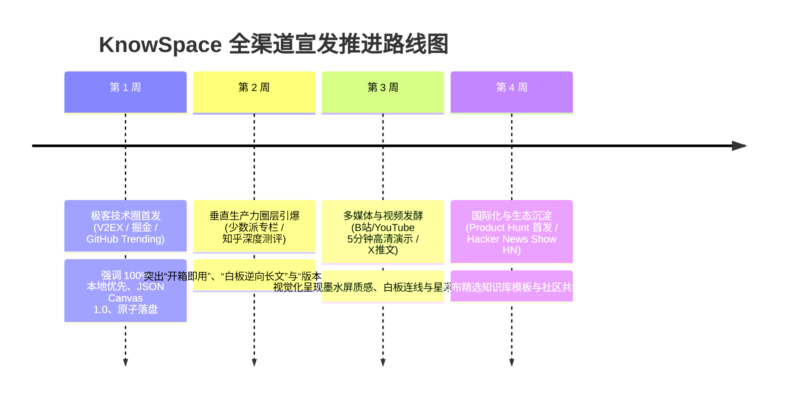

# 🪐 KnowSpace 官方独立宣传站与全渠道产品宣发方案 (v2.0.0 升级版)

> **项目名称**：KnowSpace · Personal Knowledge Workspace（现代化个人知识工作台）  
> **产品理念**：*Write. Read. Connect. Know.（记录 · 阅读 · 连接 · 认知）*  
> **当前基线**：`v2.0.0` 正式生产版（涵盖无限白板、版本时间旅行、全库混合检索、五维工作区、全能命令中枢、多格式脑图、局部星系图谱）  
> **制定团队**：摸鱼Lab (Moyu Lab)  
> **文档归档**：`docs/PROMOTIONAL_WEBSITE_PLAN.md`  
> **规划周期**：2026年9月 ~ 10月  
> **最新状态**：已完成全部 35 张 1080P/Retina 高清界面原图重新捕获与 2400×1350 Hero 主图升级，全面对齐 v2.0.0 平台实际能力。

---

## 🧭 一、 宣传站核心使命与品牌差异化战略

### 1.1 宣传站核心使命
随着 KnowSpace `v2.0.0` 正式完成研发并打包分发（包含 Windows MSI 安装包与绿色便携版），产品已具备极高的完整度与生产可用性。
独立宣传站（Official Landing Page & Marketing Hub）承担四大核心职责：
1. **重塑认知范式**：从传统一维线性文档编辑器，升维到“空间化个人认知操作系统”，打破用户对 Markdown 笔记工具的固有刻板印象。
2. **建立绝对信任**：以“100% 本地优先、零知识安全、开放标准（JSON Canvas 1.0 / OPML 2.0 / FreeMind / GFM）”彻底消除隐私泄露与厂商格式锁定的顾虑。
3. **极短转化链路**：通过高冲击力视觉质感、可交互的在线主题切换体验、拟真组件演示，实现 **访问 ➔ 惊艳 ➔ 免费下载** 的极短转化路径。
4. **生态与文档互通**：将 80,000 字完整实战手册与 32 大模块（35 张高清原图）画册无缝接入在线文档子系统，赋能社区用户与极客探索。

### 1.2 核心差异化主张 (The Core Pitch)

针对目前主流知识管理工具痛点，确立三大差异化宣传支柱：

```
                    ┌─────────────────────────────────────────┐
                    │       KnowSpace 核心差异化三脚架         │
                    └────────────────────┬────────────────────┘
                                         │
        ┌─────────────────────────────────┼─────────────────────────────────┐
        ▼                                 ▼                                 ▼
【开箱即用 · 告别插件泥潭】        【空间化认知 · 五维自由跃迁】       【100% 本地优先 · 数据绝对主权】
无需折腾 50+ 第三方插件与配置，    打破一维纯文本的思考桎梏，          物理事务原子落盘 (Temp+Fsync)，
开箱自带脑图、JSON Canvas 白板、   阅读 ➔ 分屏 ➔ 源码 ➔ 脑图 ➔ 白板，  完全保持 UTF-8 与通用标准格式，
版本旅行、全库检索、命令中枢。     行业独创白板因果拓扑逆向萃取长文。   零网络上传，断网拥有 100% 完整体验。
```

---

## 🏛️ 二、 宣传站页面架构与内容板块详案

宣传站采用 **“高冲击力叙事长流单页 (Storytelling Single-Page) + 在线文档中心 (/docs)”** 现代化架构。

### 2.1 页面板块全景蓝图 (Section Blueprint)

```
┌────────────────────────────────────────────────────────────────────────────────────────┐
│ TopNav: 品牌发光立方 Logo · 特性 · 五维空间 · 在线文档 · 更新日志 · GitHub Star · [免费下载]  │
├────────────────────────────────────────────────────────────────────────────────────────┤
│ 1. Hero 巅峰展台区 (Hero Showcase)                                                     │
│    - Eyebrow: ✨ v2.0.0 正式发布：无限可视化白板 · 本地版本旅行 · 全库混合检索          │
│    - 主标题: 记录 · 阅读 · 连接 · 认知                                                   │
│    - 副标题: 让思想在无界空间中自由生长，你的下一代现代化本地优先个人知识工作台。         │
│    - 双 CTA 按钮: [🟢 免费下载 Windows 版 (v2.0.0)]  [⚪ 查看在线交互演示 (Live Demo)]    │
│    - 拟真工作台展台: 2400×1350 超清窗口，支持在线实时切换日光/墨水屏/暗黑三大主题         │
├────────────────────────────────────────────────────────────────────────────────────────┤
│ 2. 信任指标与标准条 (Social Proof & Standards Strip)                                   │
│    - 🛡️ 100% Local-First · ⚡ <15ms 倒排检索 · 📐 JSON Canvas 1.0 · 🚀 60FPS 图谱拓扑    │
├────────────────────────────────────────────────────────────────────────────────────────┤
│ 3. Bento Grid 核心特性便当盒 (6 大高光能力矩阵)                                        │
│    - 🎨 01 无限空间可视化白板 (JSON Canvas 1.0 开放标准、贝塞尔连线、微缩鹰眼 Minimap) │
│    - ⏳ 02 本地版本时间旅行 (Myers LCS 算法、Side-by-Side 差异对比、一键无损时光倒流)   │
│    - 🔍 03 全库毫秒级混合检索引擎 (结构化语法 tag:#, link:[[, "短语", -排除、脉冲高亮) │
│    - ⚡ 04 闪念胶囊悬浮微窗 (Alt+Space 全局唤起、秒级收集、GitHub 风格活跃度热力矩阵)   │
│    - 🧠 05 交互式思维导图生态 (全键盘心流、OPML 2.0 / FreeMind / PNG 高清多格式导出)   │
│    - 🌐 06 60FPS 局部星系知识图谱 (力导向拓扑、1-Hop/2-Hop 深度探索、文件夹彩色聚类光环)│
├────────────────────────────────────────────────────────────────────────────────────────┤
│ 4. 深度漫游: 五维认知形态自由跃迁 (Deep Dive: The 5 Cognitive Dimensions)              │
│    - ① 📖 阅读模式 (Read Mode): 960px 黄金视宽、打字机滚动锁定、跨页防截断矢量打印      │
│    - ② 🪟 分屏模式 (Split Mode): AST 块级映射分段线性双向同步滚动、极客与预览无缝联动    │
│    - ③ 💻 源码模式 (Source Mode): CodeMirror 6 极客编辑器、代码精准折叠与 Front Matter  │
│    - ④ 🧠 导图模式 (Mindmap View): 结构化大纲秒转思维导图、全键盘盲操发散               │
│    - ⑤ 🎨 白板模式 (Canvas Mode): 二维自由空间布局、因果连线、逆向拓扑萃取生成长文     │
├────────────────────────────────────────────────────────────────────────────────────────┤
│ 5. 底层工程与数据主权 (Engineering Craftsmanship & Zero Cloud Risk)                    │
│    - 物理事务原子落盘 (Temp+Fsync) · 零厂商锁定 · 纯本地运行 · 外部并发冲突协商        │
├────────────────────────────────────────────────────────────────────────────────────────┤
│ 6. 竞品硬核横向对比矩阵 (KnowSpace vs Obsidian vs Notion vs Typora)                   │
├────────────────────────────────────────────────────────────────────────────────────────┤
│ 7. 下载中心 (Release Matrix)                                                          │
│    - Windows MSI 自动化安装包 (包含文件后缀关联)                                       │
│    - Windows 绿色解压即用便携版 (U 盘随身行)                                          │
│    - 完整 SHA-256 校验和与 GitHub Release 镜像通道                                     │
├────────────────────────────────────────────────────────────────────────────────────────┤
│ 8. 在线画册与文档子系统 (/docs) (包含全部 32 大模块与 35 张 1080P/Retina 原图)          │
├────────────────────────────────────────────────────────────────────────────────────────┤
│ 9. 高频常见疑问解答 (FAQ Section)                                                     │
├────────────────────────────────────────────────────────────────────────────────────────┤
│ 10. Footer & 社区开源阵地 (摸鱼Lab · MIT 许可 · GitHub Star · 微信讨论群)               │
└────────────────────────────────────────────────────────────────────────────────────────┘
```

---

## 🎨 三、 核心交互亮点设计 (Interactive Delighters)

为实现远超平庸静态页面的转化率，宣传站专门规划 **5 大高光微交互组件**：

### 3.1 拟真 3 套沉浸主题在线切换器 (Theme Switcher Widget)
- **交互形式**：在 Hero 首屏软件窗口下方提供三大交互按钮：
  - ☀️ **日光浅色 (Warm Amber)**
  - 📖 **仿电子墨水屏 (E-ink Paper)**
  - ✨ **极客暗黑 (Geek Dark)**
- **视觉反馈**：访客点击任意主题，中央拟真软件界面在 200ms 内触发 CSS 变量平滑过渡，实时切换界面底色、侧栏阴影与正文排版，让用户“未下载即可亲历设计质感”。

### 3.2 模拟全局命令中枢 (`Ctrl + K` Palette Simulator)
- **交互形式**：宣传站任何位置监听键盘 `Ctrl + K`（或点击页面浮动的快捷键胶囊），唤起模拟的毛玻璃命令悬浮窗。
- **功能体验**：访客可键入拼音测试文件切换（如输入 `jg` 匹配 `架构设计.md`）、输入 `>` 体验主题切换动作，直观呈现“手不离键盘”的极客心流。

### 3.3 JSON Canvas 微型白板体验舱 (Interactive Micro-Canvas)
- **交互形式**：在白板板块提供可鼠标拖拽平移与滚轮缩放的微型演示容器。
- **高光演示**：
  - 支持拖拽节点体验平滑磁吸与贝塞尔连线自适应弯曲；
  - 提供模拟「📝 导出为 Markdown」按钮，点击后触发粒子汇聚动效，展示零碎白板卡片瞬间逆向拓扑萃取为一篇结构严密的 Markdown 长文。

### 3.4 Myers LCS 差异对比动态滑动台 (Diff Interactive Slider)
- **交互形式**：在版本旅行板块，提供左右对比滑动条。
- **视觉反馈**：滑动对比滑块，左侧呈现历史快照，右侧呈现当前正文，新增行以柔和浅绿微光提示，删除行以浅红高亮提示，顶部动态翻牌统计 `+18` / `-5` 行数，直观呈现版本回溯的精准性。

### 3.5 结构化搜索语法即时模拟器 (Search Syntax Playground)
- **交互形式**：搜索演示框下方提供 `tag:#架构`、`link:[[分布式协议]]`、`"raft consensus"`、`-废弃` 语法快捷芯片。
- **即时响应**：点击任意芯片，搜索框就地填入语法，模拟结果列表以 10ms 极速呈现匹配的卡片，点击卡片后触发电光蓝脉冲高亮。

---

## 📁 四、 宣传站视觉资产全景映射表 (Assets Inventory)

充分复用项目已全面重新截取的 **35 张 1080P/Retina 高清截图** 与 **2400×1350 旗舰展示图**：

| 宣传站板块 | 选用资产文件 | 展示形式 | 核心传达点与功能特写 |
| :--- | :--- | :--- | :--- |
| **Hero 巅峰展台** | `screenshot.png`<br>`01-overview-workbench.png`<br>`02-theme-light.png`<br>`03-theme-eink.png`<br>`04-theme-dark.png` | 2400×1350 巨幅视窗 / 多图层透明投影 / 在线主题无缝过渡 | v2.0.0 全景工作台、五重视图切换器、白板标签、三大沉浸主题质感 |
| **Bento 01: 无限白板** | **`32-infinite-canvas.png`**<br>**`33-canvas-card-creation.png`** | 双卡切片 / 局部视网膜放大 / 贝塞尔流向连线 | **[v2.0.0 核心]** JSON Canvas 1.0 标准、节点/分组/连线/鹰眼、逆向拓扑长文萃取 |
| **Bento 02: 版本旅行** | **`34-version-history.png`** | 浮动弹窗特写 / 逐行微光对比 | **[v2.0.0 核心]** Myers LCS 算法、Side-by-Side 双栏 Diff、增删行统计、一键安全时光倒流 |
| **Bento 03: 混合检索** | **`35-hybrid-vault-search.png`**<br>`12-fulltext-search.png` | 侧栏特写 / 语法辅助芯片 | **[v2.0.0 核心]** 结构化语法 (`tag:#`, `link:[[`, `"短语"`, `-排除`)、跨文档脉冲高亮定位 |
| **Bento 04: 闪念时空** | `15-flash-capsule.png`<br>`15-flash-capsule-settings.png`<br>`23-timeline-panel.png` | 毛玻璃悬浮视窗 / 热力矩阵拼图 | `Alt+Space` 全局热键唤起、秒级收集箱落盘、GitHub 风格活跃度热力矩阵 |
| **Bento 05: 交互脑图** | `24-mindmap-view.png`<br>`25-mindmap-customization.png`<br>`30-mindmap-export-modal.png` | 导图透视图 / 导出面板特写 | `Ctrl+M` 大纲导图秒转、节点连线定制、OPML 2.0 / FreeMind / PNG 多格式导出 |
| **Bento 06: 星系图谱** | `21-global-graph.png`<br>`31-graph-depth-clustering.png` | 动态发光拓扑图 / 社区聚类光环 | 60FPS 动态力导向算法、1-Hop/2-Hop 探索深度、文件夹社区彩色光环 |
| **五维漫游: 极客与阅读** | `05-mode-split.png`<br>`06-mode-source.png`<br>`07-mode-read.png`<br>`08-rich-markdown.png`<br>`20-code-copied.png` | 轮播切换 / 标签平滑滑动 | AST 块级映射双向滚动、CodeMirror 6 极客体验、KaTeX 公式、代码悬浮一键复制 |
| **极客心流: 命令中枢** | `27-command-palette.png`<br>`28-slash-commands.png`<br>`29-editor-context-menu.png` | 浮动命令中枢 / 交互式呼出演示 | `Ctrl+K` 全局调度、斜杠快捷菜单 (`/`)、编辑器感知右键菜单 |
| **工程底座: 安全防护** | `17-dialog-unsaved.png`<br>`18-dialog-conflict.png`<br>`16-about-dialog.png` | 弹窗微缩拟物投影 | 物理事务原子落盘 (Temp+Fsync)、外部修改三向协商、未保存安全防丢守卫 |
| **阅读沉浸: 专注与灯箱** | `19-mode-zen.png`<br>`14-media-lightbox.png`<br>`11-navigation-toc.png`<br>`13-bookmarks.png` | 全屏专注视界 / 灯箱局部平移缩放 | `F10` Zen 极简模式、全屏无损媒体灯箱、大纲实时高亮、精准阅读进度书签 |

---

## 💻 五、 宣传站前端技术选型与工程化实施

### 5.1 技术栈推荐与性能指标
- **框架选型**：**Astro 4.x**（推荐，基于 Islands 架构，默认零客户端 JS 运行时，首屏性能极佳）或 **Next.js 14+ (App Router)**。
- **样式方案**：**Tailwind CSS 3.4** + 自定义 3 套主题调色盘系统（通过 CSS 变量在 `:root` 动态映射）。
- **动效库**：**Framer Motion**（滚动进场动画、数字翻牌动效、卡片微光倾斜）。
- **图标体系**：**Lucide Icons**（与桌面端一致的纯净极客图标）。
- **代码高亮**：**Shiki**（预渲染语法高亮，内嵌 Geek Dark 主题样式）。
- **性能基准**：
  - Google Lighthouse 性能指标确保 **95+ 分**；
  - 核心 LCP (Largest Contentful Paint) < **1.2s**；
  - CLS (Cumulative Layout Shift) = **0**。

### 5.2 资源压缩与轻量化管线
- 宣传站部署时，所有 PNG 原图自动通过 Sharp / Squoosh 处理为 **WebP** 与 **AVIF** 双格式，体积缩减 70%~85%，同时保留 100% 细节锐度。
- 对小尺寸图标与微动画采用 SVG 矢量化。

### 5.3 托管、CDN 与域名规划
- **代码仓库**：本项目根目录下独立模块 `web/` 或独立仓库 `KnowSpace-landing`。
- **构建与分发**：**Cloudflare Pages**（推荐）或 **Vercel**。
  - Cloudflare 全球 Anycast 边缘网络，国内与海外访问均具备优异响应速度；
  - 自动配置免费 SSL/TLS 证书，具备原生 DDoS 防护能力；
  - Git Commit 触发自动化 CI/CD 构建发布。
- **隐私友好统计**：采用 **Umami** 或 **Plausible Analytics**（无 Cookie、无个人敏感信息追踪，完美呼应 Local-First 理念）。

---

## 📣 六、 全渠道宣发与传播战役方案 (Go-to-Market Playbook)

按照 **“极客破冰 ➔ 垂直引爆 ➔ 视觉流媒体发酵 ➔ 国际化与生态沉淀”** 四阶段渐进推进：



### 6.1 阶段一：极客技术圈首发（第 1 周）
- **V2EX（程序员 / 分享创造节点）**：
  - **标题**：《做了一款开箱即用、本地优先的知识工作台 KnowSpace，告别插件泥潭与隐私焦虑》
  - **核心点**：强调 100% 本地优先、物理事务原子落盘、原生集成 JSON Canvas 1.0、Myers LCS 双栏版本对比、零网络上报。
- **掘金 / 开发者头条 / SegmentFault**：
  - **技术文章**：《如何基于 CodeMirror 6、React 19 与 Electron 打造高精度 AST 双向联动与 60FPS 知识图谱？》以硬核技术架构拆解为产品导流。
- **GitHub Trending 冲榜**：
  - 完善主仓库 README.md，挂载最新的 `screenshot.png` 2400×1350 展台图与 v2.0.0 徽章，引导第一波极客用户体验并 Star。

### 6.2 阶段二：垂直生产力圈层引爆（第 2 周）
- **少数派 (Sspai) 专栏深度投稿**：
  - **长文标题**：《从碎片散落到体系沉淀：我是如何用 KnowSpace 的五维认知空间完成万字方案的》
  - **重点解析**：闪念胶囊 ➔ 交互导图 ➔ 无限空间白板 ➔ 逆向拓扑萃取长文 ➔ 印刷级 PDF 导出的完整心流闭环。
- **知乎（PKM / 个人知识管理 / Obsidian 话题）**：
  - 聚焦回答：“如何评价本地优先知识管理工具？”、“2026 年有哪些惊艳的本地 Markdown 笔记软件？”

### 6.3 阶段三：视觉与视频矩阵（第 3 周）
- **B站 / YouTube 高清功能片**：
  - 制作 3~5 分钟电影感短片，配乐节奏明快，密集展示：
    1. 仿电子墨水屏主题下的护眼长篇沉浸排版；
    2. 全局 `Alt+Space` 闪念胶囊一键收集；
    3. `Ctrl+K` 全键盘盲操文件与指令穿透；
    4. 白板连线一键逆向萃取为长文，以及局部图谱动态探索；
    5. `Ctrl+Shift+H` 本地版本时光倒流与高精 Diff 对比。
- **X (Twitter) 动态动图流**：
  - 持续发布 10~15 秒高质量交互 GIF，带有 `#PKM #LocalFirst #Markdown #KnowledgeManagement` 标签。

### 6.4 阶段四：国际化与生态沉淀（第 4 周）
- **Product Hunt 全球首发**：
  - 准备精美 Gallery 截图组（基于最新的 35 张高清原图设计）、Maker Comment、提供专属社区欢迎词。
- **Hacker News (Show HN)**：
  - 纯粹极客沟通风格，标题推荐：`Show HN: KnowSpace – A local-first personal knowledge workspace with infinite canvas & local version history`。
  - 直面底层架构、本地安全与离线性能的极客讨论。

---

## 📋 七、 落地执行排期与任务分解 (Milestones & Deliverables)

| 里程碑任务 | 核心职责 | 关键交付物 | 计划工期 |
| :--- | :--- | :--- | :---: |
| **Milestone 1: 视觉资产与轻量化** | 设计 / 资源 | 将 35 张高清截图与 Hero 主图转换为 WebP/AVIF 双格式，提取 3 组精选交互 GIF | 1 天 |
| **Milestone 2: 宣传站前端脚手架** | 前端工程 | 初始化 Astro 4.x + Tailwind CSS 项目，搭建三大主题色彩系统与响应式布局基架 | 1 天 |
| **Milestone 3: 首屏与交互组件实现** | 前端开发 | 实现 Hero 拟真展台、在线 3 主题切换器、`Ctrl+K` 模拟器、双下载 CTA 按钮 | 2 天 |
| **Milestone 4: Bento 与五维认知漫游** | 页面构建 | 落地 6 大核心特性便当盒、五维空间演进交互演示、竞品横向对比矩阵 | 2 天 |
| **Milestone 5: 在线文档子系统集成** | 文档工程 | 接入 `全功能高清图片手册.md`（32 大模块）与 `USER_MANUAL.md`，集成轻量全文检索 | 1 天 |
| **Milestone 6: 部署上线与性能压测** | 运维部署 | 绑定独立域名、接入 Cloudflare CDN、配置 SEO TDK 与 OpenGraph 分享卡片，Lighthouse 压测调优 | 1 天 |
| **Milestone 7: 全渠道内容发布与推广** | 市场外宣 | 完成 V2EX、少数派、知乎、GitHub Release 首发稿件撰写与发布推进 | 2 天 |

---

<p align="center" style="text-align: center;">
  <strong>KnowSpace · 让每一次记录，都成为认知的沉淀</strong><br />
  <em>Copyright © 2026 摸鱼Lab (Moyu Lab). All rights reserved.</em>
</p>
