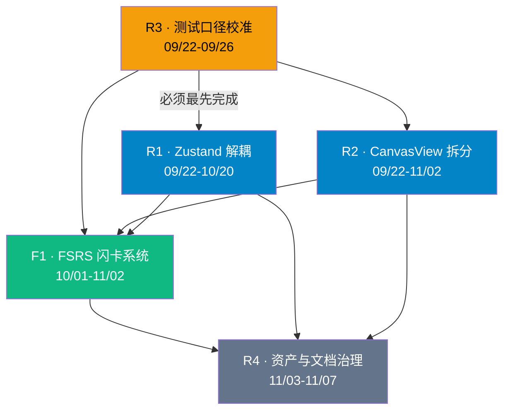

# KnowSpace v2.4.0 版本更新计划

> **文档性质**：下一版（v2.4.0）可执行发布计划
> **制定时间**：2026-09-16
> **上一版基线**：`v2.3.0`（已发布 MSI / NSIS / 便携版）
> **目标版本**：`v2.4.0`
> **计划窗口**：2026-09-22 ~ 2026-11-07（约 7 周）
> **负责人填写说明**：团队尚未在计划中固化人名，本文以**角色**代称并标注「待指派」。评审时请补齐姓名与备份人。

---

## 一、版本目标与优先级

### 1.1 一句话目标

> **在不动摇现有功能的前提下，拆掉两个巨石文件（`App.tsx` / `CanvasView.tsx`），并交付 KnowSpace 的第一个「知识内化」能力 —— FSRS 间隔重复闪卡系统。**

### 1.2 目标拆解

| 目标 | 类型 | 为什么是这一版 |
| :--- | :--- | :--- |
| **G1 · 架构减负** | 技术债 | `App.tsx` 3319 行、`CanvasView.tsx` 8451 行（🟢 实测）。这是**头号风险 R1**，越晚拆成本越高；且后续所有功能都要落在这两个文件里 |
| **G2 · FSRS 闪卡** | 新功能 | 纯 CPU 实现，**不被端侧 AI 算力问题阻塞**（蓝图已将其从后期提前至阶段一）。是当前**用户价值最高的增量** |
| **G3 · 质量基线校准** | 工程质量 | 测试口径不一致（文档称 379 项 / 🟢 实测 299 项）。重构必须建立在**可信的安全网**之上 |

### 1.3 明确**不**在本版范围内

| 事项 | 延后到 | 原因 |
| :--- | :--- | :--- |
| PDF 深度阅读双向划词 | **v2.5.0** | 依赖架构解耦成果 |
| 画布手绘矢量涂鸦图层 | **v2.5.0** | 依赖 `CanvasView` 拆分完成 |
| 端侧 AI / RAG 问答 | v2.6.0+ | 独立阶段 |
| 加密同步 / 跨端 | v2.8.0+ | 独立阶段 |

> ⚠️ **关键取舍说明**：蓝图将「架构解耦 + FSRS + PDF 划词 + 手绘涂鸦」全部放在阶段一（v2.4~v2.5）。本计划**主动把它劈成两版**——v2.4.0 只做「解耦 + FSRS」，v2.5.0 承接剩余两项。理由见 §7.1 风险 R-1。

---

## 二、任务清单

图例：**🔴 必做** ｜ **🟡 可选（本版时间富余才做）**

### 2.1 新增功能

#### F1 · FSRS 间隔重复闪卡系统 🔴

| 项目 | 内容 |
| :--- | :--- |
| **需求背景** | 当前 KnowSpace 完成了"记录 → 整理 → 连接"的闭环，但**缺少"记忆内化"环节**。用户收集的知识会随时间遗忘，工具链到此为止。FSRS 让"读过的知识真正留下来"，且纯 CPU 毫秒级计算，无需 GPU / 联网 |
| **影响范围** | 新增：`src/services/fsrsService.ts`、`src/components/DailyReviewPanel.tsx`；改动：`markdown.ts`（解析闪卡语法）、`SpaceTimelinePanel.tsx`（接入复盘入口）、`searchIndexService.ts`（闪卡索引） |
| **功能点** | ① **FSRS-4.5/5 算法内核**（DSR 三维模型：Difficulty / Stability / Retrievability）<br/>② **三种语法解析**：`Q: / A:` 问答对、行内 `正面 :: 背面`、挖空 `{{c1::答案}}` 与 `==高亮==`<br/>③ **白板卡片原生模式**：卡片可勾选「纳入复习」<br/>④ **Space 每日复盘视图**：今日到期卡片流<br/>⑤ **全键盘评估**：`Space` 翻面，`1/2/3/4` = Again/Hard/Good/Easy<br/>⑥ **纯本地进度存储**：`<!-- fsrs: S=3.2 D=4.1 due=2026-09-22 -->` 注释，第三方编辑器完全透明 |
| **验收标准** | ① 三种语法均能被正确解析并生成卡片<br/>② 算法与 FSRS 参考实现对比，**同一输入序列的下次到期时间误差 < 1 天**<br/>③ 完整走通「收集 → 解析 → 复盘 → 评分 → 下次排期」闭环<br/>④ 进度元数据以标准 HTML 注释落盘，**外部编辑器打开无乱码、无格式破坏**<br/>⑤ 复盘 100 张卡片的操作全程无可感知卡顿（评分响应 < 50ms）<br/>⑥ 新增单元测试覆盖算法内核与语法解析，**用例数 ≥ 30** |
| **负责人** | 算法/核心逻辑：**待指派**；UI：**待指派** |
| **时间节点** | 算法内核 10/01–10/12；语法解析 10/08–10/18；复盘视图 10/15–10/28；联调 10/29–11/02 |

---

### 2.2 优化项（架构重构）

#### R1 · 引入 Zustand 领域状态解耦 🔴

| 项目 | 内容 |
| :--- | :--- |
| **需求背景** | 状态散落在 `App.tsx`（3319 行）中，靠大量 props 层层传递（Prop Drilling），任何新功能都要改动顶层组件，回归风险高、协作成本大 |
| **影响范围** | 新增 `src/store/`（`useVaultStore` / `useTabStore` / `useCanvasStore`）；**全量组件读状态的路径变更** |
| **验收标准** | ① 三大 Store 落地，领域边界清晰<br/>② **全部 299+ 项测试通过，零回归**<br/>③ `App.tsx` 行数 **< 500 行**<br/>④ 无新增 `any` 类型逃逸 |
| **负责人** | **待指派** |
| **时间节点** | 方案设计 09/22–09/30；迁移 10/01–10/20（逐域迁移，每域后跑全量测试） |

#### R2 · `CanvasView.tsx` 模块化拆分 🔴

| 项目 | 内容 |
| :--- | :--- |
| **需求背景** | 8451 行的单文件组件（🟢 实测）是**头号技术债**。白板是产品差异化的核心，但它同时也是最难维护、最容易引入回归的模块 |
| **影响范围** | `CanvasView.tsx` 拆为 5 个模块：`CanvasViewport`（视口/手势）、`CanvasNodeLayer`（卡片）、`CanvasEdgeLayer`（连线）、`CanvasPresentationOverlay`（F5 演播）、`CanvasMinimap`（小地图） |
| **验收标准** | ① 拆分后单文件均 **< 2500 行**<br/>② **白板相关全部测试通过**（含 46 项 `canvas-view` 用例）<br/>③ 手动回归清单全通过：拖拽 / 连线 / 环形与网格布局 / F5 演播 / 右键菜单 / 导出 PNG 与 SVG / 多选批量操作 / 小地图<br/>④ **性能无回退**：拖动帧率与拆分前持平（对比录屏或 Performance 面板） |
| **负责人** | **待指派** |
| **时间节点** | 依赖分析 + 拆分设计 09/22–10/05；分批拆分 10/06–10/28；回归 10/29–11/02 |

#### R3 · 测试口径校准与 CI 补齐 🔴

| 项目 | 内容 |
| :--- | :--- |
| **需求背景** | 文档记载「44 套件 / 379 项测试」，而 🟢 实测为「34 文件 / 299 项」。在此差异澄清前，**重构的安全网强度是不可信的** |
| **影响范围** | `vitest.config.ts`、`package.json`、`README.md`、`docs/KNOWSPACE_EVOLUTION_BLUEPRINT_2026_2027.md` |
| **验收标准** | ① 查明差异原因（是否存在被 exclude 的测试文件）<br/>② 统一统计脚本，一键输出准确数字<br/>③ 文档中的测试数字与实际一致<br/>④ 重构前建立**可对照的基线快照** |
| **负责人** | **待指派** |
| **时间节点** | 09/22–09/26（**必须最先完成**，是其他所有任务的前置） |

#### R4 · 交付资产与文档治理 🟡

| 项目 | 内容 |
| :--- | :--- |
| **需求背景** | ① `release/` 累积多版安装包与解包目录，仓库体积膨胀<br/>② 手册存在中英/繁重复（`USER_MANUAL.md` ↔ `操作手册.md`、`PICTURE_MANUAL.md` ↔ `全功能高清图片手册.md`）<br/>③ v2.4.0 新增 FSRS，手册必须同步 |
| **验收标准** | ① 历史产物移出仓库（改挂 GitHub Release 附件）或加入 `.gitignore`<br/>② 明确手册的唯一权威版本，其余标记为归档<br/>③ 新增 FSRS 章节的手册配图与说明 |
| **负责人** | **待指派** |
| **时间节点** | 11/03–11/07（发布前收尾） |

---

### 2.3 已修复问题（v2.3.0 之后累积，将随本版一并发布）

以下为 v2.3.0 发布后至本计划制定期间的修复，**已合入主干**，将在 v2.4.0 中统一体现：

| # | 问题 | 修复要点 | 影响范围 |
| :--- | :--- | :--- | :--- |
| 1 | 白板右键菜单被父容器裁切 | 改用 portal + `position: fixed` 渲染，zIndex 提升；基于视口尺寸钳制并优先向上翻转 | `CanvasView.tsx` |
| 2 | 环状连线颜色不统一（6 节点环出现 6 色） | 整环预计算统一色；导出侧复用同一色彩解析 | `canvasService.ts` |
| 3 | 导出图片与屏幕显示不一致 | 抽取 `computeSourceDisplayColorMap` 作为单一色彩来源 | `canvasService.ts` |
| 4 | 网格对齐时连线仍为曲线 | 新增 `gridPath` 标记，矩形网格走正交直线 | `canvasService.ts` |
| 5 | 拖动卡片无法调整网格间距 | 新增拖动调距交互（`resizeGridSpacing` + 锚点卡片） | `CanvasView.tsx` |
| 6 | **PNG 导出闪退**（多轮） | ① 改 Blob + ArrayBuffer 传输，消除 base64 内存峰值<br/>② 尺寸钳制（单边 ≤16384px / 总量 ≤24MP）<br/>③ **修复根因：卡片 HTML 未自闭合导致导出 SVG 非法 XML**（新增布尔属性值化 + `serializeSvgForExport` 复用）<br/>④ 新增主进程离屏渲染兜底（`capturePage` 绕过 canvas 限制） | `canvasService.ts`、`main.cjs`、`preload.cjs` |
| 7 | 闭环连线拖动时不跟随卡片 | 新增 `syncLoopEdgeGeometry`，拖动每帧重算环几何 | `canvasService.ts` |
| 8 | 2×2 矩形被误判为圆 | 网格判定优先于环形判定 | `canvasService.ts` |
| 9 | 全屏后侧边栏下方按钮缺失 | 容器改为可滚动 + `flex-shrink: 0`；按窗口高度三级响应式收紧；tooltip 改 portal 避免被裁 | `styles.css`、`ActivityBar.tsx` |
| 10 | 白板拖动性能瓶颈 | 环检测拓扑指纹缓存、色彩映射索引化、拖动 Map 预建、window 监听器稳定化 | `canvasService.ts`、`CanvasView.tsx` |
| 11 | 批量改色颜色种类不足 | 调色板 6 → 12 色（1–6 为 JSON Canvas 标准，7–12 为扩展） | `canvasService.ts`、`CanvasView.tsx` |
| 12 | 多选成环/网格后无法整体拖动 | 新增凸包命中检测，点击中间空白区可整体平移 | `canvasService.ts` |
| 13 | 缺少环形间距调整 | 新增半径滑块 + 拖拽卡片调距 | `canvasService.ts`、`CanvasView.tsx` |
| 14 | 导出未跟随主题 | 抽取 `canvasTheme.ts` 作为屏幕与导出的共享配色来源（背景/点阵/标签/分组容器全面对齐） | `canvasTheme.ts`、`canvasService.ts` |
| 15 | **自定义颜色取色时闪退** | ① 不再从 `onChange` 同步卸载菜单（避免销毁仍在使用原生对话框的 input）<br/>② 拖色改为**预览模式**（不写历史），停手后防抖提交**单条**历史 | `CanvasView.tsx` |
| 16 | 卡片颜色比调色板选中的浅 | 卡片头部改用实色 `stroke` + 反白文字；自定义色背景透明度与标准色统一为 12% | `CanvasView.tsx` |

> **说明**：#1–16 中多数已在 v2.3.0 之后的主干完成，但**尚未打包进正式发布物**。v2.4.0 将是它们的首个正式交付版本。

---

## 三、依赖关系图



### 关键依赖说明

| 依赖 | 类型 | 说明 |
| :--- | :--- | :--- |
| **R3 → 所有任务** | 🔴 硬依赖 | 测试基线不准确，重构就没有可信的安全网 |
| **R1 / R2 → F1** | 🟠 软依赖 | FSRS 的 UI 需要稳定的状态层；若解耦延期，FSRS 可先在现有结构上落地（见 §7.2 降级预案） |
| **R1 ⊥ R2 弱耦合** | — | 两者可并行，但**同一时间不要同时大改同一文件**，需明确文件归属避免冲突 |
| **F1 → R4** | 🟠 软依赖 | 手册需新增 FSRS 章节 |

---

## 四、必做 vs 可选

### 4.1 必做（Must Have）—— 缺失则本版不可发布

| ID | 任务 | 理由 |
| :--- | :--- | :--- |
| **R3** | 测试口径校准 | 重构的前置条件 |
| **R1** | Zustand 解耦（含 `App.tsx` < 500 行） | 版本核心目标 G1 |
| **R2** | `CanvasView` 拆分 | 头号风险 R1 的缓解措施 |
| **F1** | FSRS 闪卡系统 | 版本核心目标 G2 |

### 4.2 可选（Nice to Have）—— 时间富余则做，否则顺延 v2.5.0

| ID | 任务 | 顺延代价 |
| :--- | :--- | :--- |
| **R4** | 交付资产与文档治理 | 仓库体积继续增长；手册与功能脱节 |
| F1-扩展 | 白板卡片"纳入复习"高级筛选 | 首版可用简化入口替代 |

### 4.3 允许裁剪的范围（如需保交付）

若进度紧张，**按以下顺序**削减，保证核心目标不破：

```
① 砍 R4 → ② 砍 F1 的"白板卡片原生模式"（改 v2.5.0）→ ③ 砍 F1 的"挖空填空"（先支持问答对与行内）
   → ④ 推迟 R1 的 useCanvasStore（先迁 vault + tab 两域）→ ⑤ 不可再砍：R3 / F1 核心算法 / R2 拆分
```

---

## 五、时间节点总览

| 阶段 | 窗口 | 里程碑 | 交付物 |
| :--- | :--- | :--- | :--- |
| **准备期** | 09/22 – 09/30 | 基线校准 + 方案评审 | 测试基线报告；R1/R2 拆分设计文档（含回滚预案） |
| **开发期 A** | 10/01 – 10/20 | 架构解耦主攻 | 三大 Store 落地；`App.tsx` < 500 行 |
| **开发期 B** | 10/01 – 11/02 | 白板拆分 + FSRS 并行 | `CanvasView` 五模块；FSRS 算法内核与复盘视图 |
| **联调期** | 10/29 – 11/02 | 集成验证 | 全量测试绿；手动回归清单通过 |
| **发布期** | 11/03 – 11/07 | 打包与发布 | MSI / NSIS / 便携版；Release Notes；更新的手册 |
| **观察期** | 11/08 – 11/14 | 灰度反馈 | 缺陷收集与 hotfix 判断 |

**关键时间点**

- 🔴 **09/30**：拆分设计评审通过（未通过则 R2 顺延，F1 优先级上调）
- 🔴 **10/20**：R1 达标（`App.tsx` < 500 行）
- 🔴 **11/02**：特性冻结（Feature Freeze），此后只允许修缺陷
- 🔴 **11/07**：发布

---

## 六、发布方案

### 6.1 版本号与产物

| 项目 | 内容 |
| :--- | :--- |
| 版本号 | `2.4.0`（`package.json`） |
| 产物 | ① `KnowSpace-2.4.0.msi`（企业分发）<br/>② `KnowSpace-Setup-2.4.0.exe`（图形化安装）<br/>③ `KnowSpace-win-x64-portable.zip`（绿色版） |
| 验证 | 三份产物均需在**干净环境**安装/解压后启动并跑通冒烟清单 |

### 6.2 发布前置检查清单

- [ ] 全量测试 100% 通过（数字与文档一致）
- [ ] `App.tsx` < 500 行；`CanvasView` 各模块 < 2500 行
- [ ] 手动回归清单全通过（白板 / 编辑器 / 图谱 / 导图 / 闪念 / 检索 / 快照）
- [ ] 冒烟验证：新建笔记 → 编辑 → 保存 → 重开；白板创建卡片 → 连线 → 导出 PNG
- [ ] **数据兼容验证**：用 v2.3.0 打开的库，用 v2.4.0 打开无异常（含 FSRS 注释）
- [ ] Release Notes 撰写完成（新增 / 优化 / 修复三段）
- [ ] 手册已更新（FSRS 章节）
- [ ] git tag `v2.4.0` 已打

### 6.3 发布流程

```
① 特性冻结（11/02）→ 只接受缺陷修复
② 全量测试 + 手动回归 + 冒烟
③ npm run build → electron-builder --win msi nsis
④ scripts/sync-portable.ps1 生成便携版
⑤ 干净环境安装验证（三产物）
⑥ 打 tag v2.4.0 → 推送
⑦ GitHub Release 上传三产物 + Release Notes
⑧ 官网/README 更新下载链接与徽章版本号
```

---

## 七、风险与降级预案

### 7.1 风险登记册

| ID | 风险 | 等级 | 影响 | 应对 |
| :--- | :--- | :---: | :--- | :--- |
| **R-1** | **范围过大** —— 解耦 + 拆分 + FSRS 三线并行，7 周内可能无法全部高质量完成 | 🔴 高 | 延期或质量下降 | 已通过"劈成两版"缓解（PDF/手绘移出）；设 §4.3 裁剪顺序；10/20 设中期检查点 |
| **R-2** | **重构引入回归** —— `CanvasView` 8451 行拆分风险极高 | 🔴 高 | 白板功能损坏 | ① 拆分前建立测试基线（R3）<br/>② 分批拆分，每批后跑全量测试 + 白板手动回归<br/>③ 保留可回退的分支策略 |
| **R-3** | **数据格式兼容** —— FSRS 写入注释元数据可能被旧版误读 | 🟠 中 | 旧版打开异常 | ① 仅使用标准 HTML 注释<br/>② 发布前用 v2.3.0 实测打开含 FSRS 数据的库<br/>③ 解析器对未知注释放行 |
| **R-4** | **两线并行冲突** —— R1 与 R2 同时改 `CanvasView` 相关文件 | 🟠 中 | 合并冲突、互相阻塞 | 明确文件归属：R2 独占 `CanvasView*`；R1 独占 `store/` 与 `App.tsx`；接口变更先约定后实施 |
| **R-5** | **人力不确定** —— 负责人尚未指派 | 🟠 中 | 排期落空 | 评审时必须补齐姓名与备份人；若无专职投入，改用 §4.3 裁剪至"FSRS 单品交付" |
| **R-6** | **FSRS 算法正确性** —— 参数拟合偏差导致排期不准 | 🟠 中 | 复习体验差 | 与 FSRS 参考实现做对照测试（验收标准 ②）；首版提供"重置进度"兜底 |
| **R-7** | **测试基线不明** —— 299 vs 379 差异未澄清 | 🟠 中 | 安全网不可信 | R3 最先执行，未澄清前不启动大重构 |

### 7.2 降级预案

| 触发条件 | 降级动作 |
| :--- | :--- |
| 09/30 拆分设计未评审通过 | R2 顺延至 v2.5.0；本版聚焦 **R3 + R1 + F1** |
| 10/20 `App.tsx` 未达标 | 缩减 R1 范围为 `useVaultStore` + `useTabStore`，`useCanvasStore` 顺延 |
| 10/28 FSRS 算法未达验收标准 ② | 降级为「简化 SM-2 算法」先交付闭环，FSRS 精确拟合顺延 v2.4.1 |
| 11/02 存在阻断性缺陷 | 特性冻结后延迟发布，最长顺延 1 周；仍不解决则**裁掉 F1 的白板卡片模式**后发布 |
| 发布后发现严重缺陷 | 立即执行 §8 回滚方案 |

---

## 八、回滚方案

### 8.1 回滚触发条件

| 级别 | 现象 | 动作 |
| :--- | :--- | :--- |
| **L1 · 立即回滚** | 启动崩溃 / 数据损坏 / 笔记保存失败 / 白板无法打开 | 下架 Release，回退到 v2.3.0 |
| **L2 · 紧急热修** | 单一功能不可用（如 F5 演播异常），主流程正常 | 保留版本，24h 内发 hotfix `v2.4.1` |
| **L3 · 记录观察** | 视觉瑕疵 / 次要交互异常 | 记录进下一版，不回滚 |

### 8.2 代码回滚

```
① 发布前打 tag：git tag v2.4.0
② 同时保留 v2.3.0 的 tag 与安装包（回滚基准）
③ L1 触发时：git revert / 检出 v2.3.0 重新构建发布
④ 分支策略建议：主干开发 + 每项任务独立分支 + 合并前必须测试绿
```

### 8.3 用户侧回滚（关键保障）

| 保障点 | 说明 |
| :--- | :--- |
| **数据零迁移** | v2.4.0 **不改变**任何既有文件格式（仍为 GFM Markdown + JSON Canvas 1.0） |
| **FSRS 元数据可忽略** | 进度以 HTML 注释存储，**v2.3.0 打开含 FSRS 数据的库应正常显示**（仅忽略注释） |
| **旧版安装包常备** | 保留 `KnowSpace-2.3.0.msi` 与 `KnowSpace-Setup-2.3.0.exe` 至少 2 个版本周期 |
| **降级安装可行** | 用户可直接安装 v2.3.0 覆盖 v2.4.0（同 appId，无需卸载） |
| **快照兜底** | 用户可借助 `.knowspace/snapshots/` 本地快照恢复误损内容 |

### 8.4 回滚演练（建议纳入发布前置）

- [ ] 在测试机安装 v2.4.0，用其创建含 FSRS 数据的库
- [ ] 卸载 v2.4.0，安装 v2.3.0，打开同一库，确认**无报错、内容完整**
- [ ] 记录演练结果到 Release 检查清单

---

## 九、验收标准汇总

| 类别 | 验收标准 |
| :--- | :--- |
| **功能** | FSRS 三种语法解析正确；复盘闭环可用；评分响应 < 50ms |
| **架构** | `App.tsx` < 500 行；`CanvasView` 各模块 < 2500 行；三大 Store 边界清晰 |
| **质量** | 全量测试 100% 通过且数字与文档一致；新增测试 ≥ 30 项（FSRS） |
| **性能** | 白板拖动帧率与拆分前持平；长文打字延迟 < 16ms；无内存显著增长 |
| **兼容** | v2.3.0 可正常打开 v2.4.0 创建的库；文件格式无破坏性变更 |
| **交付** | 三份产物在干净环境验证通过；Release Notes 与手册同步更新 |
| **红线** | 原子落盘可用；无遥测；未加密数据不出网 |

---

## 十、负责人与时间节点一览

> ⚠️ 以下负责人均为**待指派**，请在评审会上补齐姓名与备份人。

| ID | 任务 | 角色 | 负责人 | 备份 | 起止 |
| :--- | :--- | :--- | :--- | :--- | :--- |
| R3 | 测试口径校准 | 工程质量 | 待指派 | — | 09/22 – 09/26 |
| R2-设计 | 拆分方案与回滚预案 | 架构 | 待指派 | — | 09/22 – 09/30 |
| R1 | Zustand 解耦 | 架构 / 前端 | 待指派 | — | 10/01 – 10/20 |
| R2 | `CanvasView` 拆分 | 前端（白板） | 待指派 | — | 10/06 – 11/02 |
| F1-算法 | FSRS 内核与解析 | 算法 / 核心 | 待指派 | — | 10/01 – 10/18 |
| F1-UI | 每日复盘视图 | 前端 | 待指派 | — | 10/15 – 10/28 |
| F1-联调 | 闭环联调 | 全体 | — | — | 10/29 – 11/02 |
| R4 | 资产与文档治理 | 工程 / 文档 | 待指派 | — | 11/03 – 11/07 |
| 发布 | 打包与 Release | 工程 | 待指派 | — | 11/03 – 11/07 |

---

## 附：评审待决事项

以下问题需在计划评审会上确认：

1. **负责人指派** —— 所有「待指派」项需补齐姓名与备份人（R-5）
2. **测试差异原因** —— 是否曾存在被 exclude 的测试文件？（影响 R3 与范围判断）
3. **发布节奏** —— v2.4.0 是否严格 11/07 发布，或允许顺延 1 周以保完整性？（R-1）
4. **FSRS 首版范围** —— 是否必须包含"挖空填空"与"白板卡片模式"，还是可顺延 v2.5.0？
5. **R2 拆分粒度** —— 采用「5 模块」方案还是更保守的「先抽 2 个最大子层」？

---

> **文档维护**：本计划每完成一个里程碑（尤其是 09/30、10/20、11/02 三个检查点）后请复核并更新状态；发生降级预案触发时，请在 §7.2 记录决策与时间。
