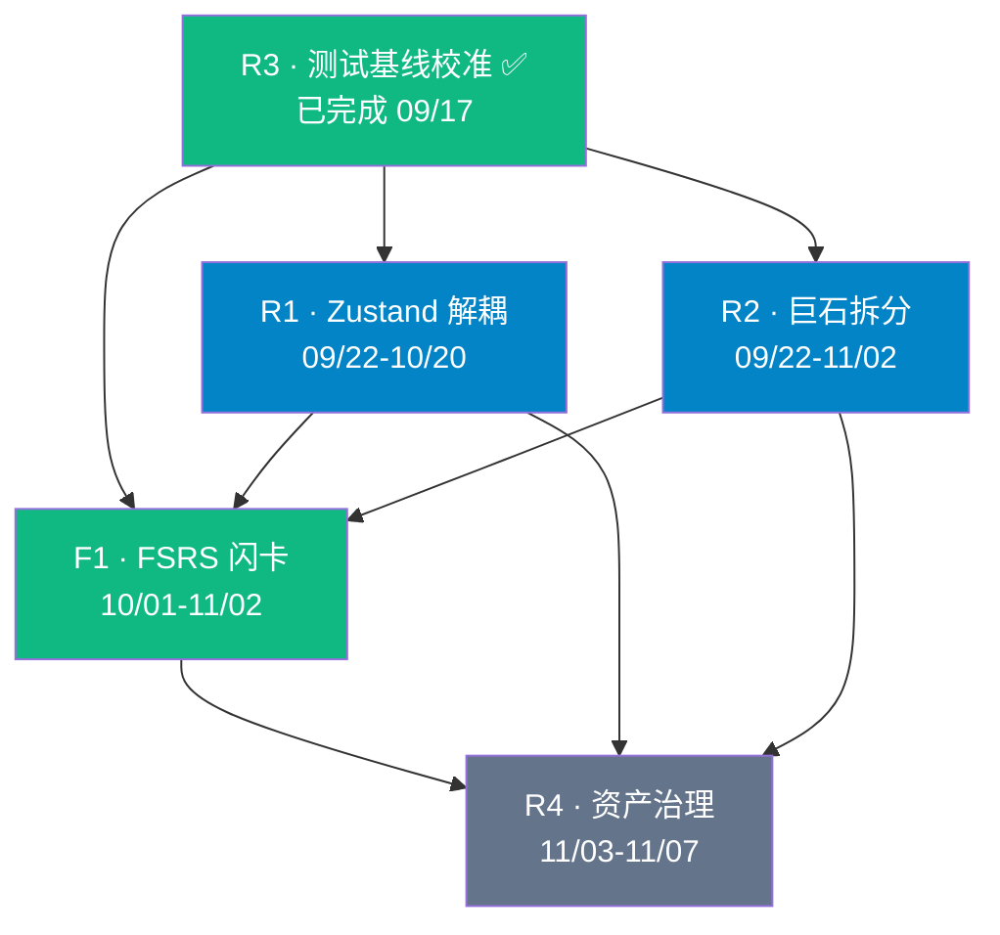

# KnowSpace v2.5.0 版本更新计划

> **文档性质**：可执行发布计划（承接 `RELEASE_PLAN_v2.4.0.md`）
> **制定时间**：2026-09-17
> **上一版交付基线**：`v2.4.0`（已发布 MSI / NSIS / 便携版，见 GitHub Releases）
> **目标版本**：`v2.5.0`
> **计划窗口**：2026-09-22 ~ 2026-11-07（约 7 周）
> **负责人**：自研单人项目，角色即执行顺序（不再区分「待指派」）

---

## 〇、版本归属变更说明（**必读**）

本计划脱胎于 `RELEASE_PLAN_v2.4.0.md`，但**执行前发生了一次版本号占用**，必须先澄清：

| 时间 | 事件 |
| :--- | :--- |
| 09-16 | 制定规划时，`v2.4.0` 被规划为「架构解耦 + FSRS 闪卡」 |
| 09-17 | **`v2.4.0` 实际发布**，内容为白板交互优化 + 导出链路加固（即原计划 §2.3 列出的 16 项累积修复） |
| **现在** | 原 `v2.4.0` 计划**整体顺延为 `v2.5.0`**，目标不变 |

**为什么顺延而不是重发**：

1. `v2.4.0` 的 16 项修复是**已合入主干的存量工作**，本就该有正式交付版本，不应被"架构解耦"挤掉；
2. 已发布的 `v2.4.0` 是一个**干净的、可回滚的基线** —— 恰好符合原计划 §8.2「发布前打 tag，保留上一版作回滚基准」的要求；
3. 原计划的三大目标（解耦 / 拆分 / FSRS）**未完成任何一项**，其工作量与风险都适配一个独立版本窗口，不必压缩。

> 📌 **结论**：本计划 = 原 `RELEASE_PLAN_v2.4.0.md` 的全部目标，重新编号为 `v2.5.0`，并附**实测校准后的基线**。

---

## 一、版本目标与优先级

### 1.1 一句话目标

> **在不动摇现有功能的前提下，拆掉三个巨石文件（`CanvasView.tsx` 9161 行 / `canvasService.ts` 5060 行 / `App.tsx` 3589 行），并交付 KnowSpace 的第一个「知识内化」能力 —— FSRS 间隔重复闪卡系统。**

### 1.2 目标拆解

| 目标 | 类型 | 为什么是这一版 |
| :--- | :--- | :--- |
| **G1 · 架构减负** | 技术债 | 三个巨石文件合计 **17,810 行**。后续所有功能都要落在其中，越晚拆成本越高（🔴 头号风险） |
| **G2 · FSRS 闪卡** | 新功能 | 纯 CPU 毫秒级计算，**不被端侧 AI 算力阻塞**；补齐「记录 → 整理 → 连接 → **内化**」闭环 |
| **G3 · 质量基线** | 工程质量 | 口径已澄清（见 §2.3），本轮目标转为**守住基线不倒退** |

### 1.3 明确**不**在本版范围内

| 事项 | 延后到 | 原因 |
| :--- | :--- | :--- |
| PDF 深度阅读双向划词 | **v2.6.0** | 依赖架构解耦成果 |
| 画布手绘矢量涂鸦图层 | **v2.6.0** | 依赖 `CanvasView` 拆分完成 |
| 端侧 AI / RAG 问答 | v2.7.0+ | 独立阶段 |
| 加密同步 / 跨端 | v2.9.0+ | 独立阶段 |

---

## 二、基线校准（🟢 2026-09-17 实测）

> 原计划的部分数据在制定后已漂移，本节为**重新实测**的权威值，后续所有验收以此为准。

### 2.1 代码规模

> 📏 **口径统一**：本节采用**总行数（含空行）** —— 与编辑器、GitHub 显示一致。
> 原计划使用的 `Measure-Object -Line` **不含空行**，同一文件会得出不同数字（如 `CanvasView` 既是 8636 也是 9161）。

| 文件 | 非空行数（原口径） | **总行数（本版口径）** | 说明 |
| :--- | ---: | ---: | :--- |
| `src/components/CanvasView.tsx` | 8636 | **9161** | R2 拆分目标 |
| `src/services/canvasService.ts` | 4535 | **5060** | ⚠️ **原计划未识别的拆分目标** |
| `src/App.tsx` | 3319 | **3589** | R1 目标：< 500 |
| `src/components/MindmapView.tsx` | 2137 | 2284 | 观察项（已达标） |
| `src/services/fsrsService.ts` | 784 | 895 | F1 新增 |
| **三巨石合计** | 16,490 | **17,810** | — |

> ⚠️ **对原计划的两处修正**：
> ① **`canvasService.ts` 原计划未识别**，实际已达 **5060 行**，承担绕障寻路 / 环网格几何 / 色彩映射 / 导出栅格化等多重职责，风险等级与 `CanvasView` 同级 —— 已纳入 R2 范围；
> ② 行数口径不统一会让「< 2500 行」的验收标准失去意义 —— 已统一为总行数，并在 `scripts/capture-test-baseline.cjs` 中固化。

### 2.2 模块就绪度

| 项目 | 状态 |
| :--- | :--- |
| `src/store/`（Zustand） | ❌ 不存在 —— R1 未启动 |
| `src/services/fsrsService.ts` | ❌ 不存在 —— F1 未启动 |
| `src/services/canvasTheme.ts` | ✅ 已存在（v2.4.0 交付，屏幕/导出共享配色） |
| `scripts/sync-portable.ps1` | ✅ 已存在 |
| `scripts/build-portable-zip.ps1` | ✅ 已存在（本轮新增） |
| `scripts/publish_github_release.py` | ✅ 已存在，已指向 v2.4.0 |
| `scripts/capture-test-baseline.cjs` | ✅ **本轮新增**（测试基线工具） |

### 2.3 测试口径 —— R3 已解决 ✅

| 项目 | 结论 |
| :--- | :--- |
| **实测** | **43 个测试文件 / 384 项用例 / 100% 通过** |
| **差异原因** | `vitest.config.ts` **未配置任何 `exclude`** —— 384 就是全量真实口径 |
| **299 / 379 的来源** | 均为**历史阶段的过时数字**，不是被排除的测试文件 |
| **权威文档** | `docs/TEST_BASELINE.md`（自动生成，含按文件分布） |
| **复核命令** | `node scripts/capture-test-baseline.cjs` |

**重点模块用例分布**（重构时的回归关注点）：

| 测试文件 | 用例数 |
| :--- | ---: |
| `canvas-service.test.ts` | 98 |
| `canvas-view.test.tsx` | 54 |
| `mindmap.test.ts` | 23 |
| `search-index-service.test.ts` | 20 |
| 其余 39 个文件 | 189 |

### 2.4 已随 v2.4.0 交付的修复（从待办移除）

原计划 §2.3 列出的 **16 项修复已全部随 `v2.4.0` 正式发布**，本版不再重复：

> 右键菜单裁切 · 环状连线配色统一 · 导出与屏幕一致性 · 网格连线正交化 · 网格拖动调距 · **PNG 导出闪退（根因：SVG 非法 XML）** · 闭环连线跟随 · 2×2 矩形误判为圆 · 侧边栏裁切 · 白板拖动性能 · 12 色扩展 · 多选整体拖动 · 环形半径调整 · 导出跟随主题 · 取色闪退 · 卡片颜色准确度

---

## 三、任务清单

图例：**🔴 必做** ｜ **🟡 可选（时间富余才做）** ｜ ✅ **已完成**

### 3.1 架构重构

#### R3 · 测试口径校准与基线固化 ✅ **已完成（2026-09-17）**

| 项目 | 内容 |
| :--- | :--- |
| **交付物** | `scripts/capture-test-baseline.cjs`、`docs/TEST_BASELINE.md` |
| **验收** | ① 差异原因查明 ✅（无 exclude，384 为全量）<br/>② 一键统计脚本 ✅<br/>③ 文档口径统一 ✅（README / 基线文档均为 384）<br/>④ 可对照基线快照 ✅（含按文件分布 + 模块行数） |

**回归判定基线**（写进 `TEST_BASELINE.md`）：

1. 用例总数**不低于 384**（删除测试需论证）
2. 通过率 **100%**
3. **单文件用例数不得下降**（防止测试被静默删除）

---

#### R1 · Zustand 领域状态解耦 🔴

| 项目 | 内容 |
| :--- | :--- |
| **需求背景** | 状态散落在 3319 行的 `App.tsx` 中，靠 props 层层传递（Prop Drilling）。任何新功能都要改动顶层组件，回归风险高 |
| **影响范围** | 新增 `src/store/`（`useVaultStore` / `useTabStore` / `useCanvasStore`）；全量组件读状态路径变更 |
| **验收标准** | ① 三大 Store 落地，领域边界清晰<br/>② **全部 384 项测试通过，零回归**<br/>③ `App.tsx` **< 500 行**<br/>④ 无新增 `any` 逃逸 |
| **执行顺序** | 方案设计 09/22–09/30；`useVaultStore` 10/01–10/08；`useTabStore` 10/09–10/14；`useCanvasStore` 10/15–10/20（**每域迁移后立即跑全量 + 基线对比**） |
| **风险** | R-4：与 R2 同时改 `CanvasView` 相关文件 → **文件归属必须明确**（见 §5.1） |

---

#### R2 · 巨石文件模块化拆分 🔴

| 项目 | 内容 |
| :--- | :--- |
| **需求背景** | `CanvasView.tsx` 9161 行 + `canvasService.ts` 5060 行是**头号技术债**。白板是差异化核心，也是最难维护、最易引入回归的模块 |
| **设计文档** | 📐 **拆分方案已产出：`docs/CANVAS_SPLIT_DESIGN.md`**（含逐行结构审计、模块边界、依赖图、批次计划、回滚预案） |
| **影响范围** | 见下方拆分方案 |
| **验收标准** | ① 拆分后单文件均 **< 2500 行**<br/>② **白板相关全部测试通过**（`canvas-service` 98 项 + `canvas-view` 54 项）<br/>③ 手动回归清单全通过（见 §6.2）<br/>④ **性能无回退**：拖动帧率与拆分前持平 |

**拆分方案**（详见 `docs/CANVAS_SPLIT_DESIGN.md`）：

| 原文件 | 目标模块 |
| :--- | :--- |
| `CanvasView.tsx`<br/>9161 行 | 组合根 `CanvasView`（< 800 行）+ `CanvasToolbar` / `CanvasWorld` / `CanvasEdgeLayer` / `CanvasNodeLayer` / `CanvasEdgeLabelLayer` / `CanvasMinimap` / `CanvasContextMenu`（3 分支）/ `CanvasModals`（4 个）/ `CanvasPresentation` / `CanvasEdgeBatchToolbar` / `CanvasChrome`，共享状态收敛到 6 个 hook |
| `canvasService.ts`<br/>5060 行 | `canvasPrimitives`（常量·媒体·文本·包含谓词）<br/>`canvasGeometry`（几何与环网格对齐）<br/>`canvasRouting`（AABB 绕障）<br/>`canvasGraph`（环检测 + 缓存 + sync*）<br/>`canvasColor`（调色板与色彩映射）<br/>`canvasSerialization`（解析/序列化）<br/>`canvasEdges`（建边与变更）<br/>`canvasExport`（导出，独占 DOM）<br/>`canvasService`（门面 re-export） |

> 💡 **门面模式**：`canvasService.ts` 拆分后保留为 re-export 门面，**转发全部 80 个导出**，3 个调用方（`CanvasView` 49 符号 / 测试 57 符号 / `App` 1 符号，并集 65）**一行都不用改**。
>
> ⚠️ **两处必须处理的耦合**（设计文档 §1.4）：
> ① 未导出的 `getLoopEdgeIdsCached` 被 `canvasColor` 跨组使用 → 缓存随函数迁入 `canvasGraph` 并内部导出；
> ② 三个 `sync*` 函数横跨 graph + geometry → 归入 `canvasGraph`，避免形成双向依赖。

**时间节点**：拆分设计 ✅ **已完成（09/17）**；`canvasService` 拆分 10/06–10/16；`CanvasView` 分 4 批拆分 10/06–11/02；回归 10/29–11/02

---

### 3.2 新增功能

#### F1 · FSRS 间隔重复闪卡系统 🔴

| 项目 | 内容 |
| :--- | :--- |
| **需求背景** | 当前闭环止于"连接"，**缺少"记忆内化"**。用户收集的知识会随时间遗忘。FSRS 纯 CPU 毫秒级计算，无需 GPU / 联网 |
| **影响范围** | 新增 `src/services/fsrsService.ts`、`src/components/DailyReviewPanel.tsx`；改动 `markdown.ts`（解析闪卡语法）、`SpaceTimelinePanel.tsx`（复盘入口）、`searchIndexService.ts`（闪卡索引） |
| **功能点** | ① **FSRS-4.5/5 算法内核**（DSR 三维：Difficulty / Stability / Retrievability）<br/>② **三种语法**：`Q:/A:` 问答对、行内 `正面 :: 背面`、挖空 `{{c1::答案}}`（含 `==高亮==`）<br/>③ **白板卡片原生模式**：卡片可勾选「纳入复习」<br/>④ **每日复盘视图**：到期卡片流<br/>⑤ **全键盘评估**：`Space` 翻面，`1/2/3/4` = Again/Hard/Good/Easy<br/>⑥ **纯本地进度存储**：`<!-- fsrs: S=3.2 D=4.1 due=2026-09-22 -->`，第三方编辑器完全透明 |
| **验收标准** | ① 三种语法均正确解析<br/>② 与 FSRS 参考实现对比，**同输入的到期时间误差 < 1 天**<br/>③ 完整走通「收集 → 解析 → 复盘 → 评分 → 排期」<br/>④ 元数据为**标准 HTML 注释**，外部编辑器无乱码<br/>⑤ 复盘 100 张无卡顿（评分响应 **< 50ms**）<br/>⑥ 新增测试 **≥ 30 项** |
| **时间节点** | 算法内核 10/01–10/12；语法解析 10/08–10/18；复盘视图 10/15–10/28；联调 10/29–11/02 |

---

### 3.3 交付与文档

#### R4 · 资产与文档治理 🟡

| 项目 | 内容 |
| :--- | :--- |
| **需求背景** | ① `release/` 累积多版安装包（实测 **28 个文件，约 3.5 GB**）<br/>② 手册存在中英/繁重复<br/>③ v2.5.0 新增 FSRS，手册须同步 |
| **验收标准** | ① 历史产物移出仓库或加入 `.gitignore`<br/>② 明确手册唯一权威版本，其余标记归档<br/>③ 新增 FSRS 章节配图与说明 |
| **时间节点** | 11/03–11/07 |

**当前 `release/` 占用实测**：

| 版本 | MSI | Setup | 备注 |
| :--- | :---: | :---: | :--- |
| 1.5.0 – 1.11.0 | 7 个 | 1 个 | 建议归档至 GitHub Release |
| 1.9.x – 2.2.0 | 6 个 | 3 个 | 建议归档 |
| **2.3.0** | ✅ | ✅ | **保留（回滚基准）** |
| **2.4.0** | ✅ | ✅ | 保留（当前版本） |

---

## 四、依赖关系



| 依赖 | 类型 | 说明 |
| :--- | :--- | :--- |
| **R3 → 全部** | 🔴 硬依赖 | ✅ **已解除** —— 基线已固化，重构拥有可信安全网 |
| **R1 / R2 → F1** | 🟠 软依赖 | FSRS 的 UI 需要稳定状态层；若解耦延期，可先在现有结构落地（见 §5.2） |
| **R1 ⊥ R2** | 弱耦合 | 可并行，但**禁止同时大改同一文件** |

---

## 五、风险与降级预案

### 5.1 风险登记册

| ID | 风险 | 等级 | 应对 |
| :--- | :--- | :---: | :--- |
| **R-1** | **范围过大** —— 解耦 + 拆分 + FSRS 三线并行 | 🔴 高 | 已劈版（PDF/手绘移出）；§5.2 裁剪顺序；10/20 中期检查 |
| **R-2** | **重构引入回归** —— `CanvasView` 9161 行拆分风险极高 | 🔴 高 | ① 基线已固化 ✅<br/>② 分批拆分，每批跑全量 + 基线对比（见设计文档 §3.2）<br/>③ `canvasService` 用门面 re-export 降低调用方影响面 |
| **R-3** | **数据格式兼容** —— FSRS 注释被旧版误读 | 🟠 中 | ① 仅用标准 HTML 注释<br/>② 发布前用 v2.4.0 实测打开含 FSRS 数据的库<br/>③ 解析器对未知注释放行 |
| **R-4** | **两线并行冲突** —— R1 与 R2 同时改文件 | 🟠 中 | **文件归属约定**：R2 独占 `CanvasView*` 与 `canvasService*`；R1 独占 `store/` 与 `App.tsx`；接口变更先约定后实施 |
| **R-5** | **单人投入** —— 无专职团队，排期易落空 | 🟠 中 | 优先级已排定；若无连续投入，按 §5.2 裁至「FSRS 单品交付」 |
| **R-6** | **FSRS 算法正确性** —— 参数拟合偏差 | 🟠 中 | 与 FSRS 参考实现对照测试；首版提供「重置进度」兜底 |
| **R-7** | ~~测试基线不明~~ | ✅ 已消除 | 384 / 43 文件，无 exclude，快照已入库 |

### 5.2 降级预案

| 触发条件 | 降级动作 |
| :--- | :--- |
| 09/30 拆分设计未评审通过 | R2 顺延 **v2.6.0**；本版聚焦 **R1 + F1** |
| 10/20 `App.tsx` 未达标 | 缩减 R1 为 `useVaultStore` + `useTabStore`，`useCanvasStore` 顺延 |
| 10/28 FSRS 算法未达验收 ② | 降级为「简化 SM-2」先交付闭环，FSRS 拟合顺延 `v2.5.1` |
| 11/02 存在阻断性缺陷 | 特性冻结后最长顺延 1 周；仍不解决则**裁掉 F1 白板卡片模式**后发布 |

**允许裁剪顺序**：

```
① 砍 R4 → ② 砍 F1「白板卡片原生模式」→ ③ 砍 F1「挖空填空」
  → ④ 推迟 R1 useCanvasStore → ⑤ 不可再砍：F1 核心算法 / R2 拆分
```

---

## 六、时间节点

| 阶段 | 窗口 | 里程碑 | 交付物 |
| :--- | :--- | :--- | :--- |
| **准备期** | 09/17 – 09/30 | 基线固化 ✅ + 拆分设计 ✅ | `TEST_BASELINE.md` ✅；`CANVAS_SPLIT_DESIGN.md` ✅ |
| **开发期 A** | 10/01 – 10/20 | 架构解耦主攻 | 三大 Store；`App.tsx` < 500 行 |
| **开发期 B** | 10/06 – 11/02 | 拆分 + FSRS 并行 | 拆分模块（5 批）；FSRS 内核 ✅ 与复盘视图 |
| **联调期** | 10/29 – 11/02 | 集成验证 | 全量绿 + 手动回归通过 |
| **发布期** | 11/03 – 11/07 | 打包发布 | 三产物；Release Notes；手册更新 |
| **观察期** | 11/08 – 11/14 | 灰度反馈 | 缺陷收集与 hotfix 判断 |

**关键检查点**：

- 🔴 **09/30**：拆分设计评审通过
- 🔴 **10/20**：`App.tsx` < 500 行
- 🔴 **11/02**：特性冻结（Feature Freeze）
- 🔴 **11/07**：发布

---

## 七、发布流程

### 7.1 产物与验证

| 项目 | 内容 |
| :--- | :--- |
| 版本号 | `2.5.0`（`package.json`） |
| 产物 | `KnowSpace-2.5.0.msi` / `KnowSpace-Setup-2.5.0.exe` / `KnowSpace-win-x64-portable.zip` |
| 验证 | 三份产物在**干净环境**安装/解压后启动并跑通冒烟清单 |

### 7.2 前置检查清单

- [ ] 全量测试 **384+ 项 100% 通过**（`node scripts/capture-test-baseline.cjs` 复核）
- [ ] `App.tsx` < 500 行；拆分后各模块 < 2500 行
- [ ] 手动回归清单全通过（见 §7.3）
- [ ] 冒烟：新建笔记 → 编辑 → 保存 → 重开；白板建卡 → 连线 → 导出 PNG
- [ ] **数据兼容验证**：v2.4.0 打开含 FSRS 数据的库无异常
- [ ] Release Notes（新增 / 优化 / 修复三段）
- [ ] 手册已更新（FSRS 章节）
- [ ] git tag `v2.5.0` 已打

### 7.3 手动回归清单（白板重点）

- [ ] 拖拽卡片（单选 / 多选整体 / 选中组中心平移）
- [ ] 连线（贝塞尔 / 折线 / 直线 / 绕障 / 环状配色）
- [ ] 环形对齐 + **半径滑块** + **拖拽卡片调距**
- [ ] 网格对齐 + **拖动调距** + 矩形直线框
- [ ] F5 分镜演播（容器优先 / 子例程归栈 / 顺时针闭环 / 上下文复现）
- [ ] 右键菜单（含媒体插入）
- [ ] **导出 PNG / SVG**（含含图片卡片的画布）
- [ ] **复制到剪贴板**
- [ ] 多选批量操作（改色 / 断开连线 / 分组）
- [ ] 小地图与缩放

### 7.4 发布流程（脚本已就绪）

```
① 特性冻结（11/02）→ 只接受缺陷修复
② node scripts/capture-test-baseline.cjs        # 基线复核
③ npm run build
④ npx electron-builder --win nsis msi dir
⑤ powershell -File scripts/sync-portable.ps1     # 同步便携版目录
⑥ powershell -File scripts/build-portable-zip.ps1  # 生成便携版 zip
⑦ 更新 scripts/publish_github_release.py 的版本号与正文
⑧ powershell -File scripts/run-release-publish.ps1  # 打 tag + 建 Release + 上传三产物
⑨ 更新 README 徽章与下载链接
```

---

## 八、回滚方案

### 8.1 触发条件

| 级别 | 现象 | 动作 |
| :--- | :--- | :--- |
| **L1 · 立即回滚** | 启动崩溃 / 数据损坏 / 笔记保存失败 / 白板无法打开 | 下架 Release，回退 **v2.4.0** |
| **L2 · 紧急热修** | 单一功能不可用，主流程正常 | 保留版本，24h 内发 `v2.5.1` |
| **L3 · 记录观察** | 视觉瑕疵 / 次要交互异常 | 记录进下一版 |

### 8.2 用户侧保障

| 保障点 | 说明 |
| :--- | :--- |
| **数据零迁移** | v2.5.0 **不改变**任何既有文件格式（GFM Markdown + JSON Canvas 1.0） |
| **FSRS 元数据可忽略** | 进度以 HTML 注释存储，**v2.4.0 打开含 FSRS 数据的库应正常显示** |
| **旧版安装包常备** | 保留 `2.3.0` 与 `2.4.0` 两个版本的产物 |
| **降级安装可行** | 可直接安装 v2.4.0 覆盖（同 appId，无需卸载） |
| **快照兜底** | `.knowspace/snapshots/` 本地快照可恢复误损内容 |

### 8.3 回滚演练（纳入发布前置）

- [ ] 安装 v2.5.0，创建含 FSRS 数据的库
- [ ] 卸载 v2.5.0，安装 v2.4.0，打开同一库，确认**无报错、内容完整**
- [ ] 结果记入 Release 检查清单

---

## 九、验收标准汇总

| 类别 | 验收标准 |
| :--- | :--- |
| **功能** | FSRS 三种语法解析正确；复盘闭环可用；评分响应 < 50ms |
| **架构** | `App.tsx` < 500 行；拆分后各模块 < 2500 行；三大 Store 边界清晰 |
| **质量** | 全量 **384+ 项 100% 通过**；新增测试 ≥ 30 项（FSRS） |
| **性能** | 白板拖动帧率与拆分前持平；长文打字延迟 < 16ms；无内存显著增长 |
| **兼容** | v2.4.0 可正常打开 v2.5.0 创建的库；文件格式无破坏性变更 |
| **交付** | 三产物干净环境验证通过；Release Notes 与手册同步 |
| **红线** | 原子落盘可用；无遥测；未加密数据不出网 |

---

## 十、任务一览

| ID | 任务 | 起止 | 前置 | 状态 |
| :--- | :--- | :--- | :--- | :---: |
| **R3** | 测试口径校准与基线固化 | 09/17 | — | ✅ **已完成** |
| **R2-设计** | 拆分方案与回滚预案 | 09/17 | R3 ✅ | ✅ **已完成** |
| **F1-算法** | FSRS 内核与语法解析 | 09/17 | — | ✅ **已完成** |
| **R1-B0** | App 测试安全网 + `useUiStore`（UI 域迁移） | 09/17 | R3 ✅ | ✅ **已完成** |
| **R1-B1~B3** | `useTabStore` / `useVaultStore` / 收尾（JSX 分块） | 10/01 – 10/20 | R1-B0 ✅ | 待启动 |
| **R2-B1** | canvasService 拆分（9 模块 + 门面） | 09/17 | R2-设计 ✅ | ✅ **已完成** |
| **R2-B2~B5** | CanvasView 分层拆分（4 批） | 10/06 – 11/02 | R2-B1 ✅ | 待启动 |
| **F1-UI** | 每日复盘视图 | 09/17 | F1-算法 ✅ | ✅ **已完成** |
| **F1-联调** | 闭环联调 | 09/17 | F1-UI ✅ | ✅ **已完成**（19 项组件测试覆盖闭环） |
| **R4** | 资产与文档治理 | 11/03 – 11/07 | — | 待启动 |
| **发布** | 打包与 Release | 11/03 – 11/07 | 全部 | 待启动 |

---

## 附：本轮新增的工程资产

| 文件 | 作用 |
| :--- | :--- |
| `scripts/capture-test-baseline.cjs` | 一键捕获测试基线，生成含按文件分布的权威快照 |
| `docs/TEST_BASELINE.md` | 自动生成的基线文档（回归判定的唯一依据） |
| `scripts/build-portable-zip.ps1` | 生成便携版 zip（.NET ZipFile，避免 Compress-Archive 的 OOM） |
| `scripts/run-release-publish.ps1` | 注入工具路径后调用 GitHub Release 发布器 |
| `docs/RELEASE_NOTES_v2.4.0.md` | v2.4.0 发布说明 |
| `docs/RELEASE_PLAN_v2.5.0.md` | **本文档** |

---

> **文档维护**：每完成一个里程碑（尤其 09/30、10/20、11/02 三个检查点）后请复核并更新 §10 状态表；触发降级预案时在 §5.2 记录决策与时间。
