# KnowSpace 完整操作手册与进阶实战指南 (Ultimate User Manual)

<p align="center" style="text-align: center;">
  
</p>

<p align="center">
  <strong>KnowSpace · Personal Knowledge Workspace | 现代化个人知识工作台</strong><br />
  <em>Write. Read. Connect. Know. (记录 · 阅读 · 连接 · 认知)</em>
</p>

<p align="center">
  
  
  
  
</p>

> [!TIP]
> 🖼️ **画册级视觉体验**：想要以图片为核心进行直观实操？欢迎参阅专为视觉学习打造的 **[全功能高清图片手册 (Picture Manual)](全功能高清图片手册.md)**，包含全部 32 大功能模块（35 张 1080P/Retina 高清原图）、界面透视与快捷键图谱。

---

## 📑 核心模块与实战案例导航

- [一、 产品理念与「超立方空间」架构体系](#一-产品理念与超立方空间架构体系)
- [二、 工作台界面全貌与布局调度](#二-工作台界面全貌与布局调度)
  - [2.1 工作台核心功能分区详解](#21-工作台核心功能分区详解)
  - [【案例 2.1】新入职工程师快速载入大型文档库并定制个性化分栏布局](#案例-21新入职工程师快速载入大型文档库并定制个性化分栏布局)
- [三、 三大专属全天候沉浸主题](#三-三大专属全天候沉浸主题)
  - [3.1 ☀️ 日光浅色主题 (Warm Light)](#31--日光浅色主题-warm-light)
    - [【案例 3.1】白天明亮办公环境下编写产品规范与高亮批注](#案例-31白天明亮办公环境下编写产品规范与高亮批注)
  - [3.2 📖 仿电子墨水屏主题 (E-ink Paper)](#32--仿电子墨水屏主题-e-ink-paper)
    - [【案例 3.2】长篇技术著作与学术文献的低疲劳护眼深度阅读](#案例-32长篇技术著作与学术文献的低疲劳护眼深度阅读)
  - [3.3 ✨ 极客暗黑主题 (Geek Dark)](#33--极客暗黑主题-geek-dark)
    - [【案例 3.3】夜间低光照环境专注编码与架构设计](#案例-33夜间低光照环境专注编码与架构设计)
- [四、 四段式工作区视图与极客编辑](#四-四段式工作区视图与极客编辑)
  - [4.1 🪟 左右分屏协同模式 (Split Mode)](#41--左右分屏协同模式-split-mode)
    - [【案例 4.1】基于 AST 块级映射分段线性双向同步滚动编写长篇教程](#案例-41基于-ast-块级映射分段线性双向同步滚动编写长篇教程)
  - [4.2 💻 纯源码极客模式 (Source Mode)](#42--纯源码极客模式-source-mode)
    - [【案例 4.2】批量重构 Front Matter 元数据与代码块精准折叠](#案例-42批量重构-front-matter-元数据与代码块精准折叠)
  - [4.3 📖 纯净排版阅读模式 (Read Mode)](#43--纯净排版阅读模式-read-mode)
    - [【案例 4.3】利用正文等宽 AST 行号槽位进行同行文档代码审查](#案例-43利用正文等宽-ast-行号槽位进行同行文档代码审查)
  - [4.4 🧠 交互式思维导图模式 (Mindmap View / `Ctrl+M`)](#44--交互式思维导图模式-mindmap-view--ctrlm)
    - [【案例 4.4】Markdown 大纲一键转化为交互式思维导图与全键盘心流编辑](#案例-44markdown-大纲一键转化为交互式思维导图与全键盘心流编辑)
  - [4.5 🎨 思维导图节点与连线右键外观深度定制](#45--思维导图节点与连线右键外观深度定制)
    - [【案例 4.5】右键毛玻璃面板定制 8 色主题、4 种节点形状与 3 种连线形态](#案例-45右键毛玻璃面板定制-8-色主题4-种节点形状与-3-种连线形态)
  - [4.6 🔄 思维导图拖拽重构 (Reparenting) 与导图内即时搜索](#46--思维导图拖拽重构-reparenting-与导图内即时搜索)
    - [【案例 4.6】鼠标拖拽节点跨分支重构归属与 `Ctrl+F` 节点快速高亮定位](#案例-46鼠标拖拽节点跨分支重构归属与-ctrlf-节点快速高亮定位)
  - [4.7 📤 思维导图多格式生态导出 (PNG / OPML / FreeMind / Markdown)](#47--思维导图多格式生态导出-png--opml--freemind--markdown)
    - [【案例 4.7】一键导出 OPML 2.0 与 FreeMind 格式无缝流转至专业脑图工具](#案例-47一键导出-opml-20-与-freemind-格式无缝流转至专业脑图工具)
    - [【案例 4.8】导出透明底高清 PNG 与 Markdown 结构化大纲](#案例-48导出透明底高清-png-与-markdown-结构化大纲)
- [五、 编辑器极客生产力工具体系](#五-编辑器极客生产力工具体系)
  - [5.1 ⚡ 斜杠指令浮动快捷菜单 (`/`)](#51--斜杠指令浮动快捷菜单-)
    - [【案例 5.1】键入 `/` 瞬间插入 GFM 表格、Callout 提示卡片与 Mermaid 架构图](#案例-51键入--瞬间插入-gfm-表格callout-提示卡片与-mermaid-架构图)
  - [5.2 🖱️ 上下文智能感知编辑器右键菜单](#52-️-上下文智能感知编辑器右键菜单)
    - [【案例 5.2】选区一键提取为新独立笔记、设为双链或存入闪念收集箱](#案例-52选区一键提取为新独立笔记设为双链或存入闪念收集箱)
  - [5.3 🖨️ 高保真矢量 PDF 打印与导出 (`Ctrl+P`)](#53-️-高保真矢量-pdf-打印与导出-ctrlp)
    - [【案例 5.3】一键导出含完整 KaTeX 矢量公式与 Mermaid 架构图的标准 A4 PDF](#案例-53一键导出含完整-katex-矢量公式与-mermaid-架构图的标准-a4-pdf)
  - [5.4 ⌨️ 全局快捷键穿透与全键盘极速流 (Keybinding Penetration)](#54-️-全局快捷键穿透与全键盘极速流-keybinding-penetration)
    - [【案例 5.4】编辑器打字过程中零延迟按键穿透呼出命令中枢、导图与图谱](#案例-54编辑器打字过程中零延迟按键穿透呼出命令中枢导图与图谱)
- [六、 全局命令中枢 (Command Palette / `Ctrl+K`)](#六-全局命令中枢-command-palette--ctrlk)
  - [6.1 命令中枢三模调度架构与指令语法](#61-命令中枢三模调度架构与指令语法)
  - [6.2 全键盘心流操作与焦点智能恢复](#62-全键盘心流操作与焦点智能恢复)
  - [【案例 6.1】利用 MRU 访问历史与拼音首字母在十万字文库中秒级跳跃](#案例-61利用-mru-访问历史与拼音首字母在十万字文库中秒级跳跃)
  - [【案例 6.2】使用 > 动作命令模式全键盘调度主题与排版模式](#案例-62使用--动作命令模式全键盘调度主题与排版模式)
  - [【案例 6.3】使用 # 标题大纲模式在长篇技术白皮书中微秒级锚定小节](#案例-63使用--标题大纲模式在长篇技术白皮书中微秒级锚定小节)
- [七、 多标签页协同与双文档分屏对比](#七-多标签页协同与双文档分屏对比)
  - [7.1 多标签页并行管理与窗口脱离](#71-多标签页并行管理与窗口脱离)
    - [【案例 7.1】跨章节协同编辑、鼠标中键秒关与独立新窗口多屏办公](#案例-71跨章节协同编辑鼠标中键秒关与独立新窗口多屏办公)
  - [7.2 🗗 双文档左右分屏对比查看模式 (Dual Document Split View)](#72--双文档左右分屏对比查看模式-dual-document-split-view)
    - [【案例 7.2】API 接口文档新旧版本逐行对照校对与无级拖拽分栏](#案例-72api-接口文档新旧版本逐行对照校对与无级拖拽分栏)
- [八、 科学计算、动态图表与富文本增强排版](#八-科学计算动态图表与富文本增强排版)
  - [8.1 LaTeX / KaTeX 高性能数学公式排版](#81-latex--katex-高性能数学公式排版)
    - [【案例 8.1】撰写微积分推导、傅里叶变换与量子力学方程](#案例-81撰写微积分推导傅里叶变换与量子力学方程)
  - [8.2 Mermaid 动态多类型图表渲染](#82-mermaid-动态多类型图表渲染)
    - [【案例 8.2】绘制分布式系统服务拓扑图与微服务调用时序图](#案例-82绘制分布式系统服务拓扑图与微服务调用时序图)
  - [8.3 语法高亮代码块与一键无损复制](#83-语法高亮代码块与一键无损复制)
    - [【案例 8.3】查看语法胶囊、一键复制并接收绿色 `✓ 已复制` 动效反馈](#案例-83查看语法胶囊一键复制并接收绿色--已复制-动效反馈)
  - [8.4 GFM 任务清单与高对比度表格交互](#84-gfm-任务清单与高对比度表格交互)
    - [【案例 8.4】构建项目敏捷冲刺任务看板与性能指标对比表](#案例-84构建项目敏捷冲刺任务看板与性能指标对比表)
- [九、 知识网络双向链接、块级互联与全景拓扑图谱](#九-知识网络双向链接块级互联与全景拓扑图谱)
  - [9.1 双向链接 `[[WikiLink]]` 与已链引用](#91-双向链接-wikilink-与已链引用)
    - [【案例 9.1】利用反向链接面板自动聚合各章节上下文并精准溯源](#案例-91利用反向链接面板自动聚合各章节上下文并精准溯源)
  - [9.2 ⚓ 块级原子互联与内联嵌入 (`^block-id`, `[[#^block]]`, `![[#^block]]`)](#92--块级原子互联与内联嵌入-block-id-block-block)
    - [【案例 9.2】跨文档段落精准微米级跳转与卡片内嵌式复用](#案例-92跨文档段落精准微米级跳转与卡片内嵌式复用)
  - [9.3 未链接提及智能扫描与一键升级双链](#93-未链接提及智能扫描与一键升级双链)
    - [【案例 9.3】一键将散落文本转化为正式双链节点](#案例-93一键将散落文本转化为正式双链节点)
  - [9.4 知识图谱关联深度过滤 (1-Hop / 2-Hop) 与社区聚类分析](#94-知识图谱关联深度过滤-1-hop--2-hop-与社区聚类分析)
    - [【案例 9.4】大型知识库中的 1-Hop / 2-Hop 局部聚焦与知识穿梭](#案例-94大型知识库中的-1-hop--2-hop-局部聚焦与知识穿梭)
    - [【案例 9.5】利用核心枢纽 (MOC) 与未链接孤岛开展知识库健康度体检与双链重构](#案例-95利用核心枢纽-moc-与未链接孤岛开展知识库健康度体检与双链重构)
- [十、 闪念胶囊 (Flash Notes) 与时间线/待办看板](#十-闪念胶囊-flash-notes-与时间线待办看板)
  - [10.1 全局热键随叫随到的灵感速记浮窗](#101-全局热键随叫随到的灵感速记浮窗)
    - [【案例 10.1】在浏览器查资料时用 `Alt+Space` 秒级捕捉灵感并原子落盘](#案例-101在浏览器查资料时用-altspace-秒级捕捉灵感并原子落盘)
  - [10.2 闪念高级设置与后台常驻守护](#102-闪念高级设置与后台常驻守护)
    - [【案例 10.2】自定义全局热键、开机静默自启与关闭至系统托盘](#案例-102自定义全局热键开机静默自启与关闭至系统托盘)
  - [10.3 闪念时间线瀑布流与跨文件待办看板](#103-闪念时间线瀑布流与跨文件待办看板)
    - [【案例 10.3】在时间线面板原地勾选待办完成并一键合并入主文档](#案例-103在时间线面板原地勾选待办完成并一键合并入主文档)
- [十一、 全功能知识导航与段落即时检索体系](#十一-全功能知识导航与段落即时检索体系)
  - [11.1 实时文档大纲目录 (TOC Outline)](#111-实时文档大纲目录-toc-outline)
    - [【案例 11.1】阅读长篇技术方案时的大纲视口动态追踪与平滑锚定](#案例-111阅读长篇技术方案时的大纲视口动态追踪与平滑锚定)
  - [11.2 全文即时段落卡片聚合检索](#112-全文即时段落卡片聚合检索)
    - [【案例 11.2】跨段落模糊搜索与 1.8 秒电光蓝微光脉冲精准聚焦](#案例-112跨段落模糊搜索与-18-秒电光蓝微光脉冲精准聚焦)
  - [11.3 精选书签与阅读进度记录](#113-精选书签与阅读进度记录)
    - [【案例 11.3】`Ctrl+B` 记录关键技术论证章节并在多文件间随心复位](#案例-113ctrlb-记录关键技术论证章节并在多文件间随心复位)
  - [11.4 多级无限递归文档目录树](#114-多级无限递归文档目录树)
    - [【案例 11.4】大型知识库的目录层级折叠、记忆恢复与章节重命名重构](#案例-114大型知识库的目录层级折叠记忆恢复与章节重命名重构)
- [十二、 媒体与架构图无损灯箱 (Media Lightbox)](#十二-媒体与架构图无损灯箱-media-lightbox)
  - [12.1 0.2× ~ 6× 自由缩放漫游灯箱](#121-02-6-自由缩放漫游灯箱)
    - [【案例 12.1】全屏毛玻璃下平移审阅超大型复杂微服务架构图细节](#案例-121全屏毛玻璃下平移审阅超大型复杂微服务架构图细节)
  - [12.2 Mermaid 架构图 3× Retina 超清 PNG 导出](#122-mermaid-架构图-3-retina-超清-png-导出)
    - [【案例 12.2】一键无损导出 300+ DPI 矢量级透明底图用于演讲幻灯片](#案例-122一键无损导出-300-dpi-矢量级透明底图用于演讲幻灯片)
- [十三、 沉浸心流与排版写作辅助](#十三-沉浸心流与排版写作辅助)
  - [13.1 🧘 专注极简模式 (Zen Mode / `F10`)](#131--专注极简模式-zen-mode--f10)
    - [【案例 13.1】进入 960px 黄金视宽全屏屏蔽一切杂质的高效闭关创作](#案例-131进入-960px-黄金视宽全屏屏蔽一切杂质的高效闭关创作)
  - [13.2 ✍️ 打字机居中滚动模式 (Typewriter Mode / `Alt+T`)](#132-️-打字机居中滚动模式-typewriter-mode--altt)
    - [【案例 13.2】保持视线水平不低头的颈椎友好型马拉松输入体验](#案例-132保持视线水平不低头的颈椎友好型马拉松输入体验)
  - [13.3 🔤 正文行号与字号自由滑块调节](#133--正文行号与字号自由滑块调节)
    - [【案例 13.3】针对 4K 高分屏的舒适阅读缩放微调](#案例-133针对-4k-高分屏的舒适阅读缩放微调)
- [十四、 工业级数据安全基石与防丢稿守卫](#十四-工业级数据安全基石与防丢稿守卫)
  - [14.1 物理事务原子落盘与断电安全](#141-物理事务原子落盘与断电安全)
    - [【案例 14.1】异常掉电与进程崩溃下的零截断损坏保障](#案例-141异常掉电与进程崩溃下的零截断损坏保障)
  - [14.2 UTF-8 BOM 与 CRLF/LF 换行格式保真](#142-utf-8-bom-与-crlflf-换行格式保真)
    - [【案例 14.2】跨 Windows 与 Linux 团队协作下的 Git 纯净提交](#案例-142跨-windows-与-linux-团队协作下的-git-纯净提交)
  - [14.3 外部编辑器并发修改冲突检测与协商](#143-外部编辑器并发修改冲突检测与协商)
    - [【案例 14.3】VSCode 与 KnowSpace 并发修改同一文档时的安全协商](#案例-143vscode-与-knowspace-并发修改同一文档时的安全协商)
  - [14.4 全链路未保存守卫拦截](#144-全链路未保存守卫拦截)
    - [【案例 14.4】误触切章节或关窗时弹出拦截弹窗挽救心血成果](#案例-144误触切章节或关窗时弹出拦截弹窗挽救心血成果)
- [十五、 键盘全快捷键高效实战速查表](#十五-键盘全快捷键高效实战速查表)
- [十六、 安装部署与便携绿色版运行](#十六-安装部署与便携绿色版运行)

---

## 一、 产品理念与「超立方空间」架构体系

**KnowSpace** 是一个本地优先、高颜值的现代化个人知识工作台（Personal Knowledge Workspace）。由 **摸鱼Lab** 研发，秉承 **“Write. Read. Connect. Know.（记录 · 阅读 · 连接 · 认知）”** 的产品理念，以「超立方空间」HyperSpace Cube 为设计核心，旨在为你打造一个收纳所有想法、文档、图表与知识的私密安全空间。

```mermaid
flowchart TD
    subgraph Space [超立方空间 (HyperSpace Cube)]
        W[Write · 极客编辑 / 斜杠指令]
        R[Read · 沉浸阅读 / 视线居中]
        C[Connect · 双链与块级网]
        M[Mindmap · 思维导图与生态导出]
        P[Palette · 全局命令中枢]
        K[Know · 闪念胶囊与内化看板]
    end

    subgraph Core [工业级本地底座]
        AST[Markdown-it AST 语法解析]
        CM6[CodeMirror 6 现代代码引擎]
        Atomic[fsync 物理原子落盘与冲突检测]
        Graph[2.2ms 黄金螺旋与社区聚类]
        PDF[高保真矢量打印引擎]
    end

    W <--> CM6
    R <--> AST
    C <--> Graph
    M <--> CM6
    P <--> Core
    K <--> Atomic
    R <--> PDF
```

---

## 二、 工作台界面全貌与布局调度

KnowSpace 采用经典现代的多栏流线型布局，各功能区职责分明且支持自由调整尺寸。

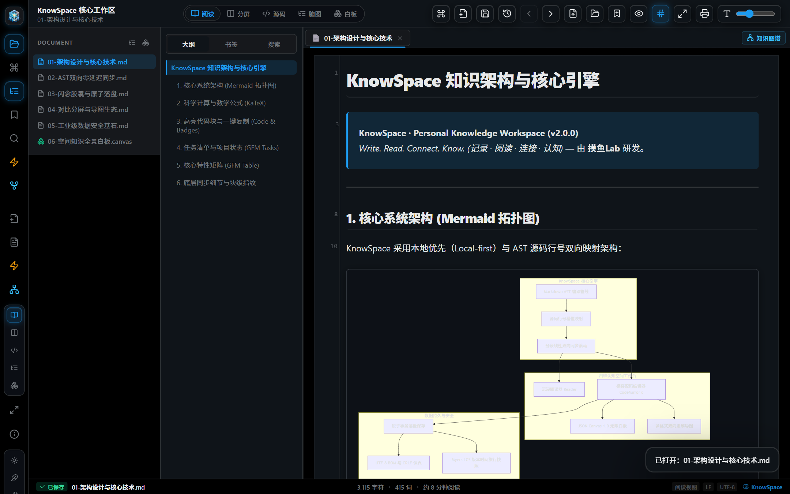

### 2.1 工作台核心功能分区详解
1. **左侧 Activity Bar 活动栏（68px 固定宽）**：
   - 顶部品牌专属 Logo 徽章。
   - 核心功能导航：📁 **文档目录树** (`Ctrl+\`)、⌨️ **全局命令中枢** (`Ctrl+K`)、📑 **文档大纲 (TOC)**、⭐ **精选书签** (`Ctrl+B`)、🔍 **全文搜索** (`Ctrl+F`)、⚡ **闪念时间线**、🔀 **反向链接与引用**。
   - 快捷动作：➕ **新建文档** (`Ctrl+N`)、📂 **打开目录** (`Ctrl+Shift+O`)、⚡ **呼出闪念胶囊**、🕸️ **知识网络全景图谱** (`Ctrl+G`)。
   - 底部控制区：四态视图微型切换器（阅读/分屏/源码/思维导图）、🖥️ 全屏模式切换 (`F11`)、ℹ️ 关于软件对话框、☀️/📖/✨ 三大专属主题直选按钮。
2. **导航与信息侧栏（160px ~ 520px 可调）**：展示当前激活的目录树、大纲、书签卡片、搜索面板、闪念时间线或双链。
3. **顶部多标签页协同栏（Multi-Tabs Bar）**：展示所有已打开文档，支持未保存呼吸灯指示、鼠标中键关闭、右键上下文菜单。
4. **顶部辅助工具栏（Toolbar）**：当前文档标题、四态视图胶囊切换（`阅读 / 分屏 / 源码 / 脑图`）、命令中枢按钮（`Ctrl+K`）、打印/导出 PDF 按钮（`Ctrl+P`）、保存/另存为、上一篇/下一篇、正文行号开关（`#`）、打字机模式开关（`Alt+T`）、阅读字号无级滑块（0.85× ~ 1.35×）。
5. **中央主工作区（Workspace）**：支持阅读模式、分屏协同、纯源码模式、双文档对比或交互式思维导图。
6. **底部实时状态栏（Status Bar Dock）**：实时保存状态徽章（绿色 `✔ 已保存` / 橙色 `● 未保存`）、文档总字符/词数/阅读时长、当前换行格式（`LF / CRLF`）、编码（`UTF-8`）。

### 【案例 2.1】新入职工程师快速载入大型文档库并定制个性化分栏布局
- **场景描述**：工程师小张拉取了团队包含 80 余篇系统设计的文档库，初次打开时希望将文件树与正文调整为最适合自己 2K 屏幕的比例。
- **操作步骤**：
  1. 按下快捷键 `Ctrl + Shift + O`，在弹出的原生目录选择框中定位至文档根目录 `D:\Projects\Docs`。
  2. 左侧目录栏瞬间递归加载出所有技术章节，首篇自动载入主屏。
  3. 将鼠标移至目录树与侧栏之间的分割线，光标变为双向调节箭头（`col-resize`）。
  4. 按住鼠标左键向右平移拖动至 280px 宽度；如果想要快速恢复最紧凑视宽，直接双击拖拽手柄即可一键自适应最佳宽度。
- **运行效果**：窗口布局数据自动由底层持久化缓存，下次启动或切换项目时自动继承，无需重复配置。

---

## 三、 三大专属全天候沉浸主题

KnowSpace 深度打磨了三款覆盖全天候、多场景的专属主题，点击左侧活动栏底部的三态切换按钮即可无缝轮播。

### 3.1 ☀️ 日光浅色主题 (Warm Light)
专为日间自然光阅读调优，采用柔白底色（`#ffffff` / `#f5f5f7`）与雅致暖橙黄高亮强调色（`#D97706` / `#F59E0B`），对比清晰温和，告别刺眼白底。

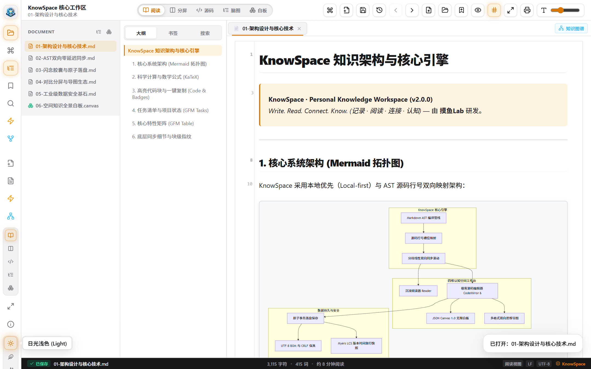

#### 【案例 3.1】白天明亮办公环境下编写产品规范与高亮批注
- **操作方式**：点击活动栏底部的 ☀️「日光浅色」图标。
- **实战效果**：在阳光充足的窗边工位，界面背景温润柔和，橙黄色的引用强调块和高亮文本极易聚焦，长时间打字审阅不产生视觉眩晕。

### 3.2 📖 仿电子墨水屏主题 (E-ink Paper)
模拟实体电子纸的温润质感，采用高对比度纯净黑白灰排版（`#f4f1ea` 纸白背景与 `#1a1a1a` 沉墨字色）、精致衬线字体、专属印刷风代码高亮以及 Mermaid 纯净灰度墨水矢量渲染。

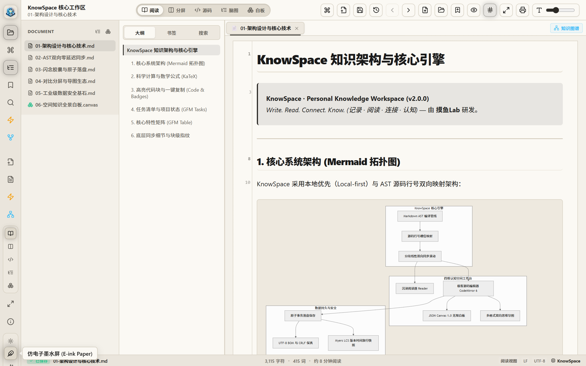

#### 【案例 3.2】长篇技术著作与学术文献的低疲劳护眼深度阅读
- **操作方式**：点击活动栏底部的 📖「仿电子墨水屏」图标。
- **实战效果**：正文文字与标题自动切换为宋体/西文衬线字体，所有图表与代码块去除了高饱和度色彩，化为细腻的灰度印刷网点质感。在连续 3 小时精读 5 万字系统架构白皮书后，眼部疲劳感大幅降低。

### 3.3 ✨ 极客暗黑主题 (Geek Dark)
采用 Lights Out 纯黑底色（`#000000`）、电光蓝高亮（`#1D9BF0`）与发丝级科技微边框（`#2F3336`）。在 OLED/Mini-LED 屏幕上拥有纯净深邃的黑位对比度。

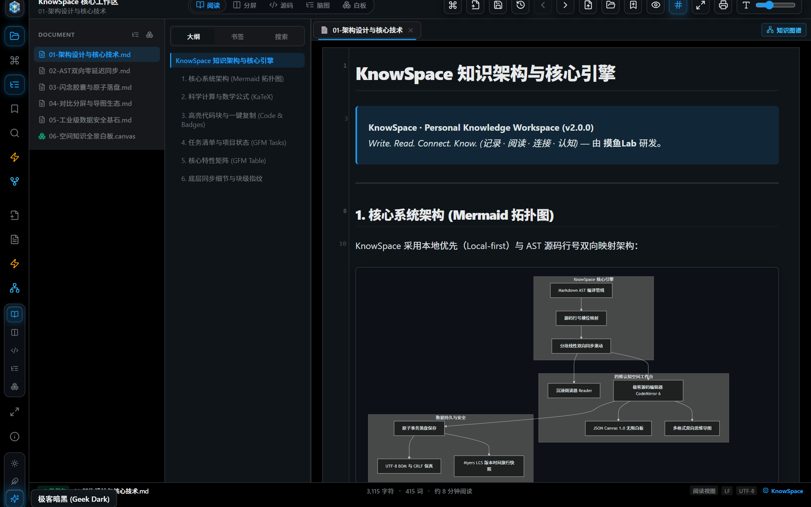

#### 【案例 3.3】夜间低光照环境专注编码与架构设计
- **操作方式**：点击活动栏底部的 ✨「极客暗黑」图标。
- **实战效果**：背景纯黑不发光，电光蓝色彩精准点亮代码关键字和高频操作元素，配合暗光环境营造极强的无打扰心流沉浸感。

---

## 四、 四段式工作区视图与极客编辑

顶部工具栏中心提供直观的胶囊四段式视图切换按钮：`阅读`、`分屏`、`源码`、`脑图`。

### 4.1 🪟 左右分屏协同模式 (Split Mode)
左侧为基于 CodeMirror 6 的现代代码编辑器，右侧为毫秒级防抖渲染预览。

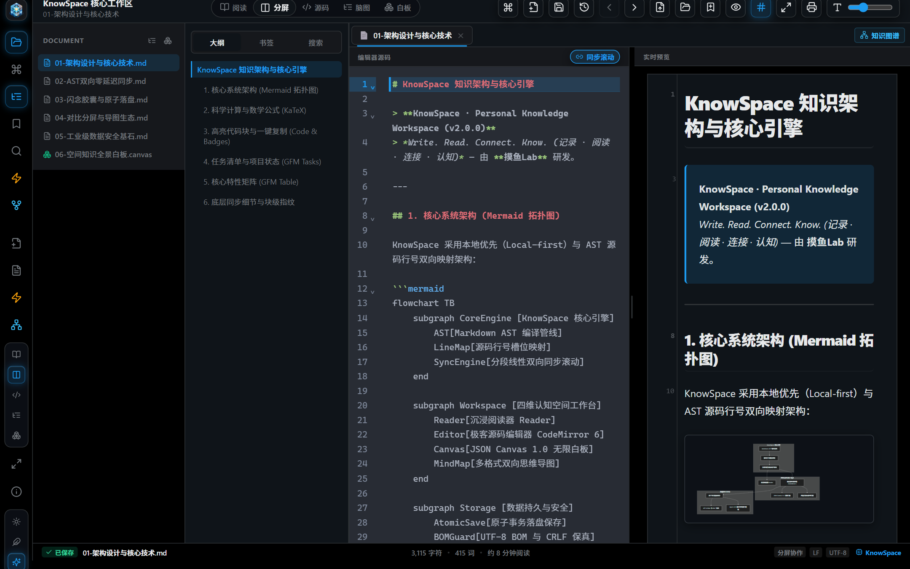

- **AST 行号双向高精度同步滚动**：基于 AST 块级源码行号标记（`data-source-line`）与分段线性插值算法，富文本与源码高度差异无论多大，滚动均严丝合缝、彻底告别偏移。
- **选区联动微光**：在预览区点击任意文段，自动聚焦对应源码行号。
- **分割线自由拖拽**：鼠标拖拽中部分割线自由调整编辑与预览比例（15% ~ 85%），在窄屏下自适应垂直分屏。

#### 【案例 4.1】基于 AST 块级映射分段线性双向同步滚动编写长篇教程
- **场景描述**：编写包含 10 个数学公式块、8 个架构图、大量文字和代码的超长 Markdown。
- **实操过程**：
  1. 选中分屏模式，滚动左侧源码；右侧预览区不论公式和图表占据多大垂直像素空间，均自动分段线性锚定。
  2. 当源码滚动至第 240 行的代码块时，右侧预览区该代码块精准出现在视窗同等比例位置，完全消除传统百分比滚动的“上下乱窜”漂移问题。
  3. 在预览区点击一段结论文字，左侧编辑器光标瞬间跳至该行，并激发柔和光晕反馈。

### 4.2 💻 纯源码极客模式 (Source Mode)
全屏呈现 CodeMirror 6 极客编辑器，适合专注编写大段内容或修改代码。

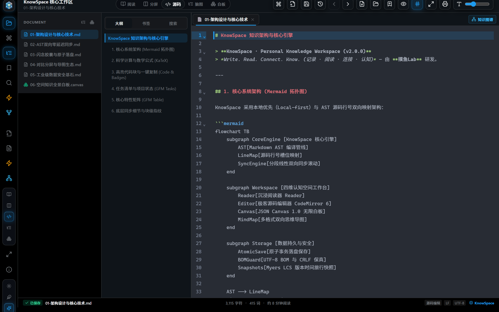

#### 【案例 4.2】批量重构 Front Matter 元数据与代码块精准折叠
- **场景描述**：对已有的知识库文章头部 YAML Front Matter 进行批量字段增补，或者快速折叠长达 200 行的 JSON 配置代码。
- **实操过程**：
  1. 点击顶部「源码」模式胶囊，全屏呈现 CodeMirror 6 现代代码环境。
  2. 利用编辑器左侧行号旁的折叠箭头（`▾`）瞬间折叠大段代码块或长列表。
  3. 享受毫秒级快速输入反馈，打字时光标绝对稳定，完全避免频繁重渲染引起的丢帧。

### 4.3 📖 纯净排版阅读模式 (Read Mode)
纯净无干扰的书籍沉浸式排版阅读界面，正文采用 960px 黄金阅读视宽。正文预览区左侧呈现等宽 AST 行号槽位，顶部工具栏提供 `#` 按钮一键显隐。

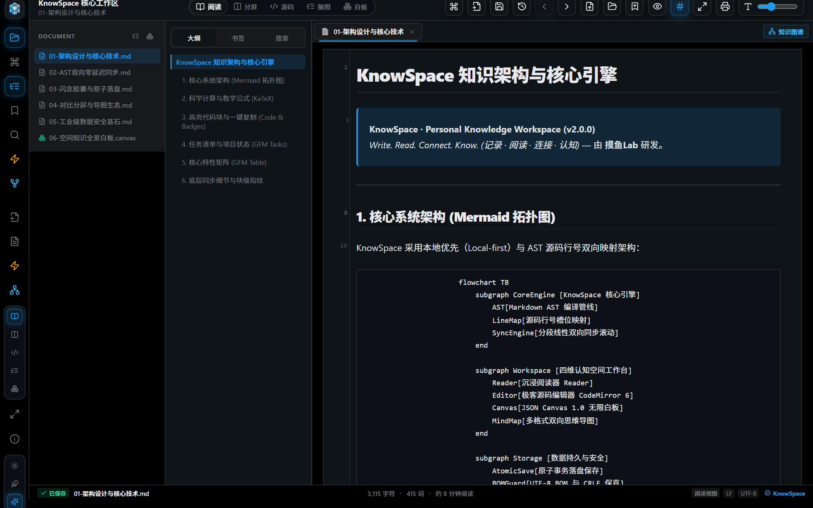

#### 【案例 4.3】利用正文等宽 AST 行号槽位进行同行文档代码审查
- **场景描述**：研发团队组织线下技术方案评审会，需要投影文档并指明具体段落与代码位置。
- **实操过程**：
  1. 切换至「阅读」模式，保证大屏幕展示版面极其美观且无代码编辑器的杂乱光标。
  2. 点击顶部工具栏的 `#` 按钮，开启正文 AST 行号槽位。
  3. 每个段落、公式块、图表、代码块左侧均清晰标明其实际源码行号（如 `L18`、`L42`）。评审人直接说“请看第 42 行架构图说明”，全场人员秒级对齐。

### 4.4 🧠 交互式思维导图模式 (Mindmap View / `Ctrl+M`)
在任何 Markdown 状态下，按下 `Ctrl + M` 或点击工具栏的 **「脑图」** 按钮，文档大纲瞬间升维为交互式思维导图：

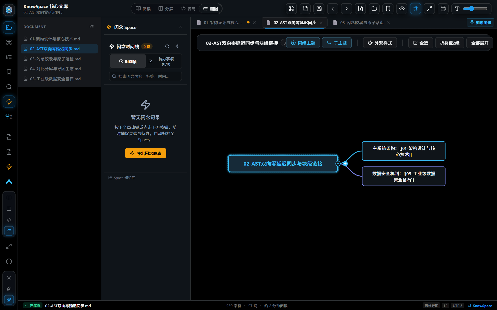

- **全键盘高能心流**：
  - `Tab` / `Insert`：在当前选中节点下**创建子主题**并进入编辑。
  - `Enter`：创建同级**兄弟主题**，灵感连绵不绝。
  - `Delete` / `Backspace`：删除选中分支（中心根节点防误删保护）。
  - `F2` / `Space` / 双击：就地呼出悬浮输入框修改文字，完美兼容中文输入法。
  - `↑ ↓ ← →`：在父子层级与同级兄弟分支之间流畅跳动导航。
  - `Ctrl + Z` / `Ctrl + Y`：完整的树结构历史快照堆栈，改动随心撤销重做。
- **双向无损序列化**：导图的任何修改即时双向同步回 Markdown 列表与标题（`# 中心主题`、`- 分支主题`），第三方编辑器兼容性 100%。

#### 【案例 4.4】Markdown 大纲一键转化为交互式思维导图与全键盘心流编辑
- **场景描述**：正在构思一个大型技术项目的模块规划，用层级列表难以梳理全局架构分支。
- **实操过程**：
  1. 按下快捷键 `Ctrl + M`，界面平滑切换为交互式思维导图模式，中央呈现带有彩色分支曲线的多叉树。
  2. 选中「核心架构设计」节点，敲击键盘 `Tab`，瞬间衍生出新的子分支并自动聚焦输入框。
  3. 键入 `分布式事务机制` 并敲击 `Enter`，即刻原地创建同级的第二个兄弟节点 `缓存一致性协议`。
  4. 滑动鼠标滚轮平滑缩放至 120%，拖拽空白区域漫游，全盘架构脉络一目了然。

### 4.5 🎨 思维导图节点与连线右键外观深度定制
在思维导图中任意节点（包括中心主题）上右键单击，秒级呼出半透明毛玻璃外观定制面板：

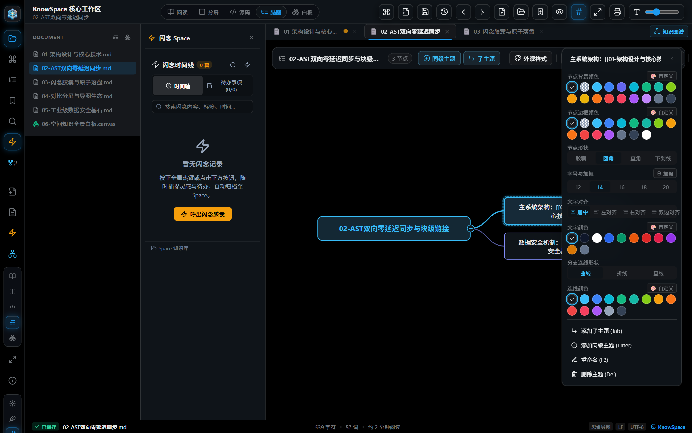

- **8 色节点色彩主题**：天蓝、翡翠绿、珊瑚橙、罗兰紫、玫瑰粉、琥珀黄、石墨灰等或跟随分支色。
- **4 种节点形状切换**：圆角胶囊 (`capsule`)、圆角矩形 (`rounded`)、纯直角矩形 (`rect`)、极简下划线 (`underline`)。
- **3 种分支连接线形态**：平滑贝塞尔曲线 (`bezier`)、90° 直角阶梯折线 (`step`)、笔直直线 (`straight`)。
- **标准行内注释持久化**：所有样式以标准 Markdown 注释保真保存（例如 `<!-- style: color=#10b981,shape=capsule,lineStyle=step -->`），零侵入、纯净透明。

#### 【案例 4.5】右键毛玻璃面板定制 8 色主题、4 种节点形状与 3 种连线形态
- **场景描述**：需要将思维导图中的重点核心模块以醒目色彩和不同形状标出，方便团队汇报。
- **实操步骤**：
  1. 鼠标右键点击需要强调的节点，毛玻璃样式定制面板在光标处秒速展开。
  2. 在「节点颜色」栏点击「珊瑚橙」，该节点边框与文字立即变为醒目的亮橙色。
  3. 在「节点形状」中选择「胶囊」，形状立即变为优雅圆润的药丸形态。
  4. 在「分支连线形状」中选择「折线」，该分支下的所有连线由平滑曲线转换为严谨的 90 度直角折线。
  5. 样式即时生效并写入 Markdown 注释，Git 协作中团队其他成员打开时完美呈现。

### 4.6 🔄 思维导图拖拽重构 (Reparenting) 与导图内即时搜索
- **拖拽重归属 (Reparenting)**：按住任意节点拖动至目标节点上，出现绿色高亮吸附框，松手即可瞬间将该节点及其所有子分支移挂为目标节点的子树！
- **导图内即时搜索 (`Ctrl+F`)**：导图顶栏提供即时搜索框，键入文字实时高亮匹配节点，支持 `▲ / ▼` 上下一个快速跳转。

#### 【案例 4.6】鼠标拖拽节点跨分支重构归属与 `Ctrl+F` 节点快速高亮定位
- **场景描述**：梳理产品功能时，发现原本归在「前端交互」下的「网络重试机制」应该挪到「底层协议」模块下。
- **实操步骤**：
  1. 在思维导图中选中「网络重试机制」节点，按住鼠标左键不放。
  2. 拖拽到「底层协议」节点上方，目标节点亮起天蓝色吸附边缘提示。
  3. 松开鼠标左键，整棵子树瞬间完成重新挂载，连线自动平滑重绘。
  4. 按下 `Ctrl + F` 键入“重试”，搜索结果高亮定位至该节点，视口自动微调居中。

### 4.7 📤 思维导图多格式生态导出 (PNG / OPML / FreeMind / Markdown)
点击导图顶栏右侧的 **「导出导图 ▾」** 按钮，展开多生态专业导出面板：

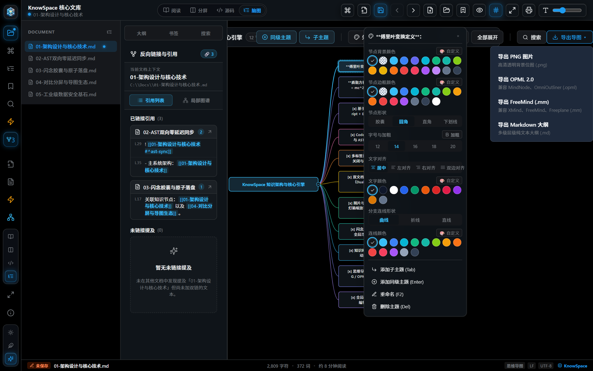

思维导图不仅能在 KnowSpace 内部完成快速头脑风暴与结构化构思，还能一键导出为行业通用大纲协议与工业级脑图文件，与外部工具链（XMind、MindNode、Freeplane、OmniOutliner 等）实现 100% 格式无缝流转：

- **📷 高清 PNG 图片 (`.png`)**：
  - 基于 Canvas 2× 视网膜级超采样抗锯齿渲染。
  - 自动遍历整棵思维导图树，精准计算所有节点、胶囊边框、文字、行内标签及贝塞尔/折线连接线的真实外接矩形（Bounding Box），留出美观的留白边距，绝不发生边缘视口截断。
  - 导出默认采用透明背景（Alpha 通道），极度适合直接拖入 Keynote、PowerPoint 演示胶片、Notion 文档或技术团队周报汇报中。
- **📑 OPML 2.0 通用大纲交换格式 (`.opml`)**：
  - 采用开放信息处理大纲交换格式（Outline Processor Markup Language 2.0）工业标准。
  - 生成标准 XML 结构，包含完整的 `<head>` 元数据（标题、编码、生成时间）与递归嵌套的 `<outline text="..." _note="...">` 节点体系。
  - **第三方兼容生态**：完美导入 **MindNode**、**OmniOutliner**、**Logseq**、**XMind**、**Dynalist** 与各种主流 RSS/大纲阅读器，100% 保持父子层级与大纲树状拓扑。
- **🧠 FreeMind 1.0.1 工业级脑图标准 (`.mm`)**：
  - 严格遵循 FreeMind 1.0.1 DTD 格式标准构建 `<map version="1.0.1"><node TEXT="..." COLOR="...">` 树状节点。
  - 自动保留并映射当前思维导图节点定制的 8 色调和色彩属性（如珊瑚橙、翡翠绿、天蓝色），生成标准十六进制色值注入 XML 属性中。
  - **第三方兼容生态**：可被 **XMind**（全版本）、**Freeplane**、**FreeMind**、**MindManager** 原生双击打开，节点层级、文本、分支折叠与颜色样式 1:1 精准还原。
- **📝 Markdown 分级列表大纲 (`.md`)**：
  - 将当前导图的多叉树结构无损序列化为规范缩进的 Markdown 无序列表（`- 节点文本`），并保真保留行内样式注释元数据（如 `<!-- style: ... -->`）。
  - 适合用于将脑图结构快速沉淀为文档提纲、复制到微信/飞书/企微讨论组，或喂给大语言模型（LLM）进行下一步的方案扩写。

#### 【案例 4.7】一键导出 OPML 2.0 与 FreeMind 格式无缝流转至专业脑图工具
- **场景描述**：在 KnowSpace 中利用键盘心流快速完成了新一代系统架构的设计大纲，需要导出为专业脑图交付给产品团队和项目经理，在 XMind 中补充详细的甘特图排期和人员分配。
- **实操步骤**：
  1. 在思维导图视图中，点击顶部工具栏右侧的 **「导出导图 ▾」** 下拉按钮。
  2. 在下拉菜单中点击 **「导出 FreeMind (.mm)」** 或 **「导出 OPML 2.0」**。
  3. 系统底层秒级执行树形遍历与 XML 序列化，调用本地保存接口生成对应文件（例如 `01-架构设计.mm`）。
  4. 打开 XMind，选择「文件」->「导入」->「FreeMind」，或直接双击 `.mm` 文件。
  5. 架构的所有核心主题、子分支层级与节点色彩高保真呈现，团队成员无需重新手动录入即可继续细化。

#### 【案例 4.8】导出透明底高清 PNG 与 Markdown 结构化大纲
- **场景描述**：即将进行技术方案答辩，需要将思维导图以高清透明插图插入汇报 PPT 幻灯片，并把大纲文本发至群聊同步。
- **实操步骤**：
  1. 点击「导出导图 ▾」菜单，选择 **「导出高清图片 (.png)」**。
  2. 系统自动生成一张去除多余空白、保留节点真实高宽且背景完全透明的高清 PNG 位图并自动下载落盘。
  3. 直接将该 PNG 拖入暗色或浅色主题的 PPT 页面，导图自然融入背景，文字矢量清晰、连接线光滑锐利。
  4. 再次点击「导出导图 ▾」，选择 **「导出 Markdown 大纲 (.md)」**，获得标准缩进大纲文件，随心粘贴分发。

---

## 五、 编辑器极客生产力工具体系

### 5.1 ⚡ 斜杠指令浮动快捷菜单 (`/`)
在编辑器新行或空格后键入 `/` 字符，光标旁立即浮现交互式快捷插入指令面板：

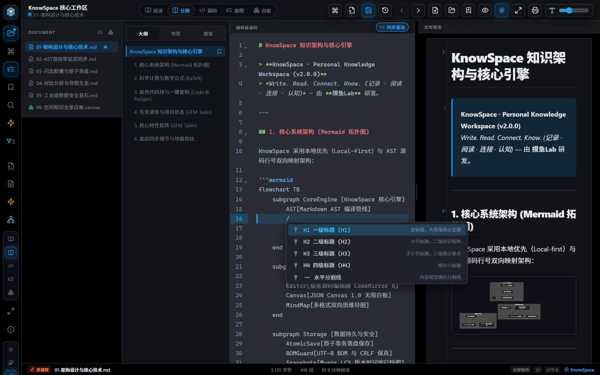

- **分类与支持指令**：
  - **排版与标题**：一级标题 (H1)、二级标题 (H2)、三级标题 (H3)、水平分割线 (`---`)、引用块 (`> `)
  - **列表与任务**：待办清单 (`- [ ] `)、无序列表 (`- `)、有序列表 (`1. `)
  - **代码与结构**：代码围栏 (` ```typescript `)、标准表格 (3×3 自动对齐表格)
  - **图表与公式**：LaTeX 数学公式块 (`\[ ... \]`)、行内公式、Mermaid 流程图、Mermaid 时序图、Mermaid 思维导图
  - **高级卡片**：提示卡片 (`> [!NOTE]`)、技巧卡片 (`> [!TIP]`)、警告卡片 (`> [!WARNING]`)、关键卡片 (`> [!IMPORTANT]`)、折叠手风琴面板 (`<details>`)
  - **知识连接**：双向链接 (`[[文档]]`)、段落块级锚点 (`^block-id`)、插入当前时间戳

#### 【案例 5.1】键入 `/` 瞬间插入 GFM 表格、Callout 提示卡片与 Mermaid 架构图
- **场景描述**：编写接口文档时需要频繁插入测试表格和警告说明，手动敲 Markdown 符号较为繁琐。
- **实操步骤**：
  1. 光标在新起一行键入 `/`，弹出斜杠指令面板。
  2. 键入字母 `bg`（表格首字母缩写）或 `tab`，首选项即刻过滤出「标准表格 (3×3)」。
  3. 敲击 `Enter`，标准对齐的 Markdown 表格骨架瞬间就地插入，光标自动停在第一个单元格。
  4. 再次换行键入 `/warn`，回车一键插入优雅的黄色警告卡片 `> [!WARNING]`，写作效率提升数倍。

### 5.2 🖱️ 上下文智能感知编辑器右键菜单
在 CodeMirror 6 编辑器内任意位置右键，或选中一段文字后右键，展开功能齐备的智能右键菜单：

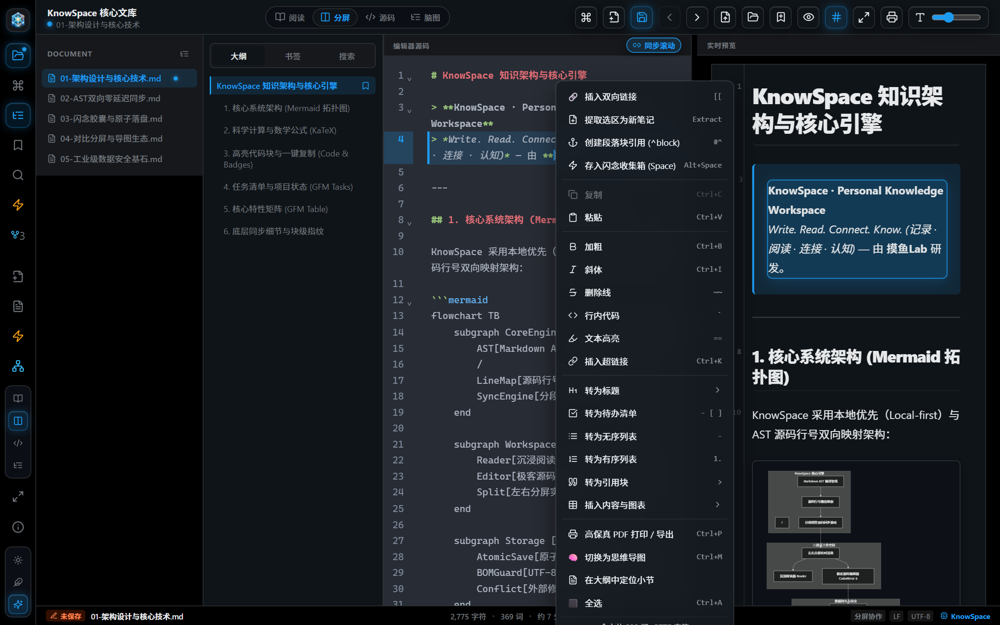

- **剪切、复制与粘贴**：保留原生剪贴板快捷键映射。
- **富文本就地格式化**：加粗 (`Ctrl+B`)、斜体 (`Ctrl+I`)、删除线 (`~~`)、行内代码 (`` ` ``)、高亮标记 (`==`)、插入超链接。
- **语法结构转换**：一键将选中行转换为标题 (H1~H3)、待办清单 (`- [ ]`)、无序列表、有序列表、引用块。
- **知识网与沉淀连接**：
  - **插入双向链接 (`[[`)**：为选中文字直接包裹 `[[` 建立双链。
  - **提取选区为新笔记 (Extract)**：将选中的长篇内容一键切分生成新文档，并在原处留下双链卡片！
  - **创建段落块引用 (`^block`)**：自动为当前段落生成专属微米级指纹锚点。
  - **存入闪念收集箱 (Space)**：将选中灵感文本一秒存入本地 `Inbox/` 闪念流中。
- **快速工具与导出**：高保真 PDF 打印/导出 (`Ctrl+P`)、切换为思维导图 (`Ctrl+M`)、在大纲中定位小节。

#### 【案例 5.2】选区一键提取为新独立笔记、设为双链或存入闪念收集箱
- **场景描述**：正在写一篇系统架构总览，发现其中“鉴权协议设计”小节篇幅很长，适合独立拆分出一篇专门的技术文档。
- **实操步骤**：
  1. 鼠标拖拽选中该小节的 200 字内容。
  2. 鼠标右键单击，在弹出的上下文菜单中选择 **「提取选区为新笔记」**。
  3. 系统自动以首行标题创建新文件并完成落盘，同时在当前主文档的原处自动替换为 `[[鉴权协议设计]]` 双链。
  4. 模块解耦与知识网络构建一气呵成。

### 5.3 🖨️ 高保真矢量 PDF 打印与导出 (`Ctrl+P`)
点击顶部工具栏的 🖨️ 打印图标，或按下快捷键 `Ctrl + P`：

- **矢量字形与公式保真**：KaTeX 数学公式以高清矢量排版渲染，绝非模糊截图放大。
- **图表矢量色彩渲染**：Mermaid 流程图、时序图自动保持当前高对比度矢量色彩输出。
- **智能分页断点规避**：自动注入 `@media print` 样式，在代码块、图表、公式块内部施加 `page-break-inside: avoid`，彻底避免图表从中间被硬生生切开跨页的尴尬情况。

#### 【案例 5.3】一键导出含完整 KaTeX 矢量公式与 Mermaid 架构图的标准 A4 PDF
- **场景描述**：技术立项答辩需要向领导提交纸质打印件或离线 PDF 报告。
- **实操步骤**：
  1. 按下快捷键 `Ctrl + P`，系统调起高保真打印预览对话框。
  2. 目标选择“另存为 PDF”，纸张尺寸选为“A4”。
  3. 点击“保存”，一份排版严谨、具备矢量清晰度且公式图表无断裂的精美商业级技术文档立即生成。

### 5.4 ⌨️ 全局快捷键穿透与全键盘极速流 (Keybinding Penetration)
为保障硬核极客与高强度写作者手不离键盘的心流创作体验，KnowSpace 在底层打通了 CodeMirror 6 编辑器内部与全局核心调度之间的事件穿透链路：

- **免失焦穿透触发**：在编辑器中输入正文或选中文字时，**无需**使用鼠标点击编辑器外部或使焦点移出，可直接敲击全局快捷键：
  - `Ctrl + K`：穿透呼出全局命令中枢与快速切换器。
  - `Ctrl + G`：瞬间展开知识网络全景拓扑图谱。
  - `Ctrl + M`：毫秒级在 Markdown 读写工作区与交互式思维导图之间无缝切换。
  - `Ctrl + \`：一键折叠或展开左侧文件目录树，最大化写作视宽。
  - `Ctrl + P`：快速呼出高保真矢量 PDF 打印预览对话框。
- **上下文智能拦截与让渡**：对于编辑器原生常用快捷键（如 `Ctrl + F` 查找、`Ctrl + Z` 撤销、`Ctrl + Y` 重做、`Ctrl + B` 加粗、`Ctrl + I` 斜体），系统优先保留给编辑器处理；在思维导图或图谱视图下，`Ctrl + F` 则智能让渡给导图/图谱内部的节点检索器，实现浑然天成的多场景人机工效学统一。

#### 【案例 5.4】编辑器打字过程中零延迟按键穿透呼出命令中枢、导图与图谱
- **场景描述**：工程师在纯源码模式下高速键入技术规范，突然需要查阅另一份关联文档、或者切换到思维导图查看分支。
- **实操体验**：
  1. 打字中途无需伸手摸鼠标，直接敲击 `Ctrl + K`，光标瞬间定位至屏幕正中央的命令输入框。
  2. 输入文档首字母命中目标并敲击 `Enter` 完成跳转。
  3. 想要总览全局网络，直接键入 `Ctrl + G`，全景拓扑图平滑展开；浏览完毕按 `Esc` 或再按 `Ctrl + G` 即可一秒回到编辑状态，光标精准停留在原先打字的位置，创作心流从不中断。

---

## 六、 全局命令中枢 (Command Palette / `Ctrl+K`)

KnowSpace 内置现代化全局命令中枢与快速切换器（Command Palette & Quick Switcher）。按下快捷键 `Ctrl + K`（或在主界面按 `Ctrl + P`，或点击活动栏顶部的 ⚡ 命令图标），即可在屏幕视口中央展开全键盘调度面板：

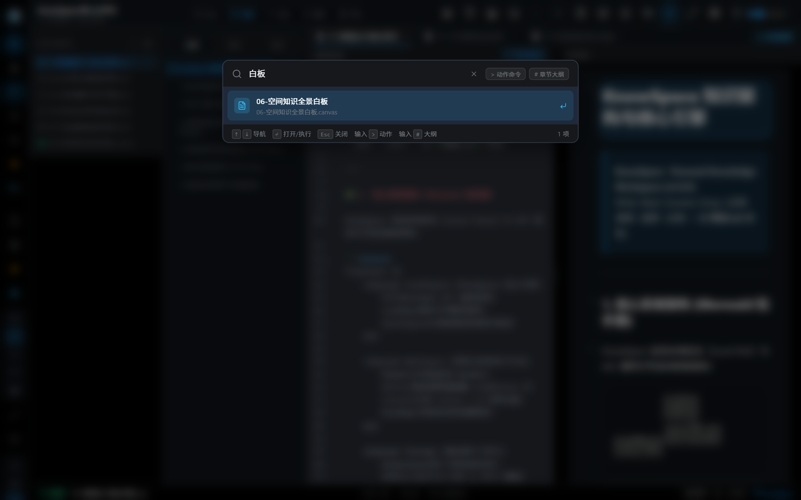

### 6.1 命令中枢三模调度架构与指令语法
命令中枢采用三模自适应状态机设计，集“文档跳转”、“动作执行”、“小节大纲穿梭”于一体：

#### 1. 默认模式：全库极速切换器 (Quick Switcher) & MRU 访问历史
- **空状态呈现最近访问 (MRU)**：在尚未输入任何文字时，输入框下方自动呈现用户最近访问过的文档历史清单，带有醒目的 `⏱️ 最近` 标签；当前正在编辑查看的文件会自动打上绿色 `📌 当前` 徽标并排在顶端。
- **拼音首字母与模糊匹配**：
  - 支持中文字符全拼、拼音首字母简拼（如键入 `jg` 即可瞬间匹配《01-架构设计与核心技术》）。
  - 支持空格多词联合过滤与非连续字母模糊匹配。
  - 搜索命中结果中的关键词会给予高亮提示。
- **目录上下文展示**：每个文档右侧清晰标注其所属的父级目录路径（如 `docs/architecture/`），即使库中存在多个同名的 `index.md` 或 `README.md` 也绝不混淆。

#### 2. `>` 动作命令模式：全系统功能键盘盲打调度 (Action Mode)
- **前缀语法**：输入 `>` 字符（例如 `> 主题` 或 `>`），面板立即变身为系统命令执行器。
- **系统支持动作清单**：
  - **主题与视觉**：
    - `切换为日光浅色主题`
    - `切换为仿电子墨水屏护眼主题`
    - `切换为极客暗黑主题`
  - **视图与排版**：
    - `切换为双栏分屏协同模式`
    - `切换为纯源码模式`
    - `切换为沉浸阅读模式`
    - `打开交互式思维导图 (Ctrl+M)`
    - `打开知识网络全景图谱 (Ctrl+G)`
  - **极客生产力辅助**：
    - `开启/关闭打字机垂直居中滚动 (Alt+T)`
    - `开启/关闭专注极简模式 (F10)`
    - `折叠/展开左侧文件目录树 (Ctrl+\)`
    - `导出高保真矢量 PDF 打印文件 (Ctrl+P)`
    - `导出思维导图 (PNG / OPML / FreeMind / Markdown)`
  - **文档生命周期**：
    - `新建 Markdown 文档 (Ctrl+N)`
    - `保存当前活动文档 (Ctrl+S)`
- **快捷键实时提示**：每个命令条目右侧带有对应的全局原生物理快捷键徽章（如 `Ctrl+P`、`Alt+T`），让用户在搜索动作的过程中顺便习得快捷键。

#### 3. `#` 标题大纲导航模式：当前文档章节直达 (Outline Mode)
- **前缀语法**：输入 `#` 字符（例如 `# 存储` 或 `#`），命令中枢秒速就地解析当前活动文档的全部标题大纲。
- **层级视觉指示**：列表中每项大纲清晰标出层级徽标（`H1`、`H2`、`H3`、`H4`、`H5`、`H6`）以及该标题在正文中的物理源码行号（如 `L120`）。
- **即时平滑滚动**：选中目标章节并敲击回车，命令面板即刻退隐，正文预览区和源码编辑器自动执行平滑滚动，视口精准对齐该标题并施加短暂高光提示。

### 6.2 全键盘心流操作与焦点智能恢复
- **键盘导航映射**：
  - `↑` / `↓`（或 `Ctrl + P` / `Ctrl + N`）：在命中候选项之间流畅切换高亮光标。
  - `Enter`：执行选中命令、打开目标文件或定位大纲小节。
  - `Esc`：秒级关闭命令中枢。
- **焦点记忆与智能恢复**：用户从 CodeMirror 编辑器的某一特定行触发 `Ctrl + K`，无论在命令面板中浏览了多少条目，按下 `Esc` 取消后，光标焦点都会毫秒级恢复至原先所在的代码行与列，输入法状态丝毫不受干扰。

#### 【案例 6.1】利用 MRU 访问历史与拼音首字母在十万字文库中秒级跳跃
- **场景描述**：一个包含 200 余篇笔记的大型知识库中，工程师频繁在《01-架构设计》、《05-存储引擎规范》和《API-接口定义》三篇文档之间交叉参考。
- **实操过程**：
  1. 在任何界面敲击 `Ctrl + K`。
  2. 面板初次展开，无需键入任何字符，最近访问的 3 篇核心文档已依时间倒序排在首位。按一次键盘 `↓`，回车即可瞬间切至《05-存储引擎规范》。
  3. 再次按 `Ctrl + K`，键入简拼 `api`，目标文件在第一位精准命中，敲击 `Enter` 完成秒级跳转。
  4. 耗时不到 1 秒，彻底摆脱在臃肿目录树中逐层翻找文件夹的低效。

#### 【案例 6.2】使用 > 动作命令模式全键盘调度主题与排版模式
- **场景描述**：夜间工作时光线暗下来，需要将软件切换为极客暗黑主题，并开启打字机居中模式专注码字。
- **实操过程**：
  1. 敲击 `Ctrl + K` 唤出面板，键入 `> 暗黑`。
  2. 命中「切换为极客暗黑主题」，按 `Enter` 执行，整套界面瞬间平滑过渡为柔和深空黑配色。
  3. 再次按下 `Ctrl + K` 键入 `> 打字机`，回车即刻开启打字机垂直居中锁定。双手始终置于键盘主键区，体验极佳。

#### 【案例 6.3】使用 # 标题大纲模式在长篇技术白皮书中微秒级锚定小节
- **场景描述**：正在阅读一份长达 15,000 字的系统重构技术白皮书，急需定位到其中关于“断电安全与物理 fsync”小节。
- **实操过程**：
  1. 按下 `Ctrl + K`，键入 `# 物理`。
  2. 候选列表精准呈现：`H3 14.1 物理事务原子落盘与断电安全 (L712)`。
  3. 敲击 `Enter`，面板关闭，正文如丝般平滑滚动至第 712 行目标小节，段落自动高亮显示。

---

## 七、 多标签页协同与双文档分屏对比

顶部流线型标签页栏支持跨多个章节与独立文档并行查阅与修改。

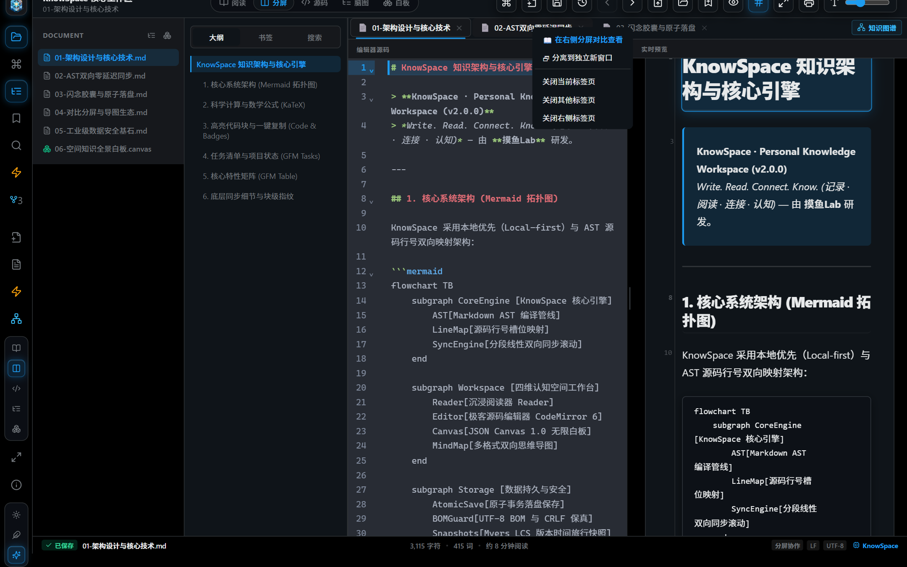

### 7.1 多标签页并行管理与窗口脱离
- **呼吸灯提示**：文件处于修改未保存状态时，标签右侧自动闪烁橙黄色呼吸微灯（`isDirty`）。
- **极速关闭**：鼠标滚轮中键直接单击标签，或按 `Ctrl+W` 极速关闭。
- **右键菜单**：
  - 📖 **在右侧分屏对比查看**：开启双文档对照模式。
  - 🗗 **分离到独立新窗口**：脱离为主窗口之外的独立 Electron 窗口。
  - **关闭其他标签页 / 关闭右侧标签页**。

#### 【案例 7.1】跨章节协同编辑、鼠标中键秒关与独立新窗口多屏办公
- **实操流程**：
  1. 同时打开开发指南的 5 个章节。
  2. 右键点击 `03-网络协议.md` 标签，选择 **「🗗 分离到独立新窗口」**。
  3. 该文档瞬间脱离为主窗口之外的独立窗口，可拖拽至副显示器上常驻参考，且两边拥有完全独立的滚动位置与落盘能力。
  4. 查阅完毕的辅助参考标签，用鼠标滚轮中键直接轻轻点击标签标题即可秒速关闭。

### 7.2 🗗 双文档左右分屏对比查看模式 (Dual Document Split View)

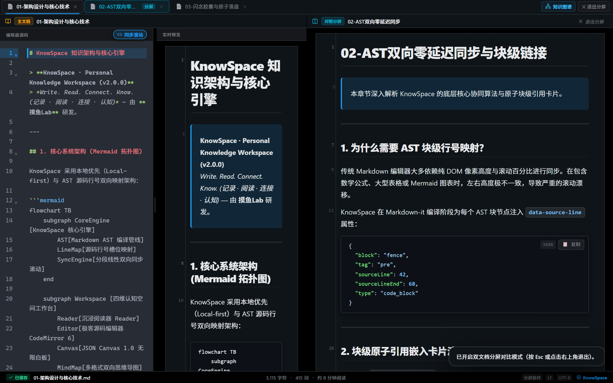

#### 【案例 7.2】API 接口文档新旧版本逐行对照校对与无级拖拽分栏
- **场景描述**：升级系统时需要核对 `UserAPI-v1.md` 与 `UserAPI-v2.md` 的参数增减与向下兼容性。
- **实操步骤**：
  1. 在标签栏处于打开状态的 `UserAPI-v2.md` 标签上右键点击。
  2. 选择 **「📖 在右侧分屏对比查看」**。
  3. 软件瞬间进入沉浸全宽对比状态，左侧标明 `主文档`，右侧标明 `对照分屏`。
  4. 鼠标拖住中央分栏手柄，随意微调左右比例（如 40%:60%）。
  5. 左右两栏均具备独立的滚动控制器与渲染能力，轻松逐行校对核心参数。
  6. 校对结束，按下键盘 `Esc` 键或点击右上角 **「✕ 退出分屏」**，一秒还原单工作台。

---

## 八、 科学计算、动态图表与富文本增强排版

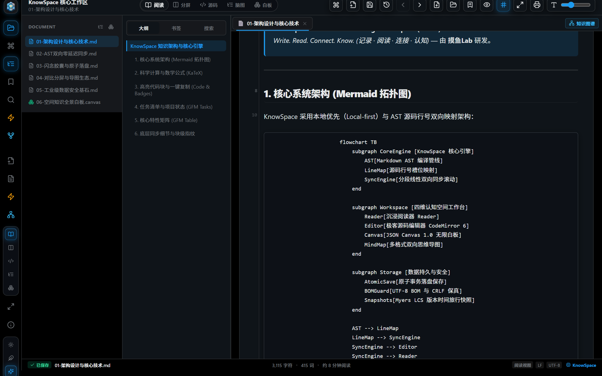

### 8.1 LaTeX / KaTeX 高性能数学公式排版
- **行内公式**：使用单个 `$` 包裹，例如 `$E = mc^2$`。
- **独立居中公式块**：使用双 `$$` 包裹：
  ```markdown
  $$ \hat{f}(\xi) = \int_{-\infty}^{\infty} f(x) e^{-2\pi i x \xi} dx $$
  ```

#### 【案例 8.1】撰写微积分推导、傅里叶变换与量子力学方程
- **代码输入**：
  ```markdown
  ### 量子薛定谔方程
  $$ i\hbar \frac{\partial}{\partial t}\Psi(\mathbf{r},t) = \left[ -\frac{\hbar^2}{2m}\nabla^2 + V(\mathbf{r},t)\right] \Psi(\mathbf{r},t) $$
  ```
- **效果呈现**：无需等待或加载外网 CDN，本地 KaTeX 引擎瞬间以高解析度矢量字形排版输出，放大缩小绝不模糊。

### 8.2 Mermaid 动态多类型图表渲染
原生内置 Mermaid 渲染引擎，支持流程图、时序图、类图、甘特图等：

````markdown
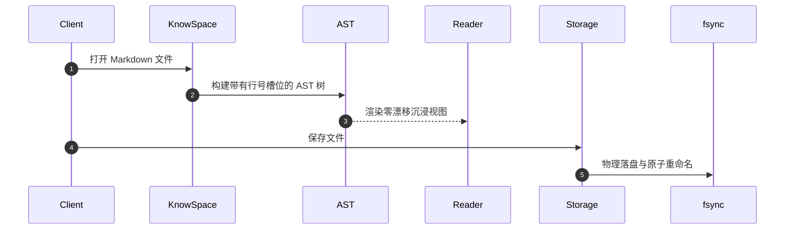
```mermaid
sequenceDiagram
    autonumber
    Client->>KnowSpace: 打开 Markdown 文件
    KnowSpace->>AST: 构建带有行号槽位的 AST 树
    AST-->>Reader: 渲染零漂移沉浸视图
    Client->>Storage: 保存文件
    Storage->>fsync: 物理落盘与原子重命名
```
````

#### 【案例 8.2】绘制分布式系统服务拓扑图与微服务调用时序图
- **效果呈现**：代码块直接转化为交互式拓扑图表，且自动与当前所选主题（日光浅色/电子墨水屏/极客暗黑）配色深度融合。

### 8.3 语法高亮代码块与一键无损复制
代码块右上角自动呈现大写语言识别胶囊（如 `TYPESCRIPT`、`PYTHON`），右侧配有复制按钮。

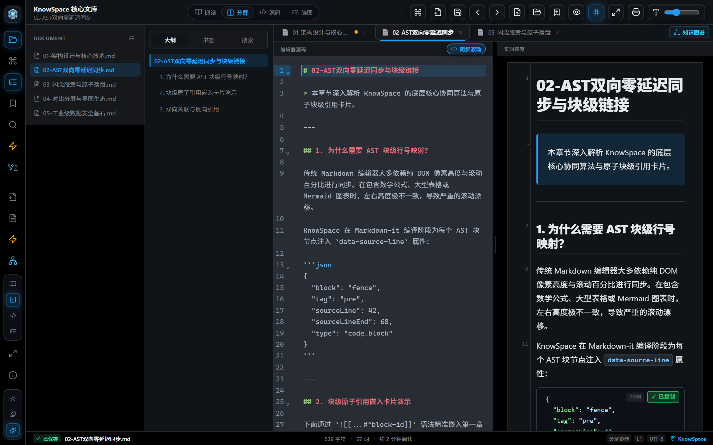

#### 【案例 8.3】查看语法胶囊、一键复制并接收绿色 `✓ 已复制` 动效反馈
- **实操效果**：点击代码块右上角的 **「📋 复制」** 按钮，代码无损写入系统剪切板，按钮随即变为绿色的 **「✓ 已复制」** 并维持 2 秒，给予明确的物理触觉式视觉反馈。

### 8.4 GFM 任务清单与高对比度表格交互
#### 【案例 8.4】构建项目敏捷冲刺任务看板与性能指标对比表
- **输入示例**：
  ```markdown
  - [x] 完成 React 19 升级
  - [ ] 性能优化测试
  
  | 特性 | 传统编辑器 | KnowSpace 工作台 |
  | :--- | :--- | :--- |
  | **落盘机制** | 简单写覆易损坏 | 原子事务 + fsync 刷盘 |
  ```
- **交互体验**：复选框原生可点，表格自适应视宽并带有斑马条纹与高对比度边框。

---

## 九、 知识网络双向链接、块级互联与全景拓扑图谱

### 9.1 双向链接 `[[WikiLink]]` 与已链引用
通过 `[[文档标题]]` 或 `[[文档标题|显示别名]]` 即可建立文档间的强关联。在编辑器中键入 `[[` 自动弹出全库标题智能联想卡片。

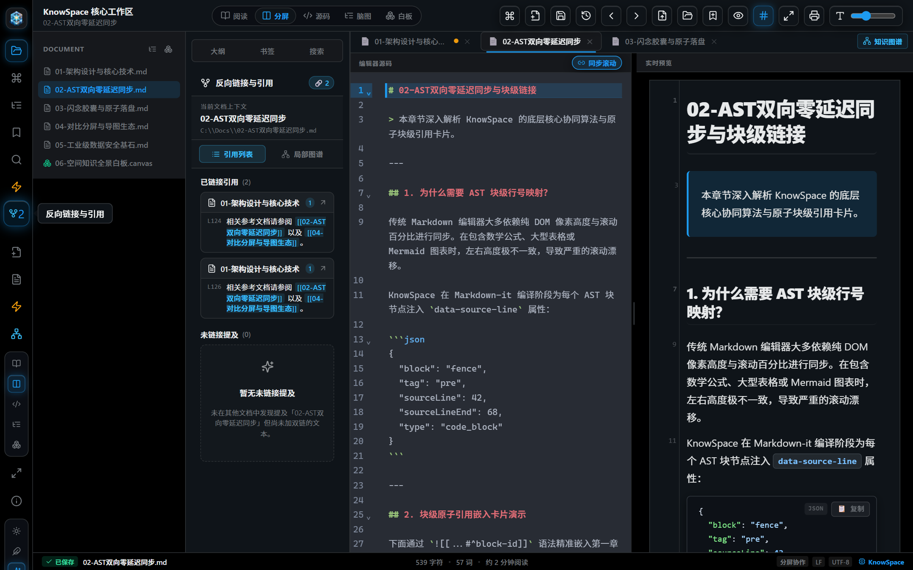

#### 【案例 9.1】利用反向链接面板自动聚合各章节上下文并精准溯源
- **场景描述**：在阅读《01-架构设计与核心技术》时，想知道知识库中哪些其他文章引用了本篇。
- **实操过程**：
  1. 点击活动栏的 🔀「反向链接与引用」图标。
  2. 侧栏自动展示已链引用卡片，清楚标明引用来源《02-AST双向零延迟同步》的第 5 行以及上下文文本。
  3. 点击卡片上的跳转图标，工作台瞬间平滑切换至引用源文件并高亮所在段落。

### 9.2 ⚓ 块级原子互联与内联嵌入 (`^block-id`, `[[#^block]]`, `![[#^block]]`)
KnowSpace 支持精确到段落和代码块的原子级双向互联：

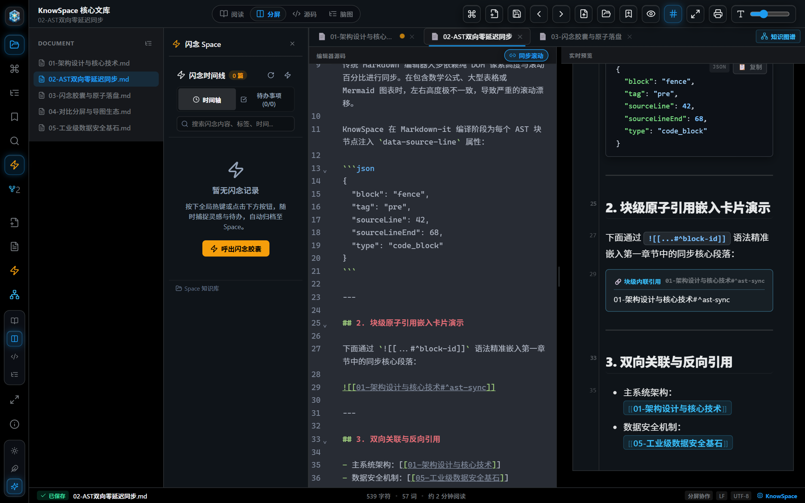

- **块指纹标记 (`^block-id`)**：在段落、列表项末尾添加 `^my-anchor`，系统自动将其渲染为精致的块锚点小徽章 `^ my-anchor`，点击该徽章一键复制其专属块引用路径。
- **块引用跳转 (`[[doc#^block-id]]`)**：精准跨文档跨章节跳转定位至目标段落，正文触发 1.8 秒发光波纹。
- **块级卡片内联嵌入 (`![[doc#^block-id]]`)**：在正文中无需跳转，直接以内联卡片形式完整投影呈现目标块内容，附带来源文档跳转角标。
- **输入智能感知 (`#^`)**：在编辑器中键入 `#^` 时，CodeMirror 自动展开当前文档所有块锚点的自动补全。

#### 【案例 9.2】跨文档段落精准微米级跳转与卡片内嵌式复用
- **场景描述**：在编写项目白皮书第 8 章时，需要引用第 1 章中关于「原子事务落盘」的权威定义，且希望读者无需反复翻页就能就地查阅。
- **实操步骤**：
  1. 在第 1 章该段落末尾键入 `^atomic-storage`。
  2. 在第 8 章正文中键入 `![[01-架构设计与核心技术#^atomic-storage]]`。
  3. 右侧预览区立即优雅渲染出一个带淡蓝边框和来源标记的「块级内联引用」卡片，核心内容就地展示，原汁原味且保持同步更新。

### 9.3 未链接提及智能扫描与一键升级双链
系统后台自动扫描全库文本，发现文章内容中出现过当前文档标题、但尚未添加 `[[...]]` 的“潜在关联”。

#### 【案例 9.3】一键将散落文本转化为正式双链节点
- **实操过程**：
  1. 在反向链接面板下方的「未链接提及」分类中，看到《03-闪念胶囊与原子落盘》在正文中提到了当前文档名称。
  2. 直接点击该卡片右侧的 **「+ 设为双链」** 按钮。
  3. KnowSpace 自动在底层对该文件的原文本完成替换包裹，未链接提及瞬间跃升为已链接引用，构建知识网络不费吹灰之力。

### 9.4 知识图谱关联深度过滤 (1-Hop / 2-Hop) 与社区聚类分析
点击左侧活动栏的 🕸️「知识网络全景图谱」按钮或按下快捷键 `Ctrl + G`，KnowSpace 将以 60FPS 硬件加速展开整座个人数字脑图宇宙：

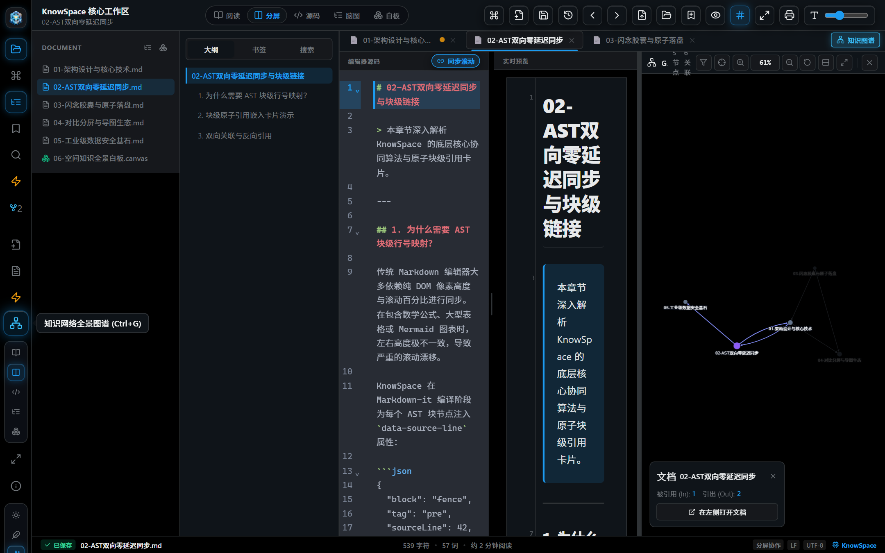

随着笔记体量的增长，无限制的全库拓扑往往会演变成密密麻麻的“毛线球”，给思维带来严重的认知过载。KnowSpace v1.11.0 引入了**关联深度步进控制**、**目录语义色彩聚类**与**节点类型视图过滤**三大专业能力，重塑知识网络的探索体验：

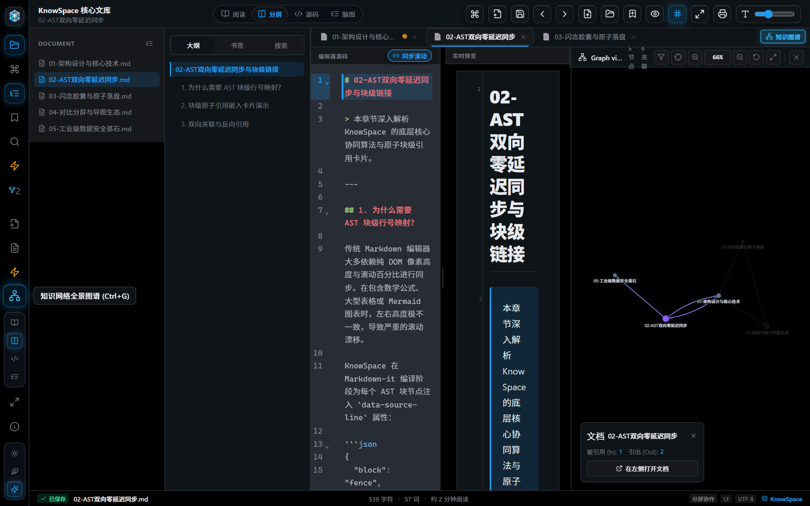

#### 1. 关联深度步进控制 (Hop Depth Subgraphing)
在图谱顶部悬浮控制栏中，提供三档关联深度胶囊切换器：
- **`1-Hop 邻近` (直系关联子图)**：
  - 仅提取与当前聚焦笔记存在直接双向链接（无论是主动引用它还是被它引用）的 1 度邻居节点。
  - 自动剪枝所有无关的外部枝节与背景干扰，将视野聚焦在当下思考主题的“最强相关上下文”。
- **`2-Hop 扩展` (二阶延展网络)**：
  - 在 1 度邻居的基础上，进一步延展出这些邻居的直接关联节点（2 度可达网络）。
  - 适合用于探索跨学科、跨模块的潜在交叉点与第二层衍生知识点，在“视野狭窄”与“信息过载”之间达成完美平衡。
- **`全局` (Full Galaxy View)**：
  - 展现全库所有笔记构成的宏大星座网络。
  - 结合物理力导向模拟与黄金螺旋算法，让孤岛节点在星系外围优雅环绕，让关联紧密的模块自然聚团。
- **动态中心重置 (Interactive Re-centering)**：在 1-Hop 或 2-Hop 模式下，单击图谱中的任意节点，系统会将其设为新的聚焦中心，并以 300ms 平滑过渡动画动态重构局部子图！

#### 2. 🎨 目录语义色彩聚类 (Folder Clustering)
- **顶级目录指纹哈希**：点击控制栏上的 **「🎨 目录聚类」** 按钮，算法自动提取全库笔记所属的根级文件夹路径（如 `01-架构设计/`、`02-数据库/`、`03-前端体系/`）。
- **调和色谱渲染**：通过色彩感知均匀的 HSL 调和色相环算法，为不同的顶级目录赋予区分度极高且舒适柔和的光环色彩（翡翠绿、天空蓝、罗兰紫、珊瑚橙、琥珀黄、洋红等）。
- **立体多维着色**：属于同一目录下的节点被赋予统一的边框主色、外发光微晕以及出入连接线。当光标悬浮在节点上时，悬浮气泡卡片明确标出该笔记所属的聚类名称与完整路径。用户一眼即可看清不同知识板块之间的引用边界与跨界融合。

#### 3. 核心枢纽 (MOC) 与未链接孤岛 (Orphans) 视图过滤
顶栏胶囊控件支持快速切换三类专注视图：
- **全部节点 (All)**：完整展示当前视野下的所有笔记。
- **核心枢纽 (MOC - Map of Content)**：
  - 自动识别度数（入度 + 出度）$\ge 3$ 的骨干节点。
  - 瞬时筛出技术知识库中的枢纽性索引白皮书与大纲纲领，帮助梳理知识库的主干骨架。
- **未链接孤岛 (Orphans)**：
  - 自动识别全库度数等于 0 的孤立单篇笔记。
  - 专门用于**知识库健康度维护**：发现那些写下后被遗忘、尚未接入双链知识网络的笔记碎片，引导用户及时为它们补充关联或归并入主干。

#### 【案例 9.4】大型知识库中的 1-Hop / 2-Hop 局部聚焦与知识穿梭
- **场景描述**：在包含上百篇系统设计的庞大工程中，架构师正在针对《分布式一致性协议》进行专项调研，但全局拓扑图线缆繁杂，难以看清直系依赖。
- **实操步骤**：
  1. 打开《分布式一致性协议.md》，敲击 `Ctrl + G` 打开知识图谱。
  2. 顶栏深度胶囊选择 **「1-Hop 邻近」**。
  3. 视图瞬间由数百个节点智能收缩，屏幕中央仅清晰呈现《分布式一致性协议》及其直接相连的 4 个模块（《Raft核心实现》、《VectorClock时钟》、《Paxos理论推导》、《网络分区容灾》）。
  4. 开启 **「🎨 目录聚类」**，发现其中 3 篇属于「分布式算法」目录（显示为紫色），1 篇属于「运维高可用」目录（显示为橙色），跨领域的调用关系一清二楚。
  5. 单击《网络分区容灾》，图谱平滑重构为以《网络分区容灾》为中心的 1-Hop 网络，知识探索层层推进。

#### 【案例 9.5】利用核心枢纽 (MOC) 与未链接孤岛开展知识库健康度体检与双链重构
- **场景描述**：知识库维护者定期进行文库整理，希望找出哪些笔记是全库的核心枢纽，并排查沉淀在底层的未链接孤立笔记。
- **实操步骤**：
  1. 按下 `Ctrl + G` 打开图谱，将节点过滤胶囊切至 **「核心枢纽 (MOC)」**。
  2. 画面中只保留度数 $\ge 3$ 的核心文档，清晰展现出知识库的三大枢纽：《系统总体设计》、《微服务技术栈》与《开发避坑指南》。
  3. 随后点击切换至 **「未链接孤岛」** 视图。
  4. 画面呈现出 3 篇孤零零悬浮的笔记：《2026-03随记》、《临时脚本说明》与《旧版部署备忘》。
  5. 双击打开《临时脚本说明》，通过右键菜单或输入 `[[微服务技术栈]]` 将其链入主体系，刷新图谱后孤岛数减 1，知识库健康闭环完美达成。

---

## 十、 闪念胶囊 (Flash Notes) 与时间线/待办看板

### 10.1 全局热键随叫随到的灵感速记浮窗
在任何软件界面下按下全局快捷键（默认 `Alt + Space`），磨砂速记微窗跃然屏上：

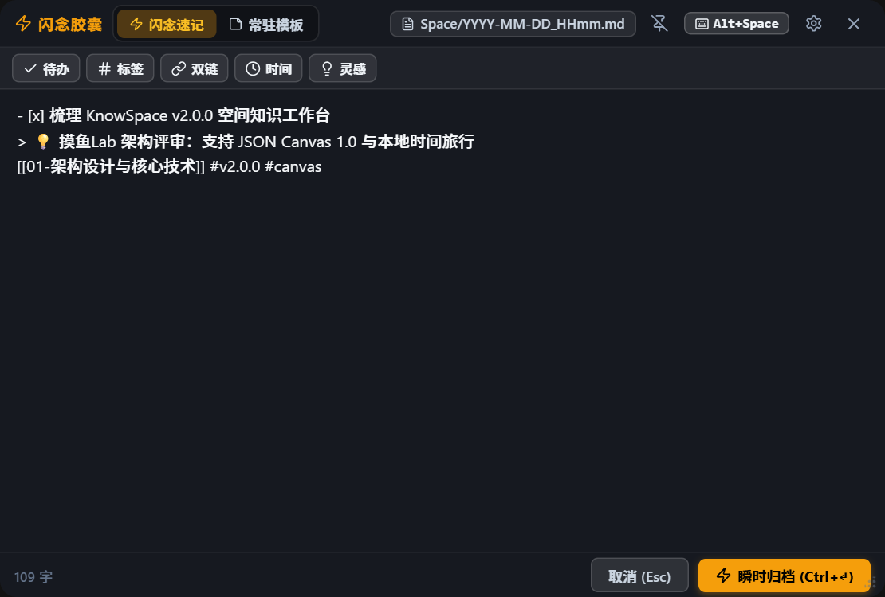

- **📌 窗口钉住 (Pin)**：点击顶部 Pin 图标锁定微窗，在浏览器查资料点击时窗口不退散。
- **📝 常驻便签与提示词模板**：内置随写随存的「常驻便签 / Prompt 模板」库，一键将模板内容填入闪念速记区。
- **📐 自由拖拉拉伸与记忆**：右下角专属点阵手柄支持任意拉伸调整长宽，本地持久化记忆。

#### 【案例 10.1】在浏览器查资料时用 `Alt+Space` 秒级捕捉灵感并原子落盘
- **实操过程**：
  1. 在看论文或代码时触发灵感，无需打开或切换 KnowSpace 主窗，直接敲击 `Alt + Space`。
  2. 悬浮窗以毛玻璃效果居中弹出，光标已自动聚焦于文本框。
  3. 点击工具栏快捷按钮插入 `- [ ] ` 待办标记或 `> 💡 ` 灵感标识。
  4. 按下 `Ctrl + Enter`，浮窗隐退，内容毫秒级原子归档写入当前知识库的 `Inbox/YYYY-MM-DD.md`。

### 10.2 闪念高级设置与后台常驻守护
点击闪念胶囊右上角的 ⚙️ 齿轮按钮，进入设置抽屉：

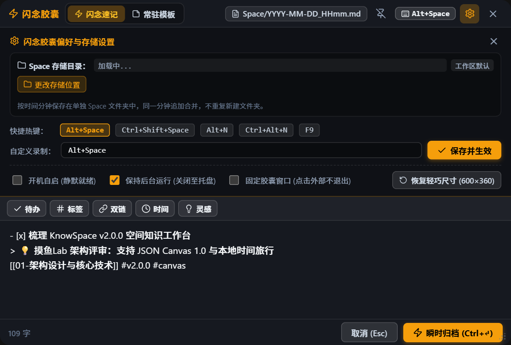

#### 【案例 10.2】自定义全局热键、开机静默自启与关闭至系统托盘
- **实操过程**：
  1. 点击录制热键输入框，按下自定义组合键（如 `Ctrl+Shift+Space` 或 `F9`），热键即时生效。
  2. 勾选 **「开机自启（静默就绪）」**，计算机开机自动在后台以 `--hidden` 模式静默就绪。
  3. 勾选 **「保持后台运行（关闭至托盘）」**，点击主窗口关闭按钮时最小化至 Windows 系统托盘，保障全局灵感随时呼之即来。

### 10.3 闪念时间线瀑布流与跨文件待办看板
点击活动栏的 ⚡ 图标呼出时间线面板：

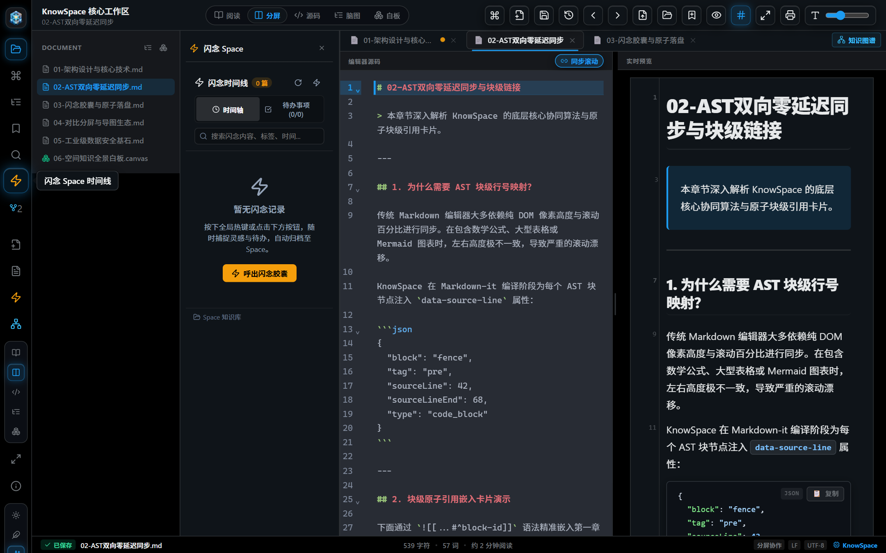

#### 【案例 10.3】在时间线面板原地勾选待办完成并一键合并入主文档
- **实操过程**：
  1. 切换至「待办事项」标签，跨所有日期收集箱的待办事项被一站式提炼汇总。
  2. 完成任务后直接在侧栏列表点击复选框，底层源 Markdown 文件中的 `- [ ]` 瞬间原地更新为 `- [x]`。
  3. 点击卡片上的 📥「合并入当前文档」图标，速记内容秒级附录追加到正在撰写的正式文档末尾。

---

## 十一、 全功能知识导航与段落即时检索体系

### 11.1 实时文档大纲目录 (TOC Outline)
自动抽取文档 H1 ~ H6 标题形成层级导航：

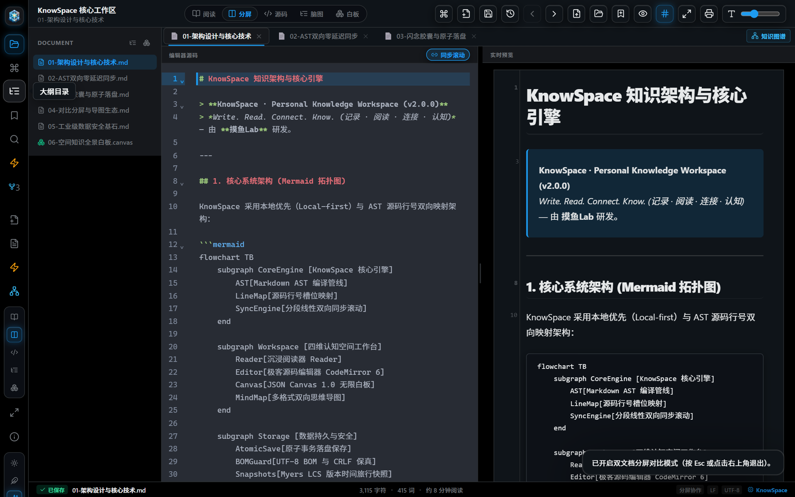

#### 【案例 11.1】阅读长篇技术方案时的大纲视口动态追踪与平滑锚定
- **实操效果**：随着正文滚轮滑动，侧栏 TOC 大纲对应条目同步亮起高亮标记；点击任意大纲项，正文伴随顺滑的平滑滚动动画精准到达目标小节。

### 11.2 全文即时段落卡片聚合检索
按下 `Ctrl + F` 呼出搜索侧栏：

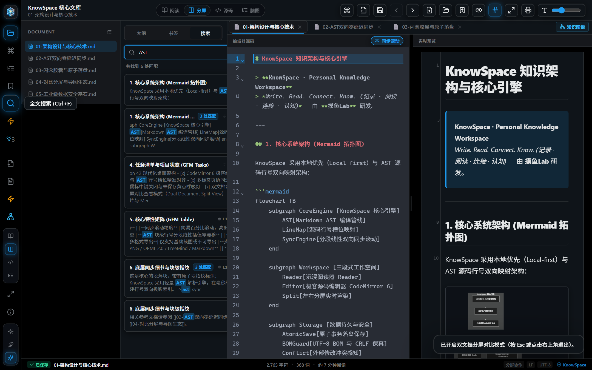

#### 【案例 11.2】跨段落模糊搜索与 1.8 秒电光蓝微光脉冲精准聚焦
- **实操过程**：
  1. 输入关键词 `AST`，侧栏即时聚合展示命中卡片，并标明每个命中所在的行号徽标（如 `L10`、`3 处匹配`）。
  2. 点击其中一张卡片，正文滚动至该处，段落被柔和明亮的电光蓝微光脉冲（`searchPulse`）笼罩 1.8 秒，瞬间锁定视线，无需在密密麻麻的文字中寻找光标。

### 11.3 精选书签与阅读进度记录
点击书签图标或按 `Ctrl + B` 打上进度书签：

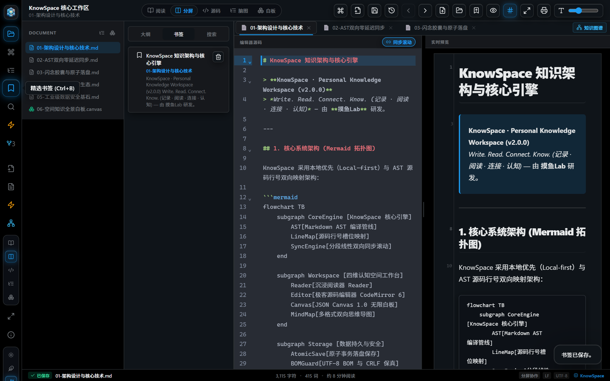

#### 【案例 11.3】`Ctrl+B` 记录关键技术论证章节并在多文件间随心复位
- **实操过程**：在长达百页的技术标准中看到关键定义，按下 `Ctrl + B`。书签面板自动保存所属文件名、小节标题以及阅读百分比（如 `45%`）。无论何时点击书签，视口精准无偏差复位。

### 11.4 多级无限递归文档目录树
#### 【案例 11.4】大型知识库的目录层级折叠、记忆恢复与章节重命名重构
- **实操过程**：支持任意深度的文件夹层级展开/收起，目录顶端支持一键「全部折叠」。在目录项上右键重命名文件时，系统自动级联重构工作区内所有引用该文件的双链，杜绝死链。

---

## 十二、 媒体与架构图无损灯箱 (Media Lightbox)

点击正文图片或复杂 Mermaid 架构图，即可展开高画质毛玻璃全屏灯箱：

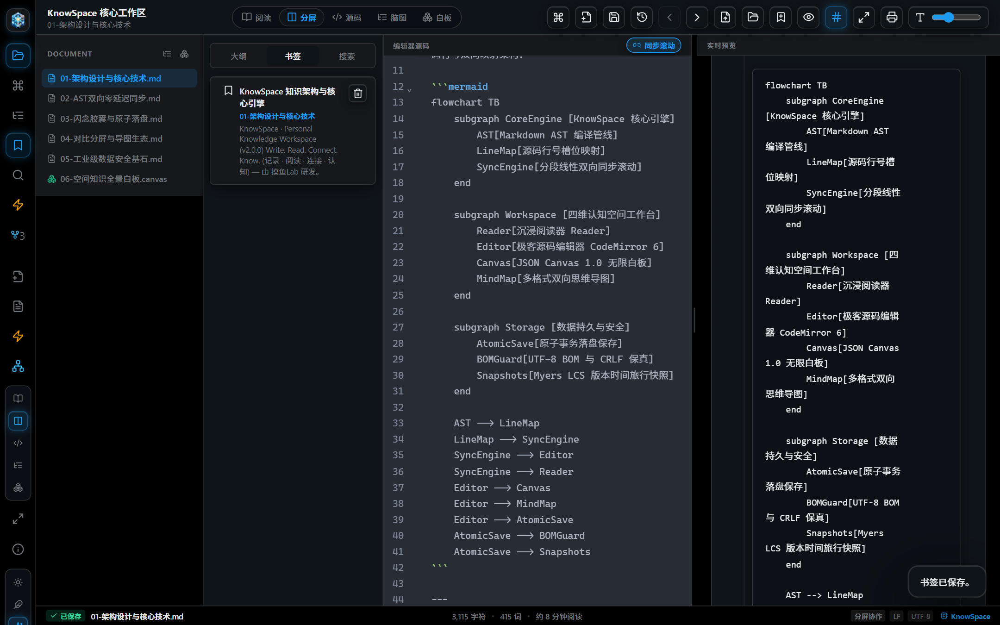

### 12.1 0.2× ~ 6× 自由缩放漫游灯箱
#### 【案例 12.1】全屏毛玻璃下平移审阅超大型复杂微服务架构图细节
- **实操过程**：
  1. 正文中的复杂时序图过于密集，点击图表唤起毛玻璃灯箱。
  2. 向上滚动鼠标滚轮放大至 400%，鼠标按住左键任意拖动画布漫游。
  3. 双击空白处或点击 `↺ 100%` 按钮一键复位，按键盘 `Esc` 退出。

### 12.2 Mermaid 架构图 3× Retina 超清 PNG 导出
#### 【案例 12.2】一键无损导出 300+ DPI 矢量级透明底图用于演讲幻灯片
- **实操过程**：
  1. 在灯箱右上角点击 **「⬇ 导出 PNG」** 按钮。
  2. 系统依据 `getBBox()` 动态计算矢量边界、内联当前主题样式及高解析度字体，以 3 倍视网膜精度光栅化导出无锯齿、无黑边的超清 PNG 图片直接保存至本地。

---

## 十三、 沉浸心流与排版写作辅助

### 13.1 🧘 专注极简模式 (Zen Mode / `F10`)
按下 `F10` 键，界面自动隐去所有侧边栏与工具栏，正文自适应居中在 960px 黄金视宽：

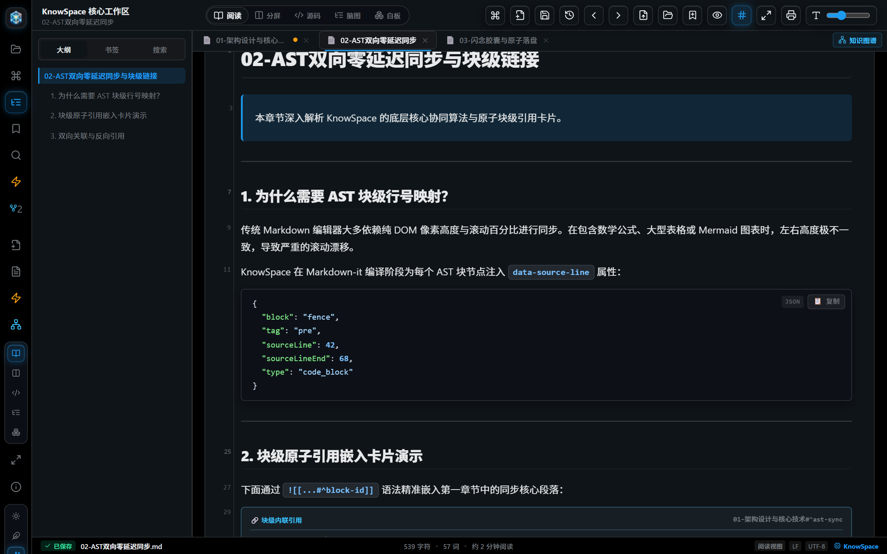

#### 【案例 13.1】进入 960px 黄金视宽全屏屏蔽一切杂质的高效闭关创作
- **实操体验**：屏幕四周所有干扰性控件退隐，只留下一片纯粹的文字输入空间，正文两边留白呼吸感十足，助力瞬间进入深度心流写作状态。再次敲击 `F10` 瞬间恢复全功能工作台。

### 13.2 ✍️ 打字机居中滚动模式 (Typewriter Mode / `Alt+T`)
#### 【案例 13.2】保持视线水平不低头的颈椎友好型马拉松输入体验
- **实操体验**：点击顶部工具栏 👁️ 眼睛图标或按 `Alt + T`，光标所在行自动被锁定在屏幕垂直视口中央（45% ~ 50% 视线黄金区域）。随着敲击键盘，页面自动平滑上卷，视线永远保持水平直视，彻底告别低头看屏幕下沿导致的肩颈酸痛。

### 13.3 🔤 正文行号与字号自由滑块调节
#### 【案例 13.3】针对 4K 高分屏的舒适阅读缩放微调
- **实操体验**：拖动顶部工具栏右侧的字体滑块（0.85× ~ 1.35×），整个正文排版比例平滑线性缩放，图文比例与行间距自适应微调，在各种高分屏与视距下均能找到最舒适的视觉平衡点。

---

## 十四、 工业级数据安全基石与防丢稿守卫

```
用户保存 (Ctrl+S) ──► 写入同目录临时文件 (.tmp) ──► 物理 fsync 刷盘 ──► 原子重命名替换 (Atomic Rename)
```

### 14.1 物理事务原子落盘与断电安全
#### 【案例 14.1】异常掉电与进程崩溃下的零截断损坏保障
- **底层机制**：KnowSpace 绝不在原文件上直接写覆数据，而是先写入同目录隐藏临时文件，调用 OS 级 `fsync` 确保数据真正沉入磁盘物理扇区后，再执行原子重命名覆盖。即便在写入瞬间电脑断电关机，原有文件依然完好无损，绝不留下 0 字节损坏空文件。

### 14.2 UTF-8 BOM 与 CRLF/LF 换行格式保真
#### 【案例 14.2】跨 Windows 与 Linux 团队协作下的 Git 纯净提交
- **底层机制**：打开带 Windows CRLF 或 UTF-8 BOM 的老旧工程文件时，KnowSpace 自动侦测并忠实继承其文件格式。保存时严格保真，绝不在 Git Diff 中产生几千行无意义的换行符全局变动。

### 14.3 外部编辑器并发修改冲突检测与协商
保存前主动比对磁盘物理指纹 `{ size, mtimeMs }`：


#### 【案例 14.3】VSCode 与 KnowSpace 并发修改同一文档时的安全协商
- **实战流程**：
  1. 在 KnowSpace 编辑的同时，外部 Git 执行了 `git pull` 更新了磁盘上的该文件。
  2. 在 KnowSpace 中按下 `Ctrl+S` 时，系统感知到物理指纹不一致，立即拦截并弹出「检测到文件冲突」对话框。
  3. 提供三种清晰选择：**重新载入磁盘内容**（丢弃本地改动）、**强制覆盖磁盘文件**（以本地为主）、**另存为新文件**（两者兼顾）。用户选择另存为，双方修改安全保全。

### 14.4 全链路未保存守卫拦截
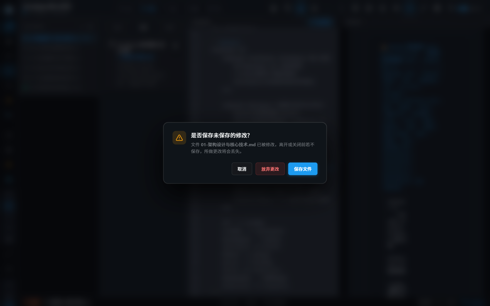

#### 【案例 14.4】误触切章节或关窗时弹出拦截弹窗挽救心血成果
- **实操体验**：只要文档处于 `isDirty` 未保存状态，无论是误触关闭标签、切换目录树章节，还是点击右上角叉号退出，系统都会主动弹出防丢稿弹窗，提供「保存文件 / 放弃更改 / 取消」，彻底消除误操作丢稿遗憾。

---

## 十五、 键盘全快捷键高效实战速查表

| 分类 | 快捷键 | 功能名称 | 场景与说明 |
| :--- | :--- | :--- | :--- |
| **全局与控制** | `Ctrl + K` / `Ctrl + P` | **全局命令中枢** | 快速检索全库文件、执行系统动作（前缀 `>`）与大纲检索（前缀 `#`），支持编辑器内免失焦穿透呼出 |
| | `Alt + Space` | **呼出/隐藏闪念胶囊** | 全局秒级唤起毛玻璃速记微窗（可在设置中自由录制） |
| **文件与工程** | `Ctrl + N` | **新建文档** | 弹出新建对话框快速创建 Markdown 文件 |
| | `Ctrl + S` | **保存文件** | 执行底层物理原子事务落盘与 `fsync` 刷盘 |
| | `Ctrl + Shift + S` | **另存为** | 将当前内容另存至新路径 |
| | `Ctrl + O` | **打开单文件** | 浏览本地任意单个 `.md` 文件 |
| | `Ctrl + Shift + O` | **打开工程目录** | 载入技术文库构建多级目录树 |
| | `Ctrl + P` | **高保真 PDF 打印** | 调出标准 A4 矢量 PDF 打印与导出面板 |
| | `Ctrl + Shift + H` | **版本快照历史与对比** | 呼出本地时间旅行面板，支持 Side-by-Side 双栏 Diff 与一键还原 |
| **导图与白板** | `Ctrl + M` | **思维导图视图** | 一键在 Markdown 读写与交互式思维导图间切换，支持编辑器内免失焦穿透 |
| | `Ctrl + Shift + C` | **空间可视化白板** | 切换至无限空间白板视图，自由拖拽多模态卡片与连线 |
| | `Tab` / `Insert` | **(导图中) 添加子主题** | 为当前选中的脑图节点创建下一级子分支并就地命名 |
| | `Enter` | **(导图中) 添加同级主题** | 为当前选中的脑图节点创建同级分支 |
| | `Delete` / `Backspace` | **(导图中) 删除主题** | 删除选中的脑图分支及其子节点（受保护根节点除外） |
| | `F2` / `Space` | **(导图中) 重命名主题** | 就地呼出悬浮输入框修改节点名称（支持双击编辑） |
| | `↑ ↓ ← →` | **(导图中) 方向键导航** | 在父子主题与兄弟主题之间键盘快速漫游定位 |
| | `Ctrl + G` | **知识网络全景图谱** | 全屏查看知识节点关联拓扑、1-Hop/2-Hop 关联深度与目录聚类，支持编辑器内免失焦穿透 |
| **编辑与排版** | `/` (斜杠) | **斜杠指令菜单** | 快速插入标题、表格、代码围栏、LaTeX公式、架构图与提示卡片 |
| | `[[` (中括号) | **双链实时联想** | 快速唤出全库文档联想卡片建立双向链接 |
| | `#^` | **块指纹联想** | 快速联想当前文档中的所有段落块级指纹锚点 |
| **标签与导航** | `Ctrl + W` | **关闭标签页** | 关闭当前激活标签（支持鼠标中键单击关闭） |
| | `Ctrl + Tab` | **下一标签页** | 循环向后切换打开的标签 |
| | `Ctrl + Shift + Tab` | **上一标签页** | 循环向前切换打开的标签 |
| | `Ctrl + \` | **折叠/展开目录** | 切换左侧文件目录树显隐，支持编辑器内免失焦穿透 |
| | `Alt + ←` / `Alt + →` | **上一篇 / 下一篇** | 顺序切换章节列表（带未保存拦截防护） |
| **检索与书签** | `Ctrl + F` | **全文搜索** | 呼出搜索侧栏并聚焦输入框（支持 tag:#、link:[[、"短语"、-排除） |
| | `Ctrl + B` | **添加书签** | 记录当前小节与阅读百分比进度 |
| **速记与沉浸** | `Ctrl + Enter` | **保存归档闪念** | 在闪念微窗内一键原子追加写入 `Inbox/` 收集箱 |
| | `F10` | **专注模式 (Zen)** | 一键隐藏侧栏工具栏，正文 960px 黄金视宽居中 |
| | `Alt + T` | **打字机滚动** | 开启/关闭光标视口垂直居中锁定 |
| | `F11` | **全屏模式** | 切换全屏沉浸阅读 |
| | `Esc` | **退出/取消** | 退出全屏灯箱、退出分屏对比、关闭命令中枢或取消弹窗 |

---

## 十六、 安装部署与便携绿色版运行

### 1. Windows MSI 标准安装包 (`KnowSpace-2.0.0.msi`)
- **适用场景**：个人常用工作电脑、企业团队桌面统一交付。
- **产品特性**：
  - 自动在开始菜单与桌面创建官方品牌图标。
  - 自动注册 `.md` 与 `.canvas` 文件关联，双击本地 Markdown 或空间白板秒开。
  - 支持 Windows 标准控制面板一键安全卸载与无缝版本迭代。

### 2. Windows 免安装绿色便携版 (`KnowSpace-win-x64-portable.zip`)
- **适用场景**：移动 U 盘办公、涉密无管理员权限设备、临时开发工作站。
- **产品特性**：
  - 解压即用，双击 `KnowSpace.exe` 直接运行。
  - 零外部运行时依赖（无需配置 Node.js、Electron 或 Python 环境）。
  - 用户个性化设置与笔记数据跟随本地文件夹，即插即用，拔盘即走。

---

## 十七、 无限空间可视化白板 (Infinite Canvas · JSON Canvas 1.0)

KnowSpace v2.0.0 正式引入完全兼容标准开源规范 **JSON Canvas 1.0** 的无限空间可视化白板，将线性文字笔记推向无限画布的二维空间认知世界。

### 1. 标准兼容与双向互通
- **标准开放**：基于标准 `.canvas` JSON 数据规范存储，具备跨软件无障碍流转能力（与 Obsidian Canvas 等生态工具双向兼容）。
- **文件管理**：在目录树中以专属绿色 Boxes 图标标识 `.canvas` 白板文件，支持在主界面新建、双击打开、重命名及删除。

### 2. 双层渲染引擎与多模态卡片
- **底层（矢量连线与网格层 · SVG）**：
  - 点阵背景（Dot Grid），视口在 10% ~ 500% 缩放平移时无畸变高清渲染；
  - 动态连线计算：支持 3 种线型（平滑三次贝塞尔曲线、90° 正交折线、直线）；
  - 4 锚点磁吸：卡片四周（上、下、左、右）配有高精度磁吸锚点，鼠标拖拽拉出连线，靠近目标边缘时自动触发磁吸对齐。
- **顶层（多模态卡片层 · HTML DOM）**：
  - **文本卡片 (Text Node)**：双击卡片进入行内编辑，失焦自动渲染为精美 Markdown（支持 LaTeX 公式、代码高亮、Checklist）；
  - **文档卡片 (File Node)**：展示库内任意关联文档，双击即可直接定位到该文档；
  - **分组容器 (Group Node)**：半透明分类容器，带标题指示，支持框选和批量拖拽搬运；
  - **自由拉伸与控制**：卡片右下角拉伸控制手柄，支持尺寸自由拉伸调整。

### 3. 视口控制、Minimap 与逆向萃取长文
- **空间漫游**：支持鼠标滚轮（按住 Ctrl/Cmd 缩放，按住 Shift 或中键抓手平移），顶部工具栏配备 `100% 聚焦` 与 `Zoom to Fit`（全景适应）；
- **Minimap 小地图**：右下角常驻全局缩略雷达小地图，实时反馈当前视口框位置，点击视框即可极速跳转对应区域；
- **画布逆向萃取为长文 (Canvas-to-Article Transformation)**：
  - 点击顶部「逆向萃取长文」按钮，算法自动依据所有卡片的空间纵向坐标与因果连线拓扑关系进行拓扑排序；
  - 一键将零散白板卡片智能萃取为一篇各级标题完备、引用因果严密的全新 Markdown 专著，并自动保存到当前工程中打开！

### 4. 连线流向反转 (`R`) 与关系说明矢量形状
- **快捷反转连线 (`R`)**：
  - 在画布中选中任意连线，轻按键盘 `R` 键，秒级翻转两端节点与箭头流向；
  - 浮动工具栏提供浅蓝微光胶囊按钮 `<Shuffle /> 反向`，右键菜单明示起止卡片名称与 `R` 快捷键，伴随底部毫秒级 Toast 反馈；
- **三种精美关系说明形状**：
  - **胶囊形（Pill）**：圆润胶囊矩形，线条柔和；
  - **矩形（Rect）**：微圆角规整矩形，工整商务；
  - **真·几何菱形（Diamond）**：内嵌 SVG 矢量底板，根据文本宽度等比自适应拉伸，两侧锐角精准接驳连线，阴影轮廓立体自然。

### 5. 媲美 Figma / Miro 的 4 大右键上下文菜单体系
- **空白画布**：新建各类卡片、**从剪贴板一键粘贴卡片 (`Ctrl+V`)**（自动读取剪贴板纯文本并在光标处直接生成新卡片）、适应画布 (`Shift+1`)、重置缩放 100% (`Ctrl+0`)、对齐网格（吸附至 20px 网格）、小地图与网格形态切换；
- **单张卡片**：Markdown 编辑、复制文本、**复制双链引用 (`[[标题]]`)**、**提取为独立笔记**、**重置为默认尺寸**（一键恢复文本卡片 280×160 等黄金规格）、图层调整、6 色雅致背景调色板；
- **多选节点**：**一键打包为分组容器 (`Ctrl+G`)**（智能计算多选卡片联合外接矩形生成半透明底框）、智能对齐（左对齐、水平居中、顶端对齐）与**水平等距分布**；
- **分组容器**：重命名容器、**一键全选内部所有卡片**、**自适应紧凑包围内容**（根据内部卡片位置智能收缩容器，预留 24px 边距）、**解散分组**（仅删除容器外框，保留内部所有卡片）。

---

## 十八、 本地时间旅行与版本快照历史 (Local Version History)

每一次知识创作的修改都应被忠实记录。KnowSpace v2.0.0 打造了完全运行在用户本地、安全防丢的本地时间旅行与版本快照历史系统。

### 1. 静默差异快照捕获引擎
- **本地存储**：在知识库根目录下维护 `.knowspace/snapshots/` 隐藏文件夹，每个快照包含精确时间戳与 SHA-256 哈希校验；
- **智能策略**：
  - 仅在保存且内容确实发生实质变更时捕获；
  - 30 秒静默去抖窗口，防止频繁 `Ctrl+S` 生成大量冗余碎片；
  - 自动修剪与配额：单个文档默认智能保留最新 50 个快照，防止过度占用存储空间。

### 2. 时间轴面板与 Side-by-Side 双栏 Diff
- **快捷唤出**：通过顶部工具栏 `History` 图标按钮或全局快捷键 `Ctrl + Shift + H` 随时唤出「时间旅行与版本快照历史」弹窗；
- **时间轴列表**：左侧清晰呈现所有历史快照点，精确标记相对时间（“刚刚”、“5分钟前”）、绝对时间戳、行数增减（如 `+18` / `-5`）与快照类型；
- **双栏差异对比 (Side-by-Side Diff)**：
  - 左栏呈现历史快照，右栏呈现当前最新文档；
  - 基于 Myers LCS 算法实现毫秒级行级差异对比（绿色背景代表新增行，红色背景代表删除行）；
  - 行内字符级微粒度高亮，精准定位单个单词或字符的修改；
  - 支持一键切换「双栏对比」与「统一对比 (Unified Diff)」两种视图。

### 3. 一键无损安全还原与手动快照
- **还原至此版本**：点击右上角「还原至此版本」，弹出防误触安全确认，点击确认后立即将工作区当前文档覆盖为历史快照内容，并自动生成一条新的恢复记录；
- **复制快照内容**：支持一键将所选历史版本的全部 Markdown 源码复制到剪贴板；
- **保存手动快照**：支持随时手动打下里程碑检查点标记。

---

## 十九、 全库毫秒级混合检索引擎与结构化语法 (Hybrid Vault Search)

KnowSpace v2.0.0 检索引擎全新升级，彻底告别单文件线性暴力扫描，引入文档级与段落块级的高性能倒排索引（Inverted Index），实现键盘键入即刻（< 15ms）出结果。

### 1. 结构化检索语法体系
不仅支持常规全文关键词，更原生支持面向高阶知识管理工作流的结构化检索语法：
- **标签筛选**：
  - `tag:#架构` 或 `tag:架构` 或 `#架构`：秒级筛选包含 `#架构` 标签的所有段落与文档；
- **双链筛选**：
  - `link:[[分布式协议]]` 或 `link:分布式协议`：秒级检索所有引用或反向链接到该目标文档的段落；
- **严格短语检索**：
  - `"raft consensus"`：用双引号包裹词语，执行严格连续字词精确匹配；
- **排除词过滤**：
  - `-keyword`（如 `raft -paxos -废弃`）：排除包含指定负向词语的搜索结果；
- **日期范围过滤**：
  - `after:2026-09-01` / `before:2026-09-08`：按时间范围进行精准圈选。

### 2. 双范围检索模式与语法快捷辅助
- **搜索范围切换**：
  - 搜索面板顶部常驻 `[当前章节]` 与 `[全库检索]` 切换标签；
  - 在全库检索模式下，搜索结果卡片直接呈现所属章节徽章（如 `[架构总览]`）、大纲层级与精准物理行号标签（如 `L12-15`）；
- **快捷语法辅助芯片 (Syntax Chips)**：
  - 搜索框下方配备 `tag:#`、`link:[[`、`"短语"`、`-排除` 快速插入辅助芯片，单击即可就地插入对应语法模板；
- **跨文档平滑导航与微光脉冲**：
  - 点击全库搜索结果中属于其他章节的卡片，系统自动秒级切换至目标章节，平滑滚动至对应物理行，并激活 1.8 秒电光蓝柔和高亮微光脉冲！

---

## ℹ️ 关于软件与技术支持

点击左侧活动栏底部的 ℹ️ 按钮可查看应用系统指标：

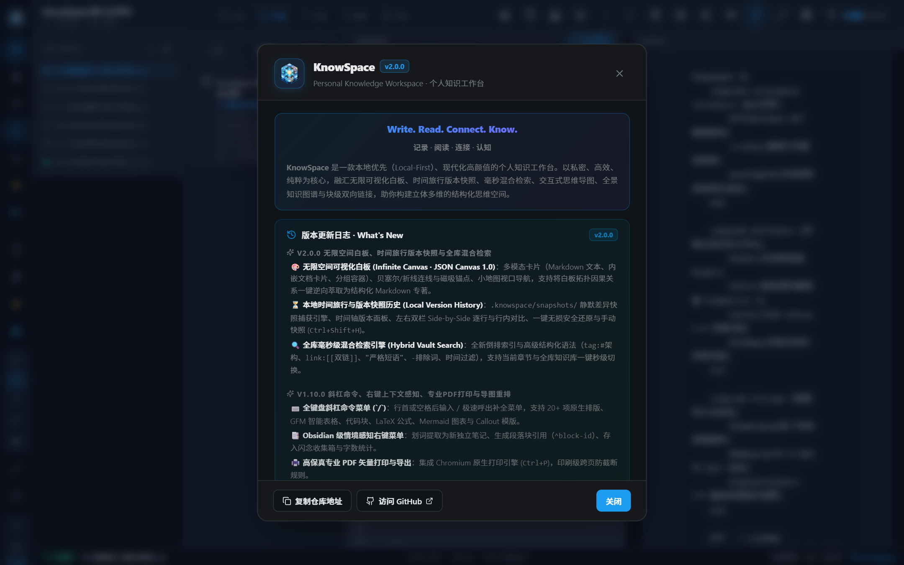

- **核心技术栈**：React 19 + TypeScript + Electron 42 + CodeMirror 6 + Markdown-it + KaTeX + Mermaid + Cytoscape + JSON Canvas
- **研发团队**：摸鱼Lab (Moyu Lab)
- **开源协议**：MIT License © 2026

*愿 KnowSpace 成为您探索知识、记录思考、建立连接的得力伙伴！*
