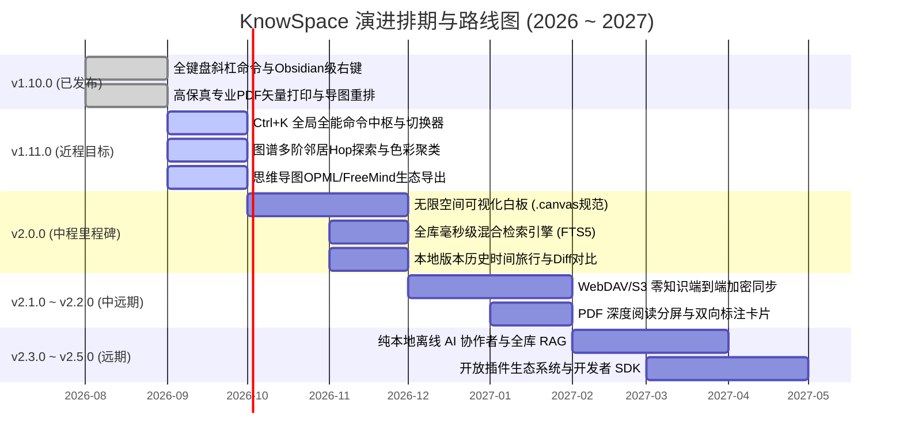

# 🪐 KnowSpace 产品路线图与全景演进规划说明书 (v1.10.0 ➔ v2.5.0)

> **项目名称**：KnowSpace · Personal Knowledge Workspace（现代化个人知识工作台）  
> **产品核心使命**：*Write. Read. Connect. Know.（记录 · 阅读 · 连接 · 认知）*  
> **当前基线版本**：`v1.10.0` (Production Verified & Published)  
> **演进核心哲学**：*本地优先 (Local-First) · 极致纯净性能 · 视觉空间化认知 · 零知识隐私安全 · 渐进式智能化*  
> **更新发布日期**：2026 年 9 月

---

## 🗺️ 一、 总体演进全景路线（四维阶梯）

```
  【v1.0 ~ v1.8】                  【v1.9.0 ~ v1.10.0】                 【v1.11.0】                     【v2.0.0】                    【v2.1.0 ~ v2.5.0】
 📖 Write & Read          ──►     🧠 Structure & Flow       ──►   ⚡ Command & Graph      ──►   🎨 Infinite Canvas      ──►   🌌 Knowledge OS
沉浸编辑 / 三大专属主题           思维导图 / 块级引用               全能命令面板 (Ctrl+K)         无限空间画布 (.canvas)         本地离线大模型 (RAG)
AST 双向精准同步滚动              全键盘斜杠补全 (/)                图谱多阶邻居 / MOC 枢纽        多模态卡片自由混排             端到端加密同步 (E2EE)
多标签页 / 左右分屏对比           Obsidian 级情境感知右键           导图 OPML/FreeMind 导出       全库极速混合检索 (FTS5)        PDF 双向高亮引用回溯
60FPS 有机知识网络图谱            高保真专业 PDF 矢量打印           文档大纲小节秒级直达          本地版本历史与 Diff 回溯       开放插件生态 SDK
```

---

## 🏆 二、 已完成里程碑回顾与当前基线 (v1.10.0 Baseline)

经过多轮密集的技术攻坚，KnowSpace 目前已建立起工业级稳定的本地优先个人知识工作台底座：

### 1. 现代化极客阅读与编辑引擎
- **三大专属全天候主题**：日光暖橙浅色 (Warm Amber)、仿电子墨水屏纸质 (E-ink Paper)、极客纯黑 (Geek Dark Lights Out)，全界面磨砂亚克力微光与高对比度交互。
- **CodeMirror 6 深度定制编辑体验**：毫秒级实时防抖渲染、打字机垂直居中模式 (`Alt + T`)、剪贴板截图直接粘贴自动落盘 `assets/`、大文档性能守护机制。
- **AST 零延迟双向高精度同步滚动**：基于源码 AST 块级行号与线性插值算法，富文本与源码高度差异无论多大均严丝合缝。
- **全键盘斜杠命令菜单 (`/` Slash Commands)**：行首或空格后输入 `/` 秒级呼出 20+ 项排版、待办、GFM 智能表格、代码块、LaTeX 公式、Mermaid 图表及 Callout 提示框，支持中英双语与拼音首字母模糊检索。
- **Obsidian 级情境感知右键菜单 (Context Menu)**：支持划词提取为新独立笔记（原地替换双链）、创建段落块引用指纹（`^block-id`）、存入 Space 收集箱、富文本与行样式转换、内置文档与选区字数/行数统计卡片。

### 2. 结构化思维与空间视觉体系
- **交互式思维导图 (Mind Map View)**：Markdown 大纲一键转为思维导图 (`Ctrl + M`)，全键盘极速编辑 (`Tab`/`Enter`/`Delete`/`F2`)。
- **思维导图跨层级拖拽重排 (Drag-and-Drop Reparenting)**：支持鼠标拖拽自由改变父子归属与同级排序，内置自闭环防环保护与目标吸附光晕。
- **导图内实时搜索与运镜聚焦 (`Ctrl + F`)**：画布顶部微型搜索条实时匹配高亮节点，支持回车一键平滑运镜（`Smooth Pan`）居中定位。
- **文字边框自适应与四向排版对齐**：支持居中、左对齐、右对齐、双边对齐 (Justify)，节点支持右下角拉动手柄自由拉伸并保真回写。
- **全景知识网络图谱 (Knowledge Graph)**：60FPS 原生 2D 绘制管线，2.2ms 黄金螺旋有机力导向算法，支持节点脉冲光晕定位与双向链接智能级联重构。

### 3. 数据安全与跨平台分发
- **高保真专业 PDF 矢量打印与导出 (`Ctrl + P`)**：原生 Chromium 矢量管线与 A4 标准输出，注入生产级 `@media print` 跨页防截断样式，代码块与图表无腰斩断裂。
- **闪念胶囊速记微窗 (Flash Capsule)**：全局热键 (`Alt + Space`) 秒开、窗口钉住、待办打勾即时写回、Space 时间线流式看板。
- **数据物理事务原子落盘**：Temp + Fsync + Rename 机制，完全保持源文件 UTF-8 BOM 与 CRLF/LF 行尾，外部冲突防丢稿守护。
- **双模 Windows 交付**：官方标准 MSI 安装包与绿色解压即用便携版 (Portable Zip)，内嵌 PE 元数据与品牌图标。

---

## 🚀 三、 详细版本演进计划 (v1.11.0 ➔ v2.5.0)

---

### 阶段一：v1.11.0 —「Command & Graph · 全局命令中枢与图谱分析进阶」

> **发布目标**：打造全键盘盲操操作中枢，深化网状知识图谱的深度探索与分析能力，打通思维导图跨软件生态流转。  
> **预计周期**：2 ~ 3 周

#### 1. 全能全局命令面板 (Command Palette / Quick Switcher · `Ctrl + K`)
- **痛点与场景**：文档数量增多后，仅靠左侧目录树寻找文档效率较低；频繁在视图、主题与各种功能之间切换需要鼠标点击菜单。
- **核心功能特性**：
  - 全局热键 `Ctrl + K`（或 `Ctrl + P`）在屏幕正上方呼出轻巧的毛玻璃命令悬浮窗。
  - **多模式前缀路由**：
    - 默认输入（无前缀）：**极速文件切换器 (Quick Switcher)**，智能展示最近访问文件列表 (MRU)，支持文件名与路径拼音首字母模糊匹配（如输入 `jg` 匹配 `2026架构设计.md`）。
    - 输入 `>`：**全局命令模式 (Commands)**，执行全量应用动作（切换主题、开关打字机模式、开启专注模式、导出 PDF、提取为新笔记、打开思维导图等）。
    - 输入 `#`：**当前文档标题大纲跳转 (Document Headings)**，快速定位到当前文档的特定 H1~H6 小节并平滑滚动聚焦。
    - 输入 `@`：**全局标签检索 (Tags)**，列出全工作区使用的 `#标签` 并聚合筛选对应文档。
  - 全程支持键盘 `↑` / `↓` 移动候选、`Enter` 确认、`Esc` 退出，带来秒级极客心流。

#### 2. 知识网络图谱深度分析与视觉进阶
- **痛点与场景**：当笔记库积累到几百上千篇时，全局图谱容易变成密密麻麻的“毛线团”，用户难以专注当前正在思考的主题。
- **核心功能特性**：
  - **多阶邻居范围探索 (Hop Filter)**：在图谱工具栏支持一键切换 `1-Hop`（仅展示当前文档及直接关联笔记）、`2-Hop`（两层关联网络）与 `全局全景`，大幅降低视觉噪音。
  - **智能多维色彩分类 (Color Groups)**：
    - 支持按**文件所在根目录/文件夹**自动分配柔和色系；
    - 支持按文档**首要标签 (`#Tag`)** 分组染色。
  - **核心知识枢纽 (MOC) 算法挖掘**：
    - 基于度中心度 (Degree Centrality) 与简易 PageRank 算法，自动识别并视觉放大知识网络中的核心枢纽文档。
  - **知识孤岛检测与关联推荐 (Unlinked Islands)**：
    - 一键高亮完全未建立链接的“孤岛笔记”，并在右侧面板列出与其它文档的潜在标题重合线索，支持一键建立规范双链。

#### 3. 思维导图多格式生态互通导出与导入
- **痛点与场景**：用户需要将 KnowSpace 中生成的思维导图导入到 XMind、MindNode、幕布或其它专业工具中进一步演示汇报。
- **核心功能特性**：
  - **导出为标准 OPML 2.0 格式**：保留完整的树状层级大纲结构，无缝接入主流大纲与思维导图软件。
  - **导出为 FreeMind / XMind 兼容 `.mm` 格式**：保留节点层级与基础样式。
  - **思维导图导入向导**：支持将外部 `.opml` 文件直接导入并生成标准的 `.mindmap.md` 文件。

---

### 阶段二：v2.0.0 —「Infinite Canvas · 无限空间可视化白板与结构化演化」

> **发布目标**：实现从“一维线性文本”到“二维无界思维平面”的根本性跃迁，成为真正意义上的空间化认知操作系统。  
> **预计周期**：1 ~ 2 个月（里程碑大版本）

#### 1. 无限空间可视化白板 (Infinite Canvas / 兼容 `.canvas` 开放格式)
- **痛点与场景**：撰写长篇系统架构、产品方案或读书研究时，零散的文字无法直观展示模块之间的空间拓扑、因果关联与概念演化脉络。
- **核心功能特性**：
  - **无界空间漫游视口**：基于高性能 2D 变换与视口裁剪算法，支持鼠标平滑抓手漫游、滚轮无级缩放（10% ~ 500%）、空格抓手手势，右下角配备实时小地图 (Minimap)。
  - **开放文件规范**：完全遵循并兼容主流开源社区的 `.canvas` JSON 规范，白板文件存储于本地知识库，不产生任何厂商锁定。
  - **多模态空间实体卡片 (Canvas Nodes)**：
    - **Markdown 笔记卡片**：直接在画布上创建可内联编辑的富文本卡片；
    - **文档嵌入卡片**：将已有 Markdown 文档拖拽入画布，呈现为带实时预览、滚动条和双链跳转的动态窗口卡片；
    - **多媒体与图片卡片**：自由粘贴截图、拖拽本地图片与架构图；
    - **组群与概念容器 (Groups)**：使用半透明彩色卡片框将多个关联卡片框选归拢，支持整体移动与命名。
  - **空间语义连线 (Semantic Edges)**：
    - 支持从卡片边缘 4 个锚点拉出动态连线，连接线类型支持平滑贝塞尔曲线、直角折线、正反向箭头；
    - 连线上支持标注关系描述文本（如“依赖”、“导致”、“推导自”）。
  - **画布向专著逆向萃取 (Canvas-to-Article Transformation)**：
    - 框选画布中的一组逻辑卡片与连线，右键点击“萃取为结构化文档”，系统自动根据拓扑排序生成一篇章节清晰的 Markdown 文章草稿。

#### 2. 全库毫秒级混合检索引擎 (Hybrid Full-Text Search)
- **痛点与场景**：万篇海量笔记环境下，单纯基于内存或线性遍历的文件搜索速度变慢，且无法进行高级布尔组合。
- **核心功能特性**：
  - **本地倒排索引技术**：引入轻量级 Web Worker 离线倒排索引（Minisearch / SQLite FTS5 本地缓存），万篇文档毫秒级即搜即显。
  - **高级结构化检索语法**：
    - 语法支持：`tag:#架构 AND link:[[系统设计]] "分布式一致性" -draft`
    - 按修改时间过滤：`after:2026-08-01`
  - **段落级微卡片聚合视图**：搜索结果展示命中文档的准确行号、上下文切片、高亮微光背景，按回车光标精准定位到对应段落。

#### 3. 本地时间旅行与版本快照历史 (Local Version History & Snapshots)
- **痛点与场景**：误删大段文字或经历重大重构后想找回昨天或一周前的版本，仅靠单一的撤销栈（Undo Stack）无法跨会话恢复。
- **核心功能特性**：
  - **本地静默增量快照**：每当文档保存并发生实质变更时，自动在用户数据目录下写入轻量增量差异记录（保留 30 天，可自定义）。
  - **版本历史时间轴面板**：在右侧活动栏查看当前文档的历史修改点，支持显示每次修改的时间戳与增减字数。
  - **左右双栏差异比对 (Side-by-Side Diff)**：绿色高亮新增行、红色高亮删除行，支持“一键还原至此版本”或“复制历史片段”。

---

### 阶段三：v2.1.0 ~ v2.2.0 —「E2EE Cloud Sync & Deep Annotations · 零知识加密同步与文献深度标注」

> **发布目标**：解决多设备数据流动问题，保护用户极致隐私；打通学术论文、电子书 PDF 与个人 Markdown 笔记的双向闭环。  
> **预计周期**：2 ~ 3 个月

#### 1. 零知识端到端加密云端同步 (Zero-Knowledge E2EE Cloud Sync)
- **痛点与场景**：用户在多台电脑（如公司台式机与私人笔记本）之间需要同步知识库，但对第三方商业云服务的隐私泄露和审查充满担忧。
- **核心功能特性**：
  - **去中心化无私有服务端**：支持用户挂载自己的通用存储服务：
    - **WebDAV 协议**：坚果云、Nextcloud、群晖/威联通 NAS、InfiniCLOUD 等；
    - **S3 兼容对象存储**：Cloudflare R2（免费 10GB 零出网流量费）、MinIO 自建桶、阿里云 OSS、腾讯云 COS。
  - **客户端 AES-256-GCM 零知识端到端加密**：
    - 所有 Markdown 笔记、图片、导图在上传前由客户端使用用户主密码本地加密为密文切片；
    - 任何存储提供商、网络中间节点均无法读取明文；
  - **智能冲突协商引擎**：离线时自由编辑，联网后基于向量钟（Vector Clocks）和时间戳自动增量合并；若同一行发生冲突，生成 `.conflict.md` 保护分支，绝不丢稿。

#### 2. 专业 PDF 嵌入式深度阅读与双向标注 (PDF Deep Annotator)
- **痛点与场景**：查阅学术论文或专业技术手册时，需要将 PDF 中的核心图表与论述摘录到 Markdown 笔记中，但摘录后往往找不到 PDF 原文对应出处。
- **核心功能特性**：
  - **PDF / Markdown 左右并排沉浸视图**：在双分屏中左侧阅读原版 PDF，右侧实时记录笔记。
  - **PDF 高亮划词生成双向引用卡片**：
    - 在 PDF 中划选文字或框选图表，右键点击“复制深度链接卡片”；
    - 粘贴到 Markdown 中呈现为 `[[paper.pdf#page=12&rect=100,200,300,400|摘录内容]]`；
    - 在 Markdown 中点击该双链，左侧 PDF 阅读器即刻平滑跳转到对应页码并聚焦在当时高亮的方框区域。

---

### 阶段四：v2.3.0 ~ v2.5.0 —「Knowledge OS & AI · 本地离线智能协作者与开放生态」

> **发布目标**：从“工具”升维为“外脑”，打造 100% 运行在本地设备上的个人 AI 智能体，建立安全开放的社区插件生态。  
> **预计周期**：3 ~ 5 个月

#### 1. 纯本地隐私优先 AI 知识协作者 (Local AI Copilot & Knowledge RAG)
- **痛点与场景**：传统云端 AI 助手需要把个人私密日记和核心技术方案上传到第三方服务器，存在严重隐私风险；纯依靠人工检索难以挖掘跨文档的隐性知识联系。
- **核心功能特性**：
  - **100% 离线端侧大模型直连**：
    - 本地免配置直连 Ollama / llama.cpp，一键调度 DeepSeek-R1、Qwen2.5 等优秀开源模型；
    - 低功耗轻薄本支持调用用户自己的 API Key（BYOK：Gemini API / Claude API 直连，不经中转）。
  - **全库知识检索增强生成 (Graph-Augmented RAG)**：
    - 结合知识图谱拓扑关系与本地向量嵌入，执行跨文档语义理解；
    - 支持提问：“总结我关于分布式存储系统一致性协议的所有思考，并列出矛盾点”、“分析这两篇方案在架构上的优缺点”。
  - **沉浸式内联写作助手**：
    - 在编辑器任意位置输入 `///` 唤起 AI 辅助浮窗，支持选区一键润色、扩写、语法校对、智能提炼关键标签与推荐关联双链。

#### 2. 开放插件拓展体系与开发者 SDK (Plugin Ecosystem SDK)
- **痛点与场景**：不同知识工作者有着极为个性化的需求（如学术 Zotero 同步、Excalidraw 手绘板、定时自动日记等），需要开放架构支撑生态扩张。
- **核心功能特性**：
  - **沙盒化安全插件运行时**：基于 TypeScript 规范提供干净、低能耗的扩展 API，插件不可滥用未经授权的系统特权。
  - **四层标准化扩展插槽 (Extension Extension Points)**：
    - **UI 插槽**：自定义侧边栏面板、状态栏徽章、工具栏按钮；
    - **编辑器扩展**：自定义 CodeMirror 语法高亮、快捷补全源、悬浮装饰器；
    - **命令注册**：向 `Ctrl+K` 命令面板注册自定义快捷动作；
    - **数据处理器**：自定义文件导入器（如导入 Notion、Evernote 导出包）。
  - **本地插件管理器**：支持本地拖入 `.zip` 插件包一键热加载与启用/禁用。

---

## 📊 四、 版本演进路线总览与排期甘特视图



---

## ⚙️ 五、 长期技术底座与架构演进原则

在推进所有功能演进的过程中，KnowSpace 研发团队将严格贯彻以下五大不可动摇的底层工程底线：

1. **纯净文件主权原则 (Zero Lock-in & Pure Markdown)**：
   - 所有文档内容必须以标准 Markdown（GFM）、标准 Frontmatter 元数据或透明的 HTML 注释存储，第三方编辑器（VS Code、Typora、Obsidian）随时可以打开阅读，绝不将用户绑架在专有封闭二进制格式中。
2. **极低功耗与恒定 60FPS 帧率标准**：
   - 杜绝非必要的复杂动画，画布与图谱计算优先采用增量更新与 RAF 节流；
   - 保证万行长文、千节点网络拓扑下内存占用平稳，不出现打字卡顿或风扇狂转。
3. **本地物理事务安全底线 (ACID Atomicity)**：
   - 严格沿用临时事务文件（`.tmp`）落盘并 `rename` 的原子性写入机制，杜绝断电或崩溃导致白文件；
   - 持续监控磁盘变更，智能拦截外部冲突，永远以用户劳动心血的绝对安全为最高优先级。
4. **零网络外泄的隐私第一原则 (Privacy by Design)**：
   - 所有核心功能（搜索、大纲、图谱、思维导图、历史版本）100% 本地计算；
   - 云端同步采用客户端端到端强加密，云端仅见密文；AI 功能优先提供纯本地轻量大模型离线推理。
5. **严密的全量自动化测试守护 (Zero-Regression Protocol)**：
   - 保持 100+ 项自动化单测与集成测试覆盖，任何涉及编辑器核心、AST 映射、文件 I/O 的改动必须经由测试验证后方可合并发布。
