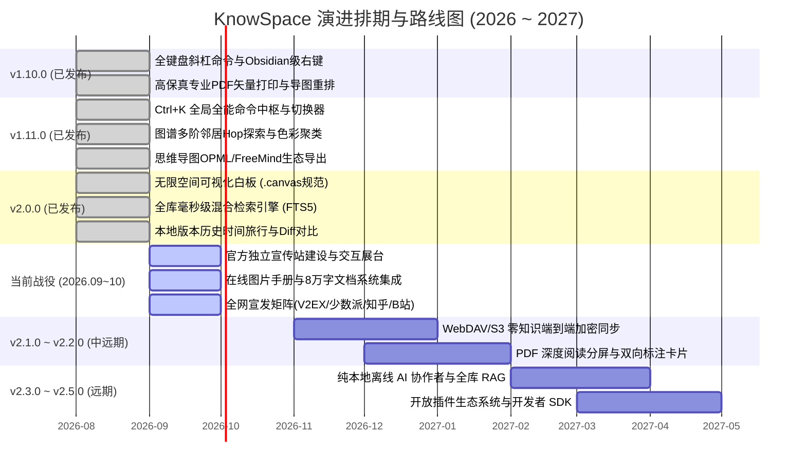

# 🪐 KnowSpace 产品路线图与全景演进规划说明书 (v2.0.0 ➔ v2.5.0)

> **项目名称**：KnowSpace · Personal Knowledge Workspace（现代化个人知识工作台）  
> **产品核心使命**：*Write. Read. Connect. Know.（记录 · 阅读 · 连接 · 认知）*  
> **当前基线版本**：`v2.0.0` (Production Verified & Published)  
> **演进核心哲学**：*本地优先 (Local-First) · 极致纯净性能 · 视觉空间化认知 · 零知识隐私安全 · 渐进式智能化*  
> **更新发布日期**：2026 年 9 月

---

## 🗺️ 一、 总体演进全景路线（四维阶梯）

```
  【v1.0 ~ v1.10】                    【v1.11.0 ~ v2.0.0】                   【当前战役 2026.09~10】                 【v2.1.0 ~ v2.2.0】                    【v2.3.0 ~ v2.5.0】
 📖 Write & Read             ──►     🎨 Canvas & Spatial        ──►     🌐 Marketing & Hub         ──►     🔒 E2EE & Annotations      ──►   🌌 Knowledge OS
沉浸编辑 / 三大专属主题               无限空间白板 (.canvas 1.0)           官方独立宣传站上线                 WebDAV / S3 客户端加密同步        纯本地离线大模型 (RAG)
AST 双向精准同步滚动                 本地版本旅行与 Diff 回溯             3套主题在线切换/Ctrl+K模拟器       PDF 深度阅读与双向标注卡片        沙盒化插件生态 SDK
多标签页 / 左右分屏对比              全能全局命令中枢 (Ctrl+K)            B站/少数派/知乎/V2EX宣发矩阵        冲突向量钟自动合并保护            全键盘工作流自动化
60FPS 有机知识网络图谱               全库毫秒级倒排混合检索               8万字在线图片文档中心打通           移动端阅读器适配调研              开放扩展市场
```

---

## 🏆 二、 已完成里程碑回顾与当前基线 (v2.0.0 Baseline)

经过多轮密集的技术攻坚，KnowSpace 目前已完整交付 `v2.0.0` 里程碑，建立起工业级稳定的本地优先个人空间化知识工作台底座：

### 1. 现代化极客阅读与编辑引擎
- **三大专属全天候主题**：日光暖橙浅色 (Warm Amber)、仿电子墨水屏纸质 (E-ink Paper)、极客纯黑 (Geek Dark Lights Out)，全界面磨砂亚克力微光与高对比度交互。
- **CodeMirror 6 深度定制编辑体验**：毫秒级实时防抖渲染、打字机垂直居中模式 (`Alt + T`)、剪贴板截图直接粘贴自动落盘 `assets/`、大文档性能守护机制。
- **AST 零延迟双向高精度同步滚动**：基于源码 AST 块级行号与线性插值算法，富文本与源码高度差异无论多大均严丝合缝。
- **全键盘斜杠命令菜单 (`/` Slash Commands)**：行首或空格后输入 `/` 秒级呼出 20+ 项排版、待办、GFM 智能表格、代码块、LaTeX 公式、Mermaid 图表及 Callout 提示框，支持中英双语与拼音首字母模糊检索。
- **Obsidian 级情境感知右键菜单 (Context Menu)**：支持划词提取为新独立笔记（原地替换双链）、创建段落块引用指纹（`^block-id`）、存入 Space 收集箱、富文本与行样式转换、内置文档与选区字数/行数统计卡片。

### 2. 结构化思维与空间视觉体系
- **无限空间可视化白板 (Infinite Canvas · 兼容 JSON Canvas 1.0)**：
  - 标准开放的二维空间思维白板（`Ctrl + Shift + C`），多模态卡片自由挂载（富文本 Markdown、嵌入文档预览、逻辑分组容器）；
  - 高精度 4 锚点磁吸与贝塞尔/折线动态矢量连线，配备右下角缩略雷达小地图与全景聚焦控制；
  - **独创画布逆向拓扑萃取长文算法**，一键将白板因果关系逆向萃取为逻辑严密的 Markdown 专著。
- **交互式思维导图 (Mind Map View · `Ctrl + M`)**：
  - Markdown 大纲一键转为思维导图，全键盘极速增删改查；
  - **跨层级拖拽重排 (Drag-and-Drop Reparenting)**：带自闭环防环保护与吸附光晕；
  - **多格式生态导出**：一键导出 2× Retina 透明底 PNG、标准 OPML 2.0 (`.opml`)、FreeMind 1.0.1 XML (`.mm`) 与 Markdown 大纲，打通 XMind / MindNode / OmniOutliner 外部生态。
- **全景与局部知识网络图谱 (Knowledge Graph · `Ctrl + G`)**：
  - 60FPS 原生 2D 绘制管线，2.2ms 黄金螺旋有机力导向算法；
  - **`1-Hop` 邻近 / `2-Hop` 扩展局部视野控制**，消除大型知识库视觉过载；
  - **顶级目录语义色彩聚类 (Folder Cluster Coloring)**，MOC 核心骨干枢纽挖掘与未链接孤岛发现。

### 3. 数据安全、版本旅行与检索中枢
- **本地版本时间旅行与快照历史 (Local Version History · `Ctrl + Shift + H`)**：
  - 运行于本地 `.knowspace/snapshots/`，30s 去抖静默捕获与 SHA-256 哈希去重；
  - 左右双栏 Side-by-Side 与统一 Unified 视图，Myers LCS 逐行与行内字符级高亮对比，一键无损安全回滚。
- **全库毫秒级混合检索引擎 (Hybrid Vault Search · `Ctrl + F`)**：
  - 段落级与文档级倒排索引（Inverted Index），万篇文档 < 15ms 即搜即显；
  - 支持 `tag:#架构`、`link:[[笔记]]`、`"严格短语"`、`-排除词` 等复合语法，支持“当前章节”与“全库”一键切换。
- **全能全局命令中枢 (Command Palette · `Ctrl + K`)**：
  - 三模合一（MRU 快速切换、`>` 动作执行模式、`#` 标题大纲秒级直达）；
  - 编辑区全键盘免失焦直接穿透，光标位置智能复原。
- **工业级数据安全体系**：
  - 物理事务原子落盘（Temp + Fsync + Rename），完全保真 UTF-8 BOM 与换行符；
  - Chromium 原生打印引擎，注入专业 `@media print` 跨页防截断排版；
  - 全局闪念胶囊（`Alt + Space`）秒级唤起、窗口钉住与 Space 流式看板；
  - Windows MSI 标准安装包与绿色解压即用便携版 (Portable Zip) 双模发布。

---

## 🚀 三、 详细演进路线规划 (当前推进 ➔ v2.5.0)

---

### 当前战役：2026.09 ~ 2026.10 —「Marketing & Landing Hub · 官方独立宣传站与全渠道产品宣发」

> **战役目标**：围绕已交付的 `v2.0.0` 工业级基线，打造高转化率的品牌官方独立宣传站与在线文档体系，启动全网极客与生产力圈层推广战役。  
> **执行详案**：已固化至独立实施文档 [`docs/PROMOTIONAL_WEBSITE_PLAN.md`](file:///c:/Users/chunxvzhang/Desktop/codex/docs/PROMOTIONAL_WEBSITE_PLAN.md)  
> **推进周期**：2 ~ 3 周

#### 1. 独立官方宣传站建设 (Official Landing Page)
- **技术栈架构**：Astro 4.x + Tailwind CSS 3.4 + Framer Motion + Cloudflare Pages 全球 Anycast CDN。
- **核心板块设计**：
  - **Hero 巅峰区**：主打 *“Write. Read. Connect. Know.”* 品牌理念，搭载拟真软件窗口展台，提供 **3 套主题在线无刷新切换器**（日光浅色 / 墨水屏 / 极客暗黑），3 秒击中访客审美；
  - **信任指标与标准条**：100% Local-First、<15ms 倒排检索、JSON Canvas 1.0 标准、60FPS 极速渲染；
  - **Bento Grid 便当盒**：卡片式呈现白板、闪念、版本旅行、命令中枢、多格式脑图与星系图谱 6 大核心模块；
  - **四维认知演进漫游**：深入阐释从文字到思维、从白板到因果长文、从网状到认知的升维全流程；
  - **硬核横向对比矩阵**：直观展示 KnowSpace 对比 Obsidian、Notion、Typora 的差异化优势；
  - **下载中心**：提供 Windows MSI 官方安装包与免安装 Portable 绿色版下载，附 SHA-256 校验码。
- **在线文档子系统集成**：直接复用项目中现成的 80,000 字 [`USER_MANUAL.md`](file:///c:/Users/chunxvzhang/Desktop/codex/docs/USER_MANUAL.md) 与 34 张高清图片手册，构建带即时全文搜索的官方文档中心。

#### 2. 全渠道产品宣发与破圈矩阵 (Go-to-Market)
- **第一周（极客破冰）**：V2EX（程序员 / 分享创造节点）、掘金技术干货、GitHub Trending 冲榜，直击“受够了插件折腾与云端隐私泄露”痛点；
- **第二周（垂直引爆）**：少数派 (Sspai) 矩阵深度测评投稿、知乎 PKM / 第二大脑话题问答深度切入；
- **第三周（多媒体发酵）**：B站 / YouTube 5 分钟电影级高清演示片（主打墨水屏长文、白板逆向长文、局部星系图谱）、X (Twitter) 动图矩阵；
- **第四周（国际化与生态）**：Product Hunt 全球首发打榜、Hacker News (Show HN) 极客发布、官方社群建立与使用模板共创。

---

### 阶段一：v2.1.0 ~ v2.2.0 —「E2EE Cloud Sync & Deep Annotations · 零知识加密同步与文献深度标注」

> **发布目标**：解决多设备间数据无缝流转问题，保护用户极致隐私；打通学术论文/书籍 PDF 与个人 Markdown 笔记的双向闭环。  
> **预计周期**：2 ~ 3 个月

#### 1. 零知识端到端加密云端同步 (Zero-Knowledge E2EE Cloud Sync)
- **痛点与场景**：用户在多台电脑之间需要同步知识库，但对第三方商业云服务的隐私泄露充满担忧。
- **核心功能特性**：
  - **去中心化通用存储挂载**：
    - **WebDAV 协议**：坚果云、Nextcloud、群晖/威联通 NAS、InfiniCLOUD 等；
    - **S3 兼容对象存储**：Cloudflare R2（免费 10GB 零出网流量费）、MinIO 自建桶、阿里云 OSS、腾讯云 COS。
  - **客户端 AES-256-GCM 零知识端到端加密**：所有 Markdown 笔记、图片、导图在上传前由客户端使用用户主密码本地加密为密文切片，云端仅见密文。
  - **智能冲突协商引擎**：离线时自由编辑，联网后基于向量钟（Vector Clocks）和时间戳自动增量合并；若同一行冲突生成 `.conflict.md` 分支保护，绝不丢稿。

#### 2. 专业 PDF 嵌入式深度阅读与双向标注 (PDF Deep Annotator)
- **痛点与场景**：查阅学术论文或专业技术手册时，需要将 PDF 中的核心图表与论述摘录到 Markdown 笔记中，但摘录后往往找不到 PDF 原文对应出处。
- **核心功能特性**：
  - **PDF / Markdown 左右并排沉浸视图**：在双分屏中左侧阅读原版 PDF，右侧实时记录笔记。
  - **PDF 高亮划词生成双向引用卡片**：在 PDF 中划选文字或框选图表，右键一键复制深度链接卡片（`[[paper.pdf#page=12&rect=100,200,300,400|摘录内容]]`），点击直接平滑定位回 PDF 对应页码的高亮区域。

---

### 阶段二：v2.3.0 ~ v2.5.0 —「Knowledge OS & AI · 本地离线智能协作者与开放生态」

> **发布目标**：从“工具”升维为“外脑”，打造 100% 运行在本地设备上的个人 AI 智能体，建立安全开放的社区插件生态。  
> **预计周期**：3 ~ 5 个月

#### 1. 纯本地隐私优先 AI 知识协作者 (Local AI Copilot & Knowledge RAG)
- **痛点与场景**：传统云端 AI 助手需要把个人私密日记上传第三方服务器，存在严重隐私风险；纯依靠人工检索难以挖掘跨文档的隐性知识联系。
- **核心功能特性**：
  - **100% 离线端侧大模型直连**：本地直连 Ollama / llama.cpp，一键调度 DeepSeek-R1、Qwen2.5 等优秀开源模型；同时支持用户自带 API Key（BYOK 直连 Gemini / Claude）。
  - **全库知识图谱增强检索生成 (Graph-Augmented RAG)**：结合知识图谱拓扑关系与本地向量嵌入，执行跨文档语义归纳与推理。
  - **沉浸式内联写作助手**：编辑器内输入 `///` 唤起 AI 辅助浮窗，支持选区润色、扩写、语法校对与关联双链智能推荐。

#### 2. 开放插件拓展体系与开发者 SDK (Plugin Ecosystem SDK)
- **痛点与场景**：不同知识工作者有着极为个性化的需求（如学术 Zotero 同步、Excalidraw 手绘板、自动日记流等），需要开放架构支撑生态扩张。
- **核心功能特性**：
  - **沙盒化安全插件运行时**：基于 TypeScript 规范提供轻量、低能耗的扩展 API，插件不可滥用未经授权的系统特权。
  - **四层标准化扩展插槽**：UI 插槽、编辑器扩展、`Ctrl+K` 命令注册、数据导入导出处理器。
  - **本地插件管理器**：支持本地拖入 `.zip` 插件包一键热加载与启用/禁用。

---

## 📊 四、 版本演进路线总览与排期甘特视图



---

## ⚙️ 五、 长期技术底座与架构演进原则

在推进所有功能演进与宣传推广的过程中，KnowSpace 研发团队将严格贯彻以下五大不可动摇的底层工程底线：

1. **纯净文件主权原则 (Zero Lock-in & Pure Markdown)**：
   - 所有文档内容必须以标准 Markdown（GFM）、标准 Frontmatter 元数据或透明的 HTML 注释存储，第三方编辑器（VS Code、Typora、Obsidian）随时可以打开阅读，绝不将用户绑架在专有封闭二进制格式中。
2. **极低功耗与恒定 60FPS 帧率标准**：
   - 杜绝非必要的复杂动画，画布与图谱计算优先采用增量更新与 RAF 节流；
   - 保证万行长文、千节点网络拓扑下内存占用平稳，不出现打字卡顿或风扇狂转。
3. **本地物理事务安全底线 (ACID Atomicity)**：
   - 严格沿用临时事务文件（`.tmp`）落盘并 `rename` 的原子性写入机制，杜绝断电或崩溃导致白文件；
   - 持续监控磁盘变更，智能拦截外部冲突，永远以用户劳动心血的绝对安全为最高优先级。
4. **零网络外泄的隐私第一原则 (Privacy by Design)**：
   - 所有核心功能（搜索、大纲、图谱、思维导图、历史版本）100% 本地计算；
   - 云端同步采用客户端端到端强加密，云端仅见密文；AI 功能优先提供纯本地轻量大模型离线推理。
5. **严密的全量自动化测试守护 (Zero-Regression Protocol)**：
   - 保持 100+ 项自动化单测与集成测试覆盖，任何涉及编辑器核心、AST 映射、文件 I/O 的改动必须经由测试验证后方可合并发布。
